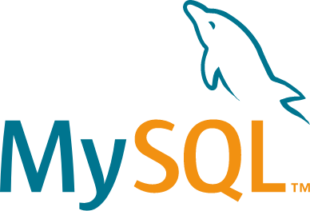

# Introduction à MySQL

## Présentation de MySQL

### Qu'est-ce qu'une base de données ?

Une base de données permet de stocker et de récupérer des données.

Ces données peuvent être extrêmement variées et l'organisation de celles-ci également.

Il peut s'agir de données très structurées (on parle alors de base de données relationnelles) ou au contraire très peu structurées (comme parfois dans le *noSQL*).
 
### Les systèmes de gestion de base de données

Les systèmes de gestion de base de données (*SGBD* ou *DBMS* en anglais) sont des ensembles de programme qui permettent de principalement gérer l’organisation et l’accès aux données.

Ils permettent d’ajouter, de lire, de mettre à jour et de supprimer les données, c’est-à-dire de réaliser les opérations **CRUD** (*Create*, *Read*, *Update*, *Delete*).

Les autres tâches gérés par ces systèmes sont principalement :
- **Le contrôle d’accès :** authentification et autorisation des opérations de lecture, d’écriture et d’administration de la base de données.
- **Vérification de la cohérence :** vérification des opérations (contrôle d’unicité, règles d’intégrité référentielle etc).
- **Assurer la durabilité :** réplication (les mêmes données sont écrites sur plusieurs disques / serveurs) et les sauvegardes ponctuelles.
- **Journalisation des opérations :** chaque opération est enregistrée dans un fichier de log appelé journal qui permet d’annuler ou de terminer l’opération en cas d’erreur ou de crash.
- **Indexation :** les index sont maintenus à jour à chaque opération.

Il existe aujourd’hui environ [400 systèmes de gestion de base de données actifs](https://db-engines.com/en/ranking). Cela fait donc un large choix !

### Le *SQL* et le *noSQL*

Le *SQL* (*Structured Query Language*) est un langage permettant de gérer les bases de données relationnelles.

Ce type de base de données est apparu dans les années 1980 et 1990 avec principalement *Oracle* (1980), *IBM Db2* (1983), *Microsoft SQL Server* (1989), *PostgreSQL* (1989) et *MySQL* (1995).

Il est standardisé depuis 1986 et le dernier standard est *SQL:2023*.

Le *NoSQL* (signifiant non-SQL, ou non relationnel ou encore not only SQL suivant les sources) est un terme désignant les bases de données qui ne sont pas relationnelles, c’est-à-dire qu’elles n’utilise pas uniquement des tables relationnelles.

Elles sont apparues dans les années 2000 avec l’explosion du volume de données à traiter (pensez *Facebook*, *Google*, *Youtube*, *Amazon* etc). Nous sommes alors passés de base de données de quelques téraoctets à des bases de données faisant plusieurs pétaoctets (milliers de téraoctets).

### MySQL

*MySQL* a été développé par la société suédoise *MySQL AB*, achetée par *Sun Microsystems*, qui est maintenant une partie d'*Oracle Corporation*.

***MySQL* est considéré comme la base de données open source la plus populaire au monde, se positionnant juste derrière *Oracle Database* selon [DB-Engines](https://db-engines.com/en/ranking).**

Il est au cœur de nombreuses applications très sollicitées telles que *Facebook*, *X* (*Twitter*), *Netflix*, *Uber*, *Airbnb*, *Shopify*, *Ebay* et *Booking.com*, grâce à sa capacité à alimenter efficacement les applications les plus accessibles ([source](https://www.mysql.com/customers/industry/?id=82)).

Étant open source, MySQL bénéficie d'un développement collaboratif avec sa communauté depuis plus de 25 ans, garantissant un large support pour vos applications ou langages de programmation préférés.

Son logo représente un dauphin nommé *Sakila*, choisi lors d'un concours. La base de données est codée en *C* et *C++*.

*MySQL* se distingue comme un système de gestion de base de données relationnelles, organisant les données en tables séparées pour optimiser la vitesse et la flexibilité. Il utilise le langage *SQL*, standardisé pour l'accès aux bases de données, permettant une intégration aisée dans divers environnements de programmation.

### Les principaux *SGBD* relationnels

- **Oracle :** *SGBD* relationnel et multi-modèles, très puissant et largement utilisé dans les grandes entreprises pour des applications critiques. Il offre une grande variété de fonctionnalités pour la gestion des données, la réplication, et la haute disponibilité. Cependant, *Oracle* peut être complexe à apprendre pour un débutant et coûteux (voir très coûteux) à implémenter.
- **MySQL :** également un *SGBD* relationnel et multi-modèles, *MySQL* est connu pour sa simplicité et sa facilité d'utilisation. Il est largement utilisé dans les applications Web et est une bonne option pour les débutants qui souhaitent apprendre les bases du *SQL*. *MySQL* offre un excellent équilibre entre fonctionnalités et simplicité.
- **Microsoft SQL Server :** ce *SGBD* relationnel et multi-modèles est fortement intégré avec les produits *Microsoft*, ce qui le rend idéal pour les environnements *Windows*. Il propose une large gamme de fonctionnalités pour le développement d'applications d'entreprise, la business intelligence, et l'analyse de données. *SQL Server* peut être plus accessible pour ceux qui sont déjà familiers avec l'écosystème *Microsoft Server* (*Azure* etc).
- **PostgreSQL :** *PostgreSQL* est un *SGBD* relationnel et multi-modèles qui est très respecté pour sa conformité aux standards *SQL*, sa robustesse, et son support de fonctionnalités avancées comme les types de données géospatiales.
- **IBM Db2 :** *Db2* est un *SGBD* relationnel et multi-modèles conçu pour les charges de travail d'entreprise, offrant des performances élevées et une sécurité robuste. Il peut être plus complexe et moins commun pour débuter, mais il est puissant pour des applications spécifiques.
- **Snowflake :** *Snowflake* est un *SGBD* relationnel conçu pour le cloud, offrant une séparation entre le stockage et le calcul, ce qui permet une scalabilité et une flexibilité élevées. Il est relativement nouveau mais gagne rapidement en popularité pour les applications de données dans le cloud.
- **SQLite :** *SQLite* est un *SGBD* relationnel léger qui est intégré dans une large variété d'applications logicielles. Sa simplicité et son autonomie le rendent idéal pour des projets de petite taille, des applications mobiles, ou comme base pour apprendre les principes de base du *SQL*.

