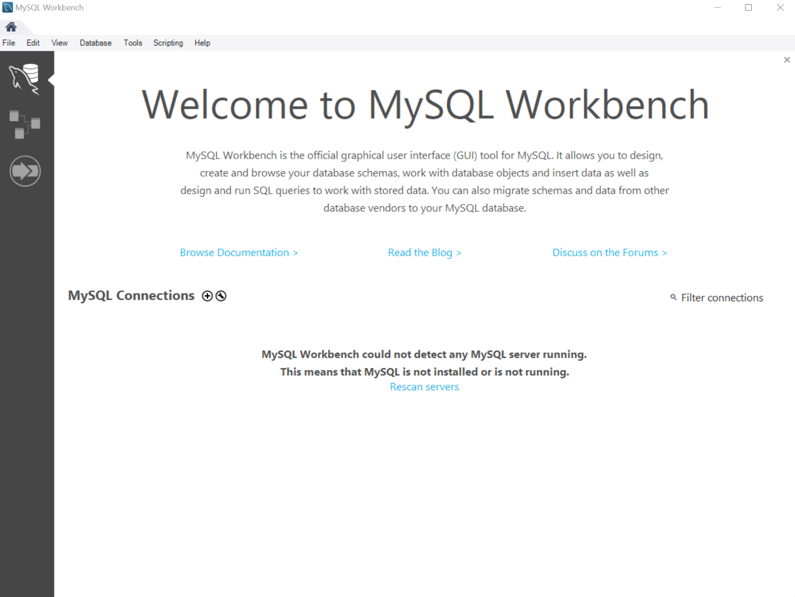
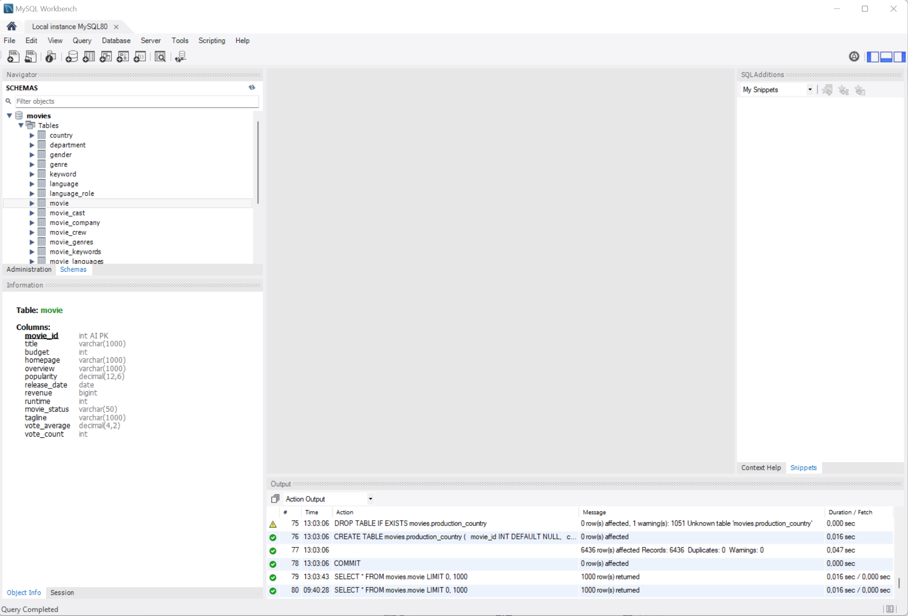
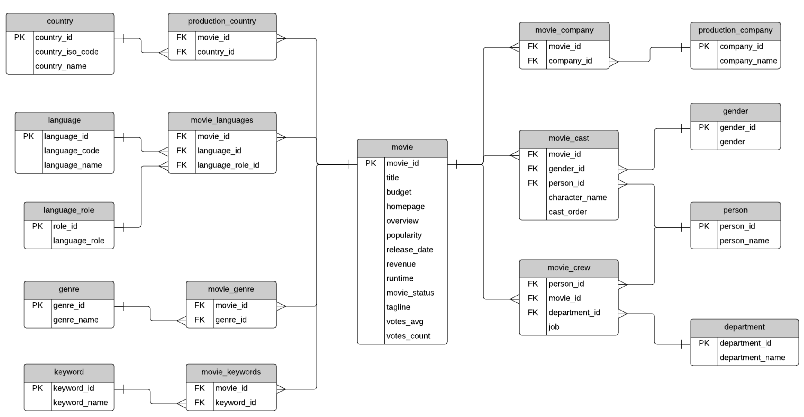
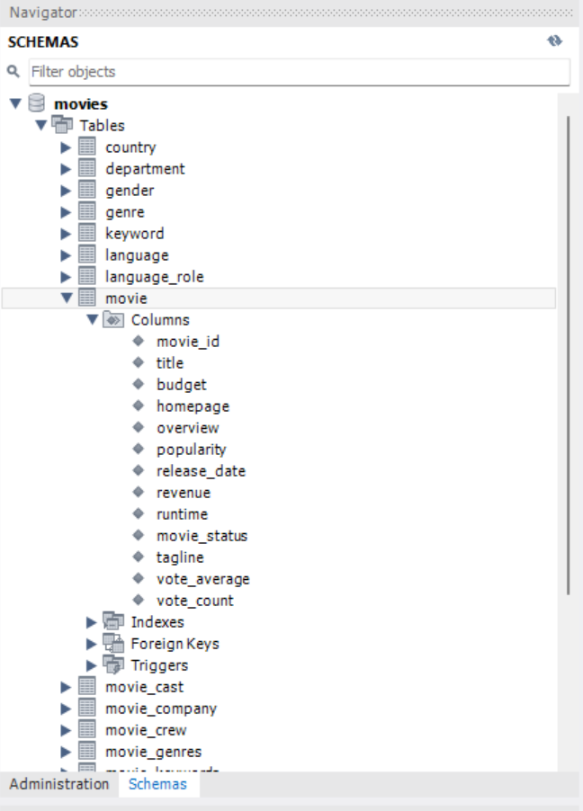
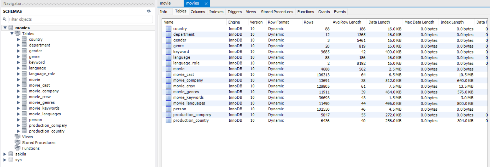

# Introduction à MySQL

## Présentation de MySQL

### Qu'est-ce qu'une base de données ?

Une base de données permet de stocker et de récupérer des données.

Ces données peuvent être extrêmement variées et l'organisation de celles-ci également.

Il peut s'agir de données très structurées (on parle alors de base de données relationnelles) ou au contraire très peu structurées (comme parfois dans le _noSQL_).

### Les systèmes de gestion de base de données

Les systèmes de gestion de base de données (_SGBD_ ou _DBMS_ en anglais) sont des ensembles de programme qui permettent de principalement gérer l’organisation et l’accès aux données.

Ils permettent d’ajouter, de lire, de mettre à jour et de supprimer les données, c’est-à-dire de réaliser les opérations **CRUD** (_Create_, _Read_, _Update_, _Delete_).

Les autres tâches gérés par ces systèmes sont principalement :

- **Le contrôle d’accès :** authentification et autorisation des opérations de lecture, d’écriture et d’administration de la base de données.
- **Vérification de la cohérence :** vérification des opérations (contrôle d’unicité, règles d’intégrité référentielle etc).
- **Assurer la durabilité :** réplication (les mêmes données sont écrites sur plusieurs disques / serveurs) et les sauvegardes ponctuelles.
- **Journalisation des opérations :** chaque opération est enregistrée dans un fichier de log appelé journal qui permet d’annuler ou de terminer l’opération en cas d’erreur ou de crash.
- **Indexation :** les index sont maintenus à jour à chaque opération.

Il existe aujourd’hui environ [400 systèmes de gestion de base de données actifs](https://db-engines.com/en/ranking). Cela fait donc un large choix !

### Le _SQL_ et le _noSQL_

Le _SQL_ (_Structured Query Language_) est un langage permettant de gérer les bases de données relationnelles.

Ce type de base de données est apparu dans les années 1980 et 1990 avec principalement _Oracle_ (1980), _IBM Db2_ (1983), _Microsoft SQL Server_ (1989), _PostgreSQL_ (1989) et _MySQL_ (1995).

Il est standardisé depuis 1986 et le dernier standard est _SQL:2023_.

Le _NoSQL_ (signifiant non-SQL, ou non relationnel ou encore not only SQL suivant les sources) est un terme désignant les bases de données qui ne sont pas relationnelles, c’est-à-dire qu’elles n’utilise pas uniquement des tables relationnelles.

Elles sont apparues dans les années 2000 avec l’explosion du volume de données à traiter (pensez _Facebook_, _Google_, _Youtube_, _Amazon_ etc). Nous sommes alors passés de base de données de quelques téraoctets à des bases de données faisant plusieurs pétaoctets (milliers de téraoctets).

### MySQL


_MySQL_ a été développé par la société suédoise _MySQL AB_, achetée par _Sun Microsystems_, qui est maintenant une partie d'_Oracle Corporation_.

**_MySQL_ est considéré comme la base de données open source la plus populaire au monde, se positionnant juste derrière _Oracle Database_ selon [DB-Engines](https://db-engines.com/en/ranking).**

Il est au cœur de nombreuses applications très sollicitées telles que _Facebook_, _X_ (_Twitter_), _Netflix_, _Uber_, _Airbnb_, _Shopify_, _Ebay_ et _Booking.com_, grâce à sa capacité à alimenter efficacement les applications les plus accessibles ([source](https://www.mysql.com/customers/industry/?id=82)).

Étant open source, MySQL bénéficie d'un développement collaboratif avec sa communauté depuis plus de 25 ans, garantissant un large support pour vos applications ou langages de programmation préférés.

Son logo représente un dauphin nommé _Sakila_, choisi lors d'un concours. La base de données est codée en _C_ et _C++_.

_MySQL_ se distingue comme un système de gestion de base de données relationnelles, organisant les données en tables séparées pour optimiser la vitesse et la flexibilité. Il utilise le langage _SQL_, standardisé pour l'accès aux bases de données, permettant une intégration aisée dans divers environnements de programmation.

### Les principaux _SGBD_ relationnels

- **Oracle :** _SGBD_ relationnel et multi-modèles, très puissant et largement utilisé dans les grandes entreprises pour des applications critiques. Il offre une grande variété de fonctionnalités pour la gestion des données, la réplication, et la haute disponibilité. Cependant, _Oracle_ peut être complexe à apprendre pour un débutant et coûteux (voir très coûteux) à implémenter.
- **MySQL :** également un _SGBD_ relationnel et multi-modèles, _MySQL_ est connu pour sa simplicité et sa facilité d'utilisation. Il est largement utilisé dans les applications Web et est une bonne option pour les débutants qui souhaitent apprendre les bases du _SQL_. _MySQL_ offre un excellent équilibre entre fonctionnalités et simplicité.
- **Microsoft SQL Server :** ce _SGBD_ relationnel et multi-modèles est fortement intégré avec les produits _Microsoft_, ce qui le rend idéal pour les environnements _Windows_. Il propose une large gamme de fonctionnalités pour le développement d'applications d'entreprise, la business intelligence, et l'analyse de données. _SQL Server_ peut être plus accessible pour ceux qui sont déjà familiers avec l'écosystème _Microsoft Server_ (_Azure_ etc).
- **PostgreSQL :** _PostgreSQL_ est un _SGBD_ relationnel et multi-modèles qui est très respecté pour sa conformité aux standards _SQL_, sa robustesse, et son support de fonctionnalités avancées comme les types de données géospatiales.
- **IBM Db2 :** _Db2_ est un _SGBD_ relationnel et multi-modèles conçu pour les charges de travail d'entreprise, offrant des performances élevées et une sécurité robuste. Il peut être plus complexe et moins commun pour débuter, mais il est puissant pour des applications spécifiques.
- **Snowflake :** _Snowflake_ est un _SGBD_ relationnel conçu pour le cloud, offrant une séparation entre le stockage et le calcul, ce qui permet une scalabilité et une flexibilité élevées. Il est relativement nouveau mais gagne rapidement en popularité pour les applications de données dans le cloud.
- **SQLite :** _SQLite_ est un _SGBD_ relationnel léger qui est intégré dans une large variété d'applications logicielles. Sa simplicité et son autonomie le rendent idéal pour des projets de petite taille, des applications mobiles, ou comme base pour apprendre les principes de base du _SQL_.

## Comment fonctionne MySQL

### Organisation des données avec _MySQL_

Dans MySQL, comme dans beaucoup de systèmes de gestion de bases de données relationnelles (_SGBDR_), les données sont organisées et structurées de manière hiérarchique.

Cette structure permet de stocker les données de manière efficace, de faciliter leur interrogation et leur manipulation.

#### Schéma _MySQL_

Un schéma _MySQL_, souvent appelé aussi base de données, est le niveau le plus élevé de l'organisation dans _MySQL_.

Il représente une collection de tables qui contiennent des données, ainsi que des relations entre ces tables, des vues, des procédures stockées, et d'autres éléments de base de données.

Dans la pratique, le terme "base de données" est plus fréquemment utilisé, mais le concept reste le même.

Un serveur _MySQL_ peut contenir plusieurs bases de données (ou schémas), chacune étant isolée des autres, ce qui permet de gérer différents projets ou applications sur le même serveur.

#### Table

Une table est une collection de données organisées en colonnes et en rangées, suivant un modèle relationnel.

Chaque table dans MySQL est associée à un schéma spécifique et contient des informations sur un type d'entité spécifique.

Par exemple, une table _utilisateurs_ pourrait contenir des informations sur les utilisateurs d'une application, avec des colonnes pour l'identifiant de l'utilisateur, son nom, son adresse e-mail, etc.

#### Colonnes

Les colonnes (ou champs) d'une table définissent le type de données que la table peut stocker.

Chaque colonne est définie avec un type de données spécifique, comme _INT_ pour les nombres entiers, _VARCHAR_ pour les chaînes de caractères, _DATE_ pour les dates, etc.

Les colonnes définissent également d'autres propriétés, telles que si une valeur est obligatoire (_NOT NULL_), si elle est unique (_UNIQUE_), ou si elle s'auto-incrémente (_AUTO_INCREMENT_).

La définition des colonnes détermine la structure de la table et comment les données peuvent être stockées et interrogées.

#### Rangées

Les rangées (ou lignes) d'une table représentent les enregistrements ou les instances de l'entité définie par la table.

Chaque rangée contient des valeurs spécifiques pour chaque colonne de la table.

Par exemple, dans une table _utilisateurs_, chaque rangée représenterait un utilisateur spécifique, avec des valeurs dans les colonnes pour son identifiant, son nom, son adresse e-mail, etc.

Les rangées sont le niveau le plus bas de données dans la base de données, et c'est là que les données réelles sont stockées.

### Résumé

- **Schéma (base de données) :** le conteneur de niveau supérieur qui contient des tables et d'autres objets de base de données, servant d'espace de travail organisé pour stocker les données.
- **Table :** une structure qui organise les données en colonnes et rangées, représentant un type d'entité spécifique dans la base de données.
- **Colonnes :** les attributs ou propriétés d'une table, définissant le type et les caractéristiques des données qui peuvent être stockées dans chaque colonne.
- **Rangées (lignes) :** les enregistrements individuels dans une table, chaque rangée contenant des valeurs pour chaque colonne associée à un enregistrement spécifique.

### Les composants principaux

Nous allons lister les composants principaux car vous verrez très fréquemment ces termes et c'est important d'avoir une vue d'ensemble avant de démarrer.

- **Serveur de base de données (_MySQL Server_) :** le serveur de base de données est le cœur du système et gère l'accès aux données, les transactions, la concurrence, le cache (_buffer pool_), etc.
- **Le moteur de stockage (_InnoDB_ ou _MyISAM_)** gère la façon dont les données sont stockées, récupérées et mises à jour.
- **Client MySQL :** les clients _MySQL_ sont des applications qui se connectent au serveur de base de données pour effectuer des opérations sur les données. Ils peuvent être des applications graphiques (_GUI_), des interfaces en ligne de commande (_CLI_), des applications web ou des services _backend_ :
  - **Interface Graphique Utilisateur (_GUI_) :** les interfaces graphiques, comme _MySQL Workbench_, fournissent une interface utilisateur visuelle pour interagir avec le serveur _MySQL_, permettant aux utilisateurs de créer des requêtes, de gérer des bases de données et de visualiser des données sans utiliser directement le _SQL_.
  - **Interface en Ligne de Commande (_CLI_) :** l'interface en ligne de commande est un client texte qui permet aux utilisateurs de se connecter au serveur _MySQL_ et d'exécuter des commandes _SQL_ directement.
  - **Pilotes (_drivers_) :** les pilotes sont des bibliothèques logicielles qui permettent aux applications de se connecter et d'interagir avec le serveur de base de données en utilisant divers langages de programmation comme _PHP_, _Java_, _Python_, _JavaScript_ etc.
- **Object-Relational Mapping (_ORM_) :** les _ORM_ sont des bibliothèques qui permettent de manipuler les données comme des objets dans le code d'une application, tout en gérant la communication avec la base de données en arrière-plan. Ils fournissent une abstraction pour éviter d'écrire du _SQL_ brut et pour faciliter l'intégration des données dans l'application.

### Moteur de stockage : _InnoDB_

Par défaut, _MySQL_ utilise le moteur _InnoDB_.

Nous allons voir ses caractéristiques principales.

_InnoDB_ est un **moteur transactionnel**, ce qui signifie qu'il garantit l'_ACID_ (Atomicité, Cohérence, Isolation, Durabilité). Chaque transaction est traitée de manière à garantir ces principes, avec un système de _commit_ et de _rollback_ bien établi. Nous reverrons ces notions dans un chapitre plus avancé.

Il utilise le **contrôle de concurrence multiversion** (_MVCC_) pour gérer l'accès concurrent aux données. Cela permet à plusieurs transactions de lire et écrire dans la base de données sans se bloquer mutuellement, en gardant des versions multiples des données pour assurer l'isolation des transactions.

Il **maintient en mémoire un cache** appelé le _buffer pool_, où il stocke les données et index fréquemment utilisés. Cela améliore les performances en réduisant le besoin d'accès aux données sur le disque.

Il utilise un **système de journalisation** pour garantir la durabilité des transactions. Les modifications apportées aux données sont d'abord écrites dans le journal de transactions. En cas de crash du système, _InnoDB_ peut se remettre d'un état cohérent en rejouant le journal.

_InnoDB_ a également un mécanisme robuste de **récupération après crash**, utilisant son journal de transactions et son système de rollback segment pour restaurer la base de données dans un état cohérent.

#### Aller plus loin : fichiers utilisés par _InnoDB_

_Vous pouvez passer rapidement, nous n'irons pas du tout voir ces fichiers dans la formation, c'est très avancé mais permet simplement d'avoir une meilleure compréhension._


S'il vous prend l'envie d'aller voir les fichiers créés par le moteur de stockage, vous retrouverez principalement :

- ***ibdata1 [*alternatif\*] :** ce fichier est le fichier de données système InnoDB global. Il contient les données et les index des tables InnoDB lorsque le paramètre innodb_file_per_table est désactivé. Il stocke également les données internes telles que les informations de tablespace, les undo logs et les données de buffer pool. Pas par défaut.\*
- **.ibd :** les fichiers avec l'extension _.ibd_ sont des fichiers de _tablespace_ individuels pour chaque table _InnoDB_ lorsque _innodb_file_per_table_ est activé. Chaque fichier _.ibd_ contient les données et les index associés à une table spécifique.
- **ib_buffer_pool :** ce fichier sauvegarde le statut actuel du buffer pool _InnoDB_ pour permettre une restauration rapide après un redémarrage du serveur.
- **ib_logfile0 et ib_logfile1 :** ce sont des fichiers de journalisation (log files) qui enregistrent toutes les modifications apportées aux données pour permettre la récupération après un crash. _InnoDB_ utilise une écriture de journal circulaire.
- **ibtmp1 :** fichier temporaire utilisé par _InnoDB_ pour les tables temporaires et les opérations de tri.
- **.cfg :** fichiers de configuration pour les fichiers _.ibd_ qui stockent des métadonnées pour des fonctions spécifiques comme le transport de tablespaces entre différentes instances de serveur.
- **mysql.ibd :** depuis _MySQL 8.0_, les métadonnées des schémas, des tables, des index, etc., sont stockées dans le dictionnaire de données, qui est en lui-même stocké dans le tablespace _mysql.ibd_.
- **undo tablespaces :** fichiers tels que _undo_001_ et _undo_002_ qui stockent les informations d'annulation pour les transactions _InnoDB_. Ces tablespaces peuvent être configurés pour s'agrandir et se réduire automatiquement.
- **binary logs (_binlog_) :** fichiers binaires qui enregistrent les modifications apportées à la base de données pour la réplication et la récupération après sinistre.
- **redologs :** fichiers qui enregistrent les modifications non encore appliquées à la base de données, permettant la récupération des données en cas de panne soudaine.
- **general log et slow query log :** journaux enregistrant respectivement toutes les requêtes et les requêtes lentes exécutées par le serveur.
- **auto.cnf :** fichier de configuration contenant l'identifiant unique du serveur pour la réplication.

## Écosystème MySQL

### Environnements pour un serveur _MySQL_

#### Installation locale

C'est ce que nous verrons dans les prochaines leçons.

Nous installerons le serveur _MySQL_ sur notre système d'exploitation local pour apprendre à utiliser _MySQL_.

#### _MySQL as a Service_

_MySQL as a Service_ désigne une offre de _MySQL_ hébergé et géré par un fournisseur de services _cloud_.

Dans ce modèle, le fournisseur s'occupe de la maintenance, des mises à jour, de la sauvegarde, et de la sécurité de la base de données, permettant aux développeurs de se concentrer sur le développement d'applications sans se soucier de la gestion de la base de données. Il en existe plusieurs dizaines mais nous mentionnerons les principaux.

- **Avantages :** Facilité de déploiement, haute disponibilité, scalabilité, et réduction des coûts opérationnels.
- **Exemples :** OVHcloud, Oracle MySQL HeatWave, Microsoft Azure MySQL, Google Cloud MySQL, Amazon RDS pour MySQL.

#### Utilisation de l'image Docker

_Docker_ est une plateforme de conteneurisation permettant de packager une application et ses dépendances dans un conteneur virtuel qui peut être exécuté sur n'importe quel système.

**Image _Docker MySQL_ :** c'est une image officielle préconfigurée contenant tout le nécessaire pour exécuter un serveur _MySQL_.

Les images _Docker_ facilitent le déploiement de _MySQL_ en permettant de lancer une instance de base de données _MySQL_ dans un conteneur _Docker_ avec peu ou pas de configuration.

### Les outils en ligne de commande (_CLI_)

Les interfaces en ligne de commande (_CLI_) offrent une manière directe et puissante d'interagir avec les systèmes de gestion de bases de données comme _MySQL_.

Les principaux outils _CLI_ utilisés avec MySQL sont les suivants :

#### Le _CLI_ officiel de _MySQL_

L'interface en ligne de commande permet aux utilisateurs d'interagir avec _MySQL_ en saisissant des commandes textuelles.

Cela inclut l'exécution de requêtes _SQL_, la gestion des bases de données et des utilisateurs, ainsi que la modification des configurations du serveur _MySQL_.

Le principal outil _CLI_ fourni par _MySQL_ est le client _mysql_, qui permet aux utilisateurs de se connecter à un serveur _MySQL_ et d'interagir directement avec les bases de données à partir du terminal.

#### _MySQL Shell_

_MySQL Shell_ est aussi officiellement maintenu par _Oracle_. C'est un _CLI_ plus récent et plus avancé.

C'est un outil avancé pour l'usage interactif et l'administration de la base de données _MySQL_.

Il supporte trois modes de programmation : _JavaScript_, _Python_ et _SQL_, offrant ainsi une flexibilité remarquable aux administrateurs et développeurs pour gérer _MySQL_.

_MySQL Shell_ peut être utilisé pour une gamme étendue de tâches administratives et d'accès, y compris la configuration de la réplication, l'exécution de requêtes, et l'administration des schémas de bases de données.

Sa capacité à exécuter des scripts dans différents langages de programmation en fait un outil particulièrement puissant pour automatiser les tâches et interagir avec _MySQL_ de manière plus intuitive que les interfaces en ligne de commande traditionnelles.

#### _Percona Toolkit_

_Percona Toolkit_ est une collection d'outils en ligne de commande développés en _Perl_, conçus pour les bases de données _MySQL_.

Ces outils offrent des fonctionnalités avancées pour l'administration et la maintenance de _MySQL_, incluant la vérification de la réplication, la réparation de données corrompues, l'automatisation des tâches répétitives, et l'amélioration des performances du serveur.

Le _Percona Toolkit_ est disponible dans plusieurs distributions _Linux_, comme _CentOS_ et _Debian_, avec des paquets également disponibles pour _Fedora_ et _Ubuntu_.

### Interfaces graphiques (_GUI_)

Les _GUI_ pour _MySQL_ permettent aux développeurs et aux administrateurs de bases de données d'interagir avec _MySQL_ de manière visuelle, sans avoir à utiliser la ligne de commande.

#### _MySQL Workbench_

C'est l'interface graphique officielle développée par _Oracle_ pour _MySQL_.

Elle permet la conception de bases de données, l'exécution de requêtes _SQL_, la gestion des utilisateurs, la visualisation des performances, et plus encore.

C'est ce que nous utiliserons dans la formation.




#### Avantages principaux de _Workbench_

- **Intégration étroite avec _MySQL_ :**
  - **Développé par _Oracle_ :** en tant que produit développé par le mainteneur de _MySQL_, _MySQL Workbench_ bénéficie de mises à jour synchronisées avec les dernières versions de _MySQL_, assurant une compatibilité sans faille.
  - **Accès aux dernières fonctionnalités :** les utilisateurs ont accès immédiat aux dernières fonctionnalités et optimisations de _MySQL_, ce qui permet de tirer pleinement parti des innovations du système de gestion de base de données.
- **Conception visuelle de bases de données :**
  - **Interface graphique intuitive :** l'interface permet de modéliser visuellement les schémas de bases de données, rendant la conception accessible même aux personnes moins familiarisées avec le _SQL_.
  - **Outils de modélisation avancés :** les utilisateurs peuvent non seulement créer et modifier des schémas, mais également générer des _scripts SQL_ directement à partir du modèle, simplifiant le processus de développement.
- **Développement SQL et administration :**
  - **Éditeur _SQL_ complet :** avec la coloration syntaxique, le complètement automatique et les outils de débogage, l'éditeur _SQL_ facilite l'écriture et l'optimisation des requêtes.
  - **Outils d'administration intégrés :** la configuration des serveurs, la gestion des utilisateurs, et la surveillance des performances sont intégrées dans une interface unique, centralisant la gestion de _MySQL_.
- **Gestion de la performance**
  - **Surveillance en temps réel :** les tableaux de bord offrent une vue en temps réel de la performance du serveur, aidant à identifier et à résoudre rapidement les problèmes de performance.
  - **Optimisation des requêtes :** l'outil propose des conseils et des analyses pour optimiser les requêtes _SQL_, améliorant ainsi l'efficacité des opérations de base de données.
- **Migration de base de données**
  - **Assistance à la migration :** _MySQL Workbench_ fournit un assistant de migration guidant les utilisateurs à travers le processus de migration des données d'autres _SGBD_ vers _MySQL_, réduisant les obstacles techniques.
  - **Compatibilité étendue :** prend en charge la migration depuis plusieurs sources, y compris _Microsoft SQL Server_, _PostgreSQL_ et _Oracle_, facilitant le passage à _MySQL_.
- **Sécurité**
  - **Gestion des utilisateurs et des privilèges :** permet une gestion fine des droits d'accès et des profils d'utilisateurs, renforçant la sécurité des données.
  - **Support _SSL_ :** supporte le chiffrement _SSL_ pour les connexions, protégeant les données en transit entre le client et le serveur _MySQL_.

#### Autres outils _GUI_ populaires

- **Adminer :** outil _PHP_ pour la gestion de _MySQL_, offrant une interface web simple pour les opérations de base de données.
- **DBeaver :** _IDE_ multiplateforme gratuit pour les développeurs et les administrateurs de base de données, supportant _MySQL_ parmi d'autres.
- **HeidiSQL :** application _Windows_ légère permettant la gestion, la maintenance, et l'exploration de bases de données _MySQL_.
- **LibreOffice Base :** composant de la suite _LibreOffice_ pour la gestion de bases de données, compatible avec _MySQL_.
- **Navicat :** outil puissant de gestion de base de données offrant une interface intuitive pour la gestion de _MySQL_.
- **phpMyAdmin :** application web très populaire pour la gestion de _MySQL_, offrant une interface web complète.
- **SQLyog :** outil de gestion de _MySQL Windows_ offrant une interface riche pour l'optimisation et la gestion des bases de données.
- **Toad for MySQL :** outil de développement et de gestion _MySQL_ facilitant l'optimisation des bases de données pour les développeurs.

## Environnement Windows

### Installation de _VS Code_

Téléchargez et installez _VS Code_ [ici](https://code.visualstudio.com/download).

### Installation de _MySQL Server_ + _Workbench_

Téléchargez l'installeur [ici](https://dev.mysql.com/downloads/mysql/).

Lancez l'installeur et sélectionnez installation _Custom_.

Ajoutez avec les flèches :

- _MySQL Server_
- _Applications > MySQL Workbench_

Laissez le _port_ par défaut (_3306_).

Définissez le mot de passe _root_. C'est l'administrateur qui peut tout faire sur la base de données.

Laissez le reste des options par défaut.

Vérifiez que _MySQL Server_ est bien lancé en allant dans la barre de recherche _Windows_ puis en recherchant _Services_.

Lancez en tant qu'administrateur (avec clic droit). Vous verrez dans la liste _MySQL_ en _Running_.

### Afficher les fichiers et dossiers cachés

Le dossier _ProgramData_ est un dossier système caché sous Windows.

Si vous ne le voyez pas, vous devez modifier les paramètres pour afficher les fichiers et dossiers cachés :

- Ouvrez l'Explorateur de fichiers.
- Allez dans l'onglet "Affichage" (dans Windows 10 et 11, cela peut être sous "Options" > "Modifier les options des dossiers et de recherche").
- Cherchez et sélectionnez "Éléments cachés" sous les paramètres d'affichage avancés.
- Appliquez les modifications et retournez à l'Explorateur de fichiers. Vous devriez maintenant voir le dossier _ProgramData_.

## Environnement MacOS

### Installation de _VS Code_

Téléchargez et installez _VS Code_ [ici](https://code.visualstudio.com/download).

### Installation de _MySQL Server_

Téléchargez l'installeur [ici](https://dev.mysql.com/downloads/mysql/).

Lancez l'installeur et lancez l'installation.

Définissez le mot de passe _root_. C'est l'administrateur qui peut tout faire sur la base de données.

Laissez le reste des options par défaut.

### Installation de _MySQL Workbench_

Téléchargez l'installeur [ici](https://dev.mysql.com/downloads/workbench/).

Installez _Workbench_.

## Environnement GNU/Linux (Ubuntu)

### Installation de _VS Code_

Ouvrez un terminal et installez _VS Code_ avec _snap_ :

```sh
sudo snap install code --classic
```

### Installation de _MySQL Server_ (_Ubuntu_ / _Debian_)

Téléchargez le package debian [ici](https://dev.mysql.com/downloads/repo/apt/).

Installez le _package_ avec _apt_ :

```sh
sudo dpkg -i /PATH/nom-package.deb
```

Il faut bien sûr remplacer par le chemin vers le _package_ qui est dans votre dossier de téléchargement. Le nom du _package_ change tout le temps car il change à chaque version (y compris les _patchs_).

Sélectionnez avec entrée _MySQL Server & Cluster_.

Ensuite sélectionnez la version _mysql-x.0_ par exemple _mysql-8.0_.

Ensuite naviguez vers le bas avec les flèches jusqu'à _OK_ et faites entrée.

Mettez à jour les sources d'_apt_ :

```sh
sudo apt-get update
```

Installez _MySQL server_ :

```sh
sudo apt-get install mysql-server
```

Entrez le mot de passe pour l'utilisateur _root_ dont nous nous servirons pendant la formation.

Vérifiez que le service _MySQL Server_ est lancé :

```sh
sudo systemctl status mysql
```

Si vous souhaitez que _MySQL Server_ se lance au démarrage de votre _OS_ à chaque fois (activé par défaut) :

```sh
sudo systemctl enable mysql
```

Si vous ne voulez pas :

```sh
sudo systemctl disable mysql
```

Il faudra dans ce cas le lancer quand vous voudrez l'utiliser avec :

```sh
sudo systemctl start mysql
```

### Installation de _MySQL Workbench_

Installez _Workbench_ :

```sh
sudo apt-get install mysql-workbench-community
```

## Présentation de Workbench et import de la première base de données

### Connexion locale et import d'une première base de données

Sur l'écran d'accueil : "_Welcome to MySQL Workbench_", cliquez sur le signe _+_ à droite de _MySQL Connections_ pour créer une nouvelle connexion.

Mettez en _Connection Name_: par exemple _Instance Locale_ (car c'est une connexion au serveur MySQL qui tourne localement sur votre machine).

Laissez l'_Hostname_ qui correspond à l'adresse locale de votre machine et le port _3306_ qui est le port par défaut utilisé par _MySQL_. (Le port est comme un numéro de porte où s'adresser à un service).

Laissez Username: root. L'utilisateur _root_ est le super-utilisateur qui peut tout faire sur le serveur MySQL : il a tous les droits d'administration.

Dans _Password_: cliquez sur _Store in Vault_: et entrez le mot de passe que vous avez créé lors de l'installation. Il sera stocké dans un espace sécurisé sur votre machine.

Cliquez sur _Test Connection_ pour vérifier la connexion puis cliquez sur _Ok_.

Cliquez sur la connexion créée et vous arriverez ici :



Vous n'aurez pas encore la base de données _movies_.

Pour l'importer, [téléchargez ce dossier](https://dyma-courses-assets.s3.fr-par.scw.cloud/MySQL/movies_db.zip) et décompressez le.

Ensuite dans _Workbench_ allez dans _File open SQL Script_ et sélectionnez le fichier décompressé.

Cliquez ensuite sur le premier éclair _sans rien sélectionner dans le code chargé_.

Cliquez sur le bouton de rafraichissement à droite de SCHEMAS si la base de données _movies_ n'apparait pas.

_Au cours de la formation nous utiliserons plusieurs bases de données et bien sûr nous en créerons et apprendrons à créer des **scripts SQL**._

### Aperçu de la base de données

Un diagramme _ERD_ (_Entity-Relationship Diagram_) est un outil graphique qui représente les entités (généralement les tables) d'une base de données relationnelle et les relations (les liens) entre ces entités.

Un _ERD_ aide à visualiser la structure d'une base de données, en montrant comment les tables se connectent via des clés étrangères, les attributs clés de chaque table, et les contraintes comme les clés primaires. Cela sert à la fois pour la conception de la base de données, pour comprendre les relations existantes dans une base de données conçue, et pour communiquer la structure de la base de données à d'autres.

Nous y reviendrons en détail dans un chapitre plus avancé, mais voici le schéma pour notre première base de données :



### Premier aperçu des menus

*MySQL Workbench* est conçu pour faciliter la gestion, le développement, et l'administration des bases de données *MySQL*.

Il se compose d'une série d'éditeurs spécialisés et de trois panneaux principaux : le panneau latéral (*sidebar*), le second panneau latéral (*secondary sidebar*), et la zone de sortie (*output area*).

Chaque éditeur s'ouvre dans un onglet secondaire au sein d'un onglet de connexion MySQL actif, et chaque panneau peut être masqué ou affiché selon les besoins.

#### Accueil

Le *Home Screen Tab* (bouton maison en haut à gauche) offre un accès rapide aux connexions, aux modèles, et à l'assistant de migration *MySQL*. Il reste ouvert en permanence pour un accès facile.

#### Onglets connexion

Chaque connexion à un serveur *MySQL* est représentée par un onglet de connexion distinct avec le nom que vous lui avez donné.

Un serveur peut être actif ou inactif lors de l'ouverture de son onglet de connexion.

#### *SQL Query Tab*

L'onglet de requête SQL (*SQL query tab*) s'ouvre par défaut lorsqu'une connexion à un serveur *MySQL* est établie.

Chaque onglet de requête est identifié par un numéro croissant. Cet onglet fournit un espace pour éditer les requêtes SQL, et d'autres éditeurs spécialisés peuvent également être ouverts dans cet espace central.

#### Menu principal

La barre de menu principale contient des menus comme *File*, *Edit*, *View*, *Query*, *Database*, *Server*, *Tools*, *Scripting*, et *Help*, offrant diverses actions en fonction de l'onglet sélectionné.

#### Barre d'outils principale

La barre d'outils principale propose des actions rapides pour créer de nouveaux onglets *SQL*, ouvrir des fichiers de script *SQL*, accéder à l'Inspecteur pour l'objet sélectionné, créer de nouveaux schémas, tables, vues, procédures stockées, et fonctions sur le serveur connecté, ainsi que pour rechercher des données dans les tables.

#### Shortcut Actions

Cette zone (tout en haut à droite) offre des raccourcis pour afficher le dialogue des préférences, masquer ou afficher le panneau latéral, la zone de sortie, et le second panneau latéral.

#### Le panneau latéral

Le panneau latéral comprend deux principales zones : *Navigator* et *Information*.

Le *Navigator* a deux sous-onglets : *Administration* et *Schemas*, permettant de gérer les schémas de la base de données et d'accéder aux outils d'administration.

L'espace *Information* fournit des informations en lecture seule sur l'objet sélectionné et sur la connexion active. Cliquez par exemple sur la *Table movie*.

#### Deuxième panneau latéral (*SQL Additions*)

Le panneau *SQL Additions* propose des sous-onglets pour l'aide contextuelle (*Context Help*) et les extraits de code (Snippets), fournissant une assistance pour la rédaction de requêtes *SQL*.

#### Le panneau de sortie

Le panneau de sortie (en bas) peut afficher un résumé des requêtes exécutées sous forme de *Action Output*, *Text Output*, ou *History Output*, aidant à analyser les résultats et le processus d'exécution des requêtes.

Nous verrons tous les menus et boutons en détail au fur et à mesure de notre utilisation.

### Visualisation de la structure de la base de données *movies*

#### Onglet *Schemas*



L'onglet *Schemas* dans le *Navigator* montre les schémas disponibles sur le serveur auquel vous êtes actuellement connecté.

Vous pouvez explorer ces éléments pour afficher les tables, les vues et les routines au sein du schéma.

Cette fonctionnalité est particulièrement utile pour les développeurs et les administrateurs de base de données qui ont besoin de visualiser rapidement la structure des bases de données et d'accéder à leurs différents composants.

Ici la base de données *movies* est dépliée et on affiche ses *Tables* et les colonnes de la *Table movie*.

#### Inspecteur de *Schéma*

Le *Schema Inspector* vous permet de parcourir des informations générales sur les objets d'un schéma, comme les tables, les index et les déclencheurs (triggers).

Il est accessible en cliquant avec le bouton droit sur un schéma dans le navigateur d'objets et en sélectionnant "*Schema Inspector*", **ou en survolant la base de données avec la souris et en cliquant sur la bulle info.**

Une fois ouvert, l'interface du *Schema Inspector* présente différentes informations réparties par onglets, centrées sur des sujets spécifiques.

Cliquez sur l'onglet Tables pour avoir un ensemble très utile d'informations sur chaque table de la base de données (par exemple le nombre de rangées) :



#### Inspecteur de Table

Le *Table Inspector* offre une interface similaire pour visualiser des informations spécifiques à une table.

Pour l'ouvrir, cliquez avec le bouton droit sur une table dans le navigateur d'objets de la zone Navigator et choisissez "*Table Inspector*", **ou en survolant la table avec la souris et en cliquant sur la bulle info.**

L'inspecteur de table fournit des informations détaillées sur la table sélectionnée, y compris :
- **Informations sur la table :** affiche des détails généraux sur la table, tels que le moteur de stockage, le nombre de lignes, la taille de la table, et plus encore.
- **Analyse et indexation :** permet d'analyser la table et de créer ou modifier des index pour améliorer les performances des requêtes. Les index sont cruciaux pour optimiser l'accès aux données et peuvent avoir un impact significatif sur les performances des requêtes.
