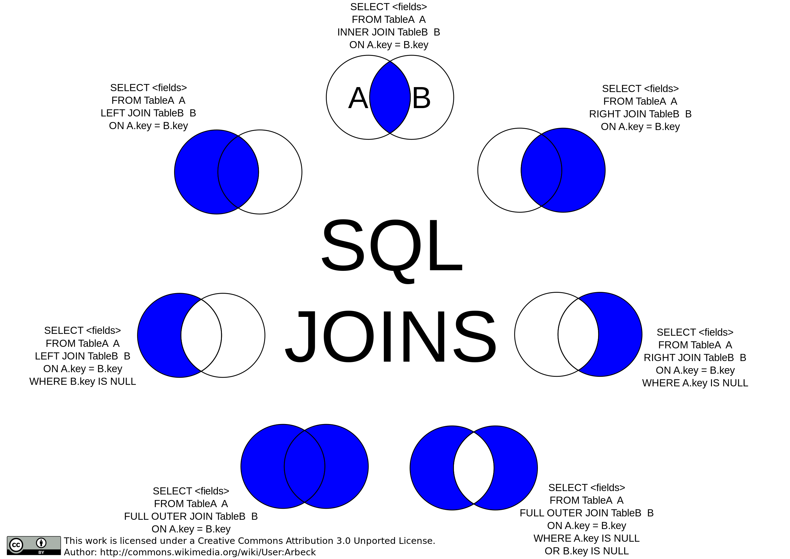
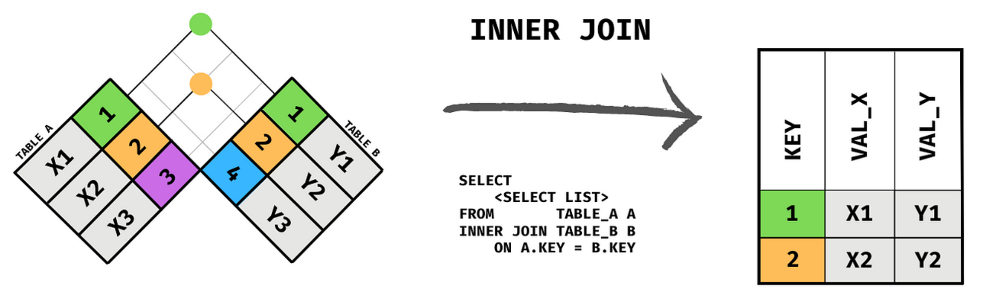
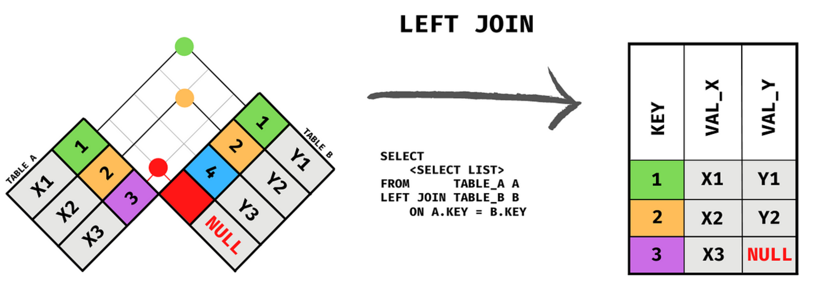
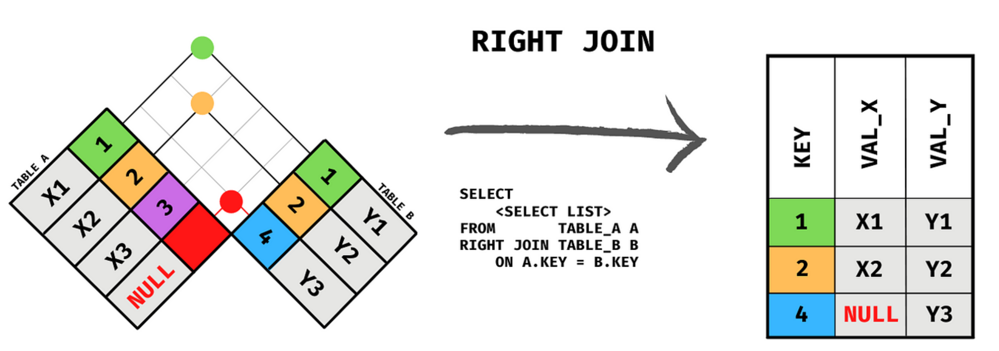
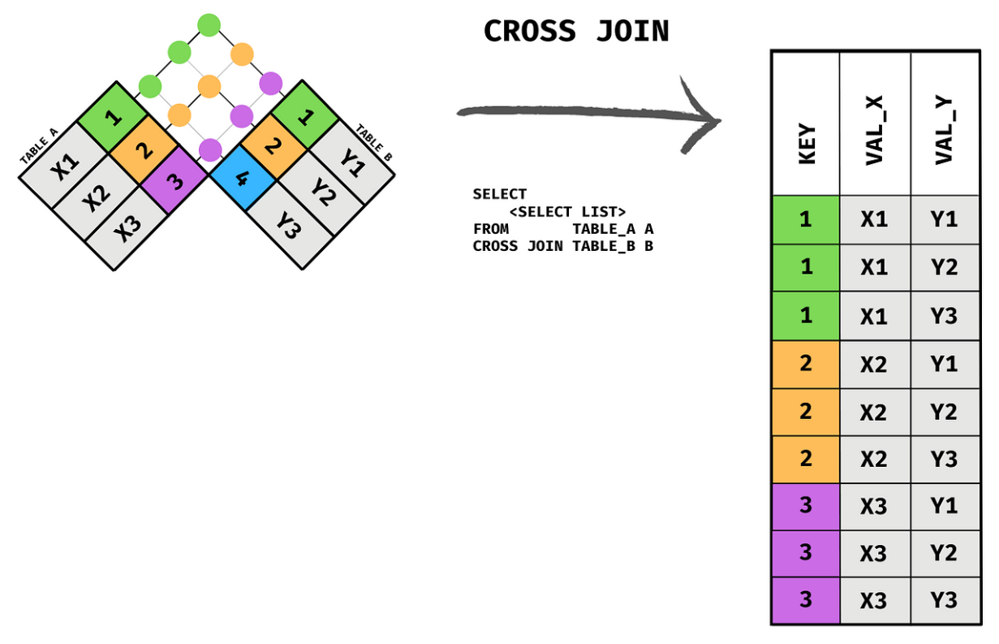

# Les jointures

## Introduction aux jointures

### Qu'est-ce qu'une jointure ?

Les jointures _SQL_ sont un concept fondamental dans la gestion des bases de données relationnelles.

**Elles permettent de combiner des colonnes de deux tables ou plus, en se basant sur une relation entre elles, pour créer un ensemble de résultats plus complet.**

Les jointures sont essentielles pour interroger efficacement des données interconnectées.

Les jointures servent à :

- Extraire des données de plusieurs tables en une seule requête.
- Relier des tables ayant une relation logique entre elles.
- Simplifier les requêtes en évitant la répétition de données.
- Optimiser l'accès et l'analyse de données complexes.



_Les diagrammes de Venn comme ci-dessus ne sont pas les mieux pour visualiser les jointures, mais c'est les plus utilisés. Nous le mettons car vous les retrouverez partout mais les visualisations suivantes sont bien meilleures._

### Types de jointures

#### `INNER JOIN`

L'`INNER JOIN` retourne les enregistrements ayant une correspondance dans les deux tables jointes.



#### `LEFT JOIN` (ou `LEFT OUTER JOIN`)

Le `LEFT JOIN` retourne tous les enregistrements de la table de gauche (A), ainsi que les enregistrements correspondants de la table de droite (B).

Les résultats pour _B_ seront _NULL_ si aucune correspondance n'est trouvée.



#### `RIGHT JOIN` (ou `RIGHT OUTER JOIN`)

Le `RIGHT JOIN `fonctionne comme le `LEFT JOIN`, mais retourne tous les enregistrements de la table de droite (_B_), et les correspondances de la table de gauche (_A_).



#### `CROSS JOIN`

Le `CROSS JOIN` produit un produit cartésien des deux tables, combinant chaque ligne de la table A avec chaque ligne de la table B.



#### `SELF JOIN`

Un `SELF JOIN` est une jointure d'une table avec elle-même. Utilisé pour comparer les lignes au sein de la même table.

#### `NATURAL JOIN`

Le `NATURAL JOIN` effectue une jointure en comparant automatiquement toutes les colonnes des deux tables ayant le même nom et datatype.

## Les INNER JOINS

### Définition du `INNER JOIN`

**Un `INNER JOIN` est une opération qui permet de combiner des lignes de deux tables ou plus, en se basant sur une condition de correspondance commune.**

Il ne renvoie que les lignes où la condition est vraie dans les deux tables.

#### Syntaxe

```sql
SELECT colonnes
FROM table1
INNER JOIN table2 ON table1.colonne_commune = table2.colonne_commune;
```

La **condition de jointure** permet de spécifier la colonne ou les colonnes sur lesquelles les deux tables sont reliées. Ici c'est _colonne_commune_.

#### Explications


Sur la gauche, nous avons deux tables, Table A et Table B, qui doivent être jointes. Chaque table a deux colonnes.

La colonne colorée représente la colonne "_KEY_" : elle est utilisée pour faire correspondre les lignes entre les tableaux.

La colonne grise est la colonne _VAL_X_ pour la table _A_ et _VAL_Y_ pour la table _B_. Il pourrait y avoir de nombreuses autres colonnes, cela ne changerait rien à l'explication.

```sql
SELECT <SELECT LIST>
FROM TABLE_A A
INNER JOIN TABLE_B B ON A.KEY = B.KEY
```

Cette requête sélectionne un ensemble de colonnes (représentées ici par `<SELECT LIST>`) à partir de la _TABLE_A_, alias _A_, et de la _TABLE_B_, alias _B_.

Les tables sont jointes en utilisant `INNER JOIN` sur la condition que la colonne "KEY" dans la _TABLE_A_ doit correspondre à la colonne "KEY" dans la _TABLE_B_.

Le résultat de la jointure est illustré sur la droite, montrant une table combinée avec les colonnes "_KEY_", "_VAL_X_", et "_VAL_Y_".

Seules les lignes avec des valeurs "_KEY_" correspondantes dans les deux tables (1 et 2) sont incluses dans le résultat. Les colonnes "_VAL_X_" et "_VAL_Y_" sont les colonnes associées à ces clés dans les tables originales.

**En résumé, l'`INNER JOIN` ne renvoie que les lignes qui ont une correspondance dans les deux tables jointes. Si une ligne de la Table A a une clé qui ne trouve pas de correspondance dans la Table B, cette ligne ne sera pas incluse dans le résultat, et vice-versa.**

**Important :** avec _MySQL_, `JOIN`, `CROSS JOIN`, et `INNER JOIN` sont exactement équivalent (ce sont des équivalents syntaxiques). C'est une spécificité de _MySQL_, en _SQL_ standard ils ne sont pas équivalents.

Il faut donc utiliser l'un des trois suivants la situation, uniquement pour augmenter la lisibilité, à savoir l'intention de la requête.

### Utilisation d'alias

Les alias sont des noms temporaires attribués à une table ou une colonne pour simplifier les requêtes, surtout quand les noms sont longs ou lorsqu'on effectue des jointures.

Nous les avions vus pour les colonnes, mais nous pouvons aussi avoir des alias pour les tables ce qui simplifie l'écriture des jointures.

Voici un exemple :

```sql
SELECT e.nom, d.nom_dept
FROM employes AS e
INNER JOIN departements AS d ON e.departement_id = d.id;
```

Dans cet exemple, _employes_ est renommé en _e_ et _departements_ en _d_, rendant la requête plus concise et plus lisible.

### Utilisation de USING

La clause `USING` simplifie encore la syntaxe lorsque les deux tables partagent des colonnes du même nom.

```sql
SELECT e.nom, d.nom_dept
FROM employes e
INNER JOIN departements d USING(departement_id);
```

Ici, `USING(departement_id)` remplace `ON e.departement_id = d.id`. C'est plus propre, surtout quand il y a plusieurs colonnes communes.

### Exemples

#### Jointure simple

```sql
SELECT e.nom, p.nom_projet
FROM employes e
INNER JOIN projets p ON e.projet_id = p.id;
```

La requête renvoie les noms des employés et les noms des projets auxquels ils sont associés.

#### Jointure avec plusieurs colonnes

```sql
SELECT e.nom, p.nom_projet, d.nom_dept
FROM employes e
INNER JOIN projets p ON e.projet_id = p.id
INNER JOIN departements d ON e.departement_id = d.id;
```

Nous ajoutons le département de chaque employé à la requête.

#### Jointure avec filtrage

```sql
SELECT e.nom, p.nom_projet, d.nom_dept
FROM employes e
INNER JOIN projets p ON e.projet_id = p.id
INNER JOIN departements d ON e.departement_id = d.id
WHERE d.nom_dept = 'Ressources Humaines';
```

Ici, nous filtrons pour n'inclure que les employés qui travaillent dans le département des Ressources Humaines.

### Mise en pratique

Pour rappel voici le schéma de notre base de données :


Voyons quelques exemples ensemble puis vous pourrez aller plus loin avec quelques exercices pratiques.

**Lister tous les films et leur pays de production, utilisez des alias où c'est possible.**

```sql
SELECT m.title, c.country_name
FROM movie m
INNER JOIN production_country pc ON m.movie_id = pc.movie_id
INNER JOIN country c ON pc.country_id = c.country_id;
```

**Lister tous les films et leur pays de production, utilisez USING pour simplifier.**

```sql
SELECT title, country_name
FROM movie
INNER JOIN production_country USING(movie_ID)
INNER JOIN country USING(country_id)
```

**Lister tous les films produits en France, utilisez des alias :**

```sql
SELECT m.title, c.country_name
FROM movie m
INNER JOIN production_country pc ON m.movie_id = pc.movie_id
INNER JOIN country c ON pc.country_id = c.country_id
WHERE country_name = 'France';
```

**Trouver tous les films avec une bande son en français, utilisez des alias : **

```sql
SELECT DISTINCT title, language_name
FROM movie m
INNER JOIN movie_languages ml ON m.movie_id = ml.movie_id
INNER JOIN language l ON ml.language_id = l.language_id
WHERE language_name = 'Français';
```

**Même chose mais avec des clauses `USING` :**

```sql
SELECT DISTINCT title, language_name
FROM movie
INNER JOIN movie_languages USING(movie_id)
INNER JOIN language USING(language_id)
WHERE language_name = 'Français';
```

**Lister les films, leur genre et leurs langues :**

```sql
SELECT m.title, g.genre_name, l.language_name
FROM movie m
INNER JOIN movie_genres mg ON m.movie_id = mg.movie_id
INNER JOIN genre g ON mg.genre_id = g.genre_id
INNER JOIN movie_languages ml ON m.movie_id = ml.movie_id
INNER JOIN language l ON ml.language_id = l.language_id;
```

**Remarquez bien qu'il y a _plusieurs lignes pour le même film_ car il existe plusieurs langues pour la plupart des films.**

**Lister tous les acteurs du film Inception et le personnage qu'ils incarnent :**

```sql
SELECT p.person_name, mc.character_name
FROM movie_cast mc
INNER JOIN person p ON mc.person_id = p.person_id
WHERE mc.movie_id = (SELECT movie_id FROM movie WHERE title = "Inception");
```

**_Notez bien_ l'utilisation d'une clause `SELECT` supplémentaire :** `(SELECT movie_id FROM movie WHERE title = "Inception")` : ce `SELECT` imbriqué permet de trouver le _movie_id_ correspondant au film dont le titre est "Inception" dans la table _movie_. Cette valeur est ensuite utilisée pour filtrer les entrées de la table _movie_cast_ et ainsi ne récupérer que les acteurs et leurs rôles associés à "Inception".

## Les OUTER JOINS

### Qu'est-ce qu'un `OUTER JOIN` ?

**Un `OUTER JOIN` renvoie toutes les lignes de la table spécifiée (gauche ou droite) et les lignes correspondantes de l'autre table.**

Les résultats contiendront _NULL_ pour chaque colonne provenant de la table qui n'a pas de correspondance.

#### `LEFT JOIN` (ou `LEFT OUTER JOIN`)

Le `LEFT JOIN` retourne tous les enregistrements de la table de gauche (A), ainsi que les enregistrements correspondants de la table de droite (B).

Les résultats pour _B_ seront _NULL_ si aucune correspondance n'est trouvée.

**Syntaxe de base**

```sql
SELECT colonnes
FROM table1
LEFT JOIN table2 ON table1.colonne_commune = table2.colonne_commune;
```

Cette requête récupère toutes les lignes de table1 et les lignes correspondantes de table2. Lorsqu'il n'y a pas de correspondance, les résultats de table2 seront NULL.


Sur la gauche, nous avons deux tables, Table A et Table B, qui doivent être jointes. Chaque table a deux colonnes.

La colonne colorée représente la colonne "_KEY_" : elle est utilisée pour faire correspondre les lignes entre les tableaux.

La colonne grise est la colonne _VAL_X_ pour la table A et _VAL_Y_ pour la table _B_. Il pourrait y avoir de nombreuses autres colonnes, cela ne changerait rien à l'explication.

```sql
SELECT <SELECT LIST>
FROM TABLE_A A
LEFT JOIN TABLE_B B ON A.KEY = B.KEY
```

Cette requête sélectionne un ensemble de colonnes (représentées ici par `<SELECT LIST>`) à partir de la _TABLE_A_, alias _A_, et de la _TABLE_B_, alias _B_.

Les tables sont jointes en utilisant `LEFT JOIN` sur la condition que la colonne "KEY" dans la _TABLE_A_ doit correspondre à la colonne "KEY" dans la _TABLE_B_.

Le résultat de la jointure est illustré sur la droite, montrant une table combinée avec les colonnes "_KEY_", "_VAL_X_", et "_VAL_Y_".

Cette requête renvoie toutes les lignes de _TABLE_A_ avec les valeurs correspondantes de _TABLE_B_. Lorsqu'il n'y a pas de correspondance (comme pour la clé 3 dans _TABLE_A_), les colonnes de _TABLE_B_ dans la sortie sont remplies de _NULL_, indiquant l'absence de correspondance.

#### `RIGHT JOIN` (ou `RIGHT OUTER JOIN`)

Le `RIGHT JOIN` fonctionne comme le `LEFT JOIN`, mais retourne tous les enregistrements de la table de droite (_B_), et les correspondances de la table de gauche (_A_).


#### `RIGHT JOIN` vs `LEFT JOIN`

On peut toujours utiliser un `LEFT JOIN` à la place d'un `RIGHT JOIN`.

En fait, n'importe quelle requête qui utilise un `RIGHT JOIN` peut être réécrite en utilisant un `LEFT JOIN` en inversant simplement l'ordre des tables impliquées dans la jointure.

Les RIGHT JOIN sont moins utilisés que les LEFT JOIN principalement pour des raisons de lisibilité et de convention. Voici quelques raisons spécifiques :

- **Convention de lecture :** en Occident, nous lisons de gauche à droite. Les `LEFT JOIN` suivent cette convention en plaçant la table principale (la table de gauche) en premier dans la requête, ce qui est plus naturel pour de nombreux développeurs.
- **Facilité de compréhension :** l'utilisation de `LEFT JOIN` permet de comprendre plus facilement que l'on prend toutes les lignes de la table de gauche et que l'on inclut les données correspondantes de la table de droite.
- **Maintenabilité du code :** si une requête doit être étendue pour inclure plusieurs jointures, l'utilisation de `LEFT JOIN` rend généralement le code plus lisible et plus facile à maintenir, car il suit un modèle linéaire de gauche à droite.
- **Cohérence :** les équipes de développement établissent souvent des normes pour la cohérence du code. Comme `LEFT JOIN` est plus couramment utilisé, les équipes s'y tiennent pour que tout le monde dans l'équipe comprenne rapidement ce que fait la requête.

Il est donc recommandé de tout le temps utiliser des `LEFT JOINS` sauf dans des requêtes vraiment longues et complexes où les `RIGHT JOINS` peuvent s'avérer nécessaires ou pratiques, mais ce sera très rare !

### Mise en pratique

Reprenons notre base de données pour une mise en pratique.

**Trouvez les films qui n'ont pas de mot clé associé :**

```sql
SELECT m.title
FROM movie m
LEFT JOIN movie_keywords mk ON m.movie_id = mk.movie_id
WHERE mk.keyword_id IS NULL;
```

**Affichez tous les films dont le pays de production n'est pas connu :**

```sql
SELECT *
FROM movie m
LEFT JOIN production_country pc ON m.movie_id = pc.movie_id
LEFT JOIN country c ON pc.country_id = c.country_id
WHERE country_name IS NULL;
```

**Trouvez les films qui n'ont pas de genre attribué :**

```sql
SELECT m.title
FROM movie m
LEFT JOIN movie_genres mg ON m.movie_id = mg.movie_id
WHERE mg.genre_id IS NULL;
```

## Les CROSS JOINS

### Qu'est-ce qu'un `CROSS JOIN` ?

**Un `CROSS JOIN` est une opération en _SQL_ qui produit le produit cartésien de deux tables.**

Cela signifie que chaque ligne de la première table est jointe à chaque ligne de la seconde table. Si la première table contient _m_ lignes et la seconde table _n_ lignes, le résultat du `CROSS JOIN` contiendra **m x n** lignes.

Pour rappel avec _MySQL_, `JOIN`, `CROSS JOIN`, et `INNER JOIN` sont exactement équivalent (ce sont des équivalents syntaxiques). C'est une spécificité de _MySQL_, en _SQL_ standard ils ne sont pas équivalents.

Il faut donc utiliser l'un des trois suivants la situation, uniquement pour augmenter la lisibilité, l'intention de la requête.

#### Quand utiliser un `CROSS JOIN` ?

Les `CROSS JOIN` sont utiles lorsque vous avez besoin de combiner chaque élément d'un ensemble avec tous les éléments d'un autre ensemble.

Par exemple, cela peut être utile pour :

- Générer toutes les combinaisons possibles de produits et de couleurs si vous gérez un inventaire.
- Associer chaque employé à chaque projet pour une analyse de charge de travail potentielle.

**Attention !** Utilisez les `CROSS JOINS` avec précaution car ils peuvent rapidement générer de très grands ensembles de résultats, surtout si les tables ont beaucoup de lignes.

#### Comment écrire un CROSS JOIN ?

La syntaxe de base d'un `CROSS JOIN` est la suivante :

```sql
SELECT *
FROM table1
CROSS JOIN table2;
```

Cela donnera comme résultat chaque combinaison possible des lignes de table1 et table2.

Le `CROSS JOIN` produit un produit cartésien des deux tables, combinant chaque ligne de la table A avec chaque ligne de la table B.


#### Exemple

Supposons que nous ayons deux tables, _employees_ et _projects_, et que nous voulions voir toutes les affectations possibles d'employés aux projets.

```sql
SELECT employees.name, projects.title
FROM employees
CROSS JOIN projects;
```

## Les SELF JOINS

### Qu'est-ce qu'un `SELF JOIN` ?

Un `SELF JOIN` est une opération en _SQL_ où une table est jointe à elle-même.

Bien qu'aucune syntaxe spéciale de `SELF JOIN` n'existe en SQL, on utilise un `INNER JOIN`, `LEFT JOIN`, ou toute autre forme de jointure pour réaliser cette opération en donnant différents alias à la même table pour la comparer avec elle-même.

### Pourquoi Utiliser un Self Join ?

Les `SELF JOIN` sont particulièrement utiles pour comparer des lignes au sein de la même table ou pour trouver des relations dans une table qui se réfère à elle-même, comme une structure hiérarchique où des employés sont managés par d'autres employés.

**Attention aux doublons :** soyez conscient des conditions qui pourraient générer des résultats redondants et utilisez `WHERE` pour les filtrer si nécessaire.

### Syntaxe de Base

Dans cet exemple, _A_ et _B_ sont des alias pour _table_name_, permettant de comparer ou de joindre la table à elle-même.

```sql
SELECT A.column_name, B.column_name
FROM table_name AS A
JOIN table_name AS B ON A.common_field = B.common_field
WHERE condition;
```

### Jointure implicite

Une jointure implicite fait référence à l'utilisation de la clause `WHERE` pour combiner des lignes provenant de deux ou plusieurs tables, basée sur une condition relationnelle, sans utiliser explicitement le mot-clé `JOIN`.

Ce type de jointure est considéré comme "implicite" car la relation entre les tables n'est pas exprimée par une syntaxe de jointure explicite (`INNER JOIN`, `LEFT JOIN`, etc.), mais est plutôt déduite de la condition spécifiée dans la clause `WHERE`.

Bien que les jointures implicites soient toujours supportées pour des raisons de compatibilité et peuvent être utiles dans des cas simples, il est généralement recommandé d'utiliser la syntaxe explicite de jointure (`JOIN`). La syntaxe explicite améliore la lisibilité, facilite la compréhension de la relation entre les tables, et réduit le risque d'erreurs dans des requêtes complexes.

### Exemples

#### Premier exemple

Imaginons une table **employees** avec les colonnes _employee_id_, _employee_name_, et _department_id_.

```sql
SELECT A.employee_name AS 'Employee 1', B.employee_name AS 'Employee 2'
FROM employees A
JOIN employees B ON A.department_id = B.department_id
AND A.employee_id != B.employee_id;
```

On peut également l'écrire de manière implicite (mais ce n'est pas vraiment recommandé, cela dépend des préférences et de la lisibilité) :

```sql
SELECT A.employee_name AS 'Employee 1', B.employee_name AS 'Employee 2'
FROM employees A, employees B
WHERE A.department_id = B.department_id
AND A.employee_id != B.employee_id;
```

Cette requête liste toutes les paires d'employés travaillant dans le même département.

#### Deuxième exemple

Si **employees** a une colonne _manager_id_ qui référence _employee_id_ dans la même table, pour trouver tous les employés et leurs managers direct :

```sql
SELECT E.employee_name AS 'Employé', M.employee_name AS 'Manager'
FROM employees E
LEFT JOIN employees M ON E.manager_id = M.employee_id;
```

### Mise en pratique

**Identifier les paires d'acteurs qui ont travaillé ensemble dans au moins un film :**

```sql
SELECT A.person_name AS 'Acteur 1', B.person_name AS 'Acteur 2', M.title AS 'Titre du Film'
FROM movie_cast AS MC1
JOIN movie_cast AS MC2 ON MC1.movie_id = MC2.movie_id AND MC1.person_id != MC2.person_id
JOIN person AS A ON MC1.person_id = A.person_id
JOIN person AS B ON MC2.person_id = B.person_id
JOIN movie AS M ON MC1.movie_id = M.movie_id;
```

## Les UNIONS

### Introduction aux `UNIONS`

**L'opérateur `UNION` en _MySQL_ est utilisé pour combiner les résultats de deux ou plusieurs requêtes `SELECT` en un seul ensemble de résultats, incluant toutes les lignes de chacune des requêtes.**

Les `UNIONS` sont particulièrement utiles lorsque vous souhaitez rassembler des données provenant de tables différentes qui ont des colonnes similaires.

#### Règles de base pour les `UNIONS`

1. **Colonnes correspondantes :** chaque requête `SELECT` dans l'`UNION` doit avoir le même nombre de colonnes dans la liste de sélection, avec des types de données compatibles.
2. **Ordre des colonnes :** l'ordre des colonnes dans chaque requête `SELECT` doit correspondre.
3. **Tri et limitation :** pour ordonner ou limiter les résultats de l'`UNION`, utilisez une clause `ORDER BY` ou `LIMIT` à la fin de la dernière requête `SELECT`.

**Syntaxe de base :**

```sql
SELECT column_name(s) FROM table1
UNION
SELECT column_name(s) FROM table2;
```

**Note importante :** `UNION` effectue par défaut la suppression des doublons, ce qui signifie qu'elle combine les résultats de deux requêtes et élimine les lignes en double pour ne retourner que des lignes uniques.

Si vous voulez conserver les lignes en doublon, il faut utiliser `UNION ALL` qui combine les résultats de deux requêtes ou plus et inclut tous les doublons. Aucune vérification des doublons n'est alors effectuée.

### Exemples

Supposons que nous avons deux tables, **employees** et **managers**, chacune avec les colonnes _id_ et _name_. Pour obtenir une liste combinée de tous les employés et tous les managers, nous pouvons utiliser `UNION` :

```sql
SELECT name FROM employees
UNION
SELECT name FROM managers
ORDER BY name;
```

### Mise en pratique

**Obtenez une liste des noms de tous les acteurs et de tous les membres de l'équipe de tournage :**

```sql
SELECT person_name FROM person
JOIN movie_cast ON person.person_id = movie_cast.person_id
UNION
SELECT person_name FROM person
JOIN movie_crew ON person.person_id = movie_crew.person_id;
```
