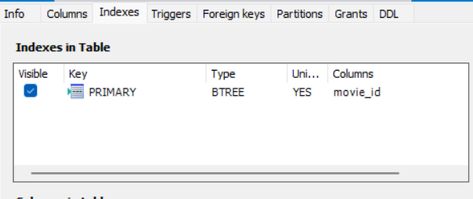

# Créer, mettre à jour et supprimer des données

## Introduction aux attributs des colonnes

### Les attributs de colonne

Les attributs de colonne dans _MySQL_ définissent les propriétés et le comportement des colonnes d'une table.

Chaque colonne dans une table _MySQL_ a un type de données spécifique et peut également avoir un ou plusieurs attributs qui précisent d'autres propriétés telles que si une colonne peut être _NULL_, sa valeur par défaut, ou des contraintes comme les clés primaires ou étrangères.

### Types de données

Chaque colonne dans une table _MySQL_ doit être déclarée avec un type de données.

Les types de données déterminent la nature des données que la colonne peut stocker et comprennent des catégories telles que :

- **Numérique :** `INT`, `SMALLINT`, `FLOAT`, `DOUBLE`, `DECIMAL`, etc.
- **Chaîne de caractères :** `VARCHAR`, `CHAR`, `TEXT`, `BLOB`, etc.
- **Date/Heure :** `DATE`, `DATETIME`, `TIMESTAMP`, `YEAR`, etc.
- **Espace de travail géographique :** `POINT`, `LINESTRING`, `POLYGON`, etc.
- Du **JSON**

Nous verrons tous les types de données en détail dans un chapitre dédié.

### Attributs de colonne principaux

Voici les attributs principaux des colonnes :

- `NULL` / `NOT NULL` : détermine si la colonne peut stocker des valeurs _NULL_.
- `DEFAULT` : établit une valeur par défaut pour la colonne.
- `AUTO_INCREMENT` : incrémente automatiquement la valeur pour les nouvelles lignes. Utilisé généralement pour la clé primaire.
- `UNSIGNED` : pour les types numériques, indique qu'ils ne peuvent pas être négatifs.
- `ZEROFILL` : remplit le champ avec des zéros si la valeur n'atteint pas la longueur définie.
- `COMMENT` : fournit un commentaire descriptif sur la colonne.

Nous verrons les autres attributs lorsque nous apprendrons à créer des tables et des colonnes.

### Contraintes de colonne

Les contraintes sont des règles appliquées aux valeurs de colonne :

- `PRIMARY KEY` : identifie de manière unique chaque enregistrement dans la table. La plupart du temps nous utilisons un entier auto-incrémenté par _MySQL_.
- `UNIQUE` : assure que toutes les valeurs dans une colonne sont différentes.
- `FOREIGN KEY` : établit une relation entre la colonne et une colonne d'une autre table.
- `CHECK` : assure que les valeurs de la colonne satisfont une condition donnée.

Nous verrons les contraintes plus en détail lorsque nous apprendrons à créer des tables et des colonnes.

### Etude des colonnes de la table movie

Voici notre table _movie_ :


Vous pouvez voir dans la colonne indexes que movie_id est la clé primaire :



Expliquons en détail quelques colonnes :

- **_movie_id_**
  - **Type :** _int_ (entier). Utilisé pour des nombres sans décimales.
  - **Attributs :** _NOT NULL_ signifie que chaque film doit avoir un identifiant unique et ne peut pas être laissé vide. _AUTO_INCREMENT_ indique que _MySQL_ va automatiquement augmenter la valeur de cette colonne pour chaque nouvel enregistrement inséré.
  - **Contraintes :** _PRIMARY KEY_ indique que cette colonne est la clé principale de la table, ce qui garantit l'unicité de chaque ligne.
- **title**
  - **Type :** _varchar(1000)_. Un type de données pour les chaînes de caractères pouvant aller jusqu'à 1000 caractères.
  - **Attributs :** _DEFAULT NULL_ indique que si aucune valeur n'est spécifiée lors de l'insertion d'un enregistrement, la colonne sera remplie avec _NULL_.
- **budget**
  - **Type :** _int_. Stocke des nombres entiers.
  - **Attributs :** _DEFAULT NULL_ permet de ne pas spécifier de budget pour un film.

## Insérer une rangée dans une table

L'insertion de données dans une table _MySQL_ se fait à l'aide de la commande `INSERT INTO`.

Celle-ci permet d'ajouter une nouvelle ligne dans la table avec les valeurs pour chaque colonne spécifiée.

Voici la syntaxe de base pour insérer une nouvelle rangée :

```sql
INSERT INTO nom_de_la_table (colonne1, colonne2, colonne3, ...)
VALUES (valeur1, valeur2, valeur3, ...);
```

**Les noms des colonnes sont facultatifs si vous fournissez des valeurs pour toutes les colonnes dans l'ordre exact où elles ont été définies dans la table.**

Si une colonne a un attribut `AUTO_INCREMENT`, vous pouvez omettre cette colonne dans la liste des colonnes, et _MySQL_ lui attribuera automatiquement la prochaine valeur incrémentée.

Pour les colonnes définies avec `DEFAULT NULL` ou avec une valeur par défaut, vous pouvez omettre ces colonnes et _MySQL_ utilisera la valeur par défaut définie.

Pour la syntaxe propre à chaque type :

- Les valeurs des chaînes doivent être entourées de guillemets simples '.
- Les valeurs numériques ne doivent pas être entre guillemets.
- Les dates doivent être au format YYYY-MM-DD et entre guillemets.

### Insertion sans préciser le nom des colonnes

Pour insérer une nouvelle rangée sans spécifier explicitement les noms des colonnes, vous devez fournir des valeurs pour toutes les colonnes de la table dans l'ordre dans lequel elles sont définies, excepté celles qui sont automatiquement gérées par _MySQL_ (comme les colonnes `AUTO_INCREMENT`).

Il est crucial de respecter l'ordre exact des colonnes tel qu'il est défini dans la structure de la table, ce qui peut rendre l'opération d'insertion moins claire et plus sujette aux erreurs.

Ce n'est donc généralement pas recommandé, mais nous allons voir un exemple.

#### Exemple avec la table **movie**

Vous devez respecter l'ordre des colonnes exact dans l'onglet _Indexes_ sur _Workbench_ :

```sql
INSERT INTO movie
VALUES (NULL, 'Future Echoes', 75000000, 'https://futureechoes.com', 'Une exploration du temps qui défie la réalité.', 22.8, '2021-11-05', 200000000, 130, 'Released', 'Le futur résonne toujours.', 9.0, 3500);
```

Notez que _NULL_ est utilisé pour _movie_id_, permettant à _MySQL_ d'assigner automatiquement la prochaine valeur `AUTO_INCREMENT`.

Nous verrons les fonctions plus tard, mais contrôlez l'insertion avec la requête :

```sql
SELECT * FROM movies.movie
WHERE movie_id = last_insert_id();
```

### Insertion en précisant le nom des colonnes

Lors de l'insertion de données dans une base de données _MySQL_, il est souvent recommandé de préciser explicitement les noms des colonnes pour lesquelles vous fournissez des valeurs.

Les avantages sont les suivants :

- **Clarté :** spécifier les noms des colonnes rend votre code SQL plus lisible et compréhensible, en particulier pour d'autres personnes ou pour vous-même à l'avenir.
- **Flexibilité :** vous pouvez insérer des données sans devoir fournir des valeurs pour chaque colonne, en particulier pour celles qui ont des valeurs par défaut ou sont optionnelles.
- **Prévention des erreurs :** en nommant explicitement les colonnes, vous réduisez le risque d'insérer accidentellement des valeurs dans les mauvaises colonnes, surtout si l'ordre des colonnes change dans la définition de la table.

#### Exemple d'insertion

Imaginons que nous voulons insérer des informations sur un nouveau film intitulé "Sunset Journey", sorti en 2021.

Nous avons des informations sur le titre, la date de sortie, le statut du film, et la popularité, mais peut-être pas sur les autres détails pour le moment.

Nous avons vu précédemment que seul _movie_id_ est non nullable dans la table et que si nous précisons pas cette colonne, _MySQL_ va générer une valeur automatiquement grâce à l'auto-incrémentation.

```sql
INSERT INTO movie (title, release_date, movie_status, popularity)
VALUES ('Sunset Journey', '2021-05-15', 'Released', 12.4);
```

Dans cet exemple, les colonnes spécifiées sont :

- **title :** le titre du film est une information essentielle pour identifier le film.
- **release_date :** la date de sortie est cruciale pour savoir quand le film est sorti ou sortira.
- **movie_status :** le statut du film (par exemple, "Released", "Post Production") nous informe de l'état actuel du film.
- **popularity :** la popularité peut être un indice de l'intérêt ou du succès du film auprès du public.

Contrôlez l'insertion avec la requête :

```sql
SELECT * FROM movies.movie
WHERE movie_id = last_insert_id();
```

## Insérer plusieurs rangées dans une table

### Insertion de plusieurs rangées

**_MySQL_ permet d'insérer plusieurs rangées en une seule instruction `INSERT`.**

Cette méthode est particulièrement efficace pour ajouter de nombreuses données en réduisant le nombre de requêtes exécutées.

La syntaxe est la suivante :

```sql
INSERT INTO nom_table (c1,c2,c3)
    VALUES(1,2,3), (4,5,6), (7,8,9);
```

Par exemple :

```sql
INSERT INTO movie (title, release_date, movie_status)
VALUES ('Film A', '2022-01-01', 'Released'),
       ('Film B', '2022-02-01', 'Post Production'),
       ('Film C', '2022-03-01', 'Announced');
```

Ici, trois films sont ajoutés à la table movie avec des informations minimales. Cela réduit la surcharge par rapport à l'exécution de trois instructions `INSERT` distinctes.

Vous pouvez voir les dernières insertions tout simplement avec un `ORDER BY` :

```sql
SELECT * FROM movie ORDER BY `movie_id` DESC LIMIT 10
```

### Insertion à partir d'une sélection

**Vous pouvez insérer des données dans une table en sélectionnant et transformant des données provenant d'une autre table ou d'une requête complexe.**

#### Exemple

Supposons que nous voulons ajouter des films sortis avant le 1er janvier 1950 à une nouvelle table **old_movies** à partir de la table **movie**.

Dans _Workbench_ dans la base de données _movies_, cliquez du droit sur _Tables_ puis _Create Table_ :

- Table Name: **old_movies**
- Colonnes :
  - title, VARCHAR(1000)
  - release_date, DATE
  - movie_id : INT, PK, NN, AI


Effectuons ensuite une insertion avec une sélection :

```sql
INSERT INTO old_movies (title, release_date)
SELECT title, release_date
FROM movie
WHERE release_date < '1950-1-1';
```

Vérifiez le contenu de la table :

```sql
SELECT * FROM movies.old_movies;
```

Les insertions avec sélection sont très puissantes.

## Mettre à jour une rangée dans une table

### Mise à jour de rangées

La mise à jour des données d'une table _MySQL_ se fait avec l'instruction `UPDATE`.

Cette commande modifie les valeurs des colonnes dans une ou plusieurs rangées selon les conditions spécifiées.

La syntaxe de base de l'instruction `UPDATE` est la suivante :

```sql
UPDATE nom_de_la_table
SET colonne1 = valeur1, colonne2 = valeur2, ...
WHERE condition;
```

**nom_de_la_table :** le nom de la table où vous souhaitez effectuer la mise à jour.

_colonne = valeur :_ la colonne à mettre à jour et la nouvelle valeur à lui attribuer.

**WHERE condition :** la condition qui détermine quelles rangées doivent être mises à jour. Si la condition `WHERE` est omise, toutes les rangées de la table seront mises à jour, ce qui n'est généralement pas recommandé.

Faites toujours attention à ne pas omettre la clause `WHERE` à moins que vous ne souhaitiez vraiment mettre à jour toutes les rangées de la table.

Il est prudent de faire un backup de vos données avant d'exécuter des mises à jour massives ou critiques.

### Exemples avec la table **movie**

Prenons comme exemple la table **movie** que nous avons vue précédemment et voyons comment nous pouvons mettre à jour des données spécifiques.

#### Exemple 1 : mise à jour simple

Mettre à jour la popularité du film "_Inception_":

```sql
UPDATE movie
SET popularity = 180
WHERE title = 'Inception';
```

Vous aurez cette erreur : **UPDATE movie SET popularity = 180 WHERE title = 'Inception' Error Code: 1175. You are using safe update mode and you tried to update a table without a WHERE that uses a KEY column. To disable safe mode, toggle the option in Preferences -> SQL Editor and reconnect.**

En fait, _MySQL Workbench_ a une option de sécurité activée par défaut qui empêche les mises à jour (et les suppressions) accidentelles de toutes les rangées d'une table si la clause `WHERE` n'utilise pas une colonne indexée.

Cela sert à prévenir les modifications massives non intentionnelles qui pourraient affecter la performance ou entraîner la perte de données.

En développement, vous pouvez désactiver le mode de mise à jour sécurisée.

Allez dans _Edit -> Preferences_ et sous SQL Editor, décochez l'option _Safe Updates_ (_rejects UPDATEs and DELETEs with no restrictions_).

Cliquez sur OK, **puis reconnectez vous à la base de données** pour que le changement prenne effet.

**En production ou si vous pouvez perdre des données, il est fortement déconseillé de désactiver le mode _Safe Update_.**

Pour le moment nous allons désactiver l'option car nous sommes en test. N'oubliez pas de quitter et de relancer la connexion à _MySQL_ dans _Workbench_. Vous pourrez ensuite exécuter la requête.

#### Exemple 2 : mise à jour de plusieurs valeurs

Augmenter le _vote_count_ et mettre à jour le _vote_average_ pour le même film :

```sql
UPDATE movie
SET vote_count = vote_count + 100, vote_average = 8.8
WHERE title = 'Inception';
```

Cette requête augmente le _vote_count_ de 100 votes et ajuste la note moyenne à 8.8 pour "Inception".

#### Exemple 3 : mise à jour de plusieurs rangées

```sql
UPDATE movie
SET movie_status = 'Released'
WHERE release_date < '2010-01-01' AND movie_status != 'Released';
```

## Utiliser des sous-requêtes pour les mises à jour

### Utiliser des sous-requête dans les mises à jour

Une sous-requête de mise à jour est une requête `SELECT` imbriquée dans une clause `UPDATE`.

**La sous-requête peut être utilisée dans la clause `SET` pour spécifier la nouvelle valeur à affecter ou dans la clause `WHERE` pour identifier les enregistrements à mettre à jour.**

Syntaxe dans la clause `SET` :

```sql
UPDATE table_a
SET column = (SELECT expression
              FROM table_b
              WHERE conditions)
WHERE conditions;
```

Syntaxe dans la clause `WHERE` :

```sql
UPDATE table_a
SET column_to_update = new_value
WHERE column = (SELECT value FROM table_b WHERE condition);
```

Les sous-requêtes dans la clause `WHERE` doivent retourner une seule valeur pour des opérateurs de comparaison comme `=`, `>`, `<`, etc.

**Elles peuvent retourner plusieurs valeurs si on utilise l'opérateur `IN`.**

```sql
UPDATE table_a
SET column_to_update = new_value
WHERE column IN (SELECT value FROM table_b WHERE condition);
```

### Exemples

#### Exemple avec `INNER JOIN` et sous-requête dans la clause `WHERE`

```sql
UPDATE movie
JOIN movie_genres USING(movie_id)
SET popularity = popularity + 10
WHERE genre_id = (SELECT genre_id FROM genre WHERE genre_name = 'Fantasy');
```

Cette requête augmentera de 10 le niveau de popularité dans la table **movie** pour tous les films qui sont classés dans le genre _'Fantasy'_, selon les correspondances trouvées dans la table **movie_genres**.

#### Utilisation de plusieurs requêtes imbriquées

```sql
UPDATE movie
SET budget = budget / 2
WHERE movie_id IN (
	SELECT movie_id FROM movie_crew WHERE person_id IN
			(SELECT person_id FROM person WHERE person_name = 'Harvey Weinstein')
	);
```

Et en ajoutant une condition supplémentaire :

```sql
UPDATE movie
SET budget = budget / 2
WHERE movie_id IN (
    SELECT movie_id FROM movie_crew
    WHERE person_id IN (
        SELECT person_id FROM person WHERE person_name = 'Harvey Weinstein'
    )
)
OR movie_id IN (
    SELECT movie_id FROM movie_cast
    WHERE person_id IN (
        SELECT person_id FROM person WHERE person_name = 'Harvey Weinstein'
    )
);
```

## Supprimer des rangées

La suppression de données est réalisée avec la commande `DELETE`.

Cette commande est puissante et doit être utilisée avec prudence, car une fois qu'une donnée est supprimée, il est généralement impossible de la récupérer.

La syntaxe de base pour supprimer des enregistrements est la suivante :

```sql
DELETE FROM nom_de_la_table WHERE condition;
```

### Suppression sans condition

Pour supprimer tous les enregistrements d'une table sans condition :

```sql
DELETE FROM nom_de_la_table;
```

Attention : Cette opération supprimera tous les enregistrements de la table !

### Suppression avec condition

Pour supprimer des enregistrements spécifiques, on utilise la clause `WHERE` :

```sql
DELETE FROM movie WHERE title = 'Inception';
```

Ceci supprimera tous les enregistrements de la table **movie** où le titre est _Inception_.

Noter que comme dans la leçon précédente il faut désactiver le mode SAFE UPDATE.

Vous pouvez aussi ruser pour ne pas avoir à désactiver le mode, en utilisant la clé primaire > 0 (ce qui sera vrai tout le temps) :

```sql
DELETE FROM movie
WHERE
    title = 'Incepddtion' AND movie_id > 0;
```

### Suppression avec plusieurs conditions

```sql
DELETE FROM movie
WHERE
    release_date < '1950-01-01'
    AND budget < 10000000
    AND movie_id > 0;
```

_Vous aurez une erreur de contrainte avec cette requête._

### Utilisation de sous-requêtes

Les sous-requêtes peuvent être utilisées pour cibler des enregistrements spécifiques :

```sql
DELETE FROM movie
WHERE
    movie_id IN (SELECT
        movie_id
    FROM
        movie_genre

    WHERE
        genre_id = 1);
```
