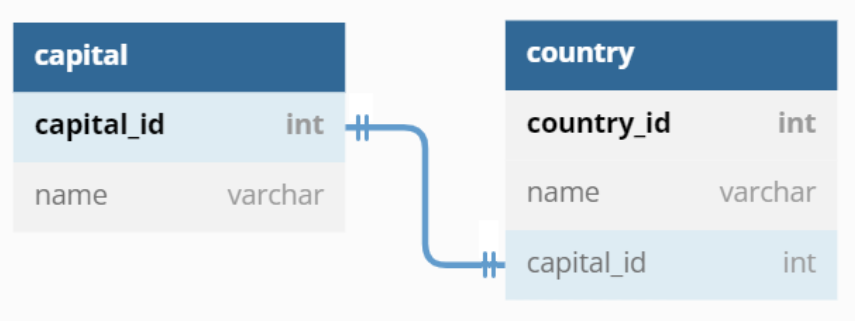
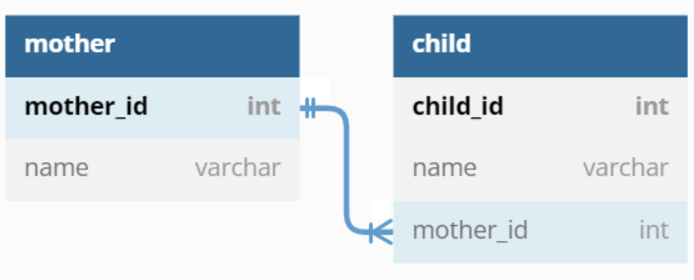
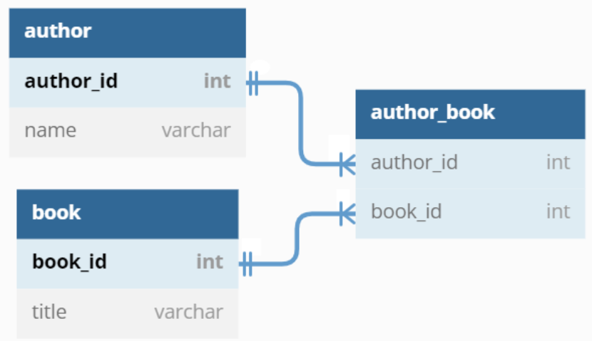
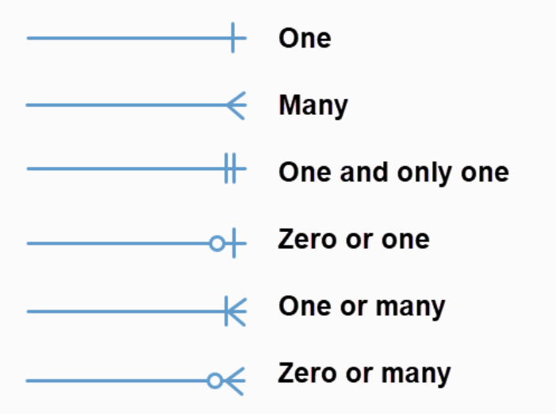
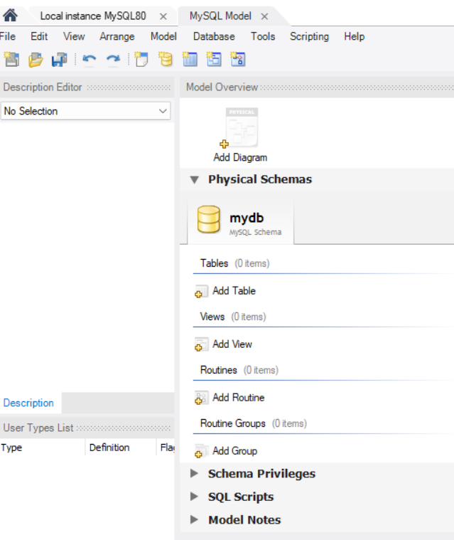
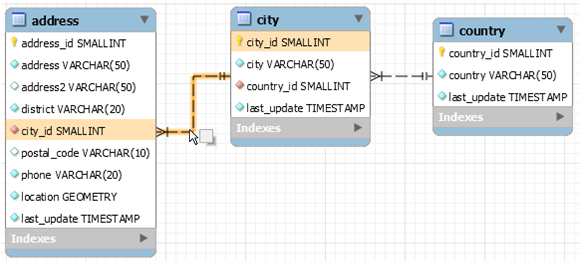
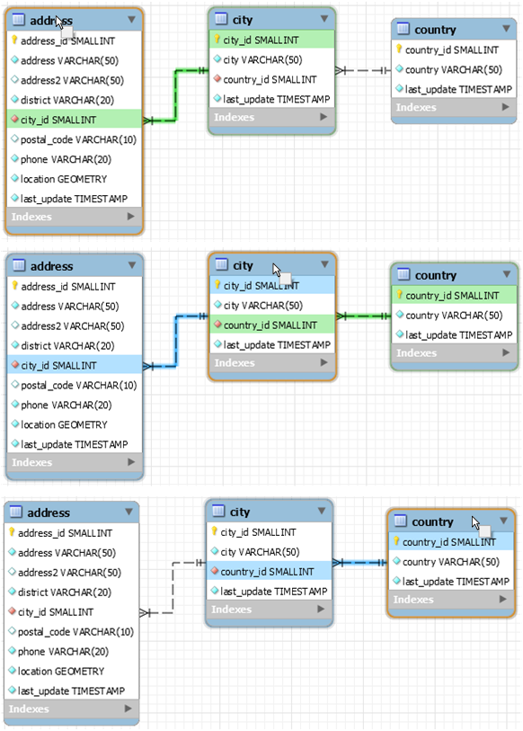
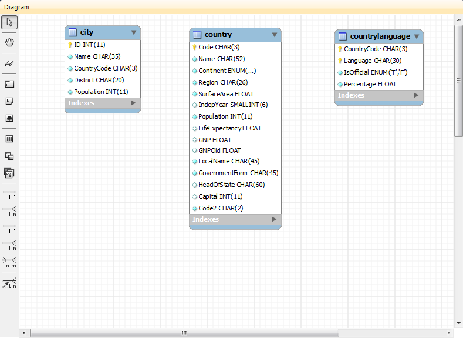
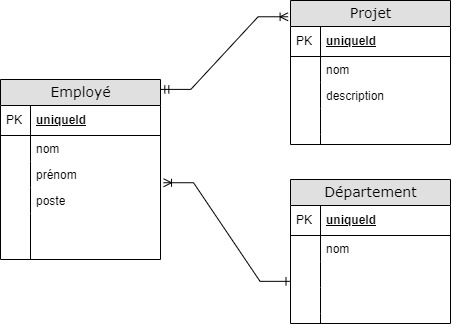
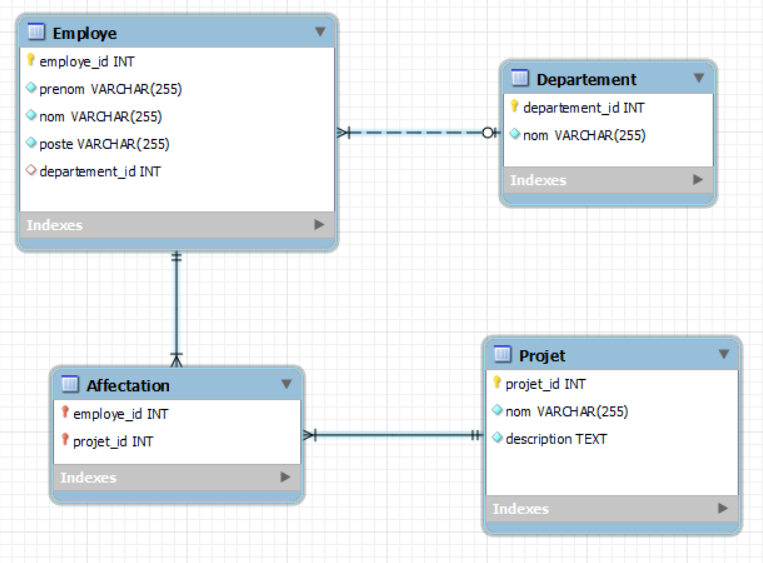

# Introduction à la modélisation de données (UML/EER)

Qu'est-ce que la modélisation de données ?

La modélisation de données permet de représenter visuellement la structure, les relations et les contraintes des données.

Ce processus aide à comprendre le système à un niveau plus abstrait et facilite la communication entre les développeurs, les analystes de données, et les parties prenantes dans l'entreprise.

Il permet de garantir que les exigences métier (on dit aussi business) soient représentées de manière optimisée dans une base de données physique.

Étapes de la modélisation de données

    Recueil des exigences : comprendre les besoins des utilisateurs et les objectifs de l'application pour déterminer les données à stocker.

    Conception conceptuelle : utilisation de diagrammes pour représenter les entités de données, leurs attributs, et les relations entre elles. Les outils comme UML (Unified Modeling Language) et EER (Enhanced Entity-Relationship) sont souvent utilisés à cette étape.

    Conception logique : traduction du modèle conceptuel en un modèle logique qui décrit les structures de données de manière plus détaillée, y compris les types de données et les contraintes. Cela implique souvent la normalisation pour minimiser la redondance des données.

    Conception physique : définition de l'implémentation physique du modèle logique dans le SGBD, en l'occurrence MySQL. Cela comprend la création de tables, de clés primaires et étrangères, d'index, et l'application d'autres contraintes.

    Optimisation et évaluation : ajustement du modèle pour améliorer les performances et l'efficacité, suivi d'une évaluation pour s'assurer qu'il répond aux exigences initiales.

Comparaison UML / EER

UML (Unified Modeling Language) et EER (Enhanced Entity-Relationship) sont deux approches puissantes pour la modélisation de systèmes informatiques et de bases de données.
UML

UML est un langage de modélisation graphique standardisé utilisé pour spécifier, visualiser, construire et documenter les artefacts d'un système logiciel. UML n'est pas seulement limité à la modélisation de logiciels mais est aussi largement utilisé pour modéliser les processus d'affaires et les systèmes d'information.

Les principaux diagrammes UML sont :

    Diagrammes de structure : incluent les diagrammes de classes, d'objets, de composants et de déploiement. Ils sont utilisés pour modéliser la structure statique du système.
    Diagrammes de comportement : comprend les diagrammes de cas d'utilisation, d'activités, de séquence, d'états et d'interaction. Ces diagrammes représentent les aspects dynamiques du système.
    Diagramme de classe : central dans UML, il décrit les types d'objets dans le système et les différentes sortes de relations statiques qui existent entre eux.

Nous n'allons pas plus détailler UML car Workbench et notre formation utilisera des diagrammes EER qui sont spécifiquement prévus pour modéliser des bases de données.
EER

Le modèle EER permet de concevoir des schémas de base de données en détaillant les entités, leurs attributs, et les relations entre elles. Il introduit des concepts avancés tels que la spécialisation, la généralisation, l'héritage, et les catégories, rendant la modélisation plus expressive et plus proche de la réalité du domaine modélisé.

Concepts clés de EER :

    Entités et attributs : les entités représentent les objets ou concepts du monde réel, et les attributs décrivent les propriétés de ces entités.

    Relations : les associations entre entités, pouvant être un-à-un, un-à-plusieurs, ou plusieurs-à-plusieurs.

    Spécialisation / généralisation : permet de modéliser des hiérarchies d'entités, où une entité "parent" peut être spécialisée en plusieurs entités "enfants" avec des attributs ou relations supplémentaires.

    Catégorisation : utilisée pour modéliser des situations où une entité enfant peut hériter de plus d'un parent.

    Attributs composés et dérivés : les attributs composés peuvent être divisés en sous-parties (par exemple, une adresse), tandis que les attributs dérivés sont calculés à partir d'autres attributs (par exemple, l'âge dérivé de la date de naissance).

Des logiciels comme MySQL Workbench permettent de concevoir visuellement un schéma EER en ajoutant des entités, attributs et relations, puis de générer le code SQL correspondant.

Les grandes étapes sont :

    Définir les entités : identifier les objets principaux du système à modéliser. Exemple : Clients, Commandes, Produits.

    Spécifier les relations : déterminer comment les entités interagissent entre elles. Par exemple, une commande peut inclure plusieurs produits.

    Appliquer la spécialisation/généralisation : si nécessaire, diviser une entité en sous-entités pour capturer des caractéristiques spécifiques. Par exemple, les Clients peuvent être spécialisés en ClientsPremium.

Voici notre exemple de diagramme :

Remarquez qu'il n'y a pas les contraintes physiques (types de données et contraintes).

Les types de relation
Les relations

Dans le cadre des diagrammes de modélisation Entité-Association Étendue (EER), comprendre les concepts de cardinalité et d'ordinalité est crucial pour représenter fidèlement les relations entre les entités.

Ces concepts permettent de spécifier la nature et la quantité des liens possibles entre les instances d'entités dans une base de données.

 
Cardinalité

La cardinalité décrit le nombre maximum d'instances d'une entité (A) qui peuvent être associées à des instances d'une autre entité (B) dans le cadre d'une relation. Elle exprime les contraintes de quantité dans une relation entre deux entités. Les types de cardinalité les plus courants sont :

    Un-à-un (1:1) : chaque instance de l'entité A est associée à au plus une instance de l'entité B, et vice versa. Par exemple, dans une relation entre Country et Capital, un pays possède au plus une capitale, et chaque capitale a un seul pays.

    Un-à-plusieurs (1:N) : une instance de l'entité A peut être associée à plusieurs instances de l'entité B, mais une instance de B ne peut être liée qu'à une seule instance de A. Par exemple, un Professeur peut enseigner plusieurs Cours, mais chaque cours est enseigné par un seul professeur.

    Plusieurs-à-plusieurs (N:M) : des instances de l'entité A peuvent être associées à plusieurs instances de l'entité B, et vice versa. Par exemple, dans une relation entre Étudiant et Cours, un étudiant peut s'inscrire à plusieurs cours, et chaque cours peut avoir plusieurs étudiants inscrits.

Ordinalité

L'ordinalité, également connue sous le nom de participation minimale, indique le nombre minimum de fois qu'une instance d'une entité doit être associée à des instances d'une autre entité.

Elle peut être obligatoire ou optionnelle, reflétant si chaque instance de l'entité doit participer à la relation. Les deux types d'ordinalité sont :

    Obligatoire (ou totale) : chaque instance de l'entité doit participer à au moins une association dans la relation. Cela est souvent représenté par une ligne pleine dans les diagrammes EER.

    Optionnelle (ou partielle) : il est possible qu'une instance de l'entité ne participe à aucune association dans la relation. Cela est souvent représenté par une ligne en pointillés dans les diagrammes EER.

 
Représentation dans les diagrammes EER

La cardinalité et l'ordinalité sont représentées graphiquement dans les diagrammes EER à l'aide de symboles spécifiques sur les lignes et à leurs extrémités, qui relient les entités concernées.

La notation exacte peut varier selon le style choisi (par exemple, Crow's Foot, Chen, etc.), mais elle comprend généralement :

    Pour la cardinalité : des symboles tels que des barres, des flèches ou des cercles indiquent les types de cardinalité (1:1, 1:N, N:M).

    Pour l'ordinalité : le style de la ligne (pleine pour l'obligatoire, en pointillés pour l'optionnelle) ou la présence de symboles spécifiques (comme un cercle pour l'optionnelle) près des entités.

Exemple avec la notation crow's foot

Dans la notation Crow's Foot, la cardinalité et l'ordinalité sont représentées de manière intuitive :

    Un cercle représente une ordinalité optionnelle (0 ou plus).
    Une barre représente une ordinalité obligatoire (1 ou plus).
    La "patte de corbeau" indique une cardinalité "plusieurs".

C'est ce qui est utilisé par Workbench.

Note sur la vidéo

Pur simplifier on considère dans l'exemple qu'une commande ne peut contenir qu'un seul produit.

Si une commande pouvait avoir différents produits nous créerions une autre table de jointure order_products qui ferait le lien pour la relation many-to-many entre orders et products.

Les clés primaires et étrangères
Les clés primaires

Nous les avons déjà vues mais nous allons les voir plus en détail car nous en aurons besoin.

Une clé primaire est un champ ou un ensemble de champs qui identifie de manière unique chaque enregistrement dans une table de base de données.

Elle garantit que chaque valeur dans la colonne est unique et non nulle.

Les clés primaires sont essentielles pour trois raisons :

    Unicité : assure que chaque ligne dans une table peut être distinctement identifiée, ce qui est crucial pour la récupération, la mise à jour et la suppression de données spécifiques.
    Intégrité des données :empêche les doublons et les valeurs nulles pour les identifiants d'entité, maintenant ainsi l'intégrité des données (nous verrons en détail la contrainte de clé primaire dans la leçon suivante).
    Indexation : MySQL crée automatiquement un index sur la clé primaire, ce qui accélère considérablement les opérations de recherche et de tri sur cette colonne (nous verrons aussi les index en détail dans un chapitre dédié).

 
Les clés étrangères

Une clé étrangère est une colonne ou un ensemble de colonnes utilisées pour établir une relation de référence entre la clé primaire d'une table (la table parent) et la colonne d'une autre table (la table enfant).

Les clés étrangères permettent trois choses :

    Intégrité référentielle : assure que les relations entre les tables restent cohérentes et valides (nous verrons les contraintes de clé étrangère dans la leçon suivante).
    Facilitation des jointures : simplifie la récupération des données liées en travers des tables.
    Contrôle des actions en cascade : permet la gestion automatique des modifications et suppressions à travers les relations (nous le verrons également en détail dans la prochaine leçon).

 
Exemples
Clé primaire

Imaginez que vous êtes dans une bibliothèque qui a des milliers de livres. Pour organiser ces livres de manière à pouvoir facilement trouver et référencer chacun d'eux, la bibliothèque utilise un système de numérotation unique : le "Numéro de Livre".

Chaque livre reçoit un numéro unique lorsqu'il est ajouté à la bibliothèque. Ce numéro est un exemple de clé primaire dans le monde des bases de données.

Table : Livres
Numéro de Livre (Clé Primaire) 	Titre 	Auteur
1 	Le Petit Prince 	Antoine de Saint-Exupéry
2 	1984 	George Orwell
3 	Le Seigneur des Anneaux 	J.R.R. Tolkien

Dans ce tableau, "Numéro de livre" est la clé primaire. Elle garantit que chaque livre peut être identifié de manière unique par son numéro.
Clé étrangère

Maintenant, supposons que la bibliothèque veut garder une trace de tous les emprunts de livres. Pour cela, elle crée une nouvelle table : "Emprunts". Cette table enregistre qui a emprunté quel livre et quand. Pour relier la table "Emprunts" à la table "Livres", nous utilisons le "Numéro de Livre" comme un pont entre les deux, qui dans ce contexte, est appelé une clé étrangère.

Table : Emprunts
ID Emprunt 	Numéro de Livre (Clé Étrangère) 	Nom de l'Emprunteur 	Date d'Emprunt
1 	3 	Alice 	2022-07-01
2 	1 	Bob 	2022-07-02
3 	2 	Charlie 	2022-07-02

Dans cette table, "Numéro de Livre" fait référence au "Numéro de Livre" de la table "Livres". Cela montre que Alice a emprunté "Le Seigneur des Anneaux", Bob "Le Petit Prince", et Charlie "1984". "Numéro de Livre" dans la table "Emprunts" est une clé étrangère car elle "pointe" vers la clé primaire dans une autre table, permettant de lier les informations entre les tables.
Pourquoi c'est utile ?

    Intégrité des données : les clés étrangères garantissent que vous ne pouvez pas enregistrer un emprunt pour un livre qui n'existe pas. Par exemple, si quelqu'un essaie d'ajouter un emprunt avec un "Numéro de Livre" 4 (qui n'existe pas dans notre exemple), la base de données rejettera cet enregistrement pour protéger l'intégrité des données.
    Facilité de recherche : grâce à la clé étrangère, il est facile de trouver quel livre a été emprunté par qui. Sans cela, relier les emprunts aux livres spécifiques deviendrait compliqué, surtout avec des milliers de livres et d'emprunts.

Création d'EER sur Workbench et contraintes (contrôle de l'intégrité des données)
La page modèle MySQL Workbench

En allant sur Workbench puis Accueil puis onglet diagrammes puis en appuyant + à droite de Models, vous ouvrirez la vue Modele.

Le panneau d'aperçu du modèle (Model Overview panel) comprend les sections suivantes :

    Diagrammes Entité-Relation Étendus (EER Diagrams) : comme nous l'avons vu, ces diagrammes permettent de visualiser et de concevoir la structure de votre base de données, incluant les tables, les relations, les clés primaires et étrangères, et autres attributs.

    Schémas physiques (Physical Schemas) : ici, vous pouvez gérer et organiser les schémas de votre base de données. Un schéma est un ensemble de tables, de vues, de routines stockées, etc., qui appartiennent à une base de données spécifique.

    Privilèges de Schéma (Schema Privileges) : cette section vous permet de définir les privilèges d'accès pour les différents utilisateurs ou groupes d'utilisateurs pour les objets de la base de données.

    Scripts SQL (SQL Scripts) : vous pouvez créer, éditer et gérer des scripts SQL qui peuvent être exécutés pour effectuer diverses tâches dans la base de données.

    Notes sur le modèle (Model Notes) : fournit un espace pour ajouter des notes ou des commentaires relatifs à la conception de votre modèle de base de données.

La barre d'outils

La barre d'outils, située immédiatement sous la barre de menus, offre un accès rapide à un ensemble d'actions fréquemment utilisées pour la gestion de vos modèles de base de données.

Les icônes présentes sur cette barre d'outils varient en fonction du contexte, c'est-à-dire de la partie de l'application qui est active ou de l'outil sélectionné. 

Lorsque nous sommes sur la vue modèle, la barre d'outil contient :

    Icône de nouveau document : cliquez sur cette icône pour créer un nouveau document ou un nouveau modèle de base de données.
    Icône de dossier : utilisez cette icône pour ouvrir un fichier MySQL Workbench existant (avec l'extension .mwb).
    Icône de sauvegarde : cliquez ici pour sauvegarder le projet MySQL Workbench actuel.
    Flèches droite et gauche : la flèche gauche permet d'effectuer une opération "Annuler" et la flèche droite réalise une opération "Rétablir".

Lorsqu'un diagramme EER est sélectionné, les icônes suivantes s'ajoutent à droite des icônes de flèches :

    Icône de grille basculante : active ou désactive la grille sur le canvas.
    Icône d'alignement sur la grille : alignez les objets sur le canvas avec la grille pour une mise en page ordonnée.
    Icône de nouveau diagramme EER : crée un nouvel onglet de diagramme EER.

 
Création d'un nouveau diagramme EER

Pour commencer à travailler avec les diagrammes EER dans MySQL Workbench, suivez ces étapes :

    Ajouter un Diagramme : depuis l'éditeur de modèle, cliquez sur "Add Diagram" (Ajouter un diagramme) pour créer un nouveau diagramme EER. Cette action ouvre un nouvel onglet sous la barre d'outils.

    Navigation : utilisez cet onglet pour accéder au diagramme EER fraîchement créé. Vous pouvez ensuite commencer à organiser vos tables et à définir les relations entre elles directement dans ce diagramme.

 
Editeur de diagramme EER 

Etudiez le diagramme d'exemple Sakila.
Les couleurs

    jaune doré : lorsque vous passez le curseur sur une ligne de connexion, elle est mise en évidence en jaune doré. Cela indique les champs représentés par la connexion entre deux tables. Si vous double-cliquez sur cette ligne de connexion, l'onglet de la relation s'ouvre, vous permettant de voir et modifier les détails de la relation entre ces deux tables.

    vert : en passant le curseur sur le nom d'une table, toutes les relations sortantes (clés étrangères) définies sur cette table et qui référencent une autre table sont mises en évidence en vert. Cela signifie que la table en question est la table source de ces relations. Un double-clic sur le nom de la table ouvre l'onglet de la table, où vous pouvez consulter ou modifier ses propriétés.

    bleu : lorsque le curseur est sur le nom d'une table, toutes les relations entrantes (clés étrangères) définies dans une autre table et qui aboutissent à cette table sont mises en évidence en bleu. Cela indique que la table en question est la table cible de ces relations. Un double-clic sur le nom de la table ouvre également l'onglet de la table.

Les icônes

    Clé : une petite icône de clé indique que la colonne fait partie de la clé primaire de la table. Les clés primaires servent à identifier de manière unique chaque enregistrement dans une table.

    Diamant rempli : un diamant rempli signifie que la colonne est définie avec la contrainte NOT NULL, ce qui indique que la colonne doit toujours avoir une valeur et ne peut pas être vide.

    Diamant non rempli : un diamant non rempli signifie que la colonne accepte les valeurs NULL, ce qui indique que la colonne peut être laissée vide.

    Rouge : l'utilisation de la couleur rouge indique que la colonne est impliquée dans une relation de clé étrangère, soit en référençant la clé primaire d'une autre table, soit en étant référencée par une autre table.

Ces icônes et couleurs peuvent être combinées pour indiquer des propriétés spécifiques, par exemple :

    Clé rouge : indique une colonne qui fait partie à la fois de la clé primaire et de la clé étrangère, impliquant qu'elle est essentielle pour les relations entre tables.
    Clé jaune : indique une colonne qui est uniquement une partie de la clé primaire, sans être impliquée dans une relation de clé étrangère.
    Diamant à contour bleu rempli : signifie qu'il s'agit d'un attribut simple qui est défini avec la contrainte NOT NULL.
    Diamant rouge rempli : signifie que la colonne est une clé étrangère avec la contrainte NOT NULL.
    Diamant à contour bleu non rempli : signifie qu'il s'agit d'un attribut simple qui accepte les valeurs NULL.
    Diamant rouge non rempli : signifie que la colonne est une clé étrangère qui accepte les valeurs NULL.

La barre d'outil à gauche

La barre d'outils verticale se trouve sur le côté gauche de l'écran lorsque vous avez sélectionné un onglet de diagramme EER. 

    Pointeur de Souris Standard
        Utilisation : Retourne au pointeur standard après l'utilisation d'autres outils.
        Raccourci : Esc.

    Main
        Utilisation : Déplace l'intégralité du diagramme EER.
        Raccourci : H.

    Gomme
        Utilisation : Supprime des objets du canevas.
        Raccourci : D.

    Calque
        Utilisation : Organise les objets sur le canevas, utile pour grouper des objets similaires.
        Raccourci : L.

    Texte
        Utilisation : Place des objets textuels sur le canevas.
        Raccourci : N.

    Image
        Utilisation : Place une image sur le canevas.
        Raccourci : I.

    Table
        Utilisation : Crée une table sur le canevas.
        Raccourci : T.

    Vue
        Utilisation : Crée une vue sur le canevas.
        Raccourci : V.

    Groupe de Routines
        Utilisation : Crée un groupe de routines sur le canevas.
        Raccourci : G.

    Relations
        Utilisation : Représentent différents types de relations entre les tables.
        Raccourcis : 1, 2, 3, 4 ou 5 suivant la relation.

Créer une table

Lorsque vous choisissez l'outil Table, la barre d'outils qui apparaît juste en dessous de la barre de menus change pour afficher une liste de schémas, une liste de moteurs, une liste de collations et une liste de couleurs. Utilisez ces listes pour sélectionner le schéma, le moteur, la collation et la couleur appropriés pour la nouvelle table.

Pour créer une table, cliquez n'importe où sur le canevas du diagramme EER. Cette action crée une nouvelle table nommée par défaut table1.

La clé primaire est indiquée par une icône de clé et les champs indexés sont indiqués par une icône de diamant de couleur différente.

En faisant un clic droit sur une table, un menu contextuel apparaît avec les éléments suivants :

    Cut 'table_name'

    Copy 'table_name'

    Paste

    Edit 'table_name'

    Edit 'table_name' in New Tab

    Copy SQL to Clipboard

    Copy Column Names to Clipboard

    Copy Inserts to Clipboard

    Copy Insert Template to Clipboard

    Delete 'table_name'

    Remove Figure 'table_name'

Ajout de relations de clés étrangère

Pour les 5 relations disponibles sur la barre d'outil, il faut distinguer :

    Une relation identifiante est représentée par une ligne solide entre les tables. Dans une telle relation, la table enfant ne peut pas être identifiée de manière unique sans son parent. Cela se produit généralement lorsqu'une table intermédiaire est créée pour résoudre une relation plusieurs-à-plusieurs, où la clé primaire est souvent une clé composite composée des clés primaires des deux tables originales.
    Une relation non identifiante est représentée par une ligne pointillée entre les tables.

Pour créer ou glisser-déposer les tables que vous souhaitez connecter, assurez-vous qu'il y a une clé primaire dans la table qui sera du côté "un" de la relation.

Cliquez sur l'outil approprié pour le type de relation que vous souhaitez créer. Si vous créez une relation un-à-plusieurs, cliquez d'abord sur la table qui est du côté "plusieurs" de la relation, puis sur la table contenant la clé référencée. Cela crée une colonne dans la table du côté "plusieurs" de la relation. Le nom par défaut de cette colonne est table_name_key_name, où le nom de la table et le nom de la clé font tous deux référence à la table contenant la clé référencée.

Pour modifier les propriétés d'une clé étrangère, double-cliquez n'importe où sur la ligne de connexion qui joint les deux tables. Cela ouvre l'éditeur de relation.

 
Que sont les contraintes ?

Les contraintes sont des règles appliquées aux colonnes d'une table pour garantir l'intégrité, la validité et la cohérence des données stockées dans une base de données.

Elles jouent un rôle crucial dans la conception d'un système de gestion de base de données relationnelle, en prévenant l'insertion, la modification ou la suppression de données qui violeraient ces règles.

Comprendre et utiliser correctement les contraintes est fondamental pour maintenir la qualité des données et les relations entre les tables.

 
Types de contraintes avec MySQL
La contrainte NOT NULL

Assure qu'une colonne ne peut pas stocker une valeur NULL.

Elle est souvent utilisée pour les champs obligatoires, comme les identifiants, les noms d'utilisateurs ou les dates importantes.

La contrainte UNIQUE

Elle garantit que toutes les valeurs dans une colonne ou un ensemble de colonnes sont uniques à travers la table.

Peut-être utile pour les colonnes comme les adresses email ou les numéros de téléphone, où les doublons ne sont pas permis.

La contrainte PRIMARY KEY

Combinaison des contraintes NOT NULL et UNIQUE elle identifie de manière unique chaque ligne dans une table.

Chaque table doit avoir une clé primaire, souvent un identifiant auto-incrémenté ou un autre attribut unique.

La contrainte FOREIGN KEY

Une contrainte de clé étrangère établit une relation entre la clé primaire d'une table et la clé étrangère d'une autre, assurant l'intégrité référentielle entre elles.

Essentielle pour maintenir les relations entre les tables, comme les liens entre les clients et leurs commandes.

La contrainte CHECK

Elle permet de spécifier une condition que les valeurs d'une colonne doivent satisfaire pour être acceptées.

Peut être utilisée pour des validations plus complexes, comme limiter une colonne age à des valeurs supérieures à 18.

La contrainte DEFAULT

Elle définit une valeur par défaut pour une colonne si aucune valeur n'est spécifiée lors de l'insertion.

Utile par exemple pour des colonnes comme date_inscription où la date actuelle peut être automatiquement insérée.

 
Les contraintes de clés étrangères : les actions référentielles 

Les actions référentielles ON DELETE et ON UPDATE déterminent le comportement lorsqu'une clé primaire référencée dans la table parente est modifiée ou supprimée.
RESTRICT

L'option RESTRICT empêche la suppression ou la modification d'une ligne dans la table parent si cette ligne est référencée dans la table enfant.

En d'autres termes, si vous essayez de supprimer ou de modifier une entrée dans la table parent qui a un lien avec une entrée dans une table enfant, MySQL bloque cette action et renvoie une erreur.

Exemple d'utilisation : si vous avez des auteurs dans une table Auteurs et des livres qui leur sont associés dans une table Livres, l'option RESTRICT empêcherait la suppression d'un auteur de la table Auteurs si au moins un livre dans la table Livres fait référence à cet auteur.
CASCADE

L'option CASCADE permet de propager les modifications ou suppressions effectuées sur les lignes de la table parent aux lignes correspondantes de la table enfant. Si une ligne est supprimée ou modifiée dans la table parent, toute ligne dans la table enfant qui référence la ligne modifiée sera également supprimée ou mise à jour.

Exemple d'utilisation : en reprenant l'exemple des auteurs et des livres, si un auteur est supprimé de la table Auteurs, tous les livres associés à cet auteur dans la table Livres seront également supprimés.
SET NULL

L'option SET NULL met à jour les colonnes de clé étrangère dans la table enfant en NULL lorsque la ligne correspondante dans la table parent est supprimée ou modifiée. C'est utile lorsque la suppression des données parent n'implique pas nécessairement la suppression des données enfant, mais plutôt la désassociation entre elles.

Exemple d'utilisation : si un auteur est supprimé, au lieu de supprimer les livres correspondants, leur champ auteur_id dans la table Livres sera mis à NULL, indiquant que ces livres n'ont plus d'auteur associé.
NO ACTION

L'option NO ACTION est similaire à RESTRICT dans le sens où elle empêche la suppression ou la modification dans la table parent si des lignes correspondantes existent dans la table enfant. La différence principale réside dans le moment où la vérification de la contrainte est effectuée. Avec NO ACTION, la vérification peut être différée jusqu'à la fin de la transaction, ce qui permet une plus grande flexibilité dans l'ordre des opérations.

Exemple d'utilisation : vous pourriez supprimer un auteur et tous ses livres dans la même transaction. Tant que les livres sont supprimés avant la fin de la transaction, la suppression de l'auteur ne violera pas la contrainte de clé étrangère.

 
Les contraintes CHECK

Les contraintes CHECK dans MySQL servent à imposer des règles spécifiques sur les valeurs pouvant être insérées dans les colonnes d'une table, en s'assurant que seules les données valides selon ces règles soient acceptées.

Les contraintes CHECK sont évaluées lors des opérations INSERT, UPDATE, REPLACE, LOAD DATA, et LOAD XML. Une erreur se produit si une contrainte évalue à FALSE.

Par exemple :

col1 INT CONSTRAINT col1_positive CHECK (c2 > 0),

Normalisation des tables
La normalisation

La normalisation est une méthodologie essentielle en conception de bases de données relationnelles pour minimiser la redondance et améliorer l'intégrité des données.

Elle est réalisée en appliquant une série de formes normales (FN).

Ces formes ont été développées par des chercheurs depuis les années 1970. Il ne faut pas chercher à les respecter à tout prix mais plutôt les connaitre et savoir comment normaliser ses tables.

La normalisation est une méthodologie essentielle en conception de bases de données relationnelles pour minimiser la redondance et améliorer l'intégrité des données. Elle est réalisée en appliquant une série de formes normales (FN). Voici une explication détaillée des formes normales principales, avec des exemples.

 
Première forme normale (1NF)

Une table est en 1NF si tous les attributs (colonnes) ne contiennent que des valeurs atomiques (indivisibles) et si chaque enregistrement (ligne) est unique.

Éliminer les valeurs répétitives dans les colonnes pour assurer que chaque colonne contienne des données uniques et indivisibles.

Non normalisé :
ID 	Nom 	Téléphones
1 	Alice 	12345, 67890
2 	Bob 	54321

En 1NF :
ID 	Nom 	Téléphone
1 	Alice 	12345
1 	Alice 	67890
2 	Bob 	54321

 
Deuxième forme normale (2NF)

Une table est en 2NF si elle est en 1NF et si tous les attributs non-clés dépendent entièrement de la clé primaire.

Elle permet d'éliminer les dépendances partielles, c'est-à-dire les situations où certaines données dépendent seulement d'une partie de la clé primaire dans le cas des clés composites.

Supposons une table non normalisée suivante :
ÉtudiantID (PK) 	CoursID (PK) 	Nom Étudiant 	Nom Cours
1 	101 	Alice 	Math
2 	102 	Bob 	Français

En 2NF (séparation en deux tables pour éliminer la dépendance partielle) :

Table Étudiants :
ÉtudiantID (PK) 	Nom Étudiant
1 	Alice
2 	Bob

Table Cours :
ÉtudiantID (PK) 	CoursID (PK) 	Nom Cours
1 	101 	Math
2 	102 	Français

 
Troisième forme normale (3NF)

Une table est en 3NF si elle est en 2NF et que tous ses attributs non-clés sont mutuellement indépendants, c'est-à-dire qu'ils ne dépendent pas d'autres attributs non-clés.

Table non normalisée :
ÉtudiantID 	Nom Étudiant 	CoursID 	Nom Cours 	Professeur
1 	Alice 	101 	Math 	M. Dupont
2 	Bob 	102 	Français 	Mme. Durand

En 3NF (séparation en trois tables pour éliminer les dépendances transitives) :

Table Étudiants :
ÉtudiantID 	Nom Étudiant
1 	Alice
2 	Bob

Table Cours :
CoursID 	Nom Cours 	ProfesseurID
101 	Math 	1
102 	Français 	2

Table Professeurs :
ProfesseurID 	Professeur
1 	M. Dupont
2 	Mme. Durand

 
Les tables de lien

Les tables de liens, également connues sous le nom de tables d'association ou tables de jonction, jouent un rôle crucial dans la modélisation de relations entre les entités dans une base de données relationnelle, en particulier lorsqu'il s'agit de relations de type plusieurs-à-plusieurs (N:N).

Elles permettent de respecter les principes de normalisation en séparant et en organisant les données de manière à minimiser la redondance et à maintenir l'intégrité des données.

Une table de lien est une table intermédiaire qui brise une relation plusieurs-à-plusieurs en deux relations un-à-plusieurs (1:N).

Elle contient généralement les clés primaires de chacune des deux tables qu'elle relie, servant ainsi de clés étrangères. Ces clés étrangères, prises ensemble, forment généralement la clé primaire de la table de lien.
Exemple

Imaginons une base de données pour une bibliothèque qui gère les informations sur les Livres et les Auteurs. Un livre peut être écrit par plusieurs auteurs, et un auteur peut écrire plusieurs livres, ce qui crée une relation plusieurs-à-plusieurs.

Sans table de lien :

Il serait difficile, voire impossible, de structurer cette relation directement dans les tables Livres ou Auteurs sans introduire de redondance ou compromettre l'intégrité des données.

Avec table de lien :

Nous introduisons une table de lien LivresAuteurs qui contient deux colonnes : LivreID et AuteurID. Chaque ligne de cette table représente une association unique entre un livre et un auteur.
LivreID 	AuteurID
1 	A
1 	B
2 	A
3 	C
Lien avec les lois normales

    Élimination de la redondance (1NF) : en séparant les relations plusieurs-à-plusieurs en deux relations un-à-plusieurs à travers une table de lien, on élimine la nécessité de répéter les informations (comme les détails de l'auteur pour chaque livre) et on s'assure que chaque attribut ne contient que des valeurs atomiques.

    Suppression des dépendances partielles (2NF) : dans une table de lien, chaque attribut dépend entièrement de la clé primaire (qui est souvent une clé composite formée des clés étrangères). Cela supprime les dépendances partielles où certains attributs ne dépendent que d'une partie de la clé primaire.

    Suppression des dépendances transitives (3NF) : les tables de lien permettent de séparer les entités de manière à ce que les attributs d'une table ne dépendent pas d'attributs d'une autre table, éliminant ainsi les dépendances transitives.

Forward Engineering, Synchronize Model, et Reverse Engineering avec Workbench
Forward Engineering

Le Forward Engineering permet de transformer un modèle de base de données conçu dans MySQL Workbench en un schéma de base de données réel dans MySQL. Cela implique la génération et l'exécution de scripts SQL basés sur le modèle.
Étapes pour le Forward Engineering :

    Concevoir le Modèle : commencez par créer un modèle EER dans MySQL Workbench en définissant les tables, les relations, les index, et d'autres éléments de schéma.

    Générer le script SQL : une fois le modèle conçu, utilisez la fonctionnalité de Forward Engineering pour générer le script SQL. Allez dans le menu Database > Forward Engineer....

    Exécuter le script : MySQL Workbench vous permettra de revoir le script généré. Vous pouvez ensuite l'exécuter directement depuis l'interface pour créer ou mettre à jour le schéma dans votre base de données MySQL.

 
Synchronize Model

La synchronisation permet de maintenir le modèle EER et la base de données MySQL en phase. Vous pouvez appliquer les changements faits à la base de données sur le modèle, et vice versa, assurant ainsi que les deux restent alignés.

Étapes pour la synchronisation :

    Comparer le modèle et la base de fonnées : ouvrez le modèle dans MySQL Workbench et lancez la synchronisation via Database > Synchronize Model.... Sélectionnez la base de données cible pour la comparaison.

    Réviser les différences : MySQL Workbench présentera une liste des différences entre le modèle et la base de données. Vous pouvez choisir les changements à appliquer dans chaque direction (modèle vers base de données ou inversement).

    Appliquer les changements : après avoir sélectionné les modifications à effectuer, appliquez-les pour synchroniser le modèle avec la base de données.

 
Reverse Engineering

Le Reverse Engineering permet de créer un modèle visuel à partir d'une base de données existante. Cela est utile pour visualiser la structure d'une base de données, pour la documentation, ou pour débuter un projet sur une base existante.

Étapes pour le reverse engineering :

    Connexion à la base de données : Dans MySQL Workbench, sélectionnez Database > Reverse Engineer... et connectez-vous à la base de données existante dont vous souhaitez créer un modèle.

    Sélectionner les objets de schéma : choisissez les objets de schéma (tables, vues, routines) à inclure dans le modèle.

    Générer le modèle : Workbench générera un modèle visuel basé sur la structure de la base de données sélectionnée.

 
Bonnes Pratiques

    Sauvegardez toujours : avant d'effectuer des opérations de synchronisation ou de forward engineering, assurez-vous de sauvegarder votre base de données et votre modèle pour éviter la perte de données en cas d'erreur.
    Révision manuelle : toujours réviser manuellement les scripts SQL générés ou les modifications proposées par la synchronisation pour éviter d'appliquer des changements indésirables.
    Utilisation régulière : utilisez régulièrement la fonctionnalité de synchronisation pour éviter que le modèle et la base de données ne divergent trop, ce qui peut compliquer les mises à jour futures.

Exercice de modélisation
Enoncé

Nous avons trois entités : Département, Employé et Projet.

Il peut y avoir plusieurs employés par département.

Un projet peut être réalisé par un ou plusieurs employés.

Un employé peut travailler sur un ou plusieurs projets.

Entrainez vous à suivre toutes les étapes de modélisation vues précédemment.

Solution de l'exercice de modélisation

Notre premier exemple sera la création d'une base de données pour gérer les informations des employés d'une entreprise.
Étape conceptuelle

L'étape conceptuelle consiste à définir les entités et leurs relations. Nous vous conseillons draw.io qui permet de faire ce genre de diagramme.

Pour notre exemple, nous pourrions avoir les entités suivantes :

    Employé : contient les informations personnelles des employés.
    Département : représente les différents départements de l'entreprise.
    Projet : projets auxquels les employés peuvent être affectés.

Relations :

    Un Employé appartient à un seul Département, mais un Département peut compter plusieurs Employés.
    Un Employé peut travailler sur plusieurs Projets, et un Projet peut impliquer plusieurs Employés.

Attributs :

    Employé : ID_employé (clé primaire), nom, prénom, poste.
    Département : ID_département (clé primaire), nom.
    Projet : ID_projet (clé primaire), nom, description.

 
Étape logique

L'objectif est maintenant de transformer le modèle conceptuel en un modèle plus formel, définissant précisément les tables, les clés primaires (PK) pour identifier de manière unique chaque enregistrement, et les clés étrangères (FK) pour établir des relations entre les tables.

    Tables : chaque entité devient une table. Les attributs de l'entité deviennent les colonnes de la table.

    Clés primaires et étrangères : chaque table a une clé primaire. Les relations entre les tables sont établies via les clés étrangères.

    Table d'association : pour gérer les relations plusieurs-à-plusieurs, comme entre Employé et Projet, une table d'association Affectation est nécessaire. Elle contient les FK des tables qu'elle associe.

Nous pouvons déjà faire cette étape sur Workbench :

    Table Employé : ID_employé (PK), nom, prénom, poste, ID_département (FK).
    Table Département : ID_département (PK), nom_département.
    Table Projet : ID_projet (PK), nom_projet, description.
    Table Affectation (pour gérer la relation plusieurs-à-plusieurs entre Employé et Projet) : ID_employé (FK), ID_projet (FK).

Commencez par donner un nom au schéma sur Workbench par exemple GestionEmployes.

 
Etape physique
Choix des types

VARCHAR(255) offre suffisamment d'espace pour les noms, prénoms, noms de département.

TEXT est choisi pour la description car cela permet un texte plus long que VARCHAR.
Contraintes

Voyons d'abord un bref rappel des contraintes que nous allons utiliser :

    ON DELETE CASCADE : supprime automatiquement les enregistrements dans les tables enfants lorsque l'enregistrement correspondant dans la table parent est supprimé. Par exemple, si un projet est supprimé, toutes les entrées le liant à des employés dans la table Affectation seront également supprimées.

    ON UPDATE CASCADE : met à jour automatiquement les clés étrangères dans les tables enfants lorsque la clé primaire correspondante dans la table parent est mise à jour.

    ON DELETE SET NULL : met à jour les clés étrangères dans les tables enfants en les mettant à NULL lorsque l'enregistrement correspondant dans la table parent est supprimé. Cela peut être utilisé pour les employés lors de la suppression de leur département, en supposant que les employés peuvent exister sans être assignés à un département spécifique.

Table Employé : lorsqu'un département est supprimé, il pourrait être judicieux de ne pas supprimer en cascade les employés car cela entraînerait la perte de données importantes. Au lieu de cela, on pourrait définir la clé étrangère pour mettre la valeur de departement_id à NULL.

Table Affectation : cette table gère la relation plusieurs-à-plusieurs entre Employé et Projet. L'utilisation de CASCADE sur les suppressions et les mises à jour garantit que toutes les affectations sont automatiquement supprimées lorsque les employés ou les projets correspondants le sont, préservant ainsi l'intégrité référentielle.

Forward Engineering

Voici le script généré par notre exemple :

-- MySQL Workbench Forward Engineering

SET @OLD_UNIQUE_CHECKS=@@UNIQUE_CHECKS, UNIQUE_CHECKS=0;
SET @OLD_FOREIGN_KEY_CHECKS=@@FOREIGN_KEY_CHECKS, FOREIGN_KEY_CHECKS=0;
SET @OLD_SQL_MODE=@@SQL_MODE, SQL_MODE='ONLY_FULL_GROUP_BY,STRICT_TRANS_TABLES,NO_ZERO_IN_DATE,NO_ZERO_DATE,ERROR_FOR_DIVISION_BY_ZERO,NO_ENGINE_SUBSTITUTION';

-- -----------------------------------------------------
-- Schema GestionEmployes
-- -----------------------------------------------------

-- -----------------------------------------------------
-- Schema GestionEmployes
-- -----------------------------------------------------
CREATE SCHEMA IF NOT EXISTS `GestionEmployes` DEFAULT CHARACTER SET utf8 ;
USE `GestionEmployes` ;

-- -----------------------------------------------------
-- Table `GestionEmployes`.`Departement`
-- -----------------------------------------------------
CREATE TABLE IF NOT EXISTS `GestionEmployes`.`Departement` (
  `departement_id` INT NOT NULL,
  `nom` VARCHAR(255) NOT NULL,
  PRIMARY KEY (`departement_id`))
ENGINE = InnoDB;

-- -----------------------------------------------------
-- Table `GestionEmployes`.`Employe`
-- -----------------------------------------------------
CREATE TABLE IF NOT EXISTS `GestionEmployes`.`Employe` (
  `employe_id` INT NOT NULL,
  `prenom` VARCHAR(255) NOT NULL,
  `nom` VARCHAR(255) NOT NULL,
  `poste` VARCHAR(255) NOT NULL,
  `departement_id` INT NULL,
  PRIMARY KEY (`employe_id`),
  INDEX `fk_Employe_Departement_idx` (`departement_id` ASC) VISIBLE,
  CONSTRAINT `fk_Employe_Departement`
    FOREIGN KEY (`departement_id`)
    REFERENCES `GestionEmployes`.`Departement` (`departement_id`)
    ON DELETE SET NULL
    ON UPDATE CASCADE)
ENGINE = InnoDB;

-- -----------------------------------------------------
-- Table `GestionEmployes`.`Projet`
-- -----------------------------------------------------
CREATE TABLE IF NOT EXISTS `GestionEmployes`.`Projet` (
  `projet_id` INT NOT NULL,
  `nom` VARCHAR(255) NOT NULL,
  `description` TEXT NOT NULL,
  PRIMARY KEY (`projet_id`))
ENGINE = InnoDB;

-- -----------------------------------------------------
-- Table `GestionEmployes`.`Affectation`
-- -----------------------------------------------------
CREATE TABLE IF NOT EXISTS `GestionEmployes`.`Affectation` (
  `employe_id` INT NOT NULL,
  `projet_id` INT NOT NULL,
  PRIMARY KEY (`employe_id`, `projet_id`),
  INDEX `fk_Affectation_Projet1_idx` (`projet_id` ASC) VISIBLE,
  CONSTRAINT `fk_Affectation_Employe1`
    FOREIGN KEY (`employe_id`)
    REFERENCES `GestionEmployes`.`Employe` (`employe_id`)
    ON DELETE CASCADE
    ON UPDATE CASCADE,
  CONSTRAINT `fk_Affectation_Projet1`
    FOREIGN KEY (`projet_id`)
    REFERENCES `GestionEmployes`.`Projet` (`projet_id`)
    ON DELETE CASCADE
    ON UPDATE CASCADE)
ENGINE = InnoDB;

SET SQL_MODE=@OLD_SQL_MODE;
SET FOREIGN_KEY_CHECKS=@OLD_FOREIGN_KEY_CHECKS;
SET UNIQUE_CHECKS=@OLD_UNIQUE_CHECKS;

