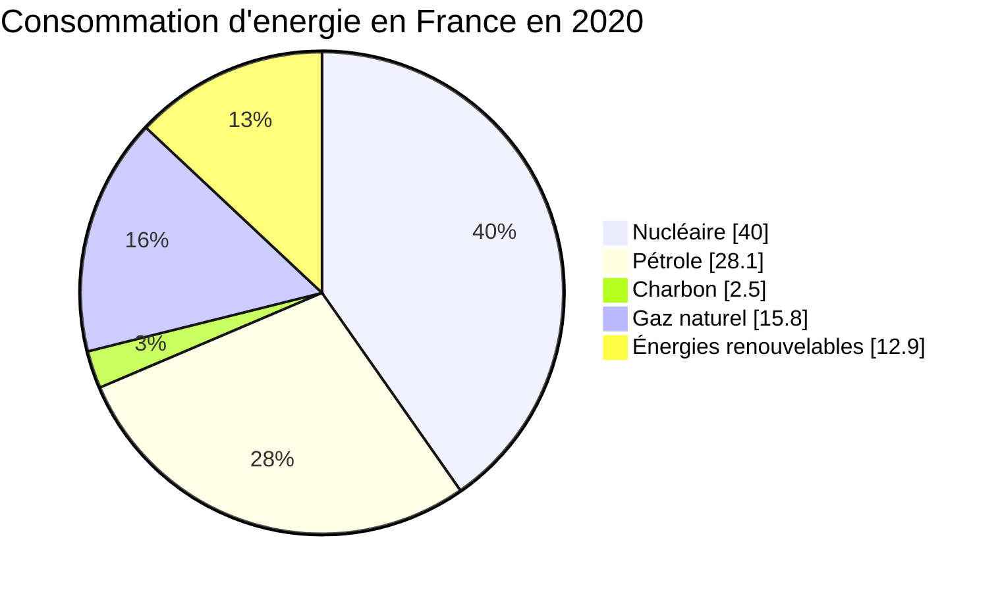

[TOC]

# Le Markdown

## La syntaxe de base

### Titres

Pour faire un retour à la ligne à l'interieur d'un paragraphe,  
on termine la ligne précédente par 2 espaces, comme ceci.

NB/ Certains éditeurs Markdown n'ont pas besoin des 2 espaces en fin de ligne pour afficher un retour à la ligne. Mais pour rester xompatible avec tous les éditeurs, il est préférable de mettre ces éspaces avant le retour à la ligne.

### Lignes de séparation

On peut créer une ligne horizontale entre 2 paragraphes au moyen de 3 tirets consécutifs.

Il doit obligatoirement y avoir une ligne vide avant et après ces tirets.

---

Voila.

### Italique, gras et mise en exergue

On met un texte en _italique_ en le plaçant entre 2 étoiles.  
On met un texte en **gras** en le plaçant entre 4 étoiles (2 de chaque côté).

> On met un paragraphe entier en exergue en le pfaisant précéder du symbole >. Syntaxe utilisée notamment pour les citations...

### Listes

**Liste à puces :**

- item 1
  - item 1.1
  - item 1.2
- item 2
- item 3

**Liste numérotée :**

1. item 1
   1. item 1.1
   1. item 1.2
1. item 2
1. item 3

### Liens hypertextes

On peut créer des liens vers des pages web, avec la syntaxe suivante :  
[site Markdown Guide](https://www.markdownguide.org/).

Le texte entre crochets est celui qui s'affiche en bleu souligné dans le rendu final. Le texte entre paranthèses est l'url de la page.

On peut créer de la même façon des liens vers des fichiers locaux, en utilisant bien des slash (/) et non des antislash dans le chamin : [essai lien readme](/README.md)

Le chemin du fichier peut être absolu ou relatif.

NB/ Dans certains éditeurs (ex: Obsidian), il faut remplacer les espaces dans les chemins de fichiers par %20, pour que les liens fonctionnent.  
Pour assurer une compatibilité maximal entre éditeurs, il est donc préférable d'éviter les espaces, ou sinon de les remplacer systèmatiquement par %20.

### Images

On insère des images avec une syntaxe semblable aux liens hypertextes. Notez simplement le point d'exclamation avant les crochets.


Le texte entre crochets donne uen description textuelle de l'image. Il n'est pas obligatoire, mais les crochets restent tout de même obligatoires.

### Extraits et blocs de code

On peut insérer des extraits de code dans le texte, comme ceci : la classe `EmployeeController`dérive de `Controller`.

Ou bien créer des blocs de code comme ceci entre back tics (`ALTGR + 7`) :

```html
<!DOCTYPE html>
<html lang="en">
  <head>
    <meta charset="UTF-8" />
    <meta name="viewport" content="width=device-width, initial-scale=1.0" />
    <title>Document</title>
  </head>
  <body></body>
</html>
```

## La syntaxe Mardown étendue

### Tableau

| Nom    |  Prénom  | Date de naissance |
| :----- | :------: | ----------------: |
| Gobert | Timothée |        18/01/1992 |
| Simon  |  Claire  |        20/08/1992 |

### Cases à cocher

Les cases à cocher sont un moyen très commode de créer des listes de tâches.

Elles peuvent être cochées et décochées par clic de souris, sans avoir à éditer le code Markdown.

- [x] apprendre le Markdown
- [ ] installer Typora
- [ ] convertir mes docs en Markdown

### Exposant et indice

Pour mettre un text en exposant, on l'entoure d'accents circonflexes : `1^er^` donne : 1^er^

Pour mettre un texte en indice, on l'entoure de tildes : `H~2~O` donne : H~2~O

### Surlignage et texte barré

Pour ==surligner un texte== afin de le faire ressortir, on l'entoure de doubles signes égal.

Pour barrer un texte ~~comme ceci~~, on l'entoure de doubles tildes.

### Notes de bas de page et liens vers les titres

On créer une réfrence à une note de bas de page [^1] avec la syntaxe suivante : `[^1]`.

On crée ensuite la note à l'ndroit souhaité (typiquement au bas de la page ou à la fin du chapitre), comme ceci : `[^1]: le texte de la note`

[^1]: le texte de la note.

On peut ajouter un lien vers [un titre](#Tableau) (ici tableau) du document courant afin de faciliter la navigation dans les documents longs.

### Autre éléments plus spécifiques

#### Icônes GFM

Le Markdown saveur GitHub (abrégé en GFM) propose des codes courts sous la forme `:...:` pour représenter des icônes colorées.

Voici une séléction de quelque icône courantes :

|      Icône       | code court GFM    |        Icône         | Code court GFM         |
| :--------------: | :---------------- | :------------------: | :--------------------- |
|    :warning:     | `:warning:`       |        :bell:        | `:bell:`               |
|    :question:    | `:question:`      |    :loudspeaker:     | `:loudspeaker:`        |
|  :exclamation:   | `:exclamation:`   |        :bulb:        | `:bulb:`               |
|    :no_entry:    | `:no_entry:`      |  :heavy_check_mark:  | `:heavy_check_mark:`   |
|      :star:      | `:star:`          |         :x:          | `:x:`                  |
| :speech_balloon: | `:speech_ballon:` | :information_source: | `:information_source:` |

Les listes complètes (trés longues) des code courts GFM est consultable sur [cette page](https://github.com/ikatyang/emoji-cheat-sheet/blob/master/README.md).

#### Tables des matières

Typora permet de créer automatiquement une table des matières à partir des titres du document avec le simple code `[TOC]` placé en début de document.

#### Formules mathématiques

Mathjax est un module indépendant intégré dans certains éditeurs Markdown pour créer des formules mathématiques avec la syntaxe LaTex.

$$
\mathbf{v}_1 \times \mathbf{v}_2=\begin{vmatrix}
\mathbf{i} & \mathbf{j} & \mathbf{k} \\
\frac{\partial X}{\partial u} & \frac{\partial Y}{\partial u} & 0 \\
\frac{\partial X}{\partial v} & \frac{\partial Y}{\partial v} & 0 \\
\end{vmatrix}
$$

#### Diagrammes Mermaid

[Mermaid](https://mermaid.js.org/intro/) est un module indépendant intégré dans certains éditeurs Markdown pour créer des diagrammes et graphiques en Mardown. Il prend en charge les types de diagrammes suivants :

##### Graphique en camenbert :


