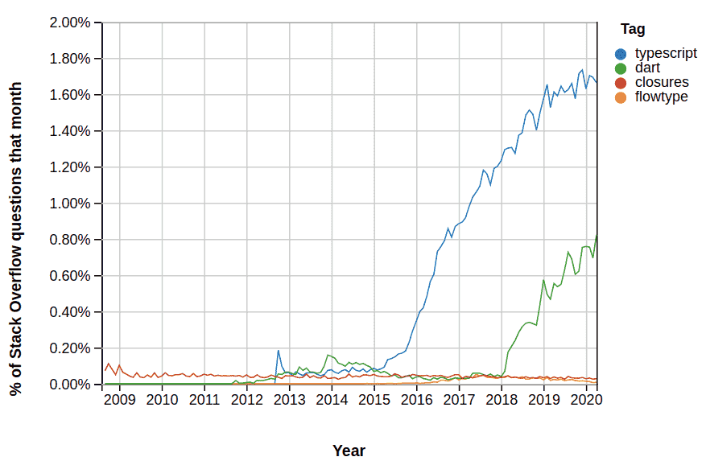
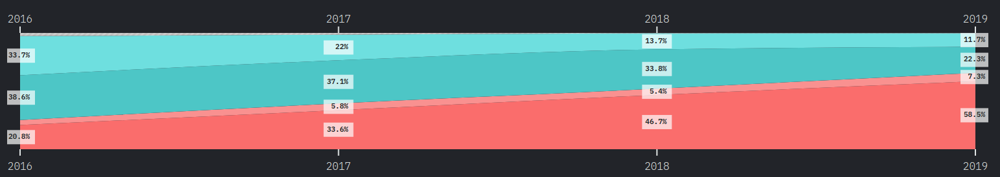

# Introduction et mise en place de l'environnement

## Qu'est-ce que TypeScript ?

### Quel est le problème ?

Les projets utilisant *JavaScript* se sont complexifiés énormément et il est devenu de plus en plus difficile de les maintenir.

Il est compliqué de pouvoir comprendre ce que fait du code *JavaScript* lorsqu'on arrive sur un projet impliquant de nombreux développeurs.

Il est difficile de savoir ce qu'accepte une fonction et ce qu'elle retourne, et devoir à chaque fois lire les éventuels commentaires pour chaque fonction dans plusieurs fichiers est fastidieux.

De très nombreux langages ou environnement ont tenté d'y remédier, on peut citer notamment : Flow, Dart, Elm, Reason, et Closure.

Mais le seul qui a vraiment conquis l'écosystème et s'est imposé dans une quantité astronomique de projets majeurs est *TypeScript* :

*Dart* a été créé par *Google* et son regain d'intérêt est dû à *Flutter* qui l'utilise. Mais il n'a pas connu la même adoption car avant sa version 2 sa syntaxe était moins agréable et qu'il n'est pas un langage avec une adoption progressive. Il faut apprendre *Dart* avant de l'utiliser.

Selon la plus grande enquête sur le développement *JavaScript*, 58.5% des développeurs *JavaScript* l'ont utilisé en 2019 et 22,3% veulent l'apprendre. Ce qui en fait de très loin la surcouche *JavaScript* la plus utilisée.

Le succès de *TypeScript* est dû principalement au fait que son adoption est progressive : tout le *JavaScript* est du *TypeScript* valide, il est donc possible de convertir un projet facilement en le typant au fur et à mesure.

Il est également possible au début de n'utiliser que les types basiques, puis de peu à peu adopter les fonctionnalités plus avancées : interfaces, mixins, unions de type etc.

### Qu'est-ce que TypeScript ?

*TypeScript* a été créé par Microsoft en 2012, il est depuis le départ un projet open-source.

**C'est un langage avec un typage fort et qui transpile en *JavaScript*.**

Transpiler signifie compiler vers un langage de même niveau.

Il est conçu comme une addition pour faire de *JavaScript* un langage qui scale en ajoutant des types.

Ses avantages immédiats sont :
1. **Du code beaucoup plus lisible.**
2. **Du code beaucoup plus maintenable.**
3. **Beaucoup de bugs en moins grâce au compilateur.**

### Qui utilise Typescript ?

L'utilisation de *TypeScript* explose et deviendra très probablement le nouveau standard dans le développement d'applications.

Voici une liste non exhaustive d'entreprises connues utilisant *TypeScript* pour leurs applications : Slack, Airbnb, Google, Microsoft, N26, Asana, Lyft etc.

Le support total de Microsoft, l'une des plus grandes entreprises technologiques au monde, lui assure un financement et un développement pérenne. En effet, *TypeScript* est maintenant très utilisé par l'entreprise, et un abandon après des investissements conséquents pendant 8 ans, est aujourd'hui totalement improbable.

D'ailleurs vous l'utilisez déjà : *Visual Studio Code* est entièrement écrit en *TypeScript* !

Enfin, les principaux frameworks l'ont ou sont en train de l'adopter. Toutes les applications Angular l'utilisent vu que le framework est conçu pour utiliser *TypeScript* (il est d'ailleurs lui même écrit avec ce langage), Vue 3 a été réécrit entièrement en *TypeScript* et *React* a un template et toutes les dépendances de type pour permettre son utilisation avec *create-react-app*.

### La communauté *DefinitelyTyped*

Vous avez remarqué dans les autres formations que nous téléchargeons des dépendances *@types* pour avoir l'autocomplétion et des informations sur les signatures des fonctions etc : ce sont des dépendances maintenues en open-source pour toutes les librairies *JavaScript* existantes.

Il n'existe pas de librairie un peu connue qui n'ait pas une dépendance pour ses types *TypeScript* !

Vous pouvez allez voir la liste ici, déjà plus de 7000 librairies *JavaScript* qui ont des types *TypeScript* :

>https://github.com/DefinitelyTyped/DefinitelyTyped/tree/master/types

