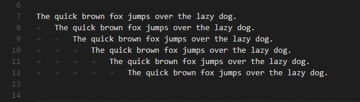
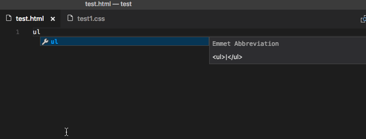

# Introduction et mise en place de l'environnement

## Qu'est-ce que TypeScript ?

### Quel est le problème ?

Les projets utilisant *JavaScript* se sont complexifiés énormément et il est devenu de plus en plus difficile de les maintenir.

Il est compliqué de pouvoir comprendre ce que fait du code *JavaScript* lorsqu'on arrive sur un projet impliquant de nombreux développeurs.

Il est difficile de savoir ce qu'accepte une fonction et ce qu'elle retourne, et devoir à chaque fois lire les éventuels commentaires pour chaque fonction dans plusieurs fichiers est fastidieux.

De très nombreux langages ou environnement ont tenté d'y remédier, on peut citer notamment : Flow, Dart, Elm, Reason, et Closure.

Mais le seul qui a vraiment conquis l'écosystème et s'est imposé dans une quantité astronomique de projets majeurs est *TypeScript* :


*Dart* a été créé par *Google* et son regain d'intérêt est dû à *Flutter* qui l'utilise. Mais il n'a pas connu la même adoption car avant sa version 2 sa syntaxe était moins agréable et qu'il n'est pas un langage avec une adoption progressive. Il faut apprendre *Dart* avant de l'utiliser.

Selon la plus grande enquête sur le développement *JavaScript*, 58.5% des développeurs *JavaScript* l'ont utilisé en 2019 et 22,3% veulent l'apprendre. Ce qui en fait de très loin la surcouche *JavaScript* la plus utilisée.


Le succès de *TypeScript* est dû principalement au fait que son adoption est progressive : tout le *JavaScript* est du *TypeScript* valide, il est donc possible de convertir un projet facilement en le typant au fur et à mesure.

Il est également possible au début de n'utiliser que les types basiques, puis de peu à peu adopter les fonctionnalités plus avancées : interfaces, mixins, unions de type etc.

### Qu'est-ce que TypeScript ?

*TypeScript* a été créé par Microsoft en 2012, il est depuis le départ un projet open-source.

**C'est un langage avec un typage fort et qui transpile en *JavaScript*.**

Transpiler signifie compiler vers un langage de même niveau.

Il est conçu comme une addition pour faire de *JavaScript* un langage qui scale en ajoutant des types.

Ses avantages immédiats sont :
1. **Du code beaucoup plus lisible.**
2. **Du code beaucoup plus maintenable.**
3. **Beaucoup de bugs en moins grâce au compilateur.**

### Qui utilise Typescript ?

L'utilisation de *TypeScript* explose et deviendra très probablement le nouveau standard dans le développement d'applications.

Voici une liste non exhaustive d'entreprises connues utilisant *TypeScript* pour leurs applications : Slack, Airbnb, Google, Microsoft, N26, Asana, Lyft etc.

Le support total de Microsoft, l'une des plus grandes entreprises technologiques au monde, lui assure un financement et un développement pérenne. En effet, *TypeScript* est maintenant très utilisé par l'entreprise, et un abandon après des investissements conséquents pendant 8 ans, est aujourd'hui totalement improbable.

D'ailleurs vous l'utilisez déjà : *Visual Studio Code* est entièrement écrit en *TypeScript* !

Enfin, les principaux frameworks l'ont ou sont en train de l'adopter. Toutes les applications Angular l'utilisent vu que le framework est conçu pour utiliser *TypeScript* (il est d'ailleurs lui même écrit avec ce langage), Vue 3 a été réécrit entièrement en *TypeScript* et *React* a un template et toutes les dépendances de type pour permettre son utilisation avec *create-react-app*.

### La communauté *DefinitelyTyped*

Vous avez remarqué dans les autres formations que nous téléchargeons des dépendances *@types* pour avoir l'autocomplétion et des informations sur les signatures des fonctions etc : ce sont des dépendances maintenues en open-source pour toutes les librairies *JavaScript* existantes.

Il n'existe pas de librairie un peu connue qui n'ait pas une dépendance pour ses types *TypeScript* !

Vous pouvez allez voir la liste ici, déjà plus de 7000 librairies *JavaScript* qui ont des types *TypeScript* :

>https://github.com/DefinitelyTyped/DefinitelyTyped/tree/master/types

## Les principales fonctionnalités de TypeScript

### Les types statiques

*TypeScript* permet de tout typer statiquement : vos variables, vos fonctions (arguments, valeur de retour) et vos classes.

Le langage ne vous force pas à typer, ce qui vous laisse totalement libre de le faire ou non et ainsi d'adopter progressivement le typage statique en fonction de votre apprentissage.

### L'inférence de types

Tous les fichiers *TypeScript*, finissant par **.ts**, permettent l'utilisation d'une fonctionnalité de *TypeScript* : l'inférence de types.

*TypeScript* va détecter automatiquement le type de votre variable en regardant la valeur qui lui est assignée. Nous reviendrons en détails sur cette fonctionnalité très pratique, mais elle permet sans aucune ligne supplémentaire d'avoir ce résultat :

```ts
const obj = { width: 1, height: 2 };
const aire = obj.width * obj.heigth;
// Property 'heigth' does not exist on type '{ width: number; height: number; }'. Did you mean // 'height'?
```

Ici *TypeScript* a détecté qu'aucune propriété *heigth* n'existait sur *obj* et vous invite à vérifier que vous n'avez pas fait une erreur. Magique, non ?

### La transpilation

*TypeScript* résoud le même problème que *Babel*. C'est-à-dire que du *TypeScript* utilisant les toutes dernières fonctionnalités sera transpilé dans un *JavaScript* compatible tout navigateur.

Vous pouvez en effet paramétrer le compilateur facilement pour transpiler vers *JavaScript ES5*, *ES6* etc.

### Les fonctionnalités majeures de *TypeScript*

Nous verrons d'abord quels sont les types de *TypeScript* puis comment typer ses fonctions.

Nous verrons également les *interfaces* qui sont des contrats qui n'existent qu'avant la compilation en *JavaScript*.

Ensuite, nous verrons les combinaisons de types avec les unions et les intersections.

Nous verrons les modules et les namespaces qui permettent de séparer votre code en blocs et de l'utiliser là où vous en avez besoin sans aucun risque de pollution.

Enfin, nous passerons aux parties les plus avancées : les décorateurs (qui sont des métadonnées sur les classes), les mixins (des classes réutilisables) et les types avancés (comme par exemple les génériques et les enums).

## Installation de VS Code, Node.js (et Git bash sur Windows)

### Installation de *VS Code*

Pour installer l'éditeur *VS Code*, il suffit de le télécharger et de l'installer. Il fonctionne sur tous les environnements : *Linux*, *Windows* et *MacOS*.

Vous pouvez le télécharger [ici](https://code.visualstudio.com/).

### Installation de *Node.js*

Pour installer *Node.js* quel que soit votre OS c'est très simple.

Vous pouvez utiliser un exécutable en le téléchargeant [ici](https://nodejs.org/en/download/).

Ou vous pouvez utiliser un gestionnaire de paquets [ici](https://nodejs.org/en/download/package-manager/).

Si vous êtes sur *Ubuntu*, *Debian*, *redhat*, *centOS* ou *fedora* il suffit de vous rendre [ici](https://github.com/nodesource/distributions/blob/master/README.md#installation-instructions) et de choisir la dernière version *LTS* de *Node*.

Que ce soit sur *Linux* ou sur *MacOS*, ouvrez rechercher et tapez simplement *terminal*.

Vous pouvez ensuite ouvrir votre terminal et faire : `node -v`.

Vous pouvez également ouvrir un terminal dans *VS Code*.

### Installation de *Git*

Par défaut, sur *Windows*, le terminal est *Powershell*.

Dans tous les cours nous utilisons *bash*, qui est le terminal le plus utilisé et que vous retrouverez sur les serveurs et sur la plupart des environnements de développement.

Nous allons donc installer *git* pour pouvoir l'utiliser : téléchargez le [ici](https://git-scm.com/downloads).

### Utilisation de Git Bash sur Windows

**Sur *Windows* uniquement**, ouvez *VS Code*.

Faites *Ctrl + Shift + p* ou *View* puis *Command Palette*.

Entrez *select default shell* puis faites entrée.

Ensuite sélectionnez *Git Bash*.

Vous pouvez ensuite faire *Terminal* puis *New Terminal* et vous aurez un terminal *Bash* ! 

## Prise en main de Visual Studio Code

### L'autocomplétion

L'un des principaux avantages est l'autocomplétion permise par *IntelliSense*.

L'autocomplétion est absolument géniale car elle fait gagner un temps considérable et évite les erreurs d'inattentions.

Elle consiste à ce que l'éditeur vous propose automatiquement d'insérer du code en fonction de la situation.


### Une librairie gigantesque d'extensions

L'un des avantages indéniables sur les autres éditeurs est la présence d'une marketplace de plusieurs milliers d'extensions.

Les extensions sont des ajouts de fonctionnalités développées par la communauté.


### Des fonctions de recherche avancées

Avec *VS code* vous pouvez facilement chercher une chaîne de caractères dans tous les fichiers, dans un groupe de dossiers, remplacer en quelques secondes :


### De nombreuses fonctionnalités supplémentaires

Durant la formation nous vous apprendrons également des raccourcis à utiliser dans *VS Code*, ils vous feront gagner en rapidité et en efficacité !

Voici quelques exemples que nous apprendrons ensemble.

Premier exemple, utilisation de sélecteurs multiples, ici pour éditer du *CSS* :


Deuxième exemple, sélectionner l'occurrence suivante avec un raccourci :



Nous verrons dans la formation *JavaScript* d'autres fonctionnalités géniales de l'éditeur comme le déboguer, l'intégration de terminaux, la gestion du contrôle des versions etc.

### L'intégration de *Emmet* pour le *HTML* et le *CSS*

Nous gardions le meilleur pour la fin pour l'utilisation du *HTML* et du *CSS* avec *VS code* : l'intégration native de *Emmet* dans *VS code*.

Nous vous l'expliquerons très en détails dans les chapitres suivants… mais ça ressemble à ça :



### L'extension Prettier

*Prettier* permet de mettre en forme le code automatiquement lorsque vous le sauvegardez.

C'est une extension très utile et nous vous invitons à l'installer dans *VS Code*.

Allez dans *Extensions* puis recherchez *Prettier*. Ensuite cliquez sur *Install*.

Dans *VS Code* allez ensuite dans *File* puis *Preferences* puis *Settings*. Recherchez *format on save* et cochez la case.

Toujours dans *VS Code*, et toujours dans *Settings*. Recherchez cette fois *Default Formatter* et dans la liste déroulante sélectionnez *Prettier - Code Formatter esbenp.prettier-vscode*.

*Prettier* fonctionnera maintenant à chaque fois que vous sauvegardez ! 

## Installation et configuration du compilateur tsc

### Mise en place dans un projet sans *framework*

Pour les projets utilisant un *framework* ou *Node.js* vous avez un chapitre correspondant dans chaque formation pour apprendre comment mettre en place *TypeScript*.

Pour un projet sans *framework*, par exemple une librairie ou autre, nous allons voir maintenant comment procéder.

Créez un nouveau dossier par exemple *typescript*.

Dans ce dossier, nous allons initialiser un *package.json* :

```sh
npm init -y
```

#### Installation du compilateur en global (conseillé)

Ensuite nous installons le compilateur *TypeScript* en global :

```sh
npm i -g typescript
```

Il sera ainsi disponible pour l'ensemble de vos projets.

#### Installation du compilateur en local pour un projet

Si vous préférez avoir une version locale pour votre projet de *TypeScript*, vous pouvez faire :

```sh
npm i -D typescript
```

Dans votre *package.json* vous pouvez rajouter un *script* :

```sh
"build": "tsc",
```

Nous verrons plus tard, que nous allons pouvoir directement utiliser *Webpack*.

### Création de notre premier fichier *TypeScript*

Tous les fichiers *TypeScript* ont une extension en **.ts**.

Nous allons donc créer un fichier *index.ts* et y placer du code *TypeScript* :

```js
const test: string = '123';
```

Nous allons ensuite transpiler ce code en utilisant le compilateur *TypeScript*.

Si vous avez installé *TypeScript* en global faites :

```
tsc index.ts
```

Sinon faites :

```sh
npm run build
```

### Création de dossiers source et distribution

Nous allons créer les deux dossiers appelés par convention *src* pour le code source depuis lequel est effectué la transpilation et un dossier *dist* pour le code généré et qui a vocation a être distribué sur un serveur ou autre.

### Création du fichier de configuration pour *TypeScript*

Le fichier de configuration *tsconfig.json* est le fichier utilisé par le compilateur de *TypeScript* avant la compilation.

Ce fichier est utilisé lorsque vous faites simplement *tsc* dans un dossier. *TypeScript* va automatiquement rechercher un fichier de configuration dans le dossier courant.

Il permet de définir **plus d'une centaine d'options**. Comme pour *Webpack* vous n'aurez pas à utiliser la plupart et nous verrons ensemble toutes celles dont nous avons besoin.

Nous allons commencer par un fichier de configuration basique :

```json
{
  "include": ["src/**/*.ts"],
  "compilerOptions": {
    "outDir": "dist",
    "target": "ES6",
    "module": "ESNext",
  }
}
```

Nous allons voir les options les plus importantes.

#### L'option *files*

Permet de spécifier un tableau de fichier *Typescript* à inclure dans la compilation, par exemple :

```json
{
  "compilerOptions": {},
  "files": [
    "index.ts",
    "app.ts",
    "router.ts",
  ]
}
```

Si l'un des fichiers n'est pas trouvé par le compilateur une erreur sera soulevée.

#### L'option *include*

Cette option permet de spécifier un tableau de fichiers ou de patterns à compiler, par exemple :

```json
{
  "include": ["src/**/*", "index.ts"]
}
```

Un *pattern* est comme une expression régulière pour matcher les fichiers et / ou les dossiers respectant le chemin spécifié.

`**/` permet de matcher n'importe quel dossier de n'importe quel niveau. Cela revient à dire tous les dossiers et tous les sous-dossiers quel que soit leur niveau inclus dans *src*.

`*` permet de matcher n'importe quel caractère et un nombre indéfini de fois. Ici cela revient à matcher tous les fichiers.

#### L'option *exclude*

Permet de spécifier des fichiers ou des patterns qui seront exclus de la compilation mêmes s'ils matchent dans *include*.

En revanche si un fichier est déclaré dans *files*, il sera compilé même si il est exclus.

#### L'option *allowJs*

Cette option permet de spécifier que des fichiers *JavaScript*, donc sans l'extension **.ts**, puissent être inclus dans votre projet. sans erreur.

#### L'option *module*

Permet de définir le système de modules pour le projet : *CommonJS* (pour un projet *Node.js* par exemple), *UMD*, *AMD*, *System*, *ESNext* ou *ES2020*.

Pour un nouveau projet on utilisera *ES2020* sauf sur *Node.js*.

#### L'option *outDir*

Par défaut, les fichiers *JavaScript* émis lors de la compilation sont placés au même niveau que les fichiers d'origine *TypeScript*.

L'option *outDir* permet de spécifier un dossier pour placer les fichiers après la compilation :

```json
{
  "compilerOptions": {
    "outDir": "dist"
  }
}
```

#### L'option *target*

La *target* est la version de *JavaScript* ciblée après la compilation.

Si votre application doit être compatible tous navigateurs récents, on choisira *ES6*.

Si votre application est en *Node.js* on choisira *ES2019* (version minimale 12) ou *ES2020*.

Il vaut mieux choisir toujours la version la plus récente possible pour éviter du code supplémentaire lors de la compilation et donc des pertes de performance.

Bien sûr il faut prendre en compte votre cible, si votre code doit absolument supporter de très vieux navigateurs abandonnés (Internet Explorer par exemple) il faudra choisir ES5.

Nous avons fait le tour des options essentielles, nous verrons au fur à mesure d'autres options lorsqu'elles seront nécessaires.

## Installation et configuration de Webpack

### Qu'est-ce que *Webpack* ?


***Webpack* est un *module bundler*.**

Il permet en fait de rassembler les fichiers de votre application (fichiers *JavaScript*, *HTML*, *CSS*, les images etc) en un ou plusieurs modules.

Un **module** est un ensemble de code nécessaire pour une fonctionnalité.

Pourquoi utiliser des modules ? Car à chaque fois que vous importez un fichier différent dans un document *HTML*, une requête *HTTP* sera effectuée.

Si vous utilisez plusieurs librairies et avez quelques dizaines de fichiers *JavaScript*, *HTML* et *CSS* cela fera un grand nombre de requêtes.

Il vaut mieux tout mettre dans un seul fichier qui sera chargé en une requête.

Mais *Webpack* ne permet pas seulement de modulariser votre code, c'est un outil très puissant qui peut effectuer grâce à des *loaders* et des *plugins* un très grand nombre de tâches essentielles en développement *Web* :

Il peut utiliser *Babel* pour transpiler votre *JavaScript* pour le rendre compatible.

Il peut minifier et compresser le code, pour réduire la taille des fichiers et donc la latence réseau (temps nécessaire pour télécharger les fichiers avec *HTTP*).

Il peut générer des noms de fichier pour optimiser la mise en cache.

Il peut compiler le *Sass* en *CSS*.

Il peut optimiser les images.

Bref, **il peut effectuer toutes les tâches permettant de passer d'un code de développement à un code de production**, c'est-à-dire à du code performant servi par un ou des serveurs à des utilisateurs.

Enfin, en développement, il permet également d'utiliser un serveur *Node.js* de développement pour servir votre code en local et l'afficher dans votre navigateur pendant que vous développerez.

Il bénéficie de l'*hot reload* qui permet de recharger la page du navigateur avec la nouvelle version du code lorsque vous sauvegardez dans votre éditeur.

En conclusion, *Webpack* est un outil **incontournable** lorsque vous êtes développeur *JavaScript*. Il est utilisé par tous les **frameworks** : *Vue.js*, *Angular*, *React* etc, et dans tous les projets *JavaScript* un peu complexe.

Nous allons l'étudier dans ce chapitre et de plus en plus au cours de la formation.

Dans cette formation nous vous apprendrons ainsi tout le langage *JavaScript* mais aussi tout l'environnement du développeur *JavaScript* moderne.

### Installation de Webpack

Pour utiliser *Webpack* nous avons besoin de trois dépendances :

```sh
npm i -D webpack webpack-cli webpack-dev-server
```

`Webpack` est la librairie permettant de *bundle* vos fichiers en module. Il est hautement configurable comme nous le verrons au fur et à mesure de la formation.

`Webpack-cli` permet d'utiliser *Webpack* dans un terminal, en ligne de commande.

`Webpack-dev-server` permet de lancer un serveur de développement *Node.js* pour développer en local.

Nous allons maintenant voir les différents points principaux de *Webpack*.

Retenez que toute la configuration de *Webpack* est définie dans un fichier *webpack.config.js*.

### Le point d'entrée : la propriété *entry*

Le point d'entrée est le fichier que *Webpack* va charger en premier.

*Webpack* va ensuite analyser ce fichier pour **construire l'arbre des dépendances.**

Pour *Webpack* chaque fichier importé par un autre fichier est **une dépendance de ce fichier.**

Si le fichier *index.js* importe *script1.js* et *script2.js*, ce fichier aura deux dépendances.

Si ces *scripts* importent d'autres fichiers, ils deviendront des dépendances des premiers. Ces successions d'imports résultent donc dans un **arbre de dépendances**.

Une fois l'arbre des dépendances analysé par *Webpack*, il commencera les opérations pour *bundle* les dépendances dans un ou plusieurs modules.

Par défaut, sans aucune configuration, le point d'entrée est .*/src/index.js*, car comme nous l'avons vu il s'agit d'une convention.

Il est possible de modifier ce point d'entrée créant un fichier *webpack.config.js* et en y plaçant :

```js
module.exports = {
  entry: './chemin/vers/mon/point/dentree.js'
};
```

### Le dossier de sortie : la propriété *output*

Il existe une propriété *output* qui permet de préciser dans quel dossier *Webpack* va mettre les *bundles* une fois toutes ses opérations terminées. Il permet également de nommer le *bundle* principal.

Par défaut, le dossier d'*output* est *dist*, et le fichier de sortie principal sera dans *dist/main.js*.

```js
const path = require('path');

module.exports = {
  entry: './chemin/vers/mon/point/dentree.js',
  output: {
    path: path.resolve(__dirname, 'dist'),
    filename: 'test.bundle.js'
  }
};
```

**path:** est la propriété à passer dans *output* pour spécifier le chemin de sortie.

**path** est un module *Node.js* permettant de facilement résoudre les chemins. Ici *path.resolve()* permet de résoudre deux chemins et retourne un chemin absolu.

**__dirname** permet de donner le chemin absolu vers le dossier contenant le fichier exécuté (ici le fichier de configuration).

Vous pourrez voir tout cela très en détails plus tard, dans la formation *Node.js*. Ne vous inquiétez pas si c'est confus pour le moment, c'est tout à fait normal !

Retenez que *Webpack* utilise *Node.js* et peut donc accéder aux modules de *Node.js*.

**filename:** est la propriété permettant de définir le nom du *bundle* principal.

### Les chargeurs (*loaders*)

Par défaut, sans les *loaders*, *Webpack* ne comprend que le *JavaScript* et le format *JSON* (*JavaScript Object Notation* qui est le format le plus utilisé pour structurer des données en *JavaScript*).

Les *loaders* permettent de charger tous les autres types de fichier pour que *Webpack* puissent les ajouter à l'arbre des dépendances.

Les *loaders* transforment les fichiers en modules compatibles *Webpack* et peuvent réaliser des transformations sur le code du fichier après le chargement.

Pour *TypScript* nous allons devoir installer un loader :

```sh
npm i -D ts-loader
```

Prenons un exemple :

```js
const path = require('path');

module.exports = {
  entry: './chemin/vers/mon/point/dentree.js',
  output: {
    path: path.resolve(__dirname, 'dist'),
    filename: 'test.bundle.js'
  },
  module: {
    rules: [
      { test: /.txt$/, use: 'raw-loader' }
    ]
  }
};
```

La propriété *rules* permet de configurer les règles à appliquer pour les différents fichiers.

Chaque règle comporte une **propriété** *test* qui prend une expression régulière (*RegExp* que nous étudierons en détails) qui va tester le nom de tous les fichiers et appliquer le *loader* passé dans la **propriété** *use* si le fichier correspond au test.

Ici dans l'exemple, tous les fichiers finissant par **.txt** utiliseront le *loader raw-loader*.

### Les *plugins*

Les *plugins* permettent de réaliser des opérations globales lors du *bundling* : comme par exemple optimiser le code, gérer les *assets* (images, vidéos etc de l'application) etc.

Prenons un exemple :

```js
const path = require('path');
const HtmlWebpackPlugin = require('html-webpack-plugin');

module.exports = {
  entry: './chemin/vers/mon/point/dentree.js',
  output: {
    path: path.resolve(__dirname, 'dist'),
    filename: 'test.bundle.js'
  },
  module: {
    rules: [
      { test: /.txt$/, use: 'raw-loader' }
    ]
  },
  plugins: [
    new HtmlWebpackPlugin({template: './src/index.html'})
  ]
};
```

Les *plugins* s'installent avec *npm* et sont des dépendances, par exemple ici nous devons installer *html-webpack-plugin* :

```sh
npm i -D html-webpack-plugin
```

Ce *plugin* permet de générer un fichier *HTML* pour votre application en injectant automatiquement tous les *bundles* générés par *Webpack*.

### Exemple de configuration

Nous allons reprendre la configuration d'exemple et l'expliquer.

Vous avez un fichier *webpack.config.js* au premier niveau de votre projet qui va faire :

```js
const path = require('path');
const HtmlWebpackPlugin = require('html-webpack-plugin');

module.exports = {
  entry: {
    main: path.join(__dirname, 'src/index.ts'),
  },
  output: {
    path: path.join(__dirname, 'dist'),
    filename: '[name].bundle.js',
  },
  module: {
    rules: [
      {
        test: /\.ts/,
        exclude: /(node_modules)/,
        use: ['ts-loader'],
      },
    ],
  },
  plugins: [
    new HtmlWebpackPlugin({
      template: path.join(__dirname, './src/index.html'),
    }),
  ],
  stats: 'minimal',
  devtool: 'source-map',
  mode: 'development',
  devServer: {
    open: false,
    static: path.resolve(__dirname, './dist'),
    port: 4000,
  },
};
```

Nous avons déjà expliqué les configurations pour les propriété *entry* et *output*.

Pour nos *rules* nous avons pour l'instant un seul *loader* : *ts-loader* qui va charger les fichiers *TypeScript* et utiliser le compilateur *tsc* et le fichier de configuration *tsconfig.json* pour les options de compilation.

*HtmlWebpackPlugin* est un *plugin* permettant d'inclure automatiquement le *bundle* généré dans le fichier *dist/index.html* après le *build*.

La propriété *devServer* permet de paramétrer le *webpack-dev-server*.

*static* permet de spécifier d'où servir les contenus statiques (images, vidéos etc).

*open* permet d'ouvrir le navigateur par défaut lorsque le serveur *Node.js* de *Webpack* a été lancé.

*port* permet de spécifier le port sur lequel l'application sera servie par le serveur de développement *Webpack*.

Dans le fichier *package.json* vous devez avoir dans la partie *scripts* :

```json
"scripts": {
  "test": "echo "Error: no test specified" && exit 1",
  "webpack": "webpack",
  "start": "webpack serve"
},
```

Vous pouvez ainsi lancer le serveur de développement *Webpack* en faisant :

```sh
npm start
```

Cette commande va simplement exécuter le *script start* avec *Node.js*.

Vous pouvez *build* le code pour la production en faisant :

```sh
npm run webpack
```

Comme nous utilisons maintenant *Webpack*, il faut modifier légèrement le fichier *tsconfig.json* car nous ne devons plus spécifier ici le chemin de sortie :

```json
{
  "files": ["src/index.ts"],
  "compilerOptions": {
    "module": "ESNext",
    "target": "ES6"
  }
}
```

### Code sur Github

Vous pouvez également retrouver le code de cette configuration sur [Github](https://github.com/dymafr/typescript-chapitre1-environnement).

### Erreurs éventuelles

Si vous avez des erreurs lors de la compilation, réinstallez bien les dépendances dans votre dossier :

```sh
npm i -D webpack webpack-cli webpack-dev-server ts-loader html-webpack-plugin
```

Et copiez le fichier *webpack.config.js* et le fichier *tsconfig.json* depuis le cours écrit ou le *Github*.

