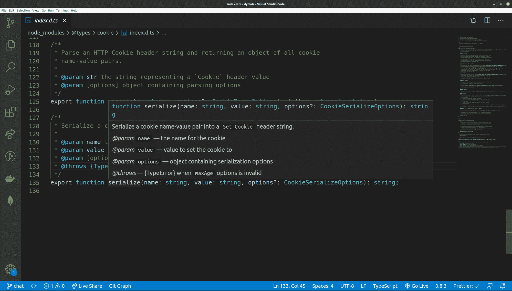

# Namespace et d.ts

## Les namespaces

### Les modules

Les modules *JavaScript* sont aujourd'hui matures et très utilisés, y compris en *TypeScript*.

>*Si ils vous manquent quelques notions sur ceux-ci, nous vous invitons à revoir le chapitre sur les modules dans le cours **JavaScript**.*

### Que sont les *namespaces* ?

Les *namespaces* sont une fonctionnalité propre à *TypeScript* qui permet d'organiser et de séparer le code pour éviter des conflits de noms.

Ils sont aujourd'hui déconseillés, il vaut mieux utiliser les modules qui sont beaucoup mieux à tout point de vue. Cependant, il vaut mieux connaître le fonctionnement des *namespaces* car vous pourriez les retrouver sur des projets *TypeScript* que ce soit dans des librairies tierces ou dans des projets un peu anciens.

Prenons un exemple officiel de *TypeScript* et expliquons le.

Prenons un premier fichier *Validation.ts* :

```ts
namespace Validation {
  export interface StringValidator {
    isAcceptable(s: string): boolean;
  }
}
```

Dans ce fichier nous avons un *namespace* dans lequel se trouve une *interface*

Prenons un second fichier *LettersOnlyValidator.ts* :

```ts
/// <reference path="Validation.ts" />
namespace Validation {
  const lettersRegexp = /^[A-Za-z]+$/;
  export class LettersOnlyValidator implements StringValidator {
    isAcceptable(s: string) {
      return lettersRegexp.test(s);
    }
  }
}
```

Ici nous retrouvons une référence au premier *namespace* qui permet de charger et de fusionner les contenus.

En effet, si vous avez plusieurs *namespaces* avec le même nom, ils sont fusionnés.

Vous pouvez ensuite utiliser le *namespace* dans un fichier tiers en faisant :

```ts
/// <reference path="Validation.ts" />
/// <reference path="LettersOnlyValidator.ts" />

let strings = ["Hello", "98052", "101"];

let validators: { [s: string]: Validation.StringValidator; } = {};
validators["Letters only"] = new Validation.LettersOnlyValidator();
```

### Recommandation

Les créateurs de *TypeScript* déconseillent fortement l'utilisation des *namespaces* si vous utilisez les modules.

Nous vous recommandons de ne jamais utiliser les *namespaces*, sauf si on vous y oblige ! 

## Utilisation des fichiers de types .d.ts

Lorsque vous utilisez une librairie écrite en *JavaScript* et que vous souhaitez avoir le support des types, principalement pour l'auto-complétion vous avez plusieurs choix.

### Utilisation de node_modules

Dans la très grande majorité des cas, il vous suffira d'installer le module de types correspondant à la librairie *JavaScript* :

```sh
npm i -D @types/moment
```

Par défaut, le compilateur détecte et applique automatiquement tous les fichiers de types qui sont dans *node_modules/@types*.

### La résolution de module complète de *TypeScript*

Nous allons voir en détails le fonctionnement de la recherche par le compilateur des fichiers de types.

Imaginons que nous ayons un fichier *test.ts* et que dans ce dernier nous ayons :

```ts
import { x } from "monModule";
```

**Comment le compilateur, et *VS Code*, vont-ils trouver les types pour ce module afin de fournir la sécurité et l'autocomplétion ?**

Voici la logique exacte de la résolution du module :

```ts
// Il commence par les dépendances locales du projet :
/root/src/node_modules/monModule.ts
/root/src/node_modules/monModule.tsx
/root/src/node_modules/monModule.d.ts
/root/src/node_modules/monModule/package.json
/root/src/node_modules/@types/monModule.d.ts
/root/src/node_modules/monModule/index.ts
/root/src/node_modules/monModule/index.tsx
/root/src/node_modules/monModule/index.d.ts

/root/node_modules/monModule.ts
/root/node_modules/monModule.tsx
/root/node_modules/monModule.d.ts
/root/node_modules/monModule/package.json
/root/node_modules/@types/monModule.d.ts
/root/node_modules/monModule/index.ts
/root/node_modules/monModule/index.tsx
/root/node_modules/monModule/index.d.ts

// Il recherche aussi dans les dépendances globales :
/node_modules/monModule.ts
/node_modules/monModule.tsx
/node_modules/monModule.d.ts
/node_modules/monModule/package.json
/node_modules/@types/monModule.d.ts
/node_modules/monModule/index.ts
/node_modules/monModule/index.tsx
/node_modules/monModule/index.d.ts
```

### Paramétrer la résolution de modules

Dans de rares cas, vous voudrez spécifier d'autres emplacements où *TypeScript* doit rechercher les fichiers de type.

Prenons un exemple :

```json
{
  "compilerOptions": {
    "baseUrl": ".",
    "paths": {
      "jquery": ["node_modules/jquery/dist/jquery"]
    }
  }
}
```

L'option `baseUrl` permet de spécifier à partir de quel chemin *TypeScript* doit construire les chemins définis dans les autres propriétés de compilation.

Ici en spécifiant `.` nous définissons le chemin vers le fichier de configuration *tsconfig.json* comme chemin courant.

La propriété *paths* permet de spécifier pour un ou plusieurs noms de modules, ou les trouver.

Ici nous disons que *jquery* peut se trouver dans *./node_modules/jquery/dist/jquery*.

## Utilisation de declare

### Le mot clé *declare*

Le mot clé *declare* s'utilise sur tout élément pour signifier au compilateur et à *VS Code* que l'élément sera disponible lors de l'exécution et qu'il ne doit pas s'en préoccuper.

Mettons que vous utilisez une librairie via un *CDN* comme dans la vidéo, vous avez donc juste à faire :

```ts
declare const maLibrairie: any;
```

*declare* veut exactement dire : "Je déclare que telle déclaration est effectuée ailleurs et qu'elle sera disponible lors de l'exécution".

### Exemple de `lodash`

**Mettons que vous chargez la librairie *lodash* via un *CDN* dans votre *index.html* :**

```ts
<script src="https://cdn.jsdelivr.net/npm/lodash@4.17.15/lodash.min.js"></script>
```

Pour pouvoir l'utiliser dans un fichier *TypeScript*, il va falloir faire :

```ts
declare const _: any;
```

Mais la plupart du temps vous souhaiterez installer la librairie et ses fichiers de types pour bénéficier de l'autocomplétion :

```sh
npm i lodash
```

Et pour les types :

```sh
npm i -D @types/lodash
```

Vous pourrez alors utiliser *lodash* en l'important comme un module :

```sh
import * as _ from 'lodash';
```

## Créer ses fichiers de types

### La propriété *typeRoots*

Par défaut, nous avons vu quel était la résolution pour chercher les fichiers de types.

La propriété de compilation *typeRoots* permet de spécifier **exactement** dans quels dossiers chercher. Cela signifie que que *TypeScript* ne cherchera plus que dans ces dossiers :

```json
{
  "compilerOptions": {
    "typeRoots": ["./typings", "./node_modules/@types"]
  }
}
```

Ici, *TypeScript* recherchera les fichiers de types uniquement dans les dossiers *typings* et *./node_modules/@types*.

Il faut également préciser la propriété *baseUrl* pour savoir depuis quel chemin *TypeScript* doit construire les chemins spécifiés.

### L'utilisation de `export =`

La syntaxe `export =` permet de spécifier l'objet unique qui est exporté d'un module. Cela peut être une classe, une *interface*, un *namespace*, une fonction ou même un *enum*.

Il s'agit d'une syntaxe propre à *TypeScript* qui ne doit généralement pas être utilisée, nous vous la montrons pour savoir qu'elle existe car vous pourriez la rencontrer dans des fichiers de types.

### Étendre d'autres fichiers de types

Parfois, vous trouverez dans des fichiers de types :

```js
/// <reference types="node" />

declare global {
  namespace Express {
    interface Request {
      session?: Session;
      sessionID?: string;
    }
}
```

Cela sert à étendre une *interface* d'une autre librairie. Dans ce cas spécifique nous étendons l'*interface Request* de *Express* en ajoutant des propriétés optionnelles.

Analysons chaque partie :

`/// <reference types="node" /> ` est appelée directive triple slash.

Elle sert à déclarer une dépendance, en passant l'attribut *types*, nous indiquons qu'il s'agit d'une dépendance de types.

Ici nous disons à *TypeScript* que ce fichier a pour dépendance les types du module *node*.

*declare global* permet de déclarer quelque chose dans la portée globale.

Comme vous le savez, les modules sont isolés pour ne pas polluer justement la portée globale. Ici, cela permet d'outrepasser cette isolation pour les déclarations faites dans l'objet.

*namespace Express* permet d'accéder à l'espace de nom *Express* pour pouvoir fusionner ce que nous allons déclarer avec les objets portant le même nom.

*interface Request* : nous ajoutons des propriétés à l'*interface Request* d'*Express*.

### Analyse d'un fichier de types

Prenons la librairie *cookie* qui permet de parser les *cookies* de requête *HTTP* sur *Node.js*.

Nous allons voir son fichier de types :

```ts
// Vous retrouverez les auteurs du fichier de type, qui ne sont pas le plus
// souvent les créateurs de la librairie :
// Type definitions for cookie 0.4
// Project: https://github.com/jshttp/cookie
// Definitions by: Pine Mizune <https://github.com/pine>
//                 Piotr Błażejewicz <https://github.com/peterblazejewicz>
// Definitions: https://github.com/DefinitelyTyped/DefinitelyTyped

/**
 * Basic HTTP cookie parser and serializer for HTTP servers.
 */

/**
 * Additional serialization options
 */
export interface CookieSerializeOptions {
    /**
     * Specifies the value for the {@link https://tools.ietf.org/html/rfc6265#section-5.2.3|Domain Set-Cookie attribute}. By default, no
     * domain is set, and most clients will consider the cookie to apply to only
     * the current domain.
     */
    domain?: string;

    /**
     * Specifies a function that will be used to encode a cookie's value. Since
     * value of a cookie has a limited character set (and must be a simple
     * string), this function can be used to encode a value into a string suited
     * for a cookie's value.
     *
     * The default function is the global `encodeURIComponent`, which will
     * encode a JavaScript string into UTF-8 byte sequences and then URL-encode
     * any that fall outside of the cookie range.
     */
    encode?(value: string): string;

    /**
     * Specifies the `Date` object to be the value for the {@link https://tools.ietf.org/html/rfc6265#section-5.2.1|`Expires` `Set-Cookie` attribute}. By default,
     * no expiration is set, and most clients will consider this a "non-persistent cookie" and will delete
     * it on a condition like exiting a web browser application.
     *
     * *Note* the {@link https://tools.ietf.org/html/rfc6265#section-5.3|cookie storage model specification}
     * states that if both `expires` and `maxAge` are set, then `maxAge` takes precedence, but it is
     * possible not all clients by obey this, so if both are set, they should
     * point to the same date and time.
     */
    expires?: Date;
    /**
     * Specifies the boolean value for the {@link https://tools.ietf.org/html/rfc6265#section-5.2.6|`HttpOnly` `Set-Cookie` attribute}.
     * When truthy, the `HttpOnly` attribute is set, otherwise it is not. By
     * default, the `HttpOnly` attribute is not set.
     *
     * *Note* be careful when setting this to true, as compliant clients will
     * not allow client-side JavaScript to see the cookie in `document.cookie`.
     */
    httpOnly?: boolean;
    /**
     * Specifies the number (in seconds) to be the value for the `Max-Age`
     * `Set-Cookie` attribute. The given number will be converted to an integer
     * by rounding down. By default, no maximum age is set.
     *
     * *Note* the {@link https://tools.ietf.org/html/rfc6265#section-5.3|cookie storage model specification}
     * states that if both `expires` and `maxAge` are set, then `maxAge` takes precedence, but it is
     * possible not all clients by obey this, so if both are set, they should
     * point to the same date and time.
     */
    maxAge?: number;
    /**
     * Specifies the value for the {@link https://tools.ietf.org/html/rfc6265#section-5.2.4|`Path` `Set-Cookie` attribute}.
     * By default, the path is considered the "default path".
     */
    path?: string;
    /**
     * Specifies the boolean or string to be the value for the {@link https://tools.ietf.org/html/draft-ietf-httpbis-rfc6265bis-03#section-4.1.2.7|`SameSite` `Set-Cookie` attribute}.
     *
     * - `true` will set the `SameSite` attribute to `Strict` for strict same
     * site enforcement.
     * - `false` will not set the `SameSite` attribute.
     * - `'lax'` will set the `SameSite` attribute to Lax for lax same site
     * enforcement.
     * - `'strict'` will set the `SameSite` attribute to Strict for strict same
     * site enforcement.
     *  - `'none'` will set the SameSite attribute to None for an explicit
     *  cross-site cookie.
     *
     * More information about the different enforcement levels can be found in {@link https://tools.ietf.org/html/draft-ietf-httpbis-rfc6265bis-03#section-4.1.2.7|the specification}.
     *
     * *note* This is an attribute that has not yet been fully standardized, and may change in the future. This also means many clients may ignore this attribute until they understand it.
     */
    sameSite?: true | false | 'lax' | 'strict' | 'none';
    /**
     * Specifies the boolean value for the {@link https://tools.ietf.org/html/rfc6265#section-5.2.5|`Secure` `Set-Cookie` attribute}. When truthy, the
     * `Secure` attribute is set, otherwise it is not. By default, the `Secure` attribute is not set.
     *
     * *Note* be careful when setting this to `true`, as compliant clients will
     * not send the cookie back to the server in the future if the browser does
     * not have an HTTPS connection.
     */
    secure?: boolean;
}

/**
 * Additional parsing options
 */
export interface CookieParseOptions {
    /**
     * Specifies a function that will be used to decode a cookie's value. Since
     * the value of a cookie has a limited character set (and must be a simple
     * string), this function can be used to decode a previously-encoded cookie
     * value into a JavaScript string or other object.
     *
     * The default function is the global `decodeURIComponent`, which will decode
     * any URL-encoded sequences into their byte representations.
     *
     * *Note* if an error is thrown from this function, the original, non-decoded
     * cookie value will be returned as the cookie's value.
     */
    decode?(value: string): string;
}

/**
 * Parse an HTTP Cookie header string and returning an object of all cookie
 * name-value pairs.
 *
 * @param str the string representing a `Cookie` header value
 * @param [options] object containing parsing options
 */
export function parse(str: string, options?: CookieParseOptions): { [key: string]: string };

/**
 * Serialize a cookie name-value pair into a `Set-Cookie` header string.
 *
 * @param name the name for the cookie
 * @param value value to set the cookie to
 * @param [options] object containing serialization options
 * @throws {TypeError} when `maxAge` options is invalid
 */
export function serialize(name: string, value: string, options?: CookieSerializeOptions): string;
```

Les commentaires sont importants pour l'affichage lorsque vous passez la souris sur un élément, ils sont affichés par *VS Code*.

Ils permettent de détailler généralement les paramètres, les erreurs etc. Ils donnent également des exemples d'utilisation.

Par exemple :



