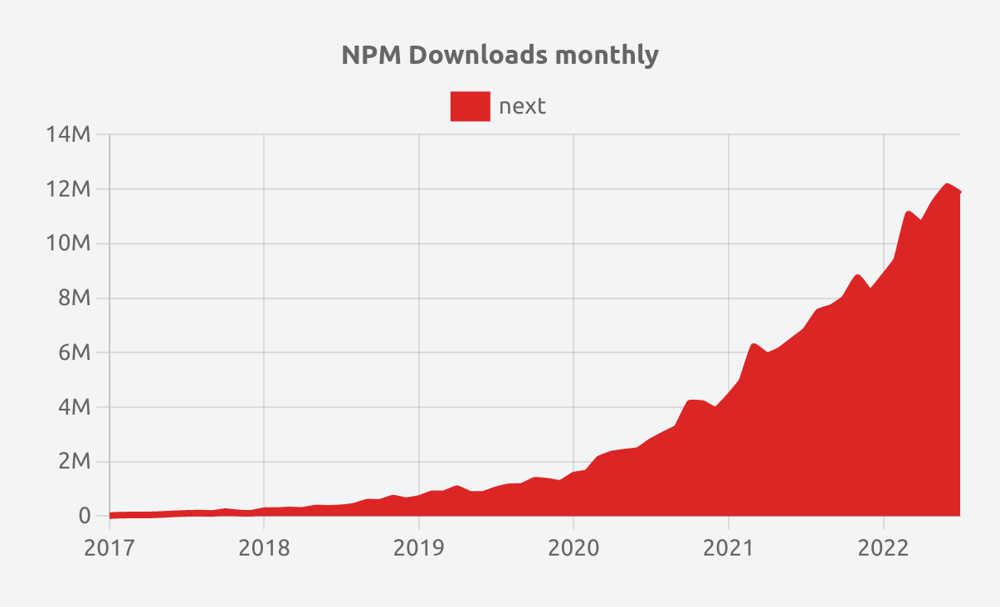
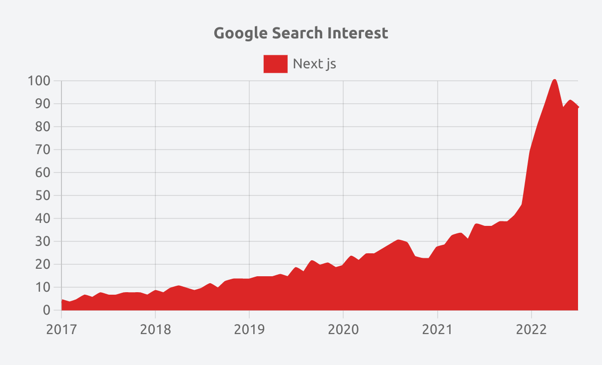

# Introduction

## Qu'est-ce que Next.js ?

### Historique des technologies Web

#### Des sites entièrement statiques...

Au début du Web, les sites étaient entièrement statiques : les mêmes pages étaient servies à tous les utilisateurs. Le protocole *HTTP* étant un protocole sans état, cela signifie que chaque requête est auto-suffisante et ne dépend pas d'un état conservé par le serveur.

#### aux pages générées dynamiquement sur les serveurs...

Grâce à l'apparition de plusieurs technologies comme les *cookies*, les bases de données et de nouveaux langages comme *PHP*, il fut possible de créer des pages dynamiques et personnalisées selon l'utilisateur sur le serveur.

Grâce aux *cookies* et aux *sessions*, les serveurs peuvent authentifier et autoriser les requêtes et donc donner des réponses différentes en fonction de l'utilisateur qui fait la requête.

Les serveurs construisent complètement la réponse à afficher (*HTML*, *CSS* et *JavaScript*) et la retournent aux navigateurs qui n'ont plus qu'à l'afficher.

#### à l'utilisation intensive du *JavaScript*...

Ensuite, grâce à l'évolution du langage *JavaScript* et à la technologie *AJAX* (possibilité d'envoyer des requêtes HTTP depuis un site Web sans avoir à recharger la page), nous sommes entrés dans l'ère *JavaScript*.

Les pages affichées aux utilisateurs (*user interface - UI*) sont devenues très **réactives**  (réactions aux clics, aux entrées, aux chargements et globalement à tous les événements) grâce à l'utilisation intensive du *JavaScript* et de l'*AJAX*.

#### jusqu'à l'essor des *SPA*...

Les outils de build avancés (comme *Webpack*) et les nouveaux frameworks (*Angular*, *React*, *Vue*) ont permis de créer des applications très complexes en *JavaScript*.

Les *SPA* (*Single Page Application*) sont des applications qui **sont exécutées majoritairement par le navigateur client**. Autrement dit, l'essentiel des manipulations de l'affichage, donc du rendu des pages, sont effectuées par du *JavaScript* dans le navigateur et non pas sur le serveur. L'application envoie de nombreuses **requêtes** *AJAX* pour charger ou mettre à jour les données nécessaires.

Ces applications ont grandement amélioré l'expérience utilisateur, car après un chargement initial, il n'y a plus de chargements et l'application est plus fluide.

Cependant, ce chargement initial peut causer plusieurs difficultés :
- **les robots** qui parcourent le site Web peuvent avoir du mal à indexer des *SPA*.
- quelle que soit la page initiale, **toute l'application (*ou une majorité*) doit être chargée initialement** même si la page est très simple ce qui est largement sous-optimal pour l'utilisation du réseau (énormément de données à envoyer).
- le temps de chargement de la page initiale est trop lent (chargement des données par le réseau, construction dans le navigateur par le *JavaScript* etc)..

#### jusqu'au meilleur des deux : *Next.js*

*Next.js* est un framework complet qui utilise notamment *React* et *Node.js*.

Il inclut, comme nous le verrons en détail, un routeur, la gestion des chargements des données etc.

Il permet d'utiliser du rendu serveur, du rendu client ou du pré-rendu suivant les situations... tout en utilisant *React* !

## A quoi sert Next.js ?

*Next.js* est un framework car à la différence de *React*, il ne vous permet pas seulement de créer une interface utilisateur !
Là où *React* était initialement prévu pour apporter un peu de dynamisme aux applications serveurs d'hier, *Next* vous permet, entre autres, d'exécuter un serveur web performant, créer tout un système de routage au sein de votre application et également gérer tout l'aspect internationalisation dont vous pourriez avoir besoin par exemple...

### Les avantages de *Next*

#### Le framework de *Vercel*

*Vercel* est une entreprise qui a levé plusieurs centaines de millions et a créé des technologies pour vérifier puis déployer des applications *frontend* rapidement.

*Next.js* est son framework *React* développé en collaboration avec *Google* et *Facebook*. L'équipe est donc très solide et la maintenabilité est donc assurée.

#### Une traction incroyable

L'utilisation de *Next.js* explose littéralement, avec plus de 12 millions de téléchargements par mois :

Et un énorme intérêt sur Google :

Des entreprises utilisant *Next.js* sont par exemple TikTok, Twitch Mobile, Hulu, Ticketmaster, Staples, Marvel, Binance, IBM, Github, Uber, Facebook, McDonald's etc.

#### Amélioration des performances *SEO*

La possibilité de générer des pages statiquement ou sur le serveur permet d'être plus facilement indexé par les moteurs de recherche.

En outre, Next offre la possibilité de facilement gérer les métadonnées sur chaque page pour les moteurs de recherche et les partages sur les réseaux sociaux.

#### Optimisation d'images

*Next.js* fournit la possibilité d'optimiser automatiquement les images envoyées suivant la taille d'écran de l'utilisateur et la taille de l'image. Cela permet des gains de performance non négligeables !

#### Internationalisation

*Next.js* permet de très facilement ajouter des traductions pour vos pages et donc facilite l'internationalisation de votre site Web.

#### Le choix du rendu adapté à chaque page

**La beauté de Next est que vous pouvez choisir *pour chaque page* si vous voulez qu'elle soit statique (*SSG*), rendue par le serveur (*SSR*) ou par le client (*CSR*).**

Vous pouvez donc toujours arbitrer entre performance et interactivité suivant les besoins de chaque page.

#### Routage facile et puissant

Le système de routage de *Next.js* est basé sur les dossiers et les fichiers ce qui permet de très facilement organiser ses pages.

Par exemple, le fichier *pages/profil/configuration.jsx* sera automatiquement disponible sur l'*URI* */profil/configuration* !

Mais ce n'est pas tout, le routeur optimise ce qu'il faut envoyer au navigateur client pour chaque page et crée automatiquement un *bundle* pour chaque page.

Il est également possible de créer des routes dynamiques très simplement en indiquant le ou les parties dynamiques : par exemple *pages/[user].jsx.* Nous verrons bien sûr le fonctionnement en détail.

#### Création de routes d'API

*Next.js* utilise *Node.js* et vous pouvez donc créer très facilement des routes d'*API* internes ou externes (par exemple pour utiliser *Stripe*).

*Next.js* est donc un framework complet !

#### Les meilleures performances possibles

Le fait de pouvoir utiliser le rendu adapté à chaque page, d'optimiser les images, de minifier et compiler le code, de le diviser en paquets adaptés pour chaque page, d'utiliser là où c'est possible les *imports* dynamiques et plein d'autres technologies intégrées à *Next.js*, permettent d'atteindre les meilleures performances possibles aujourd'hui.

### Les différents types de rendu

**Le rendu est l'étape qui permet de passer du code *React* au *DOM* *HTML* qui sera ensuite affiché par le navigateur.**

**Le rendu peut s'effectuer avant l'exécution, par le serveur ou par le client (le navigateur).**

#### Le *static rendering* (*SSG*)

L'option par défaut lorsque vous créez une nouvelle page dans le framework. 
Le *static rendering* vous permet tout simplement de créer des pages dont leur contenu *HTML* seront générés en amont, lors du build de votre application.

Ainsi, avec le *static rendering*, les composants serveurs comme clients peuvent être rendus au moment du build de l'application, au *build time*.

Ce type de rendu permet notamment de délivrer ces pages au travers d'un *Content Delivery Network* (*CDN*) géographiquement proche des utilisateurs et ainsi de réduire considérablement le temps de chargement de votre application.

L'*ISR* - *incremental static regeneration* -, vous permettra, par un facteur temporel ou par exemple l'utilisation de *webhooks*, de régénérer vos pages statiques à la demande tout au long du cycle de vie de votre application. Ainsi, vous serez en mesure dans le cas de la création d'un blog par exemple de mettre à jour tous les contenus statiques de votre application sans avoir à relancer un *build* complet.

#### Le *dynamic rendering* (*SSR*)

Le *dynamic rendering* quant à lui est un type de rendu qui vient agir au *runtime*.

Lorsqu'un utilisateur souhaite accéder à une page qui utilise ce type de rendu, le contenu *HTML* de la page est générée au moment de la requête, l'ensemble des paramètres et des données permettent de construire un document et on répète cette action pour chacune des requêtes qui a été effectuée.

*Next.js* exécutera le rendu de vos pages de manières dynamiques seulement s'il détecte que certaines fonctions dynamiques ont été utilisées au sein de vos composants de la page. Cela peut être par exemple un composant qui utiliserait la fonction `useSearchParams` du framework.

#### Le *client-side rendering* (*CSR*)

**Avec le rendu côté client** le navigateur reçoit les instructions *JavaScript* pour construire l'*interface utilisateur* (*UI*).

Nous verrons ensemble que finalement, avec cette version *App router*, les composants serveurs et clients, le client-side rendering est de moins en moins répandu.

### Les nombreuses optimisations pour la production

Vous pouvez désormais composer vos pages du framework par deux types de composants différents : les composants clients et serveurs.

#### Composants serveurs

Tous les composants créés dans *Next* dans le répertoire *app* sont des composants *React* serveurs par défaut. 

Cela permet de **réduire considérablement le *bundle* *javascript*** servi aux clients (navigateur). Depuis ces composants, vous serez en mesure de profiter directement des avantages d'un code exécuté côté serveur, comme celui d'interagir avec des services back-end tel qu'une base de données par exemple tout en gardant la flexibilité de *React* pour créer des interfaces utilisateurs complètes.

Le rendu *HTML* initial est généré côté serveur.

#### Composants clients

Les composants clients vous permettent quant à eux d'ajouter à votre application tout l'aspect interactions avec vos utilisateurs : ils sont pré-rendus côtés serveur également mais sont hydratés du côté client avec le Javascript et le JSON qui les composent.

### Jusqu'à comprendre l'intérêt d'un framework aussi puissant...

Chaque fois que vous lancerez votre application *Next*, vous profiterez également de l'ensemble des optimisations qui ont été mises en place pour vous, développeur, et également pour les futurs utilisateurs de votre application.

L'ensemble de votre code sera, d'abord, **compilé** par *SWC*, un compilateur créé sur base de *Rust*, langage très proche du langage machine donc très puissant. Cette étape permet de transformer le *JSX*, le *TypeScript* et les versions très récentes de *JavaScript* en *JavaScript* compatible tous navigateurs, ainsi que le *Sass* en *CSS*.

Tout un processus de **minification** vient s'ajouter, afin de réduire au maximum la taille des fichiers qui seront rendus à vos clients. Ainsi, toute l'écriture non nécessaire à la bonne exécution de votre code est retirée (sauts de ligne, commentaires, tabulations...)

Egalement, le *bundler* *TurboPack* s'occupera pour vous de résoudre tous les *imports* que vous auriez créé au sein de votre application et fusionner tous vos fichiers ensemble.

Enfin, *Next* identifie chaque point d'entrée de votre application pour procéder au *code splitting*. Il vient créer de petits *chunks*, pour chacune de vos pages, afin de ne servir que le code *JavaScript* utile à l'exécution de votre page, sans rendre à l'utilisateur un bundle énorme et lourd comme on aurait pu trouver dans des applications *React* d'aujourd'hui.

**Après la phase de *build*, vous aurez :**
- les fichiers *HTML* pour les pages statiques,
- le code *JavaScript* pour rendre les pages sur le serveur -c'est-à-dire construire avant de les envoyer au navigateur-,
- le code *JavaScript* pour rendre les pages réactives du côté du client,
- les fichiers *CSS*.

## Configuration de l'environnement

Dernière étape avant l'installation de notre projet Next.js, nous allons pour cette leçon entamer la configuration de notre environnement. 

### Installation de Visual Studio code

Pour installer l'éditeur de code visual studio, il vous suffit de le télécharger et de l'installer. Il fonctionne sur l'ensemble des environnements : *Linux*, *Windows* et *MacOS*.

Vous pouvez le télécharger [ici](https://code.visualstudio.com/).

Une fois que ceci est fait, rendez-vous dans l'onglet *Extensions* de Visual studio que vous trouverez sur la partie gauche de l'outil. Vous pouvez installer deux extensions : 
- **ESLint :** cette extension vous permettra, dans votre IDE, de mettre en évidence les problèmes trouvés dans votre application et de pouvoir les corriger.
- **Prettier :** il vous permettra de formater tout ou partie de votre code à chaque sauvegarde.

### Installation de *Node.js*

Téléchargez et installez la version *LTS* de [*NodeJS*](https://nodejs.org/en). Cette version est maintenue à jour sur une durée plus longue, elle ne vous offre pas les toutes dernières fonctionnalités qui pourraient se trouver dans la dernière version de Node mais elle vous apporte une plus grande stabilité.

Next utilise Node.js pour le lancement du serveur et vous aurez également besoin de l'utilitaire *npm* pour installer les différents paquets de l'application (celui-ci est inclus dans votre installation de Node).

Une fois l'installation terminée, rendez-vous de nouveau dans votre éditeur de code. Ouvrez un nouveau terminal via le menu *Terminal > Nouveau terminal*.

Vous pouvez effectuer la commande `node --version` pour vérifier que votre installation de Node.js se soit bien déroulée. Si c'est le cas, votre terminal devrait vous afficher la version de Node.js que vous avez précédemment installée.

### Configuration de *Prettier*

Pour s'assurer que *Prettier* formate vos fichiers lors de sauvegardes de ceux-ci, rendez-vous dans la partie paramètres de VS code.

Dans *Fichier > Préférences > Paramètres*, recherchez *format on save* ou *save* et cochez la case si elle n'est pas cochée.

