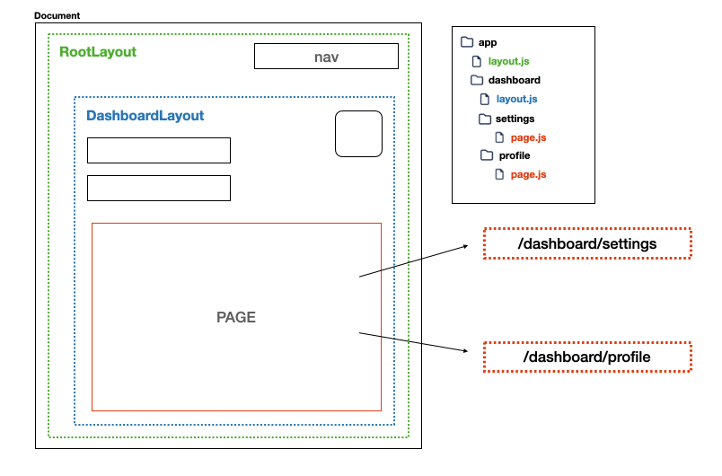

# Création et architecture d'une application Next.js

## Installation avec create-next-app

Après avoir installé Node.js et son utilitaire npm, nous allons pouvoir commencer à installer notre première application Next.js.

### Installation de l'application Next.js

Il est possible d'[installer une application Next.js](https://nextjs.org/docs/getting-started/installation) à partir d'un projet React.js existant. Ici, nous procéderons à l'installation grâce à cette ligne de commande :

```sh
npx create-next-app@latest
```

`npx`, à la différence de `npm`, nous permet d'exécuter des paquets et non pas de les enregistrer, les installer.

Le tag `latest` nous permettra de profiter de la dernière version de disponible de Next.

**L'option `--experimental-app` n'est plus à ajouter, elle permettait de définir que l'on souhait utiliser la version app router de Next quand elle n'était pas encore stable. Depuis juin 2023, cette version est stable.**

#### Les paramètres de l'exécution

Une fois ce paquet exécuté, vous pourrez définir un nom de projet qui vous sera demandé. Ce nom sera celui du dossier créé ainsi que le nom de votre projet dans votre fichier *package.json*.

Egalement, vous aurez la possibilité de choisir si l'installation de votre application vient également avec *Typescript*. Langage développé par Microsoft, c'est un surensemble de Javascript qui vous permet, entre autres, de typer les variables et retours de votre code.

Nous avions installé lors des précédentes sessions l'extension *ESLINT* pour notre IDE, ici nous préciserons que nous souhaitons l'inclure aux dépendances de notre projet. Celui-ci vient avec une configuration pré-établie pour Next.js.

Vous pouvez choisir d'inclure un dossier supplémentaire *src* dans votre application pour bien compartimenter votre code. 

Enfin, vous devriez choisir d'utiliser la version du routage sous format de dossier App. Celle-ci est la toute dernière version de routage de Next. C'est celle-là que nous allons utiliser dans nos exemples.

Un *alias d'import* par défaut vous sera proposé, qui vous permettra de remplacer une partie de vos chemins vers le dossier *src* par un format raccourci (*@/* par défaut).

### Découverte du projet installé

Comme pour tout projet Node, vous trouverez un répertoire *node_modules* qui contient la totalité des dépendances requises pour le fonctionnement de votre projet.

Le fichier *package.json*, lui, vous donnera des informations sur les paquets installés, notamment React et Next. Aussi, vous y retrouverez plusieurs scripts :
- **dev :** permet le lancement d'un serveur de développement, avec notamment le Fast Refresh qui vous permettra de profiter d'un rechargement de votre serveur lors de chaque édition de code
- **build :** permet de préparer votre application à la production.
- **start :** permet le lancement d'un serveur de production, il s'appuiera sur le dossier .next créé par l'exécution de votre script de build précédent.
- **lint :** exécute le linter ESLint sur l'ensemble de votre code pour trouver des possibles problèmes. Ce script ne nous intéressera pas forcément étant donné que l'extension installée sur notre IDE remplit déjà ce rôle.

Parmi ces fichiers installés, le *package-lock.json* sera généré pour vous et vous listera l'ensemble des paquets installés avec leur version exacte.

## Présentation de l'architecture

Maintenant que notre installation est complète, place à la découverte des fichiers qui nous sont proposés pour découvrir l'architecture du framework !

### La configuration de Next

Nous avions brièvement évoqué le fichier *next.config.js* qui, on le sait, nous permettra d'ajouter de la configuration globale à notre projet.

Ce fichier, étendu de la configuration principale de Next, nous permet également de découvrir un point intéressant : l'ensemble des composants rendus dans notre application le seront avec le *mode strict de React*.

Par mode strict, on entend 3 éléments principaux : 
- Tous nos composants seront **re-rendus 2 fois**, pour s'assurer que nous développions bien des **composants en fonction pure**. Plus précisément, avec la même entrée (state, props, context) d'un composant, on doit s'assurer que la sortie (JSX) restera identique.
- S'assurer qu'il *n'y ai pas d'effets de bord* lors de l'exécution de hooks, comme le `useEffect`, notamment que vous ayez bien nettoyé une connexion créée à l'intérieur de celui-ci par exemple.
- Vous avertir sur **l'utilisation d'API dépréciées** comme d'anciennes méthodes de cycle de vie.

### Composition du projet

Comme vous en aviez l'habitude, vous retrouverez le dossier *public* qui vous permettra de lister différentes ressources et assets.

Le dossier *app*, lui, est au coeur de notre projet. C'est d'ici que le système de routage complet de notre application sera initialisé. 

Un dossier *api* avec une première route d'API créée compose notre application. Actuellement, une réponse basique d'une chaîne de caractères est générée. Nous le verrons, les possibilités sont, ici, beaucoup plus importantes.

#### Le routage

Il nous manquait un habituel fichier *index.html* dans le dossier public. Il a été en fait transformé en un *layout.js* dans le dossier *app*. Celui-ci est appelé *RootLayout*, car il est le fichier racine du dossier. Nous le verrons, il sera possible de **créer de multiples layout au sein de notre application** Next.js.

Une première page, dans le fichier *page.js*, a été générée pour nous à la racine du dossier *app*. Elle est constituée d'un ensemble de code JSX qui permet de rendre la page d'accueil de l'application.

#### Introduction aux nouveautés apportées

C'était une découverte dans le premier composant React que nous avons vu dans le fichier *page.js*, il est constitué déjà de deux paquets inclus dans Next : *next/font* et *next/image*.

A la différence d'un projet React lambda où vous aviez l'habitude d'inclure, dans votre fichier *index.html*, le lien vers votre CDN préféré pour charger votre font, il est ici directement importé grâce à *next/font*. L'utilisation de ce paquet comporte plusieurs avantages, notamment le fait que Next.js, par cette utilisation, vienne télécharger, au build time, votre font et la serve de manière statique.

Plus de requêtes depuis votre navigateur vers le CDN, un temps de chargement réduit !

Concernant les images, là encore, l'utilisation du paquet *next/image* vous permet d'utiliser un composant créé par Next. La simple utilisation de ce paquet vous permettra notamment de servir vos images dans des formats modernes tels que *WebP* ou *AVIF*, vous serez en mesure également de servir aux différents devices des tailles adéquates. 
Finalement, vos images ne se chargeront qu'une fois présentes dans le [viewport](https://definitions-digital.com/webdesign/viewport) de vos utilisateurs.

Nous reverrons en détail l'utilisation, les possibilités et tous les détails de ces deux paquets.

## Analyse d'une requête vers Next.js

Lorsque vous vous apprêtez à démarrer un serveur avec *Next.js*, c'est un serveur *Node.js* complètement optimisé et développé pour vous qui va être lancé, sans que vous n'ayez à définir quoi que ce soit.

### Les étapes avant la construction d'une page *Next.js*

Votre serveur *Node.js* démarré, il est désormais capable d'intercepter n'importe quelle requête HTTP.

Son intérêt principal est de venir résoudre la route qui lui a été envoyée pour vous servir le bon contenu. 

Ce serveur va donc en premier lieu venir analyser le chemin d'URL qui lui a été fourni, les différents paramètres, identifier également la langue par exemple.

A partir de l'ensemble de ces paramètres, le serveur créé par Next sera en capacité de retrouver l'ensemble de votre arborescence définie dans le dossier app et d'y inclure le ou les bons layouts ainsi que la page finale à afficher.

**Un layout est une partie d'interface utilisateur partagé pour plusieurs pages.** Pendant la navigation, celui-ci conserve son état et n'est pas re-rendu.



Seul le **RootLayout (autrement dit, le layout racine) est obligatoire** dans votre application, les autres segments que vous allez créer pourront inclure, ou non, un layout.

Un layout contient obligatoirement un children, composant enfant, qui contiendra soit un autre layout d'un segment suivant s'il est défini, soit une page finale.

### Lors de la navigation...

Une fois la première requête de construction de vos différents layout terminés pour l'affichage de votre page, Next ne va modifier le rendu que pour les parties de votre interface où c'est nécessaire. On appelle ça, le **rendu partiel**.

Imaginons que vous ayez créé un segment *dashboard* avec un layout propre à celui-ci.

Vous accédez désormais au segment *settings* inclus dans votre segment *dashboard*.

Lorsque vous naviguez vers le segment *profile* par exemple, inclus également dans votre segment *dashboard*, la seule partie qui sera re-rendue sera votre partie de page.

Le rootLayout que vous aviez conservera son état et ne sera pas re-rendu, tout comme le layout du segment dashboard.

Ainsi, pour toutes les requêtes, lors de votre navigation entre vos pages, **Next n'effectuera jamais de re-rendu total de votre application**. Uniquement le segment concerné par la navigation sera rendu, ce qui permet de réduire drastiquement la quantité de données transférées et le temps d'exécution.

## Création d'un premier segment

Dans cette nouvelle leçon, l'objectif est de créer un premier segment. Comme vu précédemment, nous créons ici un **Leaf Segment**, segment final sans enfant.

### Implémentation du layout

Pour reprendre notre exemple précédent, l'ajout d'un layout et d'une page dans notre nouveau segment nous a permis de constater l'inclusion qui est faite par Next.

Le composant Root, celui qui avait déjà été créé pour nous, inclus notre layout de segment *dashboard*. Celui-ci inclus également notre page.

Création du fichier *app/dashboard/layout.js*

```ts
export default function DashboardLayout({ children }) {
  return (
    <section className="dashboard-container">
      {children}
    </section>
  )
}
```

Next **se base sur les noms des fichiers présents** dans les segments pour identifier leur rôle. Attention donc à bien nommer vos fichiers respectivement layout ainsi que page. Leur extension cependant, peut varier, notamment *js*, *jsx*, *ts* ou encore *tsx*.

### Ajout de notre page de segment

#### Création du fichier *app/dashboard/page.js*

```ts
export default function DashboardPage() {
  return (
    <div className="dashboard-page">
      <p>Hello, dashboard page !</p>
    </div>
  );
}
```

L'ajout du fichier *page.js* permet à Next d'**identifier ce segment comme publiquement accessible.** 

A l'intérieur de celui-ci, il nous est possible de créer un composant React habituel (nous verrons lors des prochaines leçons qu'il est en fait, un peu différent des composants que vous aviez l'habitude de créer).

