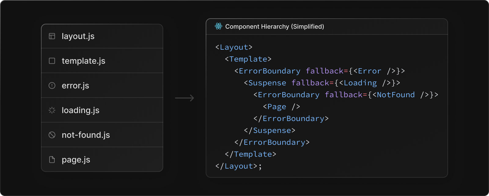

# Routage et navigation serveur

### Segments statiques et dynamiques

Afin de vous permettre de créer toutes les pages qui pourraient vous être utile dans votre application, Next.js vous met à disposition deux types de segments : les *statiques* et les *dynamiques*.

On différencie ces deux types de segments par un point important : vous utiliserez des segments statiques lorsque vous connaîtrez à l'avance le chemin d'URL pour y accéder, les segments dynamiques si ce n'est pas le cas.

Rappelez vous qu'un segment ne devient publiquement accessible que dans le cas où un fichier *page.js* a été créé directement à l'intérieur.

### Les segments statiques

Nous les avions déjà utilisés lors de notre précédente leçon, nous découvrons aujourd'hui ensemble qu'il est tout à fait possible d'en créer plusieurs, les uns imbriqués dans les autres.

Ceux-ci vous permettent également de récupérer, à l'intérieur du composant du fichier page.js le props *params* qui pourrait inclure des paramètres provenant de segment dynamiques parents, ou encore un props *searchParams* qui vous permet de récupérer les paramètres GET écrits dans votre chemin d'URL.

Création d'un fichier *dashboard/page.js* dans notre segment statique :

```ts
const DashboardPage = () => {
  return (
    <div>
      <h1>Welcome to dashboard page</h1>
    </div>
  );
};

export default DashboardPage;
```

### Les segments dynamiques

Vous avez la possibilité de créer des segments dynamiques dans le cas où vous ne connaitriez pas le chemin d'URL à l'avance. Cela peut se retrouver dans le cas d'utilisation de chemins provenant de données dynamiques.

Comme dans notre exemple, nous souhaitons créer une page pour chacun des produits de notre application. 

Ainsi, pour ce type de segment, vous avez 3 possibilités : 
- La notation *[id]* vous permet de créer un segment dynamique qui ne matchera qu'avec un seul paramètre d'URL. Exemple : */products/15*. Votre props *params* est une chaîne de caractères qui correspond au paramètre qui est inclus dans le chemin d'URL.
- La notation *[...id]* vous permettra de rendre l'accès à votre segment pour un ou plusieurs paramètres d'URL. Exemple : */products/15* ou */products/15/600/800*. Votre props *params* devient un tableau d'éléments.
- La notation *[[...id]]* quant à elle vous permettra de rendre l'accès à votre segment qu'il n'y ai aucun paramètre, un seul, ou plusieurs. Exemple : */products* ou */products/15/600* ou /*products/15*. Egalement, votre props params devient un tableau d'éléments.

Le nom que vous définissez à l'intérieur de votre segment dynamique déterminera précisément le nom de l'attribut présent dans votre props *params*.

Ainsi, en créant notre composant dans le fichier *products/[id]/page.js* nous étions en mesure d'accéder au chemin */products/15*. Le résultat produit était : *Welcome to product page with id : 15*.

```ts
const ProductPage = ({ params }) => {
  return (
    <div>
      <h1>Welcome to product page with id : {params.id}</h1>
    </div>
  );
};

export default ProductPage;
```

Nous verrons qu'il est possible d'utiliser la fonction *generateStaticParams* avec Next.js pour nous permettre de créer ces multiples pages de manière statique. Ainsi, en donnant à Next.js toutes les valeurs des params possibles en amont (grâce par exemple à un appel vers notre API pour récupérer tous les id des produits), il pourra créer le rendu HTML de nos pages au moment du lancement de notre application, au build time.

Egalement, il sera possible de se servir de la fonction *generateMetadata* pour produire des métadonnées pour nos pages présentes dans des segments dynamiques en fonction de leurs paramètres d'URL.

### Imbriquez les deux, selon vos besoins

Vous pouvez tout à fait avoir dans votre application, comme vu dans notre exemple, une suite de segments statiques et dynamiques, dans l'ordre que vous souhaitez.

Comme nous avons pu nous en apercevoir, les pages (et layout) de segments enfants d'un segment dynamique profitent également de leur *params*.

Par exemple, créer un fichier sous le répertoire *products/[id]/category/page.js* nous permettra de récupérer le props *params* avec la valeur du segment dynamique :

```ts
const ProductCategoryPage = ({ params }) => { // { id: 15 }
  return (
    <div>
      <h1>Welcome to product category page - {params.id}</h1>
    </div>
  );
};

export default ProductCategoryPage;
```

Les possibilités sont désormais infinies pour créer des routes dans votre application, vous n'avez plus qu'à les utiliser !

## Fichiers de routage pour Next.js

Jusqu'ici, nous n'avions vu ensemble que deux fichiers de routage pour Next.js : le fichier layout.js et le fichier page.js.

Pour nous permettre de gérer un ensemble de comportements dans notre application assez facilement, le framework nous en propose beaucoup d'autres !

### Les composants de partage d'interface

#### layout.js

Il s'agit d'un composant optionnel à ajouter pour chacun de nos segments. Il permet de partager une partie d'interface pour nos utilisateurs qui sera inclus dans les segments enfants. 

Son props children sera constitué d'un composant layout enfant s'il existe, ou d'une page directement.

Le seul layout obligatoire est le RootLayout, présent à la racine de notre routage, dans le dossier app, celui-ci doit être constitué au minimum d'une balise <html> et <body>.

Ces composants sont des composants serveurs par défaut. Son état reste identique tout au long de la navigation dans votre application.

```ts
const DashboardLayout = ({ children }) => {
  return (
    <section className="dashboard-container">
      {children}
    </section>
  );
}

export default DashboardLayout;
```

#### template.js

Le fichier template.js est totalement identique au fichier layout.js. La seule différence minime est que Next créé une nouvelle instance de celui-ci à chaque navigation entre pages.

Ce comportement peut nous intéresser notamment dans le cas où nous souhaiterions rejouer des animations CSS à chaque changement de page ou lorsque l'on utilise des hooks comme le useEffect et useState et que nous ne souhaiterions pas que son état reste conservé au fur et à mesure que l'utilisateur navigue.

### Les composants de gestion d'erreur

#### error.js

Le composant que nous serons mené à créer à l'intérieur de ce fichier constituera le composant fallback de l'error boundary créé par Next.js

Un composant error boundary est un composant qui vient intercepter toutes les erreurs javascript générées par ses composants enfants. A celui-ci peut être attaché un fallback, qui constitue une interface utilisateur de remplacement en cas d'erreur.

L'un des principaux intérêts de l'utilisation de ce composant de fallback est qu'il va vous permettre d'isoler une erreur créée dans votre application et ne pas impacter la totalité. Ses composants parents ne subiront pas l'erreur et conserveront leur état, on pourra donc par exemple conserver l'affichage de multiples layout de notre application.

```ts
"use client";

const Error = ({ error, reset }) => {
  return (
    <div>
      <h2>Oups, une erreur est survenue !</h2>
      <button onClick={() => reset()}>Réessayer</button>
    </div>
  );
};

export default Error;
```

Il vous permet l'utilisation de deux props : 
- **error** sera constitué du message d'erreur remonté par votre composant enfant qui a créé l'erreur de rendu inattendue.
- **reset** est une fonction qui vous est donnée que vous pourrez appeler pour tenter de réessayer de re-rendre vos composants enfants. Si le re-rendu est réussi, aucune erreur n'est remontée, le fallback présent disparaîtra et laissera de nouveau place au rendu de votre interface habituelle.

#### global-error.js

Comporte le même fonctionnement que lorsque vous créez votre fichier *error.js*.

Ce fichier a vocation a être créé uniquement **à la racine du dossier de routage** (dossier app) de votre application pour **gérer les erreurs générées par votre RootLayout**. Comme par défaut le React error boundary est placé après le layout du segment courant, il n'aurait pas été possible de gérer les erreurs de ce layout de premier niveau sans l'utilisation de ce fichier.

#### not-found.js

Constitue également une interface de remplacement pour l'affichage d'une page non trouvée, page 404.

```ts
const NotFound = () => {
  return (
    <>
      <h2>Page 404</h2>
      <p>Désolé, le produit demandé est introuvable.</p>
    </>
  );
};
```

Nous le verrons dans les prochaines leçons, Next nous donne la possibilité d'utiliser une fonction notFound() dans un segment dynamique ou statique. Dans ce cas, l'interface créée dans le fichier not-found.js sera affichée.

### Suspense fallback

#### loading.js

Lorsque Next tente de charger l'une de vos pages dynamiques, plusieurs étapes sont mises en place.   
D'abord, il effectuera toutes les récupérations de données que vous auriez pu demander avant la construction de votre page via par exemple la fonction *fetch*.  
Par la suite, du contenu HTML sera généré à partir de vos composants contenus dans cette page.  
L'ensemble du HTML, CSS et du javascript (qui lui serait créé par la création de composants clients) vont être envoyés au navigateur. La page sera alors accessible, pas encore intéractive, jusqu'à ce que React hydrate vos composants avec le javascript fourni. 

Ces étapes peuvent se révéler assez longue dans le cas où vous auriez une page qui a besoin de récupérer des données sur un temps assez long. 

C'est là que peut intervenir la création du fichier *loading.js*. Agissant comme fallback du composant Suspense de React, il vous permet de générer une interface de remplacement en attendant que vos composants aient finis d'être générés.

```ts
const Loading = () => {
  return (
    <div>
      <p>Chargement en cours...</p>
    </div>
  );
};

export default Loading;
```

Egalement, nous pourrons être amené à utiliser ce fichier pour utiliser la fonctionnalité de Streaming de Next qui permet de découper votre page en plusieurs chunks HTML et ainsi pouvoir rendre une interface à votre utilisateur par petite partie, tout en conservant un temps de chargement assez court.

### Points d'accès

Rappelons-nous, la création d'un segment ne signifie pas obligatoirement qu'il est publiquement accessible : il faudra créer un point d'accès, soit une interface de notre application avec le fichier *page.js* ou alors un endpoint d'API avec *route.js*

#### page.js

Ce fichier constitue le point d'entrée de votre segment. Le composant créé dans le fichier est directement inclus depuis le layout du même niveau ou niveau parent. 

```ts
const ProductPage = ({ params, searchParams }) => {
  return (
    <div>
      <h1>Welcome to product page !</h1>
    </div>
  );
};

export default ProductPage;
```

Deux props vous sont directement proposés à la création de ce composant : 
- **params :** inclus les paramètres de chemin d'URL du ou des possibles segments dynamiques du même niveau ou de niveau parent.
- **searchParams :** inclus les paramètres GET ajoutés au sein du chemin d'URL lors de l'accès à votre page.

#### route.js

Nous reparlerons en détail de l'utilisation de ce fichier route.js qui vous permet de créer des routes d'API au sein de votre application Next.

Grâce à la création de fonction nommée avec le verbe HTTP pour lequel vous souhaitez que votre route puisse être appelée, nous serons en mesure d'intercepter des requêtes.   
Les verbes HTTP disponibles pour ces routes actuellement sont *GET*, *POST*, *PUT*, *PATCH*, *DELETE*, *OPTIONS* et *HEAD*.

```ts
import { NextResponse } from 'next/server';

export async function GET() {
  const res = await fetch('https://data.mongodb-api.com/...', {
    headers: {
      'Content-Type': 'application/json',
      'API-Key': process.env.DATA_API_KEY,
    },
  });
  const data = await res.json();

  return NextResponse.json({ data })
}
```

Tout comme pour le fichier *page.js*, celui-ci peut être placé directement à l'intérieur du dossier *app*.

Attention, vous ne pouvez pas définir dans le même segment un fichier *page.js* et *route.js*.

### Ordre d'inclusion

L'ensemble de ces fichiers de routage sont inclus dans un ordre bien particulier choisi par Next. Il est important de comprendre cet ordre pour que, lorsque l'on créé un fallback dans le fichier *error.js* par exemple, on puisse comprendre dans quel composant React les erreurs vont pouvoir être gérées et pour lesquels ils ne le seront pas.



Dans la prochaine leçon, nous verrons en détail l'utilisation de ces fichiers et l'importance de leur placement.

