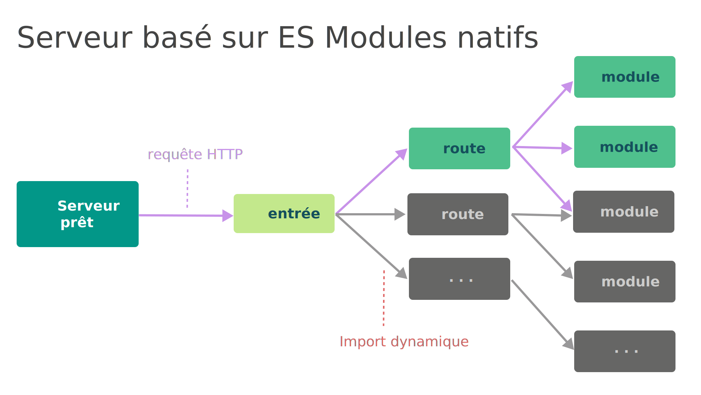
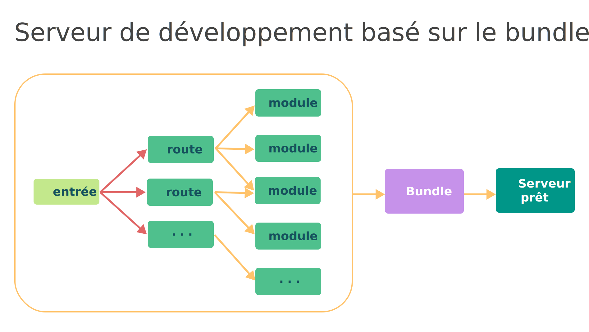

# Introduction

### Prérequis

Pour faire cette formation il faut impérativement maîtriser HTML, CSS et JavaScript.

## Qu'est-ce que React ?

React est une librairie (également appelée bibliothèque) _JavaScript_ permettant de créer des interfaces utilisateurs pour des applications.

React a été créé par Jordan Walke, un ingénieur de Facebook en 2011 et a été utilisé dans le fil d’actualité dès 2011 puis dans Instagram dès 2012.

Il permet de créer de très grandes applications qui peuvent charger des données sans avoir à recharger la page.

### Le framework le plus utilisé et apprécié

Il s’agit aujourd’hui du _framework JavaScript_ le plus utilisé au monde.

_React_ est utilisé par Netflix, Yahoo, Airbnb, Sony, Atlassian, Facebook, Instagram, WhatsApp, Microsoft, Paypal et tant d’autres entreprises.

Sur _NPM_ il s’agit du _framework front_ le plus téléchargé mensuellement devant Angular et Vue :

Selon un sondage de Stackoverflow réalisé en 2022, il s’agit du framework Web que les développeurs souhaitent le plus apprendre :

### Avantages de React

#### Des performances incroyables

React utilise un _DOM virtuel_ (que nous étudierons en détails) pour obtenir des performances très supérieures à du _JavaScript_ natif.

En effet, au lieu de modifier directement le _DOM_, qui est l’arbre des éléments HTML, ce qui est coûteux en performance, React va calculer à l’aide d’un _DOM virtuel_ tous les changements optimaux à effectuer sur le _DOM_ avant de les effectuer.

Cette stratégie permet des gains de performance très importants.

#### Utilisation de JSX et philosophie de la librairie

Avec React au lieu d’utiliser du _HTML_, nous utilisons du _JSX_.

Ce n’est pas obligatoire mais fortement recommandé.

Le _JSX_ permet d’écrire du code _HTML_ dans du code _JavaScript_.

Ce code sera ensuite transpilé en _JavaScript_.

Nous verrons tous les avantages d’utiliser ce _JavaScript_ amélioré, en même temps que nous l’apprendrons, dans le chapitre suivant.

React a pour philosophie de ne pas séparer la structure _HTML_, le style _CSS_ et la logique _JavaScript_, mais de séparer l’application en composants qui sont complets et construits autour d’une fonctionnalité.

Cette approche permet de créer des applications qui soient plus facilement maintenables car elles sont mieux structurées.

Elle permet également une réutilisation des composants dans plusieurs endroits de votre application.

#### Une communauté énorme

La communauté de développeurs React est la plus importante de tous les frameworks front.

Il vous sera facile de trouver des réponses sur Stackoverflow si vous bloquez ! Mais nous sommes là pour vous aider et le cours répondra à toutes vos questions !

#### Un écosystème fabuleux

React possède un écosystème incroyable, il existe en effet plusieurs milliers de librairies qui sont construites pour être utilisées spécifiquement avec React.

Dans ce cours nous étudierons les plus importantes qui vous permettront de réaliser des applications très complexes avec notamment _React Router_ et _Recoil_.

Pour tout ce que vous voudrez faire, vous pouvez être certain d’une chose : il y aura une librairie de l'écosystème React pour vous y aider !

#### Le mobile avec React Native 

Grâce à _React Native_ vous pouvez facilement porter votre application React sur mobile.

_React Native_ permet de développer des composants comme sur React pour une application mobile hybride (disponible sur iOS et Android).

#### Les Single Page Applications

React est un _framework_ permettant de construire des _Single Page Applications (SPA)_.

Vous connaissez forcément les _SPA_ : Gmail, Google Analytics, Trello, Dropbox en sont des exemples parmi tant d’autres.

De nombreux _frameworks front_ ont adopté cette architecture (Vue, Angular, React, Ember, Meteor etc). Mais de quoi s’agit-il exactement ?

**Une _SPA_ est une application qui fonctionne dans un navigateur sans que l’utilisateur n’ait besoin de recharger la page**.

Le principe est de simuler une application hors ligne : pas de rechargement des pages, de la rapidité, pas d’attente supplémentaire due au réseau etc.

Les principales caractéristiques de la _SPA_ sont :

- **le rendu est effectué côté client** (quand un élément change, la page est modifiée grâce aux scripts de l’application chargée côté client).
- pour fonctionner **elle charge en principe une seule fois l’application** (_HTML_, _CSS_ et _scripts_).
- **seules les données sont transmises**, si nécessaire, entre le serveur et l’application client (le plus souvent au format _JSON_).
- le développement mobile est simplifié car **le code backend peut être utilisé que l’application soit Web ou native** (iOS, Android).
- elle est particulièrement adaptée pour stocker les données localement et de n’envoyer des requêtes au serveur lorsque c’est nécessaire.


## vite, swc et JSX

### Installation de Node.js

Dans le cours vous aurez besoin d’installer des _packages_, c’est-à-dire des librairies qui deviendront des dépendances de votre projet _React_. Il vous faut donc le gestionnaire de dépendances pour les environnements _JavaScript_ : _npm_.

_npm_ est conçu pour simplifier l’installation, la mise à jour et la désinstallation des librairies utilisées dans votre application. Il est inclus dans _Node.js_.

Installez la version stable (_LTS_) de _Node.js_ en vous rendant [ici](https://nodejs.org/en/download/).

En plus de la gestion des dépendances, _Node.js_ vous sera indispensable pour le serveur de développement de _React_.

Ouvrez un terminal et vérifiez que l'installation est bien effectuée :

```bash
node -v
```

### vite

#### Qu'est-ce que Vite ?

_Vite_ (qui vient du mot français) est un outil de _build_ qui vise à fournir une expérience de développement plus rapide et plus épurée pour les projets web modernes. Il se compose de deux parties principales :

- Un serveur de développement qui offre des améliorations riches en fonctionnalités par rapport aux modules _ES_ natifs, par exemple un remplacement de module à chaud (_HMR_) extrêmement rapide.
- Une commande de _build_ qui _bundle_ votre code avec _Rollup_, pré-configuré pour générer des ressources statiques hautement optimisées pour la production.

_Vite_ est un outil aux opinions tranchées et vient avec des paramètres par défaut judicieux dès le départ.

#### Le problème avant Vite

Avant la disponibilité des modules ES natifs dans les navigateurs, les développeurs n'avaient pas de mécanisme natif pour écrire du _JavaScript_ de manière modulaire, ce qui a conduit à **la pratique du "_bundling_" : l'utilisation d'outils pour traiter et concaténer les modules source en fichiers exécutables dans le navigateur**.

Des outils tels que _webpack_, _Rollup_ et _Parcel_ ont amélioré l'expérience de développement, mais avec l'augmentation du volume de _JavaScript_ dans les applications ambitieuses, les performances des outils basés sur _JavaScript_ ont commencé à poser problème.

Le temps de démarrage du serveur de développement et le temps de réflexion des modifications de fichiers dans le navigateur sont devenus trop longs, affectant la productivité et le moral des développeurs.

Pour résoudre ces problèmes, _Vite_ tire parti des avancées récentes, notamment la disponibilité des modules _ES_ natifs dans tous les navigateurs et l'émergence d'outils _JavaScript_ écrits dans des langages compilés en natif.

#### Performances excellentes en développement

Contrairement aux configurations de _build_ basées sur des _bundlers_ qui doivent traiter toute l'application avant de pouvoir la servir, _Vite_ améliore le temps de démarrage du serveur de développement en divisant les modules en deux catégories : les dépendances et le code source.



Les dépendances, qui changent rarement, sont pré-bundlées rapidement avec _esbuild_ un outil écrit en _Go_ ou _swc_ un outil écrit en _Rust_. Le code source, qui contient souvent du _JavaScript_ non standard (par exemples du _TypeScript_) nécessitant une transformation et est fréquemment modifié, est servi via des modules _ES_ natifs, permettant au navigateur de demander et de traiter le code à la demande.

Dans les configurations basées sur des _bundlers_, éditer un fichier peut nécessiter de reconstruire et de recharger l'ensemble du _bundle_, ce qui est inefficace, surtout pour les grandes applications. _Vite_, en revanche, effectue des mises à jour _HMR_ (_Hot Module Replacement_) sur des modules _ES_ natifs, invalidant et mettant à jour uniquement le nécessaire, ce qui accélère considérablement le processus.



#### Le bundling reste nécessaire pour la production

Il reste nécessaire de _bundler_ l'application pour la production en raison de l'inefficacité de servir des modules _ES_ non _bundlés_. En effet, dans ce cas de très nombreux allers-retours réseau sont nécessaires.

_Vite_ propose une commande de _build_ préconfigurée pour gérer cela efficacement.

> _Vite_ n'utilise pas _esbuild_ pour le _bundling_ en production, malgré sa vitesse, en raison de l'incompatibilité avec l'_API_ de _plugin_ de _Vite_ et de la flexibilité offerte par _Rollup_, l'outil actuellement utilisé par _Vite_ pour le _bundling_ en production.

### Le langage JSX

#### React recommande l’utilisation de JSX.

_JSX_ est une extension syntaxique à _JavaScript_ qui permet d’utiliser du _HTML_ amélioré dans du _JavaScript_.

#### Quels sont les avantages à utiliser JSX ?

1. Premièrement, cela fait beaucoup de code en moins.
1. Deuxièmement, il s’agit de la philosophie même de _React_. _React_ prône en effet la séparation des préoccupations (_separation of concerns_) plutôt que la séparation des langages.

Autrement dit dans la logique _React_, il ne faut pas séparer le _template HTML_ de la logique _JavaScript_ car les deux participent au même objectif : l’affichage d’une UI à l’utilisateur.

En effet, la logique du rendu est trop couplée avec toutes les logiques côté _JavaScript_ : comment les événements sont gérés, comment le rendu change au cours du temps et comment les données sont préparées pour être affichées.

### Aller plus loin sur les différents outils et le bundling de production

#### Rollup

_Vite_ utilise _Rollup_ pour le processus de _bundling_ lors de la mise en production.

_Rollup_ est un outil de module _bundler_ qui permet de regrouper différents fichiers _JavaScript_ en un seul _bundle_, optimisant ainsi le chargement des _scripts_ dans le navigateur.

_Rollup_ prend en charge la création du _bundle_ final, la découpe du code (_code-splitting_), et l'inclusion des _assets_ nécessaires. Il s'occupe également de l'optimisation des bundles pour une performance optimale.

#### esbuild et swc

Ces deux outils sont alternatifs : soit on utilise _esbuild_ soit _swc_. Nous utiliserons _swc_ dans la formation.

Ces outils sont utilisés par _Vite_ pour la pré-bundling des dépendances et la minification du code.

Ils sont utilisés pour transformer et minifier rapidement le code _JavaScript_ et _CSS_. La minification consiste à réduire la taille des fichiers en supprimant les espaces inutiles, en renommant les variables pour réduire leur taille, etc.

Ils permettent également de transpiler le _Sass_ en _CSS_ ou le _TypeScript_ en _JavaScript_.

#### Étapes de Vite pour la mise en production

- **Pré-bundling des dépendances :** avant de démarrer le serveur de développement, _Vite_ pré-bundle les dépendances du projet avec _esbuild_ ou _swc_ pour accélérer les temps de chargement initiaux.
- **Transpilation :** _Vite_ transpile le code source en code compatible avec les navigateurs cibles. Cela peut inclure la transpilation de _JSX_, _TypeScript_, ou d'autres syntaxes modernes.
- **Bundling :** _Vite_ utilise _Rollup_ pour créer un ou plusieurs _bundles_ à partir du code source et des dépendances. Cela inclut également le découpage du code pour le chargement différé des modules.
- **Optimisations :** _Vite_ applique diverses optimisations pour réduire la taille des fichiers et améliorer les performances, y compris la minification (avec _esbuild_ ou un autre outil), l'élimination du code mort (_tree-shaking_), et la séparation des fichiers communs (_chunk splitting_).
- **Génération des assets :** _Vite_ génère également les fichiers _CSS_, les images optimisées, les polices et d'autres _assets_ nécessaires pour l'application.

## Environnement Windows

### Installation de Node.js

Comme nous l'avons vu, nous devons installer des dépendances _JavaScript_, appelées _packages_, nous vous conseillons donc d’installer _npm_ qui est le gestionnaire de dépendances de _Node.js_.

Si vous n’avez pas _npm_, installez _Node.js_ en vous rendant [ici](https://nodejs.org/en/download/).

### Installation de Visual Studio Code

Pour installer l’éditeur _VS Code_, il suffit de le télécharger et de l’installer. Il fonctionne sur tous les environnements : _Linux_, _Windows_ et _MacOS_.

Vous pouvez le télécharger [ici](https://code.visualstudio.com/).

### Ouvrir un terminal dans VS Code

**Pour ouvrir le terminal sur _VS Code_ vous pouvez au choix :**

- Utiliser `Ctrl+ ù`. Si le raccourci ne fonctionne pas. Allez dans le menu `File > Preferences > Keymaps`. Ensuite recherchez _view toggle terminal_. Et choisissez un raccourci puis faites `Entrée`. Nous recommandons `Ctrl` et la touche la plus à gauche juste sous la touche d'échappement.
- Aller dans le menu `Affichage > Terminal`.
- Aller dans le menu `Terminal > Nouveau terminal`.
- Tapez `Ctrl+Shift+P` puis tapez `Toggle terminal` puis `entrée`.

### Installation d’extensions VS Code

Allez dans l’onglet extension sur _VS Code_.

Recherchez et installez _Prettier_, _ESlint_ et _Material Icon Theme_.

Allez ensuite dans `Fichier > Préférences > Paramètres`. Recherchez _format on save_ et cochez la case.

Cela permet d'activer le formatage de _Prettier_ à chaque sauvegarde.

## Environnement GNU/Linux

### Installation de Node.js avec Node Version Manager :

_nvm_ permet d’installer et d’utiliser plusieurs versions de _Node.js_ localement. C’est intéressant si vous avez plusieurs projets à des versions différentes.

Installez nvm :

```bash
wget -qO- https://raw.githubusercontent.com/nvm-sh/nvm/v0.39.1/install.sh | bash
```

Collez les commandes suivantes :

```bash
export NVM_DIR="$([ -z "${XDG_CONFIG_HOME-}" ] && printf %s "${HOME}/.nvm" || printf %s "${XDG_CONFIG_HOME}/nvm")"

[ -s "$NVM_DIR/nvm.sh" ] && \. "$NVM_DIR/nvm.sh" # This loads nvm
```

### Installez Node.js LTS :

```bash
nvm install --lts
```

### Installation de Node sans nvm

Ouvrez un terminal et entrez la commande suivante qui va installer la version _LTS_ de _Node.js_ :

```bash
curl -fsSL https://deb.nodesource.com/setup_lts.x | sudo -E bash -

sudo apt-get install -y nodejs
```

Vérifiez l’installation :

```bash
node -v
```

### Installation de VS Code avec snap sur Ubuntu

Pour installer l’éditeur _VS Code_ sur _Ubuntu_, nous vous recommandons d’utiliser snap.

Ouvrez un terminal et faites simplement :

```bash
snap install code
```

### Installation de VS Code avec l’installeur

Si vous êtes sur une autre distribution ou que vous ne souhaitez pas utiliser snap, vous pouvez également utiliser l’installeur.

Vous pouvez le télécharger [ici](https://code.visualstudio.com/).

### Ouvrir un terminal dans VS Code

**Pour ouvrir le terminal sur _VS Code_ vous pouvez au choix :**

- Utiliser `Ctrl+ ù`. Si le raccourci ne fonctionne pas. Allez dans le menu `File > Preferences > Keymaps`. Ensuite recherchez _view toggle terminal_. Et choisissez un raccourci puis faites `Entrée`. Nous recommandons `Ctrl` et la touche la plus à gauche juste sous la touche d'échappement.
- Aller dans le menu `Affichage > Terminal`.
- Aller dans le menu `Terminal > Nouveau terminal`.
- Tapez `Ctrl+Shift+P` puis tapez `Toggle terminal` puis `entrée`.

### Installation d’extensions VS Code

Allez dans l’onglet extension sur _VS Code_.

Recherchez et installez _Prettier_, _ESlint_ et _Material Icon Theme_.

Allez ensuite dans `Fichier > Préférences > Paramètres`. Recherchez _format on save_ et cochez la case.

Cela permet d'activer le formatage de _Prettier_ à chaque sauvegarde.

## Environnement MacOS

### Installation de Node.js

Comme nous l'avons vu, nous devons installer des dépendances _JavaScript_, appelées _packages_, nous vous conseillons donc d’installer _npm_ qui est le gestionnaire de dépendances de _Node.js_.

Si vous n’avez pas _npm_, installez _Node.js_ en vous rendant [ici](https://nodejs.org/en/download/).

### Installation de Visual Studio Code

Pour installer l’éditeur _VS Code_, il suffit de le télécharger et de l’installer. Il fonctionne sur tous les environnements : _Linux_, _Windows_ et _MacOS_.

Vous pouvez le télécharger [ici](https://code.visualstudio.com/).

### Ouvrir un terminal dans VS Code

**Pour ouvrir le terminal sur _VS Code_ vous pouvez au choix :**

- Utiliser `Ctrl+ ù`. Si le raccourci ne fonctionne pas. Allez dans le menu `File > Preferences > Keymaps`. Ensuite recherchez _view toggle terminal_. Et choisissez un raccourci puis faites `Entrée`. Nous recommandons `Ctrl` et la touche la plus à gauche juste sous la touche d'échappement.
- Aller dans le menu `Affichage > Terminal`.
- Aller dans le menu `Terminal > Nouveau terminal`.
- Tapez `Ctrl+Shift+P` puis tapez `Toggle terminal` puis `entrée`.

### Installation d’extensions VS Code

Allez dans l’onglet extension sur _VS Code_.

Recherchez et installez _Prettier_, _ESlint_ et _Material Icon Theme_.

Allez ensuite dans `Fichier > Préférences > Paramètres`. Recherchez _format on save_ et cochez la case.

Cela permet d'activer le formatage de _Prettier_ à chaque sauvegarde.
