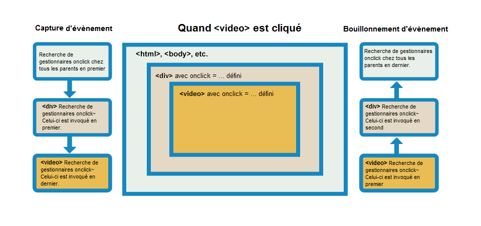

# Rendre les composants réactifs

## Composants et fonctions purs

### Les fonctions pures et _React_

Les fonctions pures sont des **fonctions dont le résultat ne dépend que des arguments passés** et qui n’ont **pas d’effets extérieurs** (appelés effets de bord). Chaque sortie d'une fonction ne dépend ainsi que de son entrée.

**Pour _React_, tous vos composants sont des fonctions pures. Cela signifie que vos composants doivent toujours retourner le même JSX s'ils reçoivent les mêmes entrées.**

**Les entrées d'un composant en _React_ proviennent des _props_, du contexte ou de l'état (_state_).** _Nous verrons bientôt le contexte et l'état._

Avec le _Strict Mode_ que nous activons pendant le développement, _React_ s'assure que les composants sont purs en les affichant deux fois.

S'il n'est donc pas possible de modifier des variables préexistantes d'un composant, car ils doivent être purs, **il est possible de modifier des variables et des objets qui sont créés par le composant pendant le rendu.**

Ainsi, s'il est interdit avec _React_ de faire :

```jsx
let uneVar = 0;

function Composant() {
  uneVar = uneVar + 1;
  return <h2>{uneVar}</h2>;
}
```

Car ici le composant a un effet de bord en modifiant une variable externe au composant.

On peut tout à fait modifier des variables ou objets défini dans le composant :

```jsx
function Composant() {
  let uneVar = [];
  for (let i = 1; i <= 12; i++) {
    uneVar.push(<AutreComposant key={i} uneProp={i} />);
  }
  return uneVar;
}
```

### Utiliser des effets de bord

Dans une application il est nécessaire d'effectuer des changements externes aux composants : par exemple pour déclencher des animations, charger des données etc.

En _React_, **ces effets doivent être déclenchés dans les gestionnaires d'événement**. Les gestionnaires d'événements sont des fonctions exécutées par _React_ lorsque l'utilisateur effectue une action, par exemple un clic sur un bouton.

**Les gestionnaires d'événements n'ont pas à être purs car ils ne sont pas exécutés pendant le rendu des composants.**

### Pourquoi les composants doivent-ils être purs avec _React_ ?

1. **Pour que les composants puissent être rendus dans différents environnement.** Puisqu'ils retournent le même résultat pour les mêmes entrées, un composant peut être utilisé dans différents environnements.
2. **Pour que les composants puissent être mis en cache.** _React_ peut améliorer les performances en sautant le rendu des composants donc les entrées n'ont pas changé.
3. **Pour que les rendus puissent être interrompus lors dr nouveaux événements.** Si des entrées changent suite par exemple à une interaction utilisateur, React peut stopper le rendu en cours sans perte de temps et demander un nouveau rendu immédiatement avec les nouvelles entrées?

### Les étapes du rendu de l'UI avec React

Avant que les composants soient affichés sur l'écran, ils doivent être rendus par _React_. Les étapes de ce rendu sont les suivantes :

1. **Déclenchement** (_triggering_) du rendu
2. **Rendu** (_rendering_) du composant
3. **Affichage** (_committing_) sur le DOM

#### 1 - Déclenchement du rendu (_triggering_)

Il y a deux raisons pour laquelle un rendu est déclenché : **le rendu initial** et **le rendu lorsque l'état d'un composant change.**

Le rendu initial est simplement déclenché par :

```jsx
ReactDOM.render();
```

Lorsqu'un composant a été rendu initialement, l**es rendus suivants sont déclenchés par la mise à jour de son état avec les fonctions _set_.** _Nous verrons cela au cours du chapitre._

La mise à jour de l'état d'un composant va automatiquement déclencher une mise en attende d'un nouveau rendu.

#### 2 - Le rendu du composant (_rendering_)

Après le déclenchement d'un rendu, **_React_ exécute le composant pour savoir quoi afficher sur l'écran.** C'est ce qu'on appelle le _rendering_.

**Pour le rendu initial,** _React_ appelle le composant racine, qui va appeler à son tour tout l'arbre des composants.

**Pour les rendus suivants,** _React_ appelle le composant dont l'état a été mis à jour et qui a déclenché la demande de rendu. Si le composant retourne d'autres composants, et que ces autres composants retournent eux-mêmes d'autres composants _React_ va rendre tous ces composants.

#### 3 - Affichage sur le _DOM_ (_committing_)

Après la phase de _rendering_, et que tous les composants dont l'état a été modifié et leurs enfants aient été appelés, _React_ va modifier le _DOM_.

Pour le rendu initial, _React_ va utiliser la méthode `appendChild()` pour ajouter tous les nœuds du _DOM_ qu'il a créé.

Pour les rendus suivants, _React_ **va effectuer uniquement les modifications minimales nécessaires qui ont été calculées pendant la phase de rendu** (_rendering_).

Cela signifie que React* ne modifie les nœuds du *DOM\* uniquement dans le cas où il y a une différence entre les différents rendus.

## Écouter des évènements

### Ajouter de l'interactivité

Aujourd'hui toutes les applications sont interactives. Les utilisateurs peuvent cliquer sur des boutons, remplir des formulaires etc.

A chaque interaction de l'utilisateur l'application doit se mettre à jour en fonction de celle-ci.

Pour réagir à un événement, _React_ permet l'ajout de **gestionnaires d'événements** (_event handlers_).

**Le gestionnaire d'événement est une fonction qui est exécutée lorsqu'un événement précis se produit sur l'élément cible.**

**Pour définir un gestionnaire d'événement il faut passer la fonction comme une _prop_ avec comme nom, le nom d'un événement précédé par _on_.**

Par exemple, le clic sur un bouton :

```jsx
export default function Button() {
  function handleClick() {
    alert("Clic !");
  }

  return <button onClick={handleClick}>Cliquez</button>;
}
```

**Par convention, les noms des gestionnaires d'événement doivent être précédés par _handle_ et suivi du nom de l'événement.**

Ici par exemple, `handleClick()`.

Un autre exemple serait `onMouseEnter={handleMouseEnter}`.

Il est possible de directement définir la fonction dans le JSX mais c'est très rare car cela nuit à la lisibilité du composant. Il faut que le corps du gestionnaire soit très court.

```jsx
<button onClick={() => {
  alert('Clic !');
}}>
```

### Erreur commune : exécution des gestionnaires d'événements

**Faites très attention :** lorsque l'on débute avec _React_ on a tendance à exécuter les gestionnaires d'événement au lieu de passer leurs références.

Au lieu de faire :

```jsx
<button onClick={handleClick}>
```

On fait :

```jsx
<button onClick={handleClick()}>
```

Or si dans le premier cas on passe la référence de la fonction, pour qu'elle soit exécutée plus tard lorsque l'événement clic survient, dans le second cas on exécute directement la fonction et on passe _undefined_ en gestionnaire d'événement.

Dans la continuité, une erreur commune et d'exécuter directement un gestionnaire d'événement qui prend un ou plusieurs arguments :

```jsx
<button onClick={alert('CLIC !')}>
```

Au lieu de retourner une fonction qui retournera le gestionnaire d'événement :

```jsx
<button onClick={() => alert('CLIC !')}>
```

Dans le premier cas, l'alerte est immédiatement affichée car le gestionnaire est immédiatement exécuté.

Dans le second cas, la fonction anonyme crée une fonction gestionnaire, qui sera exécutée lors du clic.

### Propagation des événements

Voici un rappel sur la propagation des événements avec les phases de capture et de bouillonnement (_bubbling_) :



> _Si vous ne maîtrisez pas ces sujets, rafraîchissez-vous la mémoire sur la formation **JavaScript**._

**Tous les événements se propagent avec _React_ sauf _onScroll_.**

Pour stopper la propagation, ce qui est assez courant, **il suffit d'appeler la méthode `stopPropagation()` sur l'événement reçu par le gestionnaire d'événement :**

```jsx
function handleClick(e) {
  e.stopPropagation();
  console.log("CLIC", e);
}
```

### Empêcher le comportement par défaut

Certaines événements ont des comportements associés par défaut sur les navigateurs.

Le plus connu est le fait de rafraîchir la page lorsqu'un événement _submit_ est émis dans un formulaire.

Pour empêcher ce comportement par défaut, qui est très souvent ce que nous voulons avec une SPA, **il suffit d'appeler la méthode `preventDefault()` sur l'événement reçu par le gestionnaire d'événement :**

```jsx
export default function Composant() {
  return (
    <form
      onSubmit={(e) => {
        e.preventDefault();
        alert("Envoyé !");
      }}
    >
      <input />
      <button>Envoyer</button>
    </form>
  );
}
```

**\*Pour rappel,** un bouton sans attribut **type** dans un formulaire est de type **submit**. Un clic sur celui-ci émettra donc l'événement **submit**.\*

## Événements, composant et paramètres

### Accéder aux _props_ dans les gestionnaires d'événement

Comme les gestionnaires d'événement sont déclarés dans les composants, vous pouvez accéder aux _props_ du composant.

```jsx
function Composant({ message, children }) {
  return <button onClick={() => alert(message)}>{children}</button>;
}
```

Le composant reçoit en _props_ une propriété _message_ et la propriété spéciale _children_, que nous avons déjà vue.

Le gestionnaire d'événement _onClick_ peut accéder sans problème à la propriété _message_ passée en _prop_ au composant.

### Passer des gestionnaires d'événement comme _prop_

Très souvent, vous voudrez qu'un composant parent passe au composant enfant un gestionnaire d'événement différent suivant le contexte.

Par exemple, pour un composant _Bouton_, vous pourriez vouloir que l'action soit différente lors d'un clic suivant le composant parent qui l'utilise.

Pour ce faire, c'est très simple, **il suffit de passer au composant enfant le gestionnaire d'événement en _prop_.**

En effet, nous avons vu que tout type de valeur pouvait être passé en _prop_ et donc y compris une référence vers une fonction.

```jsx
function Bouton({ handler, children }) {
  return <button onClick={handler}>{children}</button>;
}
```

Ici par exemple, notre composant reçoit en _prop_ un gestionnaire d'événement _handler_, qu'il peut ensuite utiliser et lier à l'événement _onClick_.

**Notez que le nom de la _prop_ est totalement libre. Ce qui importe c'est que l'attribut sur le composant enfant ait bien le nom de l'événement précédé par _on_.**

_Ici nous utilisons **handler** comme nom de prop mais cela pourrait être n'importe quel autre nom._

```jsx
function Parent() {
  return (
    <Bouton handler={() => alert("Téléversement...")}>Téléversement</Bouton>
  );
}
```

Ici le composant parent passe au composant enfant un gestionnaire d'événement en _prop_.

## Présentation de `useState()`

### L'état d'un composant

Les composants ont souvent besoin de changer ce qu'ils affichent en fonction d'une interaction d'un utilisateur et de sauvegarder des données comme la valeur courante d'un champ, un panier etc.

**La mémoire d'un composant est appelé état (_state_) en React.**

L'état d'un composant ne peut pas être sauvegardé dans des variables locales car **elles ne sont pas sauvegardées entre les rendus d'un composant** et **le changement de la valeur d'une variable locale ne déclenchera aucun nouveau rendu du composant.**

Pour cette raison, nous utilisons des variables spéciales appelées **variable d'état et une fonction _set_ associée qui permet de mettre à jour cette variable et de déclencher un nouveau rendu.**

### Le _hook_ d'état `useState()`

**Les _hooks_ sont des fonctions qui permettent d'interagir avec la gestion d’état local et de cycle de vie de _React_ depuis des composants.**

Les _hooks_ sont fournis par _React_ et vous pouvez également en créer des personnalisés. Ils commencent par _use_ car ils permettent d'utiliser une fonctionnalité de _React_.

Le premier hook que nous allons voir est le **_hook_ d'état qui permet de gérer un état local du composant.**

C'est-à-dire qu'il permet de conserver une valeur, de la modifier et de déclencher un nouveau rendu du composant lorsqu'elle est modifiée.

Il s'importe depuis _React_ :

```jsx
import { useState } from "react";
```

Il prend un unique argument qui est **la valeur initiale de l'état local** et retourne un tableau contenant à l'index 0 la **variable d'état** et à l'index 1 **une fonction liée à la variable et qui permet de modifier la valeur de la variable et de déclencher un nouveau rendu du composant par React**, cette fonction est appelée _setter_ :

```jsx
const [state, setState] = useState(valeurInitiale);
```

**La convention pour le nom du _setter_ est d'utiliser le préfixe _set_ suivi du nom de la variable en _camelCase_.**

> _Notez l'utilisation de l'**affectation par décomposition positionnelle.** Si vous ne maîtrisez pas cette syntaxe reportez-vous à la formation **JavaScript**._

Un composant peut utiliser autant de variable d'état que nécessaire :

```jsx
function Composant() {
  const [age, setAge] = useState(42);
  const [prenom, setPrenom] = useState("Jean");
  const [todos, setTodos] = useState([{ text: "Apprendre React" }]);
  // ...
}
```

**Il est très important que les _hooks_ soient déclarés au premier niveau du composant et ne soient pas imbriquées.**

Voici un exemple minimaliste :

```jsx
import React, { useState } from "react";

function Composant() {
  const [count, setCount] = useState(0);

  return (
    <div>
      <p>Vous avez cliqué {count} fois</p>
      <button onClick={() => setCount(count + 1)}>Cliquez ici</button>
    </div>
  );
}
```

### Fonctionnement interne du _hook_ d'état

Les _hooks_ ne sont pas magiques, _React_ ajoute simplement des tableaux aux composants lors de l'exécution en **se basant sur l'ordre de déclaration des _hooks_ sur le composant.**

Comme les _hooks_ sont déclarés au premier niveau du composant, **ils sont toujours exécutés dans le même ordre.**

Voici une version simplifiée (sans les optimisations) du fonctionnement :

```jsx
const hooksDuComposant = [];
let indexDuHookCourant = 0;

// Version simplifiée de useState() :
function useState(valeurInitiale) {
  const paire = hooksDuComposant[indexDuHookCourant];
  if (paire) {
    // C'est que ce n'est pas le premier rendu
    // et que la paire d'état existe
    indexDuHookCourant++;
    return paire;
  }

  // Sinon c'est que c'est le premier rendu
  // donc nous créons la paire
  paire = [valeurInitiale, setState];

  function setState(nouvelleValeur) {
    // Mise à jour de la valeur et du DOM
    paire[0] = nouvelleValeur;
    updateDOM();
  }

  // Stockage de la paire pour les prochains rendus
  hooksDuComposant[indexDuHookCourant] = paire;
  indexDuHookCourant++;
  return paire;
}
```

### Les règles pour structurer l'état des composants

Voici les recommandations de _React_ pour structuré l'état :

- **Grouper les états reliés :** si vous mettez à jour systématiquement deux ou plus variables d'état en même temps, fusionnez les dans une seule variable d'état.
- **Eviter les contradictions dans l'état :** si plusieurs variables d'état entrent en contradiction suivant l'état de l'application, modifiez l'état.
- **Eviter les redondances :** si vous pouvez calculer une information en utilisant plusieurs _props_ ou plusieurs variables d'état ne créez pas une variable d'état pour cette information.
- **Eviter les duplications dans l'état :** si les mêmes informations sont à plusieurs endroits de l'état, par exemple imbriquées dans plusieurs objets, cela devient difficile à maintenir.
- **Eviter les imbrications profondes :** évitez au maximum de créer des états qui comportent trop de niveaux d'imbrication d'objets / tableaux. Cela devient difficile pour les mises à jour.

Cela viendra avec la pratique mais gardez les en tête.

## useState, batch et fonctions de mise à jour

### Mettre à jour l'état déclenche un rendu

Nous allons reprendre ce que nous avons appris sur le fonctionnement des rendus avec _React_.

Il est très important de comprendre qu'avec _React_, ce n'est pas un événement, par exemple un clic qui va déclencher une mise à jour du _DOM_.

Comme nous l'avons vu, **c'est la mise à jour de l'état avec une fonction _setter_ qui déclenche un nouveau rendu.**

_React_ va ensuite ré-exécuter le composant avec la ou les nouvelles valeurs de l'état et **aboutir à un rendu calculé qui est le nouveau _JSX_ à afficher** (c'est-à-dire à un nouvel état du _DOM virtuel_).

_React_ va enfin effectuer **comparer le nouvel état du _DOM virtuel_ avec l'ancien état du _DOM virtuel_ et va calculer les modifications minimales à apporter sur le _DOM_ du navigateur pour qu'il corresponde au nouvel état demandé.**

Prenons maintenant un exemple où nous utilisons plusieurs fois une fonction _setter_ dans un gestionnaire d'événement :

```jsx
import { useState } from "react";

export default function Compteur() {
  const [compteur, setCompteur] = useState(0);

  return (
    <>
      <h1>{compteur}</h1>
      <button
        onClick={() => {
          setCompteur(compteur + 1);
          setCompteur(compteur + 1);
          setCompteur(compteur + 1);
        }}
      >
        +3 ?
      </button>
    </>
  );
}
```

Ici au lieu de la valeur 3 attendue nous obtenons 1 après un clic sur le bouton.

**La raison est que la fonction _setter_ ne défini la nouvelle valeur de la variable d'état que pour le prochain rendu.**

Autrement dit, lors du clic nous avons à chaque fois la même instruction :

```jsx
setCompteur(compteur + 1);
```

Comme la valeur de _compteur_ pour ce rendu est de 0 car nous avons passé 0 en valeur d'état initial à `useState()`, nous demandons simplement 3 fois à _React_ de **définir pour le prochain rendu** la valeur de compteur à 0 + 1 donc 1.

Cela revient en fait exactement à faire, pour le second rendu (un clic après le rendu initial) :

```jsx
<button
  onClick={() => {
    setCompteur(0 + 1);
    setCompteur(0 + 1);
    setCompteur(0 + 1);
  }}
>
  +3 ?
</button>
```

Pour le troisième rendu (deux clics après le rendu initial) :

```jsx
<button
  onClick={() => {
    setCompteur(1 + 1);
    setCompteur(1 + 1);
    setCompteur(1 + 1);
  }}
>
  +3 ?
</button>
```

**Retenez donc que la valeur d'une variable d'état ne change jamais pendant un rendu donné.** Et ce même si le code du rendu est asynchrone :

```jsx
<button
  onClick={() => {
    setCompteur(compteur + 1);
    setTimeout(() => {
      setCompteur(compteur + 1);
    }, 3000);
  }}
>
  +3 ?
</button>
```

### Mises à jour successives d'un état pendant le même rendu

**_React_ attend que tous les gestionnaires d'événements aient été exécutés avant de réaliser les mises à jour des variables d'état demandées.**

Cela permet de mettre à jour plusieurs variables d'état sans déclencher trop de rendus.

Ce fonctionnement est appelé **le traitement par lots ou _batching_.**

Il est possible de mettre à jour plusieurs fois la même variable d'état juste avant le même rendu, même si c'est très rarement nécessaire, **en passant une fonction à la fonction _setter_ :**

```jsx
<button
  onClick={() => {
    setCompteur((n) => n + 1);
    setCompteur((n) => n + 1);
    setCompteur((n) => n + 1);
  }}
>
  +3 ?
</button>
```

Ici `n => n + 1` est appelée **fonction de mise à jour**.

**Les fonctions de mise à jour doivent être pures et retourner la nouvelle valeur de la variable d'état.**

_React_ va mettre en attente toutes ces fonctions de mise à jour dans une queue le temps que tous les gestionnaires d'événement aient été exécutés.

Ensuite, a**u début du prochain rendu, _React_ va les exécuter une par une pour déterminer la nouvelle valeur de la variable d'état pour le nouveau rendu.**

Nous aurons donc bien la valeur 3 lors d'un clic après le rendu initial.

## Exemple d'utilisation des évènements et de useState

### Mettre à jour des objets dans l'état

Nous avons vu qu'en _React_ il ne fallait pas modifier un certain nombres d'objets directement : les props dans les composants enfants et une variable d'état (\*sans utiliser la fonction **setter\***).

En _JavaScript_, comme les objets sont passés par référence et non par valeur (_revoyez la formation **JavaScript** si vous n'êtes pas au clair sur cette notion clé du langage_), **il ne faut jamais modifier un objet contenu dans une variable d'état directement.**

**Il faut d'abord copier l'objet et ensuite modifier cette copie et mettre à jour la variable d'état en utilisant la fonction _setter_.**

Prenons un exemple :

```jsx
const [position, setPosition] = useState({ x: 0, y: 0 });
```

Que se passe t-il si nous faisons :

```jsx
position.x = 42;
setPosition(position);
```

Nous modifions l'objet position pendant le rendu et la valeur de la propriété `x` devient `42` pendant le rendu en cours.

Or, **il faut traiter tout ce qui est mis dans l'état comme étant en lecture seule pendant le rendu**, sinon l'état est décorrélé de ce qui est affiché (rappelez-vous que seule les fonctions _setter_ peuvent déclencher un nouveau rendu).

Autrement dit, si vous modifiez un objet contenu dans une variable d'état directement, la valeur sera modifiée pendant le rendu courant mais aucune mise à jour de l'affichage ne sera déclenchée.

Même si dans certains cas, cela peut fonctionner suivant votre code **c'est une extrêmement mauvaise pratique de modifier l'état sans déclencher de mise à jour et pendant l'état courant.**

Retenez donc deux choses : **ne jamais modifier directement un objet contenu dans une variable d'état** et **toujours utiliser une fonction _set_ pour modifier une variable d'état.**

Il faut donc ici faire :

```jsx
setPosition({
  x: 42,
  y: 0,
});
```

Ici nous créons un nouvel objet littéral qui n'a donc pas la même référence que l'objet contenu dans la variable d'état _position_ et nous le passons à la fonction _setter_.

### Mettre à jour des objets avec la syntaxe _spread_ (**...**)

Le plus souvent, les objets contenus dans vos variables d'état n'auront pas simplement deux propriétés.

Il est serait donc trop long de re-déclarer l'ensemble des propriétés pour une modifier une ou deux sur l'objet.

Il faut utiliser la syntaxe spread pour copier les propriétés de l'objet contenu dans la variable d'état, puis modifier les propriétés souhaitées :

```jsx
setPersonne({
  ...personne,
  prenom: "Jean",
});
```

Ici :

- **{}** crée un nouvel objet littéral.
- **...personne** copie toute les propriétés de l'objet contenu dans la variable d'état _personne_.
- **prenom: 'Jean'** écrase la valeur de la propriété _prenom_ avec la nouvelle valeur _'Jean'_.

> *Revoyez la formation **JavaScript** si vous n'êtes pas au clair sur les notions de copie d'objets, de *spread* et d'écrasement de propriété.*

Notez que si vous avez des objets avec des propriétés contenant des objets (_y compris des tableaux ou des fonctions qui sont des objets_) il faudra penser à copier ces propriétés imbriquées, en effet **l'utilisation de l'opérateur spread effectue une copie superficielle des propriétés d'un objet :**

```jsx
setPersonne({
  ...personne,
  adresse: {
    ...person.adresse,
    ville: "Lyon",
  },
});
```

> **Revoyez les notions de copie superficielle et de copie profonde des objets dans la formation **JavaScript** si besoin.**

### Mettre à jour des tableaux dans l'état

Les tableaux étant des objets particuliers en _JavaScript_, les mêmes règles s'appliquent.

**Il faut toujours traiter l'état local d'un composant comme en lecture seule et ne jamais le modifier sans passer par une fonction _setter_.**

**Il faut toujours créer une copie d'un tableau avant de modifier cette copie et de l'utiliser avec la fonction _setter_ pour mettre à jour l'état lors du prochain rendu.**

En conséquence, il ne faut utiliser aucune méthode modifiant le tableau sur lequel elles sont appliquées : _push, unshift, pop, shift, splice, arr[i] = ..., reverse, sort etc.,_ sur une variable d'état contenant un tableau.

Il faut créer un nouveau tableau en utilisant les méthodes de programmations fonctionnelles : _filter_, _map_, _slice_ et la syntaxe _spread_ (**...**).

#### Ajouter un élément à un tableau contenu dans l'état

Par exemple, il ne faut jamais faire :

```jsx
const [personnes, setPersonnes] = useState([]);

personnes.push({ prenom: "Jean", nom: "Dupont" });

setPersonnes(personnes);
```

Il faut toujours faire :

```jsx
const [personnes, setPersonnes] = useState([]);

setPersonnes([...personnes, { prenom: "Jean", nom: "Dupont" }]);
```

Si vous voulez ajouter un élément au début du tableau et non à la fin, il faudra faire :

```jsx
const [personnes, setPersonnes] = useState([]);

setPersonnes([{ prenom: "Jean", nom: "Dupont" }, ...personnes]);
```

#### Supprimer un élément d'un tableau contenu dans l'état

Pour enlever un élément d'un tableau, on peut utiliser `filter()` car cette méthode crée un nouveau tableau sans modifier le tableau sur lequel elle est appliquée :

```jsx
const personneASupprimer = {
  id: 42,
  prenom: "Jean",
  nom: "Dupont",
};

setPersonnes(personnes.filter((p) => p.id !== personneASupprimer.id));
```

#### Transformer un tableau contenu dans l'état

Pour transformer un tableau par exemple pour modifier un élément ou tous les éléments d'un tableau, il faut utiliser `map()` :

```jsx
const nextCounters = counters.map((c, i) => {
  if (i === index) {
    return c + 1;
  } else {
    return c;
  }
});
setCounters(nextCounters);
```

#### Ajouter un élément à un index spécifique dans un tableau contenu dans l'état

Pour ajouter un élément à un index spécifique dans un tableau contenu dans l'état il faut utiliser la méthode _slice_ et l'opérateur _spread_ :

```jsx
const [tableau, setTableau] = useState([]);

setTableau([
  ...tableau.slice(0, indexInsertion),
  42,
  ...tableau.slice(indexInsertion),
]);
```

#### Trier un tableau contenu dans l'état

Pour trier un tableau contenu dans l'état il faut créer une copie du tableau avec l'opérateur _spread_ et ensuite utiliser par exemple `sort()` ou `reverse()` sur cette copie :

```jsx
const nouveauTableau = [...tableau];
tableau.reverse();
setTableau(nouveauTableau);
```

#### Modifier un tableau contenant des objets

Si vous avez bien suivi, vous savez que vous n'avez pas le droit de faire :

```jsx
const copie = [...personnes];
const personneAMaj = copie.find((p) => p.id === personne.id);
personneAMaj.prenom = "Julie";
setPersonnes(copie);
```

En effet, **...** réalise une copie partielle de _personnes_ et le nouveau tableau contient donc les références des objets précédents.

En modifiant une _personne_ du nouveau tableau on modifie donc en fait la _personne_ de l'ancien tableau car c'est le même objet.

Dans ce cas il faut donc faire :

```jsx
setTableau(
  personnes.map((personne) => {
    if (personne.id === personneId) {
      return { ...personne, prenom: "Julie" };
    } else {
      return personne;
    }
  })
);
```

Nous créons un nouvel objet littéral avec la propriété modifiée avant de la retourner.
