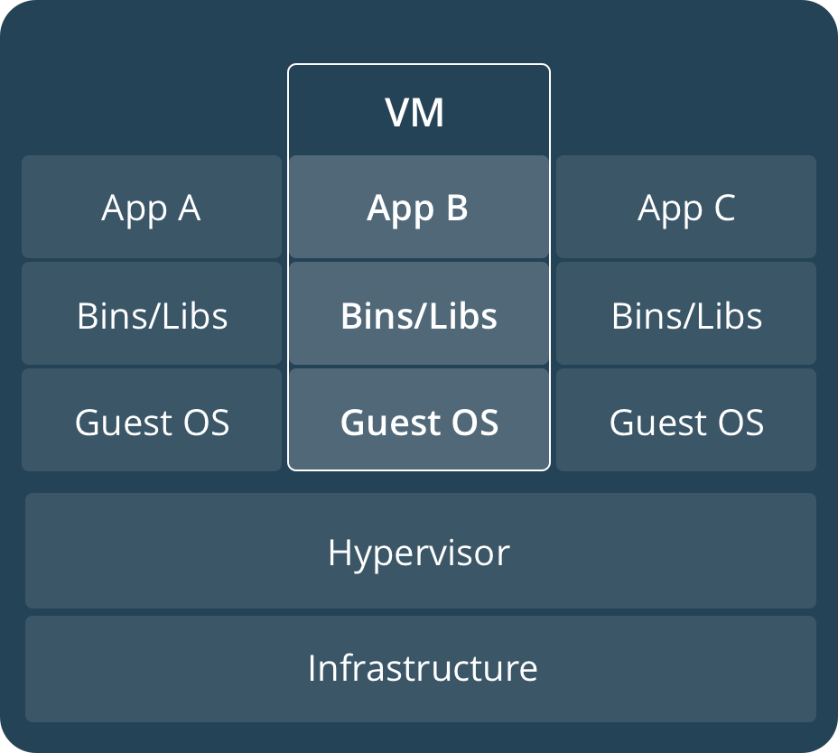
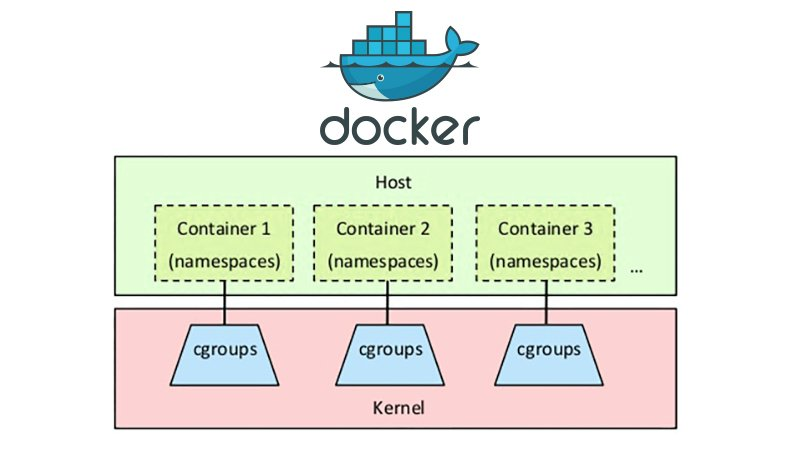
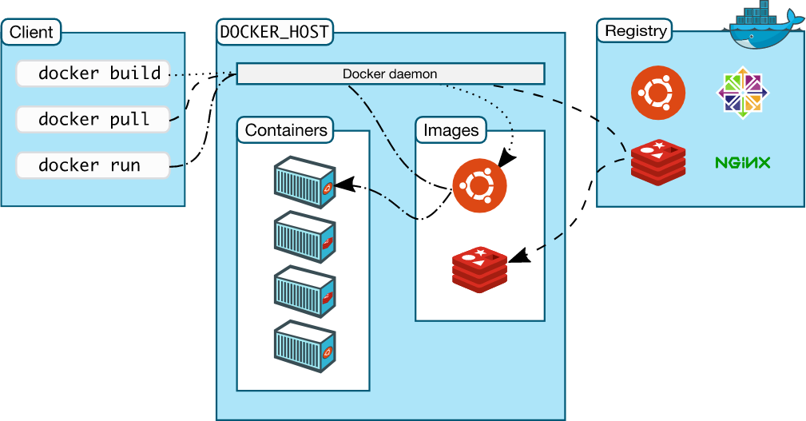

# Introduction à Docker

## A quoi sert Docker ?

### _Docker_ en deux mots

_Docker_ est un outil open-source écrit en langage _Go_ et créé en 2012 par trois ingénieurs français. Il résulte de développements internes de l'entreprise _dotCloud_ co-fondés par deux français d'Epitech.

Il s'agit aujourd'hui d'une entreprise américaine qui a été scindée en deux : une partie open-source et une partie entreprise qui a été revendue à _Mirantis_.

Nous allons dans ce chapitre uniquement nous intéresser à _Docker Community Edition_, la partie entreprise étant réservée aux très très grosses entreprises.

Une bonne première définition de _Docker_ est **un outil qui peut empaqueter une application et ses dépendances dans un conteneur isolé, qui pourra être exécuté sur n'importe quel environnement.**

Appréhender _Docker_ n'est pas une chose aisée. Aussi il est normal d'être perdu au début et il faut avoir bien avancé pour comprendre l'utilité et la puissance de cet outil !

Nous allons quand même lister les principaux avantages dès maintenant.

### Les principaux avantages à utiliser _Docker_

#### 1 - Utilisation plus efficiente des ressources système

_Docker_ permet une utilisation plus efficiente des ressources d'un système tout en permettant les mêmes avantages qu'une machine virtuelle : c'est-à-dire principalement l'isolation et la reproductibilité.

Les applications conteneurisées utilisent beaucoup moins de ressources que des machines virtuelles car elles utilisent le même noyau _Linux_.

Elles démarrent et s'arrêtent en quelques millisecondes, alors qu'il faut quelques secondes ou minutes pour une machine virtuelle.

#### 2 - Reproductibilité

Un conteneur _Docker_ est garanti d'être identique quel que soit le système.

Il garantit que la bonne version de chaque dépendance soit installée. Ainsi, chaque membre d'une équipe est certain d'avoir le ou les applications qui fonctionnent identiquement sur des environnements différents (pas les mêmes _OS_, pas les même configurations locales, pas les mêmes dépendances globales etc).

Avec _Docker_, plus jamais vous entendrez le : "Moi, cela fonctionne sur ma machine".

Cela permet aux développeurs de se soucier uniquement du code et pas de l'environnement où celui-ci sera finalement exécuté.

#### 3 - Isolation

Les dépendances ou les configurations d'un conteneur n'affectera aucune dépendance ou configuration des autres conteneurs ou de la machine hôte.

Vous pouvez ainsi avoir 5 versions de _Node.js_ ou de _MongoDB_ différentes localement sans aucune peine ! C'est un énorme plus lorsque l'on travaille sur plusieurs projets avec des versions de dépendances qui ne sont pas les mêmes. En effet, elles présentent souvent des incompatibilités ou des _breaking changes_ se qui se révèlent être un véritable casse-tête !

#### 4 - Mises à jour et tests

Pour ceux qui ont à gérer plusieurs serveurs, vous savez combien il est complexe de mettre à jour correctement des environnements complexes.

Il faut bien sûr mettre à jour l'_OS_ sur chaque serveur, puis les environnements serveurs et les bases de données : le tout dans le bon ordre et sans oublier de serveurs.

Avec _Docker_, la mise à jour d'un environnement dans le _cloud_, même sur de nombreux serveurs est très simple. Vous gagnerez un temps précieux.

Même chose si vous devez gérer plusieurs environnement : par exemple le classique _development / tests_, _staging_ et _production_. Il faut être sûr que tous les environnements aient les mêmes dépendances, les mêmes versions d'_OS_ etc pour que les tests soient fiables. Avec _Docker_ toute cette gestion d'environnements est simplifiée !

#### 5 - Bonnes pratiques grâce aux images open source

Comme nous le verrons, _Docker_ est si populaire que tous les mainteneurs de librairies ou de logiciels divers (environnement serveur, serveur _Web_, bases de données etc) maintiennent des images _Docker_.

Ces images _Docker_ officielles, disponibles sur une plateforme que nous étudierons, _Docker Hub_, permettent de lancer des conteneurs fiables très rapidement et sans avoir à les configurer soit même.

### Les grands principes des conteneurs Docker

_Docker_ est une plateforme pour les développeurs et les _devops_ qui permet de _build_, de lancer et de partager des applications en utilisant des conteneurs.

Les conteneurs, comme nous allons l'apprendre, permettent d'isoler les applications pour **assurer une parfaite réplicabilité des environnement.**

Autrement dit, ils permettent de s'assurer que vous exécuter une ou plusieurs applications sur le même environnement quel que soit la machine physique et l'_OS_ utilisé.

**Les principes des _conteneurs Docker_ sont les suivants :**

- **ils sont flexibles :** n'importe quelle applications, même les plus complexes, peuvent être containerisée (on dit aussi "dockerisée").
- **ils sont légers :** le fait qu'ils partagent les ressources et le noyau _Linux_ du système d'exploitation de la machine hôte font qu'ils sont beaucoup plus légers que des machines virtuelles (nous l'étudierons en détails dans le chapitre).
- **ils sont portables :** ils sont utilisables sur n'importe quel environnement (tout _OS_, aussi bien pour le développement local que sur des centaines de serveurs dans le _cloud_).
- **ils ont un couplage faible :** cela signifie que les conteneurs sont autonomes car ils sont isolés. Il est facile de les supprimer, les ajouter, les modifier (mise à jour par exemple) sans perturber les autres conteneurs tournant sur une machine.
- **ils sont scalables :** des outils permettent de déployer des centaines voir des milliers de conteneurs en quelques minutes voir secondes sur un très grande nombre de serveurs. Il est même possible d'automatiser le déploiement de nouveaux conteneurs (_auto-scaling_).
- **ils sont sécurisés :** les contraintes et l'isolation par défaut des conteneurs apporte une grande sécurité des environnements déployés.

## Comment fonctionne Docker

### Qu'est-ce qu'une machine virtuelle ? ( _Virtual Machine_ ou _VM_)

Une machine virtuelle est une machine créée par un logiciel et qui n'a pas donc d'existence physique.

Elle permet de simuler des ressources matérielles (disque dur, _RAM_, _CPU_ etc) et logicielles afin qu'un ou plusieurs autres systèmes d'exploitation puissent être utiliser sur la même machine physique.

L'avantage d'une machine virtuelle est la possibilité de lancer plusieurs environnements isolés, avec des systèmes d'exploitation pouvant être différents, en même temps, sur la même machine.

Cela est particulièrement utile pour des serveurs, souvent très puissants, qui peuvent ainsi lancer des dizaines voir des centaines d'environnements isolés sur les mêmes machines physiques (c'est l'une des technologie du _Cloud_).

C'est aussi utile pour pouvoir utiliser différents systèmes d'exploitation sans avoir à redémarrer : c'est parfait pour le développement par exemple. Vous pouvez avoir une machine virtuelle avec tous les logiciels que vous souhaitez sur _GNU/Linux_ et la lancer depuis _Windows_ en deux clics par exemple.

L'inconvénient est bien sûr une diminution des performances, car il faut diviser l'allocation des ressources physiques entre machine hôte et machine virtuelle, et il y a à exécuter la couche système hôte, l'hyperviseur et la couche système invité comme nous allons le voir.



### Différences avec _Docker_

**Il faut bien comprendre que _Docker_ utilise le noyau _Linux_ et l'environnement _GNU_ de votre système.**

Si vous êtes sur n'importe quelle distribution de _GNU/Linux_, il pourra utiliser directement cet environnement.

Si vous êtes sur _MacOS_ ou _Windows_, il utilisera l'hyperviseur installé sur le système (de type 2) et lancera une machine virtuelle _GNU/Linux_ qu'il utilisera.

Dans tous les cas, _Docker_ utilise **un seul système d'exploitation _GNU/Linux_.**

Sur ce système, il va lancer un **conteneur** qui est un processus (c'est-à-dire un programme en cours d'exécution, _c.f. cours Linux / Bash_), avec des fonctionnalités d'encapsulation lui permettant d'être isolé de l'hôte et des autres conteneurs.

Chaque conteneur a son propre système de fichiers isolé qui est fourni par une image _Docker_. Ce système de fichiers contient le code, les binaires, les fichier exécutables et toutes les dépendances requises pour faire fonctionner une application.

Nous reviendrons sur tous ces aspects en détails, mais cela permet d'avoir une idée du fonctionnement par rapport à une machine virtuelle.


Autrement dit, _Docker_ partage le système d'exploitation entre tous les conteneurs qu'il lance, qui sont des simples processus légers. Alors qu'une machine virtuelle est un système d'exploitation entier nécessitant plusieurs gigaoctets de mémoire vive, beaucoup d'espace disque et une utilisation importante du _CPU_.

### Technologies utilisées par Docker

_Docker_ est un environnement beaucoup plus facile d'accès et déjà paramétré de technologies existantes. En fait, il s'agit d'une surcouche et d'une _API_ permettant de contrôler des fonctionnalités bas niveau du noyau _Linux_.

_Docker_ est écrit en langage _Go_ et utilise toutes les fonctionnalités _Linux_ que nous allons voir.

#### Les namespaces

_Docker_ utilise les _namespaces Linux_ qui permettent de créer des espaces isolés sur un système d'exploitation _Linux_.

C'est cette fonctionnalité de _Linux_ qui confère aux conteneurs leur isolation. Chaque aspect d'un containeur est exécuté dans un _namespace_ qui lui est propre et auquel seul ce dernier peut accéder.

_Docker_ utilise ainsi des _namespaces_ pour :

- **l'isolation des processus du conteneur (_PID namespace_)**
- **l'isolation des interfaces réseaux du conteneur (_NET namespace_)**
- **l'isolation des ressources de communications inter-processus (_IPC namespace_)**
- **l'isolation du système de fichiers (_MNP namespace_)**
- **l'isolation des identifiants du noyau et des versions (_UTS namespace_)** qui permet notamment d'avoir un _hostname_ différent pour les conteneurs comme nous le verrons.

#### Les Cgroups

_Docker_ utilise également les _control groups_ (_cgroups_).

Cette technologie _Linux_ permet de limiter l'accès aux ressources à des processus. Grâce à cela, _Docker_ partage les ressources système disponibles entre tous les conteneurs (_RAM_, _CPU_, accès réseaux et lecture / écriture disques etc).

Il est également possible, grâce à cette technologie, de limiter les ressources allouées à chaque conteneur comme nous le verrons plus tard.



#### _UnionFS_

_UnionFS_ (pour _Union File System_) est un type de système de fichiers pour Linux.

Suivant la distribution _Linux_, _Docker_ utilise l'une des implémentations disponibles : _AUFS_, _btrfs_, _vfs_ ou _DeviceMapper_.

Ces systèmes de fichiers fonctionnent en créant des couches (_layers_). Ils sont au coeur des images _Docker_ et leur permettent d'être légères et très rapides.

Nous étudierons en détails le fonctionnement de ces systèmes de fichiers lorsque nous verrons les images.

## L’écosystème Docker

### Le _Docker Engine_

**Le _Docker Engine_ ou moteur _Docker_ est une application sur un modèle client / serveur.**

Il est composé de **trois parties** principales.

#### 1 - Le serveur _dockerd_

**Le serveur _dockerd_** qui est un service, également appelé démon, qui est exécuté en permanence. C'est lui qui va créer et gérer tous les objets _Docker_ : par exemples les images, les conteneurs, les réseaux et les volumes.

#### 2 - L'_API REST_

L'_API REST_ spécifie les interfaces que les programmes peuvent utiliser pour communiquer avec le service _dockerd_.

#### 3 - Le client (_CLI_)

**Le client** (un _CLI_ pour _command line interface_) permet d'exécuter des commandes _Docker_. Le _CLI_ traduit les commandes entrées par l'utilisateur en requêtes pour l'_API REST_.

Le schéma officiel suivant montre les relations entre le client, le démon et la bibliothèque d'images (_Docker Hub_ ou un _registry_ privé) dont nous avons parlé dans la leçon précédente :



### Premier aperçu des objets _Docker_

#### Les images

**Une image _Docker_ est un schéma en lecture seule qui contient les instructions pour créer un conteneur _Docker_.**

Le plus souvent, une image est elle-même basée sur une autre image avec des configurations spécifiques.

Par exemple, il est possible de prendre une image _Node.js_ et d'ajouter les fichiers nécessaires au fonctionnement de votre application.

**Pour créer une image, il faut utiliser un fichier spécifique appelé _Dockerfile_** qui a une syntaxe particulière permettant de définir les étapes nécessaires à la création de l'image.

**Chaque instruction dans un _Dockerfile_ permet de créer une couche dans l'image.**

Lorsque vous modifiez le _Dockerfile_ et que vous rebuildez l'image, **seules les couches modifiées sont rebuild**. C'est l'une des raisons pourquoi _Docker_ est beaucoup plus rapide que les machines virtuelles.

#### Les conteneurs

**Un conteneur est une instance d'une image en cours d'exécution qui peut prendre des options de configuration passées lors du lancement.**

Vous pouvez donc avoir de nombreux conteneurs à partir de la même image.

C'est la même logique avec un programme que vous pouvez lancer plusieurs fois en même temps créant ainsi plusieurs processus.

Pour créer, démarrer, arrêter, déplacer ou supprimer un conteneur il faut utiliser le _CLI_ dont nous avons parlé.

Nous verrons qu'il est possible de connecter un conteneur à un ou plusieurs réseaux, qu'il est également possible de lui attacher un ou plusieurs volumes de stockage.

Comme nous l'avons vu, par défaut, un conteneur est isolé des autres conteneurs et de la machine hôte. Il est bien sûr possible de paramétrer cette isolation en modifiant les réseaux auxquels le conteneur est connecté, le stockage etc.

#### Les volumes

**Les volumes permettent aux conteneurs de stocker des données.**

Ils sont initialisés lors de la création d'un conteneur.

Ils permettent de persister et de partager des données d'un conteneur.

Ces volumes sont stockés en dehors du système _UnionFS_ que nous avons vu. Ils permettent en effet de conserver des données même si un conteneur est supprimé, mis à jour ou rechargé.

### Scaler avec _Docker_

Pour l'instant nous avons vu les objets permettant de lancer une ou plusieurs instances d'une image sous la forme de conteneurs.

Mais au fur et à mesure que votre application grandit, vous voudrez lancer plusieurs conteneurs sur le même hôte ou plusieurs conteneurs sur plusieurs hôtes.

Des outils extrêmement puissants permettent de gérer pour vous la problématique du scaling sur plusieurs hôtes.

#### Exécuter une application multi-conteneurs avec _Docker compose_

**_Docker Compose_ est l'outil _Docker_ permettant de définir et de lancer des applications multi-conteneurs.**

Nous verrons que nous aurons simplement à utiliser un fichier de configuration spécifique pour définir **les services de votre application.**

Avec _Docker Compose_ vous pourrez ainsi lancer tous les services de votre application en une commande.

Par exemple, un service pour votre base de données, un service pour l'authentification et un troisième pour votre application serveur.

#### Utiliser un orchestrateur pour du multi-hôte avec _Docker swarm_ ou _Kubernetes_

**_Docker Swarm_ est un orchestrateur qui permet de gérer facilement plusieurs conteneurs (souvent nombreux) sur de multiples serveurs.**

Nous verrons que ce sont les mêmes fichiers de configuration que _Docker Compose_ mais pas les mêmes commandes.

**_Kubernetes_ est également un orchestrateur mais développé par _Google_ et non par _Docker_.**

C'est un outil extrêmement puissant permettant de faire énormément de choses (auto-scaling notamment). Il permet de faire beaucoup plus de choses que _Docker Swarm_ mais est bien plus long à maîtriser. Vous n'en aurez besoin que dans des cas spécifiques (énormes charges -applications vidéos très connues par exemple-, machine-learning etc).

## Installation de Docker

### Installation sur votre machine _Ubuntu_

Installez _Docker Desktop_ en allant sur ce [lien](https://docs.docker.com/desktop/install/linux-install/).

### Installation sur _Ubuntu_ sans GUI (sans Docker Desktop)

**A suivre uniquement si vous ne voulez pas utiliser _Docker Desktop_.**

Il faut commencer par supprimer les anciens paquets de _Docker_ pour éviter tout conflit s'il était installé préalablement :

```bash
sudo apt-get remove docker docker-engine docker.io containerd runc
```

Il faut ensuite mettre à jour votre liste de paquets disponibles pour _APT_ :

```bash
sudo apt-get update
```

Il faut installer certaines dépendances :

```bash
sudo apt-get install     ca-certificates     curl     gnupg
```

Ensuite, il faut ajouter la clé _GPG_ de _Docker_ :

```bash
sudo install -m 0755 -d /etc/apt/keyrings
curl -fsSL https://download.docker.com/linux/ubuntu/gpg | sudo gpg --dearmor -o /etc/apt/keyrings/docker.gpg
sudo chmod a+r /etc/apt/keyrings/docker.gpg
```

Cette clé permet la transmission des paquets de manière signés et chiffrés, garantissant ainsi leurs authenticité, intégrité et confidentialité. Autrement dit, personne ne pourra se faire passer pour _Docker_ pour installer des paquets.

Il faut ensuite ajouter le répertoire officiel de _Docker_ :

```bash
echo   "deb [arch="$(dpkg --print-architecture)" signed-by=/etc/apt/keyrings/docker.gpg] https://download.docker.com/linux/ubuntu   "$(. /etc/os-release && echo "$VERSION_CODENAME")" stable" |   sudo tee /etc/apt/sources.list.d/docker.list > /dev/null
```

Et enfin, il ne reste qu'à installer la dernière version :

```bash
sudo apt-get update &&sudo apt-get install docker-ce docker-ce-cli containerd.io docker-buildx-plugin docker-compose-plugin
```

Pour vérifier l'installation, faites simplement :

```bash
sudo docker run hello-world
```

Vous aurez alors le message suivant :

```bash
Hello from Docker!
This message shows that your installation appears to be working correctly.

To generate this message, Docker took the following steps:
  1. The Docker client contacted the Docker daemon.
  2. The Docker daemon pulled the "hello-world" image from the Docker Hub.
    (amd64)
  3. The Docker daemon created a new container from that image which runs the
    executable that produces the output you are currently reading.
  4. The Docker daemon streamed that output to the Docker client, which sent it
    to your terminal.

To try something more ambitious, you can run an Ubuntu container with:
  $ docker run -it ubuntu bash

Share images, automate workflows, and more with a free Docker ID:
  https://hub.docker.com/

For more examples and ideas, visit:
  https://docs.docker.com/get-started/
```

Vous êtes prêt à commencer à utiliser _Docker_ !

Si vous n'avez rien, lancez le démon _Docker_ avec cette commande :

```bash
systemctl start docker
```

### Installation sur Windows ou sur MacOS

Utilisez simplement l'exécutable disponible à cette [adresse](https://docs.docker.com/get-docker/)

### Installation de _Visual Studio Code_

_Visual Studio Code_ est un éditeur de code extensible développé par _Microsoft_.

Il a été créé en 2015 et est _open source_ depuis sa création.

Nous allons l'utiliser dans toutes les formations et le recommandons fortement car il est très performant et gratuit.

Vous pouvez le télécharger [ici](https://code.visualstudio.com/).

### Utilisation de _Git Bash_ sur _Windows_

Sur _Windows_, téléchargez et installer _Git_ en utilisant l'exécutable officiel que vous trouverez [ici](https://git-scm.com/download/win).

Par défaut, sur _Windows_, le terminal est _Powershell_.

Dans tous les cours nous utilisons _bash_, qui est le terminal le plus utilisé et que vous retrouverez sur les serveurs et sur la plupart des environnements de développement.

Sur _Windows_, ouvez _VS Code_.

Faites _Ctrl + Shift + p_ ou _View_ puis _Command Palette_.

Entrez _select default shell_ puis faites entrée.

Ensuite sélectionnez _Git Bash_.

Vous pouvez ensuite faire _Terminal_ puis _New Terminal_ et vous aurez un terminal _Bash_ !
