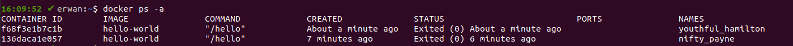
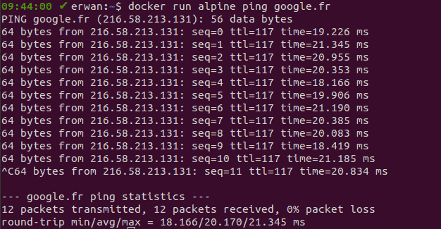
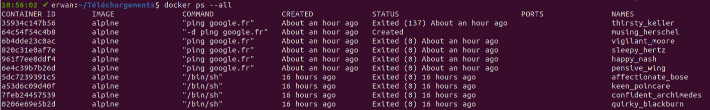
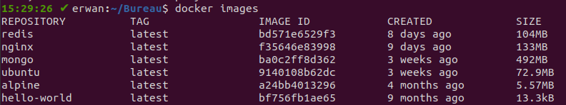
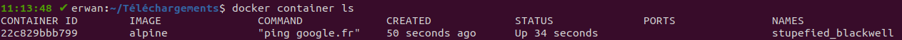

# Découvrir les bases de Docker

### Premier conteneur

#### Lancer son premier conteneur

_Docker_ a un conteneur d'exemple qui permet de voir comment fonctionne le lancement d'un conteneur.

Faites dans un terminal :

```bash
docker run hello-world
```

Il s'agit de notre première commande avec le _CLI Docker_ ! Grâce à cette commande, le client _Docker_ demande au démon _Docker_ d'exécuter un nouveau conteneur à partir de l'image spécifiée.

Vous aurez :

```bash


Unable to find image 'hello-world:latest' locally
latest: Pulling from library/hello-world
0e03bdcc26d7: Pull complete
Digest: 3
sha256:8c5aeeb6a5f3ba4883347d3747a7249f491766ca1caa47e5da5dfcf6b9b717c0
Status: Downloaded newer image for hello-world:latest

Hello from Docker!
This message shows that your installation appears to be working correctly.

To generate this message, Docker took the following steps:
  1. The Docker client contacted the Docker daemon.
  2. The Docker daemon pulled the "hello-world" image from the Docker Hub.
    (amd64)
  3. The Docker daemon created a new container from that image which runs the
    executable that produces the output you are currently reading.
  4. The Docker daemon streamed that output to the Docker client, which sent it
    to your terminal.

To try something more ambitious, you can run an Ubuntu container with:
  $ docker run -it ubuntu bash

Share images, automate workflows, and more with a free Docker ID:
  https://hub.docker.com/

For more examples and ideas, visit:
  https://docs.docker.com/get-started/
```

Nous allons analyser chaque ligne et l'expliquer.

```bash
Unable to find image 'hello-world:latest' locally
```

_Docker_ commence par vérifier si l'image depuis laquelle on veut démarrer un conteneur avec _docker run_ est disponible localement.

Comme c'est la première fois que vous cherchez à utiliser cette image et que _Docker_ ne l'a pas téléchargé depuis _Docker Hub_ il indique qu'il n'arrive pas trouver sur votre machine l'image _hello-world:latest_.

Le _:latest_ est le _tag_ de l'image, c'est-à-dire sa version. Nous y reviendrons en détails.

Sachez que par défaut, si vous ne précisez pas de _tag_ pour une image, _Docker_ téléchargera la dernière version disponible sur le _registry_ (_Docker Hub_), c'est-à-dire la version de l'image correspondant au _tag latest_.

```bash
latest: Pulling from library/hello-world
```

_Docker_ va alors récupérer l'image depuis le _registry_ configuré (qui est _Docker Hub_ par défaut, comme nous l'avons déjà expliqué). Il exécute en fait _docker pull hello-world_ pour vous.

```bash
0e03bdcc26d7: Pull complete
Digest: 3
sha256:8c5aeeb6a5f3ba4883347d3747a7249f491766ca1caa47e5da5dfcf6b9b717c0
```

_Docker_ indique qu'il a fini le téléchargement de l'image (appelé _pull_).

Il fournit ensuite **le _digest_ de l'image téléchargée, qui est son identifiant unique** (il s'agit en fait d'un _hash SHA256_ de la configuration _JSON_ de l'image).

```bash
Status: Downloaded newer image for hello-world:latest
```

_Docker_ indique qu'il a fini le téléchargement et l'extraction de la dernière version (_tag latest_) de l'image _hello-world_.

Enfin, tout le reste est un message affiché par le conteneur et redirigé vers le terminal de la machine hôte. Pour afficher ce message, le démon a créé un conteneur depuis l'image téléchargée et l'a exécuté.

Lors de la création du conteneur, le démon _dockerd_ fait plein de choses : il lui assigne une _IP_ virtuelle sur un réseau privé, il lui assigne un nom aléatoire, il lui crée une couche dans son système de fichiers isolé avec les droits d'écriture etc. Nous y reviendrons plus en détails.

Une fois le conteneur créé, le démon va exécuter la commande précisée dans le fichier de configuration (_Dockerfile_) que nous étudierons dans le prochain chapitre.

Pour ce conteneur, après l'exécution de la commande, le conteneur n'est plus exécuté car il se coupe après avoir affiché le message.

Vous pouvez le vérifier en faisant :

```bash
docker container ls -a
```

Vous verrez dans la colonne _STATUS_, _Exited_ ce qui signifie qu'il n'est plus en cours d'exécution.

Nous étudierons bien sûr en détails cette commande dans le formation.

Vous pouvez également voir que l'image est maintenant disponible localement :

```bash
docker images
```

Vous verrez que vous aurez bien l'image _hello-world_.

### Relancer le conteneur

Que se passe t-il si vous refaites :

```bash
docker run hello-world
```

Vous aurez cette fois-ci directement :

```bash
Hello from Docker!
This message shows that your installation appears to be working correctly.

To generate this message, Docker took the following steps:
  1. The Docker client contacted the Docker daemon.
  2. The Docker daemon pulled the "hello-world" image from the Docker Hub.
    (amd64)
  3. The Docker daemon created a new container from that image which runs the
    executable that produces the output you are currently reading.
  4. The Docker daemon streamed that output to the Docker client, which sent it
    to your terminal.


To try something more ambitious, you can run an Ubuntu container with:
  $ docker run -it ubuntu bash

Share images, automate workflows, and more with a free Docker ID:
  https://hub.docker.com/

For more examples and ideas, visit:
  https://docs.docker.com/get-started/
```

Cela signifie en fait que _Docker_ n'a pas eu besoin de télécharger l'image depuis _Docker Hub_. Il a vu que l'image était disponible localement et a donc pu créer immédiatement un nouveau conteneur à partir de celle-ci.

Il s'agit bien d'un nouveau conteneur et pas du même, vous pouvez le vérifier avec _docker container ls -a_.

Vous aurez ainsi :



## Lancer un conteneur

### La commande `docker run`

La commande `docker run` est en réalité un raccourci notamment pour plusieurs commandes _Docker_ que nous étudierons plus tard : `docker pull image`, `docker container create -d image`, `docker container start ID`, `docker container -a ID`.

Comme nous l'avons vu dans le premier chapitre, un conteneur est un processus en cours d'exécution sur la machine hôte. L'hôte peut être votre machine locale ou un serveur distant, comme nous le verrons plus tard.

#### Comportement par défaut de `docker run image`

**La commande `docker run` va commencer par créer un conteneur,** qui revient à :

- créer un système de fichiers isolé pour le conteneur, ainsi qu'un réseau privé et un arbre des processus isolé.
- créer une couche avec les droits d'écriture activés (_writable container layer_) au-dessus de la couche de l'image en lecture seule.
- exécuter la commande prévue dans l'image en utilisant la configuration par défaut spécifiée. La configuration peut être relative à l'exécution en premier plan ou en arrière plan, à l'identification du conteneur, aux paramètres réseaux et à des limites d'utilisation des ressources (_CPU_, mémoire etc).

Par défaut également, la sortie d'erreur (_STDERR_) et la sortie standard (_STDOUT_) sont attachées à votre terminal pour que vous puissiez voir les flux de sortie de votre conteneur dans votre terminal directement.

Par défaut, c'est comme si vous faisiez en fait :

```bash
docker run -a stdin -a stdout image
```

Nous allons commencer par démarrer un conteneur en tâche de fond, par exemple l'image officielle de _redis_ qui est la base de données clé / valeur la plus utilisée :

```bash
docker run redis
```

Ici l'image officielle prévoit notamment que par défaut le processus _redis-server_ tourne en premier plan sur le port _6379_.

Vous pouvez constater que nous avons :

```bash
1:C 22 Oct 2020 12:36:12.762 # oO0OoO0OoO0Oo Redis is starting oO0OoO0OoO0Oo
1:C 22 Oct 2020 12:36:12.762 # Redis version=6.0.8, bits=64, commit=00000000, modified=0, pid=1, just started
1:C 22 Oct 2020 12:36:12.762 # Warning: no config file specified, using the default config. In order to specify a config file use redis-server /path/to/redis.conf
1:M 22 Oct 2020 12:36:12.765 * Running mode=standalone, port=6379.
1:M 22 Oct 2020 12:36:12.765 # Server initialized
1:M 22 Oct 2020 12:36:12.765 # WARNING overcommit_memory is set to 0! Background save may fail under low memory condition. To fix this issue add 'vm.overcommit_memory = 1' to /etc/sysctl.conf and then reboot or run the command 'sysctl vm.overcommit_memory=1' for this to take effect.
1:M 22 Oct 2020 12:36:12.765 * Ready to accept connections
```

Puis que nous gardons la main car le processus est lancé par défaut en mode interactif.

Vous pouvez ainsi quitter avec _Ctrl + C_.

Relancez maintenant un nouveau conteneur mais cette fois-ci avec une option qui va permettre de lancer le processus en arrière-plan :

```bash
docker run -d redis
```

Nous verrons bien sûr cette option dans une prochaine leçon. Mais ce qu'il est important de retenir c'est que **les images ont des configurations par défaut qu'il est possible de modifier en passant des option.**

Ici, le processus n'est plus interactif mais en arrière plan :

```
9e38f6e910342adb6dd91ba916cef79e5b71252d509818f1e86a615d5705b751
```

#### L'option -i de docker run

Nous allons voir une première option `--interactive` ou `-i` qui permet de garder l'entrée standard ouverte même si le processus est lancé par défaut en arrière plan ou qu'il ne démarre pas de service et donc quitte immédiatement.

Pour ce faire, nous allons utiliser l'image officielle d'_Alpine_.

La distribution _Alpine Linux_ est une distribution _GNU/Linux_ extrêmement légère. Il n'y a que très peu de programmes installés. Par exemple, la distribution n'a pas _bash_ comme _shell_ installé par défaut mais uniquement _sh_.

Grâce à cela, l'image officielle d'_Alpine_ disponible sur _Docker Hub_ fait uniquement _5.57 MB_ décompressée (à comparer avec environ _80 MB_ pour _Ubuntu_).

Pour rappel, _Docker Hub_ est le _registry_ officiel _Docker_, il s'agit d'une bibliothèque contenant des images officielles publiques, ainsi que des projets publics ou privés. Vous pouvez le voir comme le "Github / Gitlab des images".

Lançons d'abord _alpine_ en mode par défaut donc non interactif :

```bash
docker run alpine
```

Si vous faites _docker container ls_ vous pouvez voir que le conteneur n'est pas en cours d'exécution. La raison est que l'image n'exécute aucun service par défaut, aussi il n'y a rien à exécuter et le conteneur, qui rappelons-le encore est un processus, s'arrête.

Faites maintenant :

```bash
docker run -i alpine
```

Cette fois vous êtes en mode interactif et vous pouvez entrer des commandes :

```bash
ls
```

La commande listera les fichiers et les dossiers du conteneur.

Quittez ensuite le conteneur avec _CTRL + C_ car vous êtes en mode interactif.

#### L'option `-t` de `docker run`

**L'option `--tty` ou `-t` permet de démarrer un _pseudo-TTY_ (c'est-à-dire un terminal) et de l'allouer au conteneur.**

Essayez de faire :

```bash
docker run -it alpine
```

Cette fois-ci vous avez un terminal connecté à un _shell sh_ en mode interactif.

Vous avez maintenant un prompt :

```bash
/ #
```

Nous verrons plus tard que la commande lancée par défaut par l'image _alpine_ est _/bin/sh_ et c'est pour cette raison que vous avez _sh_ en mode interactif.

Cela revient en fait à faire :

```bash
docker run -it alpine sh
```

#### Petit exercice

Nous allons maintenant faire un petit test du mode interactif. Notre but va être d'installer _curl_ et _bash_ dans un conteneur basé sur une image _alpine_ en mode interactif.

Nous commençons donc par lancer le conteneur avec un _TTY_ en mode interactif :

```bash
docker run -it alpine
```

Nous allons ensuite mettre à jour les paquets avec le gestionnaire de paquets d'_Alpine_, _APK_ (équivalent à _APT_ pour les systèmes _Debian_) :

```bash
apk update
```

Nous installons ensuite _bash_ :

```bash
apk add bash
```

Nous pouvons maintenant le lancer :

```bash
bash
```

Nous vérifions que nous utilisons bien le _shell bash_ :

```bash
echo $0
```

Nous avons bien _/bin/bash_.

### Démarrer en mode _background_ ou _foreground_

Vous pouvez créer et démarrer un conteneur au premier plan (_foreground_) ou un conteneur en mode détaché, en arrière plan (_background_).

#### Démarrer en mode _foreground_

Par défaut, avec la commande `run` le conteneur est exécuté au premier plan. Par exemple, faites :

```bash
docker run alpine ping google.fr
```

Ici cela va créer et démarrer un conteneur _alpine_ et lui demander d'exécuter la commande `ping google.fr`.

Cette commande permet d'envoyer des paquets à intervalle de temps régulier à http://www.google.fr pour obtenir des statistiques réseau.

Vous verrez que dans ce cas, **les sorties standard et d'erreur et l'entrée standard du conteneur sont liées à votre terminal :**



Vous remarquez que la sortie standard du conteneur est liée à votre terminal car les retours sont affichés dans votre terminal (sur la machine hôte).

Vous remarquez également que vous pouvez envoyer un _SIGINT_ avec _Ctrl + C_ et que cela fonctionne car l'entrée standard du conteneur est liée à celle de votre terminal également.

#### Démarrer en mode _background_

Maintenant, nous allons démarrer un conteneur à partir de la même image mais en mode _background_.

Il faut alors utiliser l'option `-d` ou `--detach`.

```bash
docker run -d alpine ping google.fr
```

Cette fois-ci le conteneur est exécuté en arrière plan, vous ne pouvez plus rien faire car vous ne l'avez pas lancé en mode interactif.

Le conteneur continue à envoyer toutes les requêtes mais en arrière plan.

Vous obtenez uniquement l'_ID_ du conteneur dont vous avez lancé l'exécution en arrière-plan, par exemple :

```
35934c147b56911427c4dd9f6e7e3a08a0a822bd938033df3e489620e2f2f1e8
```

Nous apprendrons bien sûr dans les leçons suivantes à arrêter et supprimer les conteneurs. Ne vous inquiétez pas !

Mais vous pouvez déjà afficher toute la sortie standard de votre conteneur avec la commande `docker logs`, que nous reverrons.

Il faut passer à la commande le nom ou l'_ID_ d'un conteneur, par exemple :

```bash
docker logs 35934c147b56911427c4dd9f6e7e3a08a0a822bd938033df3e489620e2f2f1e8
```

Vous aurez alors :

```bash
PING google.fr (216.58.213.67): 56 data bytes
64 bytes from 216.58.213.67: seq=0 ttl=116 time=18.703 ms
64 bytes from 216.58.213.67: seq=1 ttl=116 time=17.098 ms
64 bytes from 216.58.213.67: seq=2 ttl=116 time=17.410 ms
64 bytes from 216.58.213.67: seq=3 ttl=116 time=17.941 ms
64 bytes from 216.58.213.67: seq=4 ttl=116 time=17.801 ms
64 bytes from 216.58.213.67: seq=5 ttl=116 time=17.795 ms
64 bytes from 216.58.213.67: seq=6 ttl=116 time=18.211 ms
64 bytes from 216.58.213.67: seq=7 ttl=116 time=18.084 ms
64 bytes from 216.58.213.67: seq=8 ttl=116 time=18.547 ms
64 bytes from 216.58.213.67: seq=9 ttl=116 time=18.518 ms
64 bytes from 216.58.213.67: seq=10 ttl=116 time=18.346 ms
64 bytes from 216.58.213.67: seq=11 ttl=116 time=16.750 ms
64 bytes from 216.58.213.67: seq=12 ttl=116 time=17.499 ms
64 bytes from 216.58.213.67: seq=13 ttl=116 time=18.773 ms
64 bytes from 216.58.213.67: seq=14 ttl=116 time=22.429 ms
64 bytes from 216.58.213.67: seq=15 ttl=116 time=21.544 ms
64 bytes from 216.58.213.67: seq=16 ttl=116 time=18.390 ms
64 bytes from 216.58.213.67: seq=17 ttl=116 time=20.201 ms
```

## Obtenir de l'aide, lister et supprimer des images et des conteneurs

### Structure des commandes et obtenir de l'aide

Entrez simplement :

```bash
docker
```

Qui lance en fait `docker help`.

Vous aurez alors la liste des commandes de base sous _Commands_, qui ont cette syntaxe :

```bash
docker commands [...options]
```

Un exemple est `docker ps -a` qui permet de lister tous les conteneurs.

Vous aurez également la liste des commandes de gestion par sujet qui sont appelées _Management Commands_. Leur syntaxe est :

```bash
docker commande sous-command [...options]
```

Un exemple est `docker container ls -a` qui permet de lister tous les conteneurs.

**Vous remarquerez que plusieurs commandes sont en doublons, comme par exemple _docker ps_ et _docker container ls_.**

La raison est historique, à mesure que _Docker_ s'est complexifié et que le nombre de commandes du _CLI_ a explosé, les commandes ont étés divisées en groupes pour plus de clarté.

Certaines commandes, parmi les plus utilisées sont maintenues (du moins pour l'instant) en commande de base car plus rapides.

Nous vous recommandons d'utiliser d'abord les commandes au format long pour vous y habituer avant de passer aux commandes raccourcies.

**Pour obtenir de l'aide sur une commande spécifique , il suffit d'utiliser l'option `--help` :**

```bash
docker container ls --help
```

Vous aurez alors le détail de la commande avec toutes les options :

```bash
Usage:	docker container ls [OPTIONS]

List containers

Aliases:
  ls, ps, list

Options:
  -a, --all             Show all containers (default shows just running)
  -f, --filter filter   Filter output based on conditions provided
      --format string   Pretty-print containers using a Go template
  -n, --last int        Show n last created containers (includes all
                        states) (default -1)
  -l, --latest          Show the latest created container (includes all
                        states)
      --no-trunc        Don't truncate output
  -q, --quiet           Only display numeric IDs
  -s, --size            Display total file sizes
```

### Lister les conteneurs et les images

Il est très utile de pouvoir lister les conteneurs et les images afin de savoir l'état de votre environnement _Docker_.

#### Lister les conteneurs

Pour lister les conteneurs **en cours d'exécution** vous pouvez utiliser deux commandes :

```bash
docker container ls
```

Et un alias qui est :

```bash
docker ps
```

Pour lister tous les conteneurs, y compris ceux qui sont seulement créés ou qui ne sont plus en cours d'exécution (_exited_). Il faut utiliser l'option `-a` ou `--all`.

```bash
docker container ls -a
```

Ou :

```bash
docker ps -a
```

Vous obtiendrez alors quelque chose comme :



Vous retrouverez le début de l'_ID_ des conteneurs, l'image utilisée, la commande lancée lors de l'exécution du conteneur, la date de création du conteneur, son statut, les ports (que nous verrons dans un prochain chapitre) et enfin un nom aléatoire généré par _Docker_ pour pouvoir faciliter l'utilisation des commandes du _CLI_.

#### Lister les images

Pour lister les images locales vous pouvez utiliser deux commandes :

```bash
docker images
```

Ou :

```bash
docker image ls
```

Ce qui peut donner par exemple :



Vous retrouverez le nom de l'image, son _tag_ (version), son _ID_, la date de création de l'image et la taille décompressée.

Le plus souvent, vous listerez les images suivant les versions comme nous le verrons, par exemple vous pourrez lister toutes les versions des images de _MongoDB_ que vous avez localement en faisant :

```bash
docker image ls mongo
```

### Supprimer un ou plusieurs containers

#### Supprimer un conteneur arrêté

Pour supprimer un conteneur qui n'est pas en cours d'exécution (avec le statut _UP_) vous pouvez faire :

```bash
docker container rm NOM_OU_ID
```

Mais si le conteneur est en cours d'exécution vous aurez un message d'erreur.

Lancez un conteneur en arrière-plan avec le nom _redis_ :

```bash
docker run --name redis -d redis
```

Essayez de le supprimer :

```bash
docker container rm redis
```

Vous aurez le message d'erreur suivant :

```bash
Error response from daemon: You cannot remove a running container 15e7ada9de7cc51ad6656f3f245672d9a18059083264165b9a60078ef941791c. Stop the container before attempting removal or force remove
```

Le démon _Docker_ indique qu'il faut couper le conteneur avant de le supprimer.

#### Supprimer un conteneur en cours d'exécution

Vous pouvez **forcer la suppression avec l'option `--force` ou `-f` :**

```bash
docker container rm -f redis
```

**Vous pouvez aussi supprimer plusieurs conteneurs d'un coup en passant leur ID ou leur nom en arguments.**

Par exemple, lancez trois conteneurs :

```bash
docker run --name redis1 -d redis
docker run --name redis2 -d redis
docker run --name redis3 -d redis
```

Puis supprimez les :

```bash
docker container rm -f redis1 redis2 redis3
```

Vérifiez que les conteneurs sont bien supprimés en faisant :

```bash
docker container ls
```

#### Supprimer tous les conteneurs arrêtés

Pour supprimer tous les conteneurs arrêtés vous pouvez directement faire :

```bash
docker container prune
```

Vous aurez alors un message de confirmation :

```bash
WARNING! This will remove all stopped containers.
Are you sure you want to continue? [y/N]
```

Il faut entrer `y` puis la touche `Entrée` pour confirmer.

Vous aurez ensuite la liste de tous les _ID_ des conteneurs supprimés ainsi que la place récupérée.

La mémoire disque récupérée est souvent faible grâce au mécanisme des couches superposées (système de fichiers _UnionFS_ que nous avons vu dans le premier chapitre).

En effet, un conteneur utilise la couche de l'image en lecture seule et ajoute une couche en écriture par dessus, seule cette couche est supprimée lorsque vous supprimez le conteneur.

### Supprimer une ou plusieurs images

#### Supprimer une ou plusieurs images sans conteneur en cours d'exécution

Vous pouvez supprimer une image avec la commande :

```bash
docker image rm NOM_OU_ID
```

Par exemple :

```bash
docker image rm alpine
```

Supprimera les images _alpine_ présentes.

Vous pouvez bien sûr passer plusieurs noms ou _ID_ d'images à supprimer :

```bash
docker image rm alpine nginx
```

#### Supprimer une ou plusieurs images avec un conteneur en cours d'exécution

Lancez un conteneur en arrière plan :

```bash
docker run --name redis -d redis
```

Essayez ensuite de le supprimer :

```bash
docker image rm redis
```

Vous aurez l'erreur suivante :

```bash
Error response from daemon: conflict: unable to remove repository reference "redis" (must force) - container d6f1d731d932 is using its referenced image bd571e6529f3
```

**Il n'est pas possible de supprimer une image qui est utilisée par un conteneur en cours d'exécution.**

Vous pouvez **forcer la suppression avec l'option `--force` ou `-f` :**

```bash
docker image rm -f redis
```

Dans ce cas, l'image n'est pas supprimée mais elle n'est plus suivie (sa version, _tag_, est supprimé, et elle n'est plus liée au _repository_, c'est-à-dire au serveur dont elle provient). Autrement dit, elle devient _dangling_.

Vous pouvez le voir en faisant :

```bash
docker images
```

Vous aurez :

```bash
REPOSITORY          TAG                 IMAGE ID            CREATED             SIZE
<none>              <none>              bd571e6529f3        8 days ago          104MB
```

#### Supprimer une image _dangling_

Les images _dangling_ sont les images qui ne sont pas versionnées par un _tag_.

Pour supprimer les images _dangling_ et **qui ne sont pas utilisées par un conteneur en cours d'exécution**, il suffit de faire :

```bash
docker image prune
```

#### Supprimer toutes les images locales

**Pour supprimer l'ensemble des images locales qui n'ont pas de conteneur en cours d'exécution associé il faut utiliser l'option `-a` :**

```bash
docker image prune -a
```

Vous aurez le message de confirmation suivant :

```bash
WARNING! This will remove all images without at least one container associated to them.
Are you sure you want to continue? [y/N]
```

### Tout supprimer

Pour supprimer :

- tous les conteneurs qui ne sont pas en cours d'exécution
- tous les réseaux qui ne sont pas utilisés par au moins un conteneur en cours d'exécution
- toutes les images _dangling_ qui ne sont pas taguées et qui ne sont pas utilisées par au moins un conteneur en cours d'exécution
- tous les caches utilisés pour la création d'images Docker.

Il suffit de faire :

```bash
docker system prune
```

Pour en plus supprimer les images qui sont _taguées_, donc toutes les images sauf celles utilisées par un conteneur en cours d'exécution, vous pouvez utiliser l'option `--all` ou `-a` :

```bash
docker system prune -a
```

## Le cycle de vie d'un conteneur

### Créer un conteneur sans l'exécuter

Nous avons vu que `docker run image` permettait de réaliser un ensemble d'actions et notamment de créer un conteneur en mode détaché (arrière-plan).

**La commande `docker container create` permet de créer un conteneur mais de ne pas l'exécuter.**

C'est utile lorsque vous souhaitez créer un conteneur avec une configuration spécifique et le démarrer lorsque vous en aurez besoin.

Le statut initial d'un conteneur créé avec cette commande est _CREATED_.

Faites par exemple :

```bash
docker container create alpine
```

Puis faites `docker container ls -a`. Vous verrez que le conteneur a le statut _Created_.

Lorsque vous faites cette commande, l'_ID_ du conteneur est affiché pour que vous puissiez le démarrer lorsque vous en avez besoin.

La commande vous affichera ainsi quelque chose comme :

```
25ce86f0edead3d3eeece53ae8f31225648b7fbbe94d8a7d539988bfbf6e386f
```

Par exemple, pour une configuration basique, vous pouvez créer un conteneur en mode interactif auquel un _TTY_ sera rattaché et avec le nom "alpine1" :

```bash
docker container create --name alpine1 -it  alpine
```

### Exécuter un conteneur avec `docker container start`

Vous pouvez ensuite démarrer un conteneur créé quand vous le souhaitez avec `docker container start`.

Si le conteneur n'est pas interactif et n'est pas relié à un terminal, le containeur quittera comme si vous aviez fait `docker run alpine`.

Par contre, si vous aviez créer le conteneur avec les options `-it`, le conteneur est alors interactif, vous pouvez le lancer avec l'option `-a` pour l'attacher à votre terminal :

```bash
docker container start -a alpine1
```

Quelques explications s'imposent.

Premièrement, _start_ ne peut pas changer les options ou la commande définies lors de la création. Si le conteneur n'est pas relié à un _TTY_ et qu'il n'est pas interactif vous ne pourrez pas le changer.

Ainsi si vous faites :

```bash
docker container create --name alpine2  alpine
```

Et que vous essayez d'avoir un terminal interactif :

```bash
docker container start -ai alpine2
```

Cela ne fonctionnera pas !

Par contre, si vous faites la même chose avec un conteneur qui avait été créé avec les options `-it` vous pourrez faire :

```bash
docker container start -ai alpine1
```

**L'option `-a` pour `--attach` permet d'attacher la sortie standard (_STDOUT_) et la sortie d'erreur (_STDERR_) à votre terminal.** Autrement dit, cela permet d'afficher les flux de sortie de votre conteneur dans votre terminal comme si vous étiez dans le conteneur.

**L'option `-i` pour `--interactive` permet d'attacher l'entrée standard (_STDIN_) de votre terminal au conteneur.** Autrement dit, cela permet de taper des commandes dans votre terminal comme si vous étiez dans le conteneur.

A noter que `docker start -ai` revient à utiliser les commandes suivantes :

```bash
docker start alpine1
docker attach alpine1
```

En effet, cette commande permet d'attacher les trois flux d'un conteneur (_STDIN_, _STDOUT_ et _STDERR_) au terminal.

### Stopper un conteneur en cours d'exécution avec `docker container stop`

Nous allons recréer un conteneur en utilisant l'image _alpine_ et qui va exécuter la commande `ping google.fr` :

```bash
docker container create alpine ping google.fr
```

Nous allons ensuite le démarrer en utilisant son _ID_ :

```bash
docker container start 22c829bbb7990ccab66efaaf56bbdf3bd79ef90854a2ff6cce8db5f62a7b9922
```

Il faut bien sûr remplacer par l'_ID_ qui vous a été fourni.

Ensuite, nous allons lister tous les conteneurs en cours d'exécutions :

```bash
docker container ls
```

Vous aurez alors :



_Vous pourriez en voir deux si vous aviez démarrer l'autre conteneur dans une leçon précédente._

Vous voyez que le statut du conteneur est _UP_ donc en cours d'exécution.

Vous pouvez d'ailleurs vérifier les logs du conteneur :

```bash
docker container logs stupefied_blackwell
```

#### Stopper un conteneur avec un _SIGTERM_

Nous allons le stopper en utilisant la commande **`docker container stop` ou l'alias `docker stop`**.

La commande accepte soit l'_ID_ soit le nom du conteneur :

```bash
docker container stop stupefied_blackwell
```

Notez que vous pouvez utiliser la touche tabulation pour obtenir l'autocomplétion après avoir entré le début du nom du conteneur, c'est beaucoup plus rapide !

Le conteneur va mettre plusieurs secondes à se couper et il vous sera retourné son nom, dans notre exemple :

```bash
stupefied_blackwell
```

En fait, `docker container stop` envoie un _SIGTERM_ pour laisser au conteneur le temps d'effectuer des éventuelles tâches de nettoyage / sauvegarde avant de se couper.

Si au bout de quelques secondes le conteneur est toujours en cours d'exécution, le démon envoie alors un _SIGKILL_ au conteneur pour forcer son interruption.

Ici c'est le cas car la commande _ping_ n'a pas de code permettant de répondre à un _SIGTERM_.

> _Si vous n'êtes pas à l'aise avec ces notions, nous vous conseillons de vous tourner vers le cours **Linux**._

#### Stopper un conteneur avec un _SIGKILL_

Nous pouvons également forcer l'exécution du conteneur en cours d'exécution immédiatement en envoyant un _SIGKILL_ avec la commande `docker container kill` ou l'alias `docker kill`.

Nous allons recréer un conteneur en arrière plan :

```bash
docker run -d alpine ping google.fr
```

Puis nous allons le _kill_ immédiatement avec la commande `docker container kill` :

```bash
docker container kill 7d99
```

Notez que vous pouvez taper que le début de l'_ID_ du conteneur tant que celui-ci est discriminant (à savoir qu'aucun autre objet _Docker_ commence par le même début).

Ne vous inquiétez pas, si le début de l'_ID_ n'est pas discriminant vous aurez une erreur qui vous préviendra :

```bash
Error response from daemon: Cannot kill container: 4: Multiple IDs found with provided prefix: 4
```

Il suffira alors de rentrer quelques caractères de plus.

#### Stopper tous les conteneurs en cours d'exécution

Pour stopper tous les conteneurs en cours d'exécution vous pouvez faire :

```bash
docker stop $(docker ps -aq)
```

Si vous avez fait le cours _Linux_ cette commande est triviale. Sinon voici quelques explications :

**$()** est une substitution de commande qui va exécuter la commande entre les parenthèses et la remplacer avec le résultat avant d'exécuter la `commande docker stop`.

`docker ps -aq` ou `docker container ls -aq` permettent de lister tous les _ID_ des conteneurs.

Nous passons donc la liste des _ID_ de tous les conteneurs à la commande `docker stop` qui va pouvoir stopper tous les conteneurs en cours d'exécution.

### Petit exercice

Maintenant que vous connaissez pas mal de choses nous allons faire un petit exercice.

L'objectif est de démarrer trois conteneurs basés respectivement sur les images officielles de _MongoDB_, _redis_ et _postgreSQL_.

Ces conteneurs doivent être démarrés en arrière-plan et avec les noms _mongo_, _redis_ et _postgre_.

Pour commencer, recherchez le nom des images sur _Docker Hub_.

Une fois toutes les images lancées, vérifiez bien que les conteneurs sont en cours d'exécution.

Ensuite coupez tous les conteneurs et supprimez toutes les images.

Voici la solution. Nous commençons par lancer toutes les images en arrière plan :

```bash
docker run -d --name mongo mongo
docker run -d --name redis redis
docker run -d --name postgres postgres
```

Ensuite, nous allons vérifier que tous les conteneurs sont bien en cours d'exécution :

```bash
docker container ls
```

Nous remarquons que nous n'avons que _mongo_ et _redis_ qui sont en cours d'exécution. Il faut alors comprendre pourquoi _postgres_ ne fonctionne pas. C'est le moment d'utiliser `docker logs` !

```bash
docker logs postgres
```

Nous avons l'erreur suivante :

```bash
Error: Database is uninitialized and superuser password is not specified.
        You must specify POSTGRES_PASSWORD to a non-empty value for the
        superuser. For example, "-e POSTGRES_PASSWORD=password" on "docker run".

        You may also use "POSTGRES_HOST_AUTH_METHOD=trust" to allow all
        connections without a password. This is *not* recommended.

        See PostgreSQL documentation about "trust":
        https://www.postgresql.org/docs/current/auth-trust.html
```

L'erreur nous indique que sommes obligé de passer une option lors de la création pour définir un mot de passe ou accepter les connexions sans mot de passe à la base de données.

Comme c'est un exercice nous allons utiliser le mode non recommandé sans mot de passe. Nous allons donc supprimer l'ancien conteneur arrêté et en redémarrer un avec l'option :

```bash
docker container prune
```

Nous validons, puis :

```bash
docker container run --name postgres -d -e POSTGRES_HOST_AUTH_METHOD=trust postgres
```

L'option `-e` que nous n'avions pas encore vue permet de définir **une variable d'environnement pour le conteneur.** Nous reverrons souvent cette option.

Nous vérifions que cette fois-ci les conteneurs sont bien lancés :

```bash
docker container ls
```

Il ne nous reste plus qu'à les stopper :

```bash
docker container stop $(docker container ls -aq)
```

Puis à tout supprimer :

```bash
docker system prune -a
```

## Docker pause, unpause, rename et exec

### Renommer un conteneur

Nous avons vu qu'il est possible de passer un nom lors de la création d'un conteneur avec `docker container create` ou `docker container run` en utilisant l'option `--name`.

Après la création d'un conteneur, il reste possible de changer de nom en utilisant la commande `docker container rename`.

```bash
docker container rename CONTENEUR NOUVEAU_NOM
```

Pour cibler le conteneur à renommer vous pouvez comme d'habitude utiliser le nom ou l'_ID_ de celui-ci.

### Mettre en pause et reprendre les processus dans d'un conteneur

La commande `docker container pause` permet de suspendre tous les processus d'un ou de plusieurs conteneurs spécifiés.

Il utilise en fait la fonctionnalité du noyau _Linux_ des _freezer cgroup_ qui permet de suspendre les processus sans envoyer de signaux (_SIGSTOP_). Cela permet en fait que les processus ne puissent pas réagir car aucun signal n'est envoyé et de les "geler".

Ainsi, il est possible de mettre en pause et de reprendre n'importe quel processus.

Pour reprendre les processus d'un ou plusieurs conteneurs _Docker_ il suffit ensuite d'utiliser `docker container unpause`.

Mettre en pause des conteneurs est utile dans de rares cas : par exemple si vous voulez mettre en pause des conteneurs trop gourmands en ressource sur certains serveurs le temps d'un pic de charge.

### Exécuter des commandes dans des conteneurs en cours d'exécution

**Pour exécuter des commandes dans des conteneurs en cours d'exécution il faut utiliser la commande `docker container exec`.**

La commande `docker container exec` n'exécute la commande passée en argument que tant que le premier processus du conteneur (avec le _PID 1_) est en cours d'exécution.

Vous pouvez passez également l'option `--detach` ou `-d` pour exécuter la nouvelle commande en arrière plan.

Vous pouvez également utiliser les options `--interactive` ou `-i` et `--tty` ou `-t` que nous avons déjà vues.

Prenons un exemple : nous allons commencer par démarrer un conteneur _redis_ en arrière-plan avec le nom _redis_ :

```bash
docker run -d --name redis redis
```

Nous allons ensuite exécuter le _CLI_ de _redis_ à l'intérieur du conteneur :

```bash
docker exec -it redis redis-cli
```

Nous pouvons ensuite taper une ou deux commandes redis qui fonctionneront :

```bash
set cle 42
get cle
```

### Obtenir un _shell_ dans n'importe quel conteneur en cours d'exécution

Pour obtenir un terminal connecté à un _shell_ dans n'importe quel conteneur vous pouvez utiliser :

```bash
docker exec -it redis bash
```

Si jamais _bash_ n'est pas installé dans le conteneur, par exemple avec _alpine_ vous pouvez bien sûr utiliser _sh_ à la place :

```bash
docker exec -it redis sh
```

### Chemins sur Windows avec GitBash

Si vous utilisez _GitBash_ sur _Windows_, _Git Bash_ tente de convertir les chemins de fichiers _POSIX_ (comme _/app_) en chemins de fichiers _Windows_.

Ainsi, dans l'exemple de la vidéo, si vous utilisez _/app_, _Git Bash_ va essayer de convertir _/app_ en *C:/Program Files/Git/app *ce qui ne fonctionnera pas. Il faut donc faire :

```bash
docker container exec test mkdir //app
```

Pensez-y si vous rencontrez d'autres problèmes de chemins.

## Copier des fichiers et inspecter un conteneur

### Copier des fichiers depuis ou vers un conteneur

**Pour copier des fichiers et des dossiers entre un conteneur et le système de fichiers de la machine hôte, il existe la commande `docker container cp`.**

La syntaxe est la suivante :

```bash
docker cp SOURCE DESTINATION
```

**Si vous voulez copier dans le sens hôte -> conteneur :**

```bash
docker cp CHEMIN_SOURCE CONTENEUR:CHEMIN_DESTINATION
```

Par exemple :

```bash
docker cp ./test conteneur1:/home/jean
```

Le conteneur peut comme d'habitude être désigné par son nom ou son _ID_.

Notez bien que les deux points permettent de séparer la désignation du conteneur et le chemin source ou de destination sur celui-ci.

**Si vous voulez copier dans le sens conteneur -> hôte :**

```bash
docker cp CONTENEUR:CHEMIN_SOURCE CHEMIN_DESTINATION
```

Exemple :

```bash
docker cp conteneur1:/home/jean ./test
```

**A noter que le conteneur peut être en cours d'exécution (_UP_), en pause ou stoppé.**

**Attention ! La commande considère les chemins du conteneur comme étant absolu.** Cela signifie que _dossierx/fichiery_ est interprété comme _/dossierx/fichiery_. Nous vous conseillons cependant d'utiliser que des chemins absolus pour plus de clarté.

En revanche, les chemins sur la machine hôte peuvent être relatifs ou absolus.

### Inspecter les changements dans le système de fichiers d'un conteneur

Vous pouvez vérifier les fichiers qui ont été modifiés dans un conteneur en faisant :

```bash
docker container diff CONTENEUR
```

La lettre `A` signifie qu'un fichier ou un dossier a été ajouté.

La lettre `D` signifie qu'un fichier ou un dossier a été supprimé.

La lettre `C` signifie qu'un fichier ou un dossier a été modifié.

Si vous avez toujours le conteneur _redis_ vous pouvez donc faire :

```bash
docker container diff redis
```

Vous aurez par exemple :

```bash
C /root
A /root/.rediscli_history
A /root/.bash_history
```

### Inspecter les processus dans un conteneur en cours d'exécution

Comme nous le savons, les processus dans un conteneur sont isolés. Ils ont leur propre _PID_ dans le conteneur et on ne peut pas voir les processus des autres conteneurs ou ceux de la machine hôte depuis celui-ci.

Vous pouvez le vérifier en utilisant la commande `docker container top` **sur un conteneur en cours d'exécution, pour lister tous les processus d'un conteneur :**

```bash
docker container top redis
```

**Cette commande va lister les processus du conteneur spécifiés du point de vue de la machine hôte.**

Autrement dit, vous aurez le _PID_, le _PPID_, l'utilisateur etc des processus du conteneur sur la machine hôte.

Pour voir la différence, et se placer du point de vue du conteneur, faites :

```bash
docker exec -it redis bash
```

Pour obtenir un _shell bash_. Installez ensuite le programme pour pouvoir utiliser _ps_ pour lister les processus :

```bash
apt update && apt install -y procps
```

Faites ensuite :

```bash
ps -ef
```

Pour lister tous les processus du conteneur. Vous verrez alors que le _PID_ de _redis_ est 1 et qu'il n'a pas de _PPID_. Même chose pour _bash_ qui aura un _PID_ différent.

**Ce qu'il faut retenir de cette démonstration est que l'isolation des conteneurs vaut à l'intérieur de ceux-ci.** Un conteneur, comme nous l'avons déjà dit, ne peut pas voir les processus des autres conteneurs ou de la machine hôte, il est isolé.

### Obtenir toutes les options de configuration d'un conteneur

Pour obtenir toute la configuration d'un conteneur nous pouvons utiliser la commande :

```bash
docker container inspect CONTENEUR
```

Ainsi, par exemple :

```bash
docker container inspect redis
```

Donnera :

```bash
[
    {
        "Id": "d87afef9e736f80d927d21928c3311a6939eb0ff72e97214f4c665cbabec67f0",
        "Created": "2020-10-22T17:11:09.54773927Z",
        "Path": "docker-entrypoint.sh",
        "Args": [
            "redis-server"
        ],
        "State": {
            "Status": "running",
            "Running": true,
            "Paused": false,
            "Restarting": false,
            "OOMKilled": false,
            "Dead": false,
            "Pid": 313214,
            "ExitCode": 0,
            "Error": "",
            "StartedAt": "2020-10-22T17:11:11.633121423Z",
            "FinishedAt": "0001-01-01T00:00:00Z"
        },
        "Image": "sha256:bd571e6529f32461648680c82e2540f9db4b3bb92709ae5d19dd347531c98f19",
        "ResolvConfPath": "/var/lib/docker/containers/d87afef9e736f80d927d21928c3311a6939eb0ff72e97214f4c665cbabec67f0/resolv.conf",
        "HostnamePath": "/var/lib/docker/containers/d87afef9e736f80d927d21928c3311a6939eb0ff72e97214f4c665cbabec67f0/hostname",
        "HostsPath": "/var/lib/docker/containers/d87afef9e736f80d927d21928c3311a6939eb0ff72e97214f4c665cbabec67f0/hosts",
        "LogPath": "/var/lib/docker/containers/d87afef9e736f80d927d21928c3311a6939eb0ff72e97214f4c665cbabec67f0/
        d87afef9e736f80d927d21928c3311a6939eb0ff72e97214f4c665cbabec67f0-json.log",
        "Name": "/redis",
        "RestartCount": 0,
        "Driver": "overlay2",
        "Platform": "linux",
        "MountLabel": "",
        "ProcessLabel": "",
        "AppArmorProfile": "docker-default",
        "ExecIDs": null,
        "HostConfig": {
            "Binds": null,
            "ContainerIDFile": "",
            "LogConfig": {
                "Type": "json-file",
                "Config": {}
            },
            "NetworkMode": "default",
            "PortBindings": {},
            "RestartPolicy": {
                "Name": "no",
                "MaximumRetryCount": 0
            },
            "AutoRemove": false,
            "VolumeDriver": "",
            "VolumesFrom": null,
            "CapAdd": null,
            "CapDrop": null,
            "Capabilities": null,
            "Dns": [],
            "DnsOptions": [],
            "DnsSearch": [],
            "ExtraHosts": null,
            "GroupAdd": null,
            "IpcMode": "private",
            "Cgroup": "",
            "Links": null,
            "OomScoreAdj": 0,
            "PidMode": "",
            "Privileged": false,
            "PublishAllPorts": false,
            "ReadonlyRootfs": false,
            "SecurityOpt": null,
            "UTSMode": "",
            "UsernsMode": "",
            "ShmSize": 67108864,
            "Runtime": "runc",
            "ConsoleSize": [
                0,
                0
            ],
            "Isolation": "",
            "CpuShares": 0,
            "Memory": 0,
            "NanoCpus": 0,
            "CgroupParent": "",
            "BlkioWeight": 0,
            "BlkioWeightDevice": [],
            "BlkioDeviceReadBps": null,
            "BlkioDeviceWriteBps": null,
            "BlkioDeviceReadIOps": null,
            "BlkioDeviceWriteIOps": null,
            "CpuPeriod": 0,
            "CpuQuota": 0,
            "CpuRealtimePeriod": 0,
            "CpuRealtimeRuntime": 0,
            "CpusetCpus": "",
            "CpusetMems": "",
            "Devices": [],
            "DeviceCgroupRules": null,
            "DeviceRequests": null,
            "KernelMemory": 0,
            "KernelMemoryTCP": 0,
            "MemoryReservation": 0,
            "MemorySwap": 0,
            "MemorySwappiness": null,
            "OomKillDisable": false,
            "PidsLimit": null,
            "Ulimits": null,
            "CpuCount": 0,
            "CpuPercent": 0,
            "IOMaximumIOps": 0,
            "IOMaximumBandwidth": 0,
            "MaskedPaths": [
                "/proc/asound",
                "/proc/acpi",
                "/proc/kcore",
                "/proc/keys",
                "/proc/latency_stats",
                "/proc/timer_list",
                "/proc/timer_stats",
                "/proc/sched_debug",
                "/proc/scsi",
                "/sys/firmware"
            ],
            "ReadonlyPaths": [
                "/proc/bus",
                "/proc/fs",
                "/proc/irq",
                "/proc/sys",
                "/proc/sysrq-trigger"
            ]
        },
        "GraphDriver": {
            "Data": {
                "LowerDir": "/var/lib/docker/overlay2/7446b2fabe67a6254e37ffe9ecfaddf558b7af79a2d6772a1f986f20ea53f408-init/
                diff:/var/lib/docker/overlay2/d76f0feb8300628f0c2cb0f3767d940be8c9a99737f4c4b4146e685c1cd2fe3b/diff:
                /var/lib/docker/overlay2/e8f581ddb7c8428adf469eaec7792a057e8df8e85d20a8ecefb8eba42f903026/diff:
                /var/lib/docker/overlay2/21a0d0dfe8ac6e2c231904d9bce7d244d20d10bb08ea279cc07d6f4ebe7ce8b6/diff:
                /var/lib/docker/overlay2/b192eba16ad9e6bd769632e41076c2bc0e25a2df0abad3d2b5c8aac2c37070d0/diff:
                /var/lib/docker/overlay2/0aded6db51a97269ef13a5819d4b7f584e99653c786e45050bdf4a6fefa99b37/diff:
                /var/lib/docker/overlay2/06e13d54a73166c8a1be92e942bdcda89bfbcd9e5e8c5aa3a3dba9679145ae73/diff",
                "MergedDir": "/var/lib/docker/overlay2/7446b2fabe67a6254e37ffe9ecfaddf558b7af79a2d6772a1f986f20ea53f408/merged",
                "UpperDir": "/var/lib/docker/overlay2/7446b2fabe67a6254e37ffe9ecfaddf558b7af79a2d6772a1f986f20ea53f408/diff",
                "WorkDir": "/var/lib/docker/overlay2/7446b2fabe67a6254e37ffe9ecfaddf558b7af79a2d6772a1f986f20ea53f408/work"
            },
            "Name": "overlay2"
        },
        "Mounts": [
            {
                "Type": "volume",
                "Name": "7b8d8c02a87143658420a4686b45fdfe9e9b015e1b76e2dfce9a912ab836784d",
                "Source": "/var/lib/docker/volumes/7b8d8c02a87143658420a4686b45fdfe9e9b015e1b76e2dfce9a912ab836784d/_data",
                "Destination": "/data",
                "Driver": "local",
                "Mode": "",
                "RW": true,
                "Propagation": ""
            }
        ],
        "Config": {
            "Hostname": "d87afef9e736",
            "Domainname": "",
            "User": "",
            "AttachStdin": false,
            "AttachStdout": false,
            "AttachStderr": false,
            "ExposedPorts": {
                "6379/tcp": {}
            },
            "Tty": false,
            "OpenStdin": false,
            "StdinOnce": false,
            "Env": [
                "PATH=/usr/local/sbin:/usr/local/bin:/usr/sbin:/usr/bin:/sbin:/bin",
                "GOSU_VERSION=1.12",
                "REDIS_VERSION=6.0.8",
                "REDIS_DOWNLOAD_URL=http://download.redis.io/releases/redis-6.0.8.tar.gz",
                "REDIS_DOWNLOAD_SHA=04fa1fddc39bd1aecb6739dd5dd73858a3515b427acd1e2947a66dadce868d68"
            ],
            "Cmd": [
                "redis-server"
            ],
            "Image": "redis",
            "Volumes": {
                "/data": {}
            },
            "WorkingDir": "/data",
            "Entrypoint": [
                "docker-entrypoint.sh"
            ],
            "OnBuild": null,
            "Labels": {}
        },
        "NetworkSettings": {
            "Bridge": "",
            "SandboxID": "63f982a7474a923bbb459394c109ae14018867809513c1c80596fed88b9f4070",
            "HairpinMode": false,
            "LinkLocalIPv6Address": "",
            "LinkLocalIPv6PrefixLen": 0,
            "Ports": {
                "6379/tcp": null
            },
            "SandboxKey": "/var/run/docker/netns/63f982a7474a",
            "SecondaryIPAddresses": null,
            "SecondaryIPv6Addresses": null,
            "EndpointID": "c1b4fa9b06e1f4d2e651f8e5321f3606c20b65fcd413b961e43fa2c4025699f0",
            "Gateway": "172.17.0.1",
            "GlobalIPv6Address": "",
            "GlobalIPv6PrefixLen": 0,
            "IPAddress": "172.17.0.2",
            "IPPrefixLen": 16,
            "IPv6Gateway": "",
            "MacAddress": "02:42:ac:11:00:02",
            "Networks": {
                "bridge": {
                    "IPAMConfig": null,
                    "Links": null,
                    "Aliases": null,
                    "NetworkID": "82fa097c5057bc256251d863c033451c430c15c4908fd917a98641a29c6114f4",
                    "EndpointID": "c1b4fa9b06e1f4d2e651f8e5321f3606c20b65fcd413b961e43fa2c4025699f0",
                    "Gateway": "172.17.0.1",
                    "IPAddress": "172.17.0.2",
                    "IPPrefixLen": 16,
                    "IPv6Gateway": "",
                    "GlobalIPv6Address": "",
                    "GlobalIPv6PrefixLen": 0,
                    "MacAddress": "02:42:ac:11:00:02",
                    "DriverOpts": null
                }
            }
        }
    }
]
```

Bien sûr nous verrons les options au fur et à mesure de nos besoins, mais cette commande est à utiliser pour vérifier une option.

### Visualiser l'utilisation des ressources par les conteneurs

Pour visualiser la consommation de toutes les ressources par les conteneurs en cours d'exécution il faut faire :

```bash
docker container stats
```

Vous aurez les informations sur l'utilisation du _CPU_, de la mémoire, sur les transferts entrants et sortants sur son interface réseau (reçus / envoyés), l'utilisation du disque (tout ce qu'il a lu / écrit) et enfin le nombre de processus créés (_PIDS_).

Par exemple :


### Visualiser l'espace disque utilisé

Pour visualiser l'espace disque utilisé sur la machine hôte par les images, les conteneurs et les volumes, vous pouvez faire :

```bash
docker system df
```

Pour avoir le détails pour chaque éléments et non des totaux agrégés utilisez l'option `-v` pour verbose :

```bash
docker system df -v
```

## Récapitulatif et approfondissement

Pour bien avoir en tête le fonctionnement des images avant d'aborder le prochain chapitre sur la création d'images, nous allons revoir quelques éléments et approfondir l'isolation des conteneurs.

### Récapitulatif sur `docker run`

**La commande `docker run` va commencer par créer un conteneur,** qui revient à :

- créer un système de fichiers isolé pour le conteneur, ainsi qu'un réseau privé et un arbre des processus isolé.
- créer une couche avec les droits d'écriture activés (_writable container layer_) au-dessus de la couche de l'image en lecture seule.
- exécuter la commande prévue dans l'image en utilisant la configuration par défaut spécifiée. La configuration peut être relative à l'exécution en premier plan ou en arrière plan, à l'identification du conteneur, aux paramètres réseaux et à des limites d'utilisation des ressources (_CPU_, mémoire etc). Nous verrons justement toutes ces configurations dans le prochain chapitre.

Par défaut également, la sortie d'erreur (_STDERR_) et la sortie standard (_STDOUT_) sont attachées à votre terminal pour que vous puissiez voir les flux de sortie de votre conteneur dans votre terminal directement.

Par défaut, c'est comme si vous faisiez en fait :

```bash
docker run -a stdin -a stdout image
```

### L'isolation des conteneurs

Nous allons faire quelques tests sur des conteneurs pour bien comprendre l'isolation.

#### Tester l'isolation des systèmes de fichiers

Nous allons vérifier l'isolation des systèmes de fichier des conteneurs.

**Nous allons créer deux conteneurs à partir de la même image et vérifier qu'une modification sur le système de fichiers d'un des conteneurs ne modifie ni le système de fichiers de l'autre conteneur, ni celui de la machine hôte.**

Autrement dit, nous allons vérifier l'isolation des conteneurs, du moins la partie système de fichiers !

```bash
docker run -it alpine
```

Puis créez un fichier dans le dossier _home_ :

```bash
touch /home/test
```

Vérifiez que le fichier est présent :

```bash
ls /home
```

Coupez le conteneur :

```bash
exit
```

Relancez un nouveau conteneur :

```bash
docker run -it alpine
```

Vérifiez la présence du fichier :

```bash
ls /home
```

Le fichier "test" n'est plus là !

La raison est simple, c'est que ce ne sont pas les mêmes conteneurs comme nous l'avons vu dans la leçon précédente !

Si vous faites :

```bash
docker ps -a
```

Vous verrez deux conteneurs différents !

#### Le conteneur est juste un processus

Nous allons montrer que contrairement à une machine virtuelle, un conteneur est simplement un processus qui est lancé par _dockerd_ et qui partage le noyau _Linux_ de la machine hôte.

Le test suivant ne fonctionnera que sur une machine hôte _Linux_ car il faudrait se connecter à la _VM Linux_ sur _MacOS_ ou _Windows_ pour exécuter ces commandes.

Nous allons commencer par démarrer un conteneur en tâche de fond, par exemple _redis_ :

```bash
docker run -d redis
```

Grâce à cette commande nous lançons un conteneur utilisant l'image officielle _redis_ de _Docker Hub_ en arrière-plan.

```bash
Unable to find image 'redis:latest' locally
latest: Pulling from library/redis
bb79b6b2107f: Pull complete
1ed3521a5dcb: Pull complete
5999b99cee8f: Pull complete
f99a38f44786: Pull complete
d6fc863042e2: Pull complete
9bd1af4eae13: Pull complete
Digest: sha256:33ca074e6019b451235735772a9c3e7216f014aae8eb0580d7e94834fe23efb3
Status: Downloaded newer image for redis:latest
8f48ca284fffdef055fe1819784b9b78044f475306cd1d21d6aa8a978bd2fec2
```

Vous pouvez vérifier que le conteneur est en cours d'exécution :

```bash
docker container ls
```

Vous verrez que le conteneur basé sur l'image _redis_ est en cours d'exécution.

Nous pouvons vérifier qu'il existe bien un processus lancé sur la machine hôte pour le conteneur en faisant :

```bash
sudo ps -ef | grep redis
```

Vous aurez quelque chose comme :

```bash
redis       1388       1  0 oct.21 ?       00:02:50 /usr/bin/redis-server 127.0.0.1:6379
guest-c+  225973  225956  0 12:39 ?        00:00:00 redis-server *:6379
```

Cela montre bien que nous avons des processus lancés pour le conteneur _redis_ que nous avons démarré sur le système hôte !

Si vous quittez un des processus sur la machine hôte cela coupera le conteneur.

Essayez :

```bash
sudo killall redis-server
```

Puis vous pourrez constater que le conteneur n'est plus en cours d'exécution :

```bash
docker container ls
```

Le conteneur n'est plus listé dans les conteneurs en cours d'exécution !

Cela démontre bien que **les conteneurs _Docker_ sont des processus spéciaux sur le système hôte !** (Ou sur une machine virtuelle _Linux_ dans le cas de _Windows_ et de _MacOS_).
