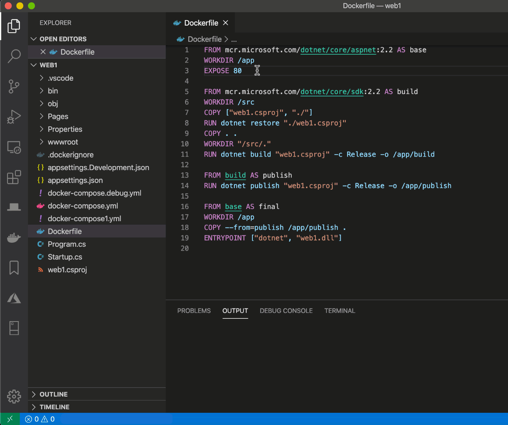

# Créer une image avec un Dockerfile

## Introduction au Dockerfile

### Qu'est-ce qu'un Dockerfile ?

Jusqu'à maintenant nous avons utilisé des images officielles, mais la plupart du temps vous utiliserez vos propres images qui sont configurées pour contenir votre application et toute la configuration dont elle a besoin.

Dans ce chapitre nous allons donc voir comment créer vos images, en commençant par les _Dockerfiles_.

**Un _Dockerfile_ contient les instructions permettant à _Docker_ de construire (_build_) une image automatiquement.**

Ce fichier contient donc toutes les commandes nécessaires à la construction de l'image que vous souhaitez.

Comme nous le verrons un _Dockerfile_ est constituée de trois parties :

**1 - Une image de base.** C'est l'image à partir de laquelle vous allez effectuer les modifications pour créer votre image. Vous n'allez en effet pas créer un système d'exploitation tout seul !

**2 - Les instructions.** Elles sont des commandes Docker permettant de détailler toutes les modifications à apporter à l'image de base pour aboutir à votre image finale, par exemple votre application backend.

**3 - L'action.** C'est la commande qui est exécutée par défaut lorsque l'image sera lancée dans un conteneur.

### Installer l'extension VS Code Docker

**L'extension _VS Code Remote Docker_ est une extension officielle de _Microsoft_ permettant de gérer très simplement les conteneurs depuis _VS Code_ :**



Nous verrons au fur et à mesure du cours ses fonctionnalités. Mais notez déjà l'onglet _Docker_ (baleine remplie de conteneurs) à gauche après l'installation.

Pour l'installer rapidement faites _CTRL + P_ puis entrez :

```bash
ext install ms-azuretools.vscode-docker
```

Vous pouvez également l'installer manuellement en allant dans l'onglet Extensions et en recherchant _docker_.

### Créer notre premier _Dockerfile_

Dans un nouveau dossier, créez un fichier _Dockerfile_. Respectez exactement la casse et n'ajoutez aucune extension.

Dans ce fichier placez le code suivant :

```bash
FROM alpine

RUN apk add --update nodejs

COPY ./app.js /app/

CMD [ "node", "/app/app.js" ]
```

Nous détaillerons bien sûr toutes les instructions dans les leçons suivantes, pour l'instant contentez vous de les copier pour construire votre première image.

Notez que _apk_ est le gestionnaire de paquets de _Alpine_, c'est l'équivalent de _APT_ pour les distributions _Debian_ et donc notamment pour _Ubuntu_.

`apk add` permet d'installer un paquet comme `apt install`.

`apk update` permet de mettre à jour les paquets disponibles, comme `apt update`.

`apk add --update` permet en fait de d'abord faire apk update puis `apk add`. Cela revient à faire `apt update && apt install` sur _Debian_.

Créez également un fichier dans le même dossier, _app.js_, dans lequel vous mettez simplement :

```js
console.log("Bonjour !");
```

Attention à bien mettre le chemin _/app/_ avec un _slash_ à la fin, sinon _Docker_ considérera qu'il s'agit du fichier _app_ et non le dossier _app_ et ne placera pas _app.js_ dans un nouveau dossier _/app_ mais renommera le fichier _app.js_ en _app_.

Attention également à bien utiliser les guillemets doubles et non simples dans _CMD_ car ils permettent d'échapper les slashs (cf formation _Linux_).

### Construire une image

Pour créer une image à partir d'un _Dockerfile_ il faut la _build_. Pour ce faire, il suffit d'utiliser `docker image build CHEMIN`.

Le processus de construction d'une image (_build_) utilise **un _Dockerfile_ et un contexte**.

**Le contexte est l'ensemble des fichiers contenus dans le chemin passé à la commande `docker image build`.** Vous aurez ainsi par exemple lors du _build_ :

```bash
Sending build context to Docker daemon 3.51 MB
```

Cela signifie que les fichiers et les dossier contenus dans le chemin passé en argument à la commande font _3,51 Mo_.

C'est pour cette raison qu'il faut créer le _Dockerfile_ dans le dossier de votre application, ou ici pour tester, dans un dossier à part. Si vous créez votre _Dockerfile_ directement dans le répertoire racine _/_, l'ensemble de votre disque dur est envoyé comme contexte au démon !

**Le _build_ est effectué par le démon _Docker_.**

A supposer que vous êtes dans le dossier qui contient le _Dockerfile_, vous pouvez donc faire :

```bash
docker image build .
```

`.` étant le dossier courant.

Vous aurez alors le résultat suivant :

```bash
Sending build context to Docker daemon 3.072kB
Step 1/4 : FROM alpine
latest: Pulling from library/alpine
188c0c94c7c5: Pull complete
Digest: sha256:c0e9560cda118f9ec63ddefb4a173a2b2a0347082d7dff7dc14272e7841a5b5a
Status: Downloaded newer image for alpine:latest
---> d6e46aa2470d
Step 2/4 : RUN apk add --update nodejs
---> Running in bfa6e6159c03
fetch http://dl-cdn.alpinelinux.org/alpine/v3.12/main/x86_64/APKINDEX.tar.gz
fetch http://dl-cdn.alpinelinux.org/alpine/v3.12/community/x86_64/APKINDEX.tar.gz
(1/8) Installing ca-certificates (20191127-r4)
(2/8) Installing brotli-libs (1.0.9-r1)
(3/8) Installing c-ares (1.16.1-r0)
(4/8) Installing libgcc (9.3.0-r2)
(5/8) Installing nghttp2-libs (1.41.0-r0)
(6/8) Installing libstdc++ (9.3.0-r2)
(7/8) Installing libuv (1.38.1-r0)
(8/8) Installing nodejs (12.18.4-r0)
Executing busybox-1.31.1-r19.trigger
Executing ca-certificates-20191127-r4.trigger
OK: 37 MiB in 22 packages
Removing intermediate container bfa6e6159c03
---> 00f5133d389e
Step 3/4 : COPY ./app.js /app
---> 5985a238bb14
Step 4/4 : CMD [ "node", '/app/app.js' ]
---> Running in 8f3fb48afa08
Removing intermediate container 8f3fb48afa08
---> 526fb4a033d6
Successfully built 526fb4a033d6
```

### Taguer une image

Pour donner un nom à une image, c'est ce qu'on appelle un _taguer_ ou donner un _tag_, il faut utiliser l'option `-t` de la commande _build_.

Nous pouvons par exemple faire :

```bash
docker build -t node:latest .
```

Vous obtiendrez cette fois (après avoir tout nettoyé avec `docker system prune -a`) :

```bash
Sending build context to Docker daemon 3.072kB
Step 1/4 : FROM alpine
latest: Pulling from library/alpine
188c0c94c7c5: Pull complete
Digest: sha256:c0e9560cda118f9ec63ddefb4a173a2b2a0347082d7dff7dc14272e7841a5b5a
Status: Downloaded newer image for alpine:latest
---> d6e46aa2470d
Step 2/4 : RUN apk add --update nodejs
---> Running in bc5c9a4cd53e
fetch http://dl-cdn.alpinelinux.org/alpine/v3.12/main/x86_64/APKINDEX.tar.gz
fetch http://dl-cdn.alpinelinux.org/alpine/v3.12/community/x86_64/APKINDEX.tar.gz
(1/8) Installing ca-certificates (20191127-r4)
(2/8) Installing brotli-libs (1.0.9-r1)
(3/8) Installing c-ares (1.16.1-r0)
(4/8) Installing libgcc (9.3.0-r2)
(5/8) Installing nghttp2-libs (1.41.0-r0)
(6/8) Installing libstdc++ (9.3.0-r2)
(7/8) Installing libuv (1.38.1-r0)
(8/8) Installing nodejs (12.18.4-r0)
Executing busybox-1.31.1-r19.trigger
Executing ca-certificates-20191127-r4.trigger
OK: 37 MiB in 22 packages
Removing intermediate container bc5c9a4cd53e
---> d87483fefe3e
Step 3/4 : COPY ./app.js /app
---> 1f8aef922d23
Step 4/4 : CMD [ "node", '/app/app.js' ]
---> Running in 6af9582dba62
Removing intermediate container 6af9582dba62
---> ae97a4b96431
Successfully built ae97a4b96431
Successfully tagged node:latest
```

### Lister notre image et l'exécuter

Maintenant que nous avons _build_ et tagué notre image, nous pouvons l'afficher en faisant :

```bash
docker image ls
```

Vous verrez le nom de l'image dans la colonne _REPOSITORY_ et le tag dans la colonne _TAG_

Vous pouvez maintenant démarrer un conteneur à partir de votre image en faisant :

```bash
docker run node
```

## Les étapes de la construction d'une image

### Format du Dockerfile

La syntaxe du _Dockerfile_ est la suivante :

```dockerfile
 Commentaire
INSTRUCTION arguments
```

Vous pouvez donc écrire des commentaires en les faisant précéder d'un `#`.

Toutes les instructions, que nous étudierons une par une dans les prochaines leçons, sont en lettres majuscules.

Les arguments sont passés à chaque instruction et peuvent être écrit sur plusieurs lignes pour plus de lisibilité en utilisant des`\` :

```dockerfile
INSTRUCTION argument1 argument2
```

### Fonctionnement du _build_ d'une image

Nous allons maintenant rentrer dans les détails de la construction des images (_build_).

Lorsque le démon _Docker_ exécute chaque instruction, il crée une couche (_layer_) et la sauvegarde dans une nouvelle image si cela est nécessaire.

En effet, pour rappel, **une image _Docker_ est une pile de couches en lecture seule qui représentent les instructions du _Dockerfile_**

**Ces couches superposées comportent uniquement les différences par rapport à la couche précédente.** C'est ce qui les rend légères et performantes.

Reprenons par exemple :

```dockerfile
FROM alpine
RUN apk add --update nodejs
COPY ./app.js /app/
CMD [ "node", "/app/app.js" ]
```

Revoyons les étapes de _build_ :

```bash
Sending build context to Docker daemon  3.072kB
Step 1/4 : FROM alpine
latest: Pulling from library/alpine
188c0c94c7c5: Pull complete
Digest: sha256:c0e9560cda118f9ec63ddefb4a173a2b2a0347082d7dff7dc14272e7841a5b5a
Status: Downloaded newer image for alpine:latest
  ---> d6e46aa2470d
Step 2/4 : RUN apk add --update nodejs
  ---> Running in c1a47e545dcc
fetch http://dl-cdn.alpinelinux.org/alpine/v3.12/main/x86_64/APKINDEX.tar.gz
fetch http://dl-cdn.alpinelinux.org/alpine/v3.12/community/x86_64/APKINDEX.tar.gz
(1/8) Installing ca-certificates (20191127-r4)
(2/8) Installing brotli-libs (1.0.9-r1)
(3/8) Installing c-ares (1.16.1-r0)
(4/8) Installing libgcc (9.3.0-r2)
(5/8) Installing nghttp2-libs (1.41.0-r0)
(6/8) Installing libstdc++ (9.3.0-r2)
(7/8) Installing libuv (1.38.1-r0)
(8/8) Installing nodejs (12.18.4-r0)
Executing busybox-1.31.1-r19.trigger
Executing ca-certificates-20191127-r4.trigger
OK: 37 MiB in 22 packages
Removing intermediate container c1a47e545dcc
  ---> bf558394bb09
Step 3/4 : COPY ./app.js /app/
  ---> a2b4ec016b91
Step 4/4 : CMD [ "node", "/app/app.js" ]
  ---> Running in 40656f21e5d6
Removing intermediate container 40656f21e5d6
  ---> 6c2f2ab1a0e0
Successfully built 6c2f2ab1a0e0
Successfully tagged test:latest
```

L'instruction `FROM` crée une couche qui a pour _hash d6e46aa2470d_ contenant l'image de base _alpine:latest_.

Ensuite, un conteneur intermédiaire est créé à partir de cette image de base pour exécuter l'installation de _nodejs_. Ce conteneur a accès à une couche avec les droits d'écriture afin d'effectuer les modifications spécifiées par l'instruction (ici l'installation de _Node_). Une fois l'installation terminée, le conteneur est supprimé et une capture des différences sur le système de fichiers avec l'image précédente est sauvegardée dans une image dont le _hash_ est _bf558394bb09_.

Puis, depuis la nouvelle image le démon copie le contenu du contexte sur la machine hôte avec le chemin _./app.js_ dans _/app/_. Il n'a pas besoin d'exécuter de conteneur intermédiaire car il n'y a rien à exécuter, il suffit d'ajouter les nouveaux fichiers et de sauvegarder les différences dans une nouvelle image avec le _hash a2b4ec016b91_.

Enfin, il ajoute la commande par défaut et l'exécute dans un conteneur intermédiaire. Il sauvegarde enfin la commande dans une nouvelle image avec le _hash 6c2f2ab1a0e0_.

Comme il n'y a plus d'instructions, cette dernière image est le résultat du _build_ et elle est donc taguée si vous avez passez l'option `-t` dans la commande de _build_.

Ici le tag est _test:latest_.

### Fonctionnement du cache

**Dès que c'est possible, _Docker_ va réutiliser les images intermédiaires qui sont mises en cache pour accélérer (souvent énormément) la vitesse de _build_.**

Lorsque _Docker_ utilise le cache lors d'une étape de _build_ vous verrez alors le message _Using cache_ et l'étape est alors passée instantanément.

Les étapes suivantes sont effectuées par le démon _Docker_ afin de déterminer s'il peut ou non utiliser le cache :

- pour chaque image du processus de construction (_build_), le démon va regarder toutes les images dérivées de cette image (images filles) et il va regarder si l'une de ces images contient **exactement la même instruction**. Si une image est trouvée, alors le cache est utilisé.

- pour les instructions _COPY_ et _ADD_, et **uniquement pour celles-ci**, le démon va comparer les _checksums_ de chaque fichier pour voir s'ils correspondent tous (un _checksum_ est un _hash_ du contenu du fichier qui permet d'être certain que le fichier est exactement identique, en effet, si un seul bit d'un fichier est différent son _checksum_ sera différent). Le cache n'est utilisé que si tous les _checksums_ correspondent entre une image fille et les fichiers qui seraient ajoutés par l'instruction.

Cela signifie que si nous avons :

```dockerfile
FROM ubuntu
RUN apt-get update && apt-get -y dist-upgrade
COPY ./app.js /app/
CMD [ "node", "/app/app.js" ]
```

L'instruction `RUN` ne sera pas exécutée à chaque _build_ et ce **même si des mises à jour du système plus récentes existent.**

Le démon voit que l'instruction _RUN_ est exactement identique lors des _build_ suivants et il utilise le cache.

Testez par vous même, une fois dans le dossier, faites deux fois :

```bash
docker build -t test .
```

Pour ne pas utiliser de cache il faut faire :

**Notez que vous pouvez interdire l'utilisation du cache par le démon avec l'option `--no-cache`.**

Par exemple :

```bash
docker build --no-cache -t test .
```

### Optimisation du cache

Voici les choses les plus importantes à retenir sur le cache :

**Seules les instructions _RUN_, _COPY_ et _ADD_ créent des nouvelles couches et augmentent la taille d'une image.** Toutes les autres instructions ne font que créer des images intermédiaires temporaires et n'augmentent donc pas la taille de l'image finale.

Il faut donc éviter de multiplier les commandes _RUN_, et essayez de regrouper toutes les commandes nécessaires dans une seule instruction _RUN_, par exemple :

```dockerfile
FROM ubuntu
ENV DEBIAN_FRONTEND=noninteractive
RUN apt-get update && apt-get install -y \
    git \
    nodejs \
    && rm -rf /var/lib/apt/lists/*
```

Il est alors recommandé de mettre une installation par ligne et de les mettre par ordre alphabétique pour s'y retrouver plus facilement.

**Il est obligatoire de mettre `apt-get update` et `apt-get install` dans la même instruction `RUN`.** Dans le cas contraire vous aurez de graves problèmes de cache.

Pour les images utilisant _Ubuntu_ ou _Debian_, il est recommandé de supprimer _/var/lib/apt/lists_ qui contient le cache d'_APT_ avec tous les paquets disponibles afin de réduire la taille de l'image.

`ENV DEBIAN_FRONTEND=noninteractive` permet de spécifier au gestionnaire de paquet _Debian_ (_APT_) que nous sommes dans un environnement non interactif pour l'installation. Cela évite les prompts demandés par certains programmes lors de l'installation (par exemple _Git_).

## Les instructions FROM, WORKDIR, RUN, COPY et ADD

### L'instruction `FROM`

**Tous les _Dockerfile_ doivent utiliser une instruction `FROM` comme première instruction.**

La seule exception est que vous pouvez
placer des commentaires et des arguments globaux avec l'instruction `ARG`.

**L'instruction `FROM` permet d'indiquer quelle est l'image parente depuis laquelle vous allez effectuer les modifications spécifiées dans vos instructions.**

Autrement dit, il s'agit de l'image de base ou d'origine à partir de laquelle vous allez construire votre image.

Le plus souvent vous utiliserez une image de base provenant de _Docker Hub_. Nous l'étudierons en détails dans le prochain chapitre. Mais pour rappel _Docker Hub_ est le _registry_ officiel.

**Un _registry_ est un service d'hébergement qui contient les _repositories_ des images.**

**Un _repository_ est un ensemble d'images _Docker_ qui sont distinguées par des _tags_.**

Autrement dit un _registry_ est un ensemble de serveurs qui contient des _repositories_ qui sont des ensembles d'images d'une libraire ou d'une application dont les versions sont distinguées par des _tags_.

La syntaxe des arguments passés à `FROM` est :

```dockerfile
FROM image@digest
```

Ou :

```dockerfile
FROM image:tag
```

Ou :

```dockerfile
FROM image
```

Si vous spécifiez un _digest_ (qui est l'_ID_ de l'image), la version précise de l'image spécifiée sera utilisée.

Si vous spécifiez un _tag_, la version de l'image respectant le tag sera utilisée. Le système _SemVer_ (_semantic versioning_) est utilisé la plupart du temps pour les versions, donc :

_image:2.2.3_ signifie que la version 2.2.3 de l'image sera téléchargée.

_image:2.2_ signifie que la dernière version `2.2.*` sera téléchargée.

_image:2_ signifie que la dernière version `2.*.*` sera téléchargée.

Si vous n'utilisez ni un _tag_, ni un _digest_, alors **par défaut, l'image avec le _tag latest_ sera utilisée.**

**A noter enfin que l'image de base recommandée officiellement pour la plupart des cas d'utilisation est _Alpine_ car c'est la plus petite et la mieux contrôlée.**

### L'instruction `RUN`

**L'instruction `RUN` permet d'exécuter toutes les commandes spécifiées dans une nouvelle couche (_layer_) au-dessus de la dernière image intermédiaire puis de sauvegarder le résultat.**

L'image qui en résulte sera utilisée pour la prochaine instruction (également appelée étape).

Il existe deux syntaxes pour l'instruction `RUN`, la forme _shell_ et la forme _exec_.

#### La forme _exec_ de `RUN`

**La forme _exec_ utilise un tableau _JSON_ de mots qui seront ensuite interprétés en une instruction.**

**Elle permet d'exécuter des commandes avec des exécutables sans utiliser nécessairement un _shell_.**

**Il est obligatoire d'utiliser des guillemets doubles** et non des guillemets simples.

La syntaxe est :

```dockerfile
RUN ["executable", "param1", "param2"]
```

Par exemple :

```dockerfile
RUN ["/bin/bash", "-c", "echo Bonjour !"]
```

#### La forme _shell_ de `RUN`

**La forme _shell_ permet d'exécuter une ou plusieurs commandes par un _shell_ qui est par défaut _sh_.**

Elle revient en fait à faire _/bin/sh -c_. Ce qui permet de faire exécuter la commande passée à l'option `-c` par un nouveau _shell_ non interactif et non connecté (\*cf cours **Linux\***).

L'équivalent à la forme _exec_ précédente est donc :

```dockerfile
RUN echo "Bonjour !"
```

#### `RUN` et le cache

Extrêmement important : les instructions `RUN` ne sont pas invalidées automatiquement à chaque _build_.

Par exemple, si vous avez l'instruction suivante dans un _Dockerfile_ :

```dockerfile
RUN apt update && apt dist-upgrade -y
```

Les commandes _shell_ ne seront exécutées que lors du premier _build_, ensuite ce sera le cache qui sera utilisé aux prochains _builds_.

Pour empêcher l'utilisation du cache il faut utiliser l'option `--no-cache` lors du _build_ :

```bash
docker build --no-cache
```

### L'instruction `ADD`

**L'instruction `ADD` permet de copier des fichiers, des dossiers ou des fichiers distants en utilisant des _URL_ et de les ajouter au système de fichiers de l'image.**

`ADD` permet d'automatiquement décompresser des archives locales passées en source avant de les copier dans la destination choisie (à noter que cela ne fonctionne pas pour les _URL_).

La syntaxe est :

```dockerfile
ADD SOURCE... DESTINATION
```

Par exemple :

```dockerfile
ADD exemple.txt /app/
```

Copiera le fichier _exemple.txt_ dans le dossier _/app/_ du conteneur.

Notez que pour que _Docker_ considère que la destination est **un dossier il faut obligatoirement qu'elle finisse par _/_.**

Notez également que si le chemin de destination n'existe pas (car les dossiers n'existent pas), il sera créé automatiquement par _Docker_.

Si nous passons un dossier :

```dockerfile
ADD back/ /app/
```

Tout le contenu du dossier, y compris les sous-dossiers, seront copiés dans _/app/_. Le dossier ne sera pas copié, uniquement son contenu.

#### Les patterns

Il est possible d'utiliser des _patterns_, comme avec _Linux_.

Par exemple :

```dockerfile
ADD package* /app/
```

Copiera tous les fichiers commençant par _package_ dans le dossier _/app/_ du conteneur.

Les autres caractères disponibles pour les patterns proviennent du langage _Go_ utilisé par _Docker_, nous avons donc accès principalement à :

`*` qui signifie une séquence de caractères de toute longueur qui ne contient pas de caractères de séparation (par exemple espace ou tabulation).

`?` qui signifie un seul caractère qui n'est pas un caractère de séparation.

#### Utilisation de chemins relatifs

Les chemins relatifs des sources sont interprétés en fonction du contexte du _build_. C'est-à-dire en fonction des fichiers et dossiers envoyés au démon lors du _build_, comme nous l'avons vu précédemment.

Il n'est donc pas possible de remonter au dessus du dossier racine du contexte avec `...`

_Docker_ recommande fortement de n'u**tiliser que des chemins absolus** avec `WORKDIR` pour plus de lisibilité et de clarté.

Les chemins relatifs des destinations sont interprétés en fonction de l'instruction `WORKDIR` (voir plus bas).

Par exemple :

```dockerfile
ADD test.txt app/
```

Sera ainsi interprété comme `<WORKDIR>/app/`.

### L'instruction `COPY`

**L'instruction `COPY` permet de copier des fichiers et des dossiers et de les ajouter au système de fichiers de l'image.**

Les règles de syntaxe sont les mêmes que pour `ADD`. Les différences entre `COPY` et `ADD` sont les suivantes :

`COPY` contrairement à `ADD`, n'accepte pas d'URL comme source.

`COPY` contrairement à `ADD`, ne va pas automatiquement décompresser des archives locales passées comme source.

**A noter que _Docker_ recommande d'utiliser _COPY_** car vous ne risquez pas de décompresser des archives sans que vous le souhaitez.

Il est donc recommandé de **n'utiliser `ADD` que lorsque vous avez besoin des fonctionnalités de décompression ou du téléchargement de sources depuis des URL.**

### L'instruction `WORKDIR`

**L'instruction `WORKDIR` permet de modifier le répertoire de travail pour toutes les instructions `RUN`, `CMD`, `ENTRYPOINT`, `COPY` et `ADD`.**

Vous pouvez utiliser plusieurs `WORKDIR` dans un _Dockerfile_, dans ce cas chaque `WORKDIR` s'appliquera pour les instructions jusqu'au prochain `WORKDIR`.

Par exemple :

```dockerfile
WORKDIR /app
```

A noter que vous pouvez utiliser des variables d'environnement :

```dockerfile
ENV DIR=/app
WORKDIR $DIR/back
RUN pwd
```

`pwd` affichera _/app/back_.

## Les instructions CMD et ENTRYPOINT

### Différence entre commande et point d'entrée

Avant d'aborder les deux instructions suivantes, _CMD_ et _ENTRYPOINT_, il faut expliquer ce que sont la commande et le point d'entrée d'un conteneur.

Par défaut, _Docker_ a un point d'entrée par défaut qui est _/bin/sh -c_ mais n'a pas de commande par défaut.

Si l'on lance par exemple :

```bash
docker run -it ubuntu bash
```

Ici le point d'entrée reste celui par défaut, _/bin/sh -c_, et la commande est _bash_.

Cela signifie que c'est un _shell sh_ qui va lancer la commande _bash_, ce qui est exécuté par _Docker_ dans le conteneur est précisément :

```sh
/bin/sh -c bash
```

Autrement dit, c'est un nouveau _shell sh_ qui va lancer un _shell bash_ et avec lequel vous interagirez avec un _TTY_ (terminal) grâce aux options `-it`.

**Ce qu'il faut absolument comprendre est que la commande est passée au point d'entrée,** et que celui-ci est par défaut _/bin/sh -c_.

Donc lorsque nous utilisons l'instruction `CMD`, comme nous le verrons juste après, cela revient à faire exécuter tout ce que vous passez par un _shell sh_ par défaut.

Vous pouvez changer ce comportement par défaut en modifiant le point d'entrée grâce à `ENTRYPOINT`.

Dans ce cas, ce ne sera plus _sh_ qui lancera la commande mais **l'exécutable que vous précisez.**

### L'instruction `CMD`

**L'instruction `CMD` permet de fournir la commande exécutée par défaut pour les conteneurs lancés depuis l'image.**

Il ne peut y avoir qu'**une seule instruction `CMD` par _Dockerfile_**

Il existe trois formes pour l'instruction `CMD` : la forme _exec_, la forme _shell_ et la forme en utilisation conjointe avec `ENTRYPOINT`.

Comme pour `RUN`, la forme _exec_ est :

```dockerfile
CMD ["exécutable","param1","param2"]
```

Dans ce cas l'exécutable n'est pas lancé par un _shell_.

La forme _shell_ est :

```dockerfile
CMD commande param1 param2
```

Dans ce cas, la commande est lancée par le _shell sh_ par défaut avec les paramètres spécifiés (en utilisant _/bin/sh -c_).

**La forme recommandée par _Docker_ est la forme _exec_.**

### L'instruction `ENTRYPOINT`

**L'instruction `ENTRYPOINT` permet de configurer un conteneur qui sera lancé comme un exécutable.**

Autrement dit, elle permet de configurer la commande qui sera toujours exécutée lorsque vous lancerez un conteneur.

L'instruction `ENTRYPOINT` a aussi une forme _shell_ et _exec_. Cependant, comme la forme _shell_ est déconseillée, nous ne montrerons que la forme _exec_ :

```dockerfile
ENTRYPOINT ["exécutable", "param1", "param2"]
```

### Interaction entre `CMD` et `ENTRYPOINT`

Elle s'utilise en combinaison avec l'instruction `CMD`.

L'usage recommandé est d'utiliser `ENTRYPOINT` pour définir les commandes et les arguments stables et d'utiliser les arguments par défaut qui sont plus susceptibles d'être changés par l'utilisateur dans `CMD`.

Ce qu'il faut retenir est qu'au moins une instruction `CMD` ou `ENTRYPOINT` doit être présente dans un _Dockerfile_.

`ENTRYPOINT` doit être utilisé lorsqu'on utilise le conteneur comme un exécutable.

`CMD` doit alors être utilisé pour définir des arguments par défaut pour `ENTRYPOINT`.

Prenons un exemple pour bien comprendre, considérons le _Dockerfile_ suivant :

```dockerfile
FROM alpine
ENTRYPOINT ["/bin/ping"]
CMD ["localhost"]
```

Construisons notre image de test :

```bash
docker build -t test .
```

Et lançons là sans rien :

```bash
docker run test
```

Sans surprise, nous obtenons :

```bash
PING localhost (127.0.0.1): 56 data bytes
64 bytes from 127.0.0.1: seq=0 ttl=64 time=0.121 ms
64 bytes from 127.0.0.1: seq=1 ttl=64 time=0.105 ms
64 bytes from 127.0.0.1: seq=2 ttl=64 time=0.108 ms
64 bytes from 127.0.0.1: seq=3 ttl=64 time=0.104 ms
```

Car la commande qui est exécutée par défaut est _/bin/ping localhost_.

Maintenant essayons de faire :

```bash
docker run -it test bash
```

Nous obtenons alors :

```bash
ping: bad address 'bash'
```

Car la commande exécutée en définitive est _/bin/ping bash_.

Par contre nous pouvons faire :

```bash
docker run -it test google.fr
```

Cette fois-ci nous remplaçons la commande par défaut (_localhost)_ par notre commande et nous aurons bien :

```bash
PING google.fr (216.58.204.131): 56 data bytes
64 bytes from 216.58.204.131: seq=0 ttl=116 time=18.985 ms
64 bytes from 216.58.204.131: seq=1 ttl=116 time=22.357 ms
```

Vous pouvez quand même supplanter le point d'entrée avec l'option `--entrypoint` :

```bash
docker run -it --entrypoint="/bin/sh" test
```

Dans ce cas ce ne sera plus la commande _/bin/ping_ mais _/bin/sh_ qui sera exécutée.

## Les instructions ARG, ENV, LABEL et la commande inspect

### L'instruction `ARG`

**L'instruction `ARG` permet de définir des variables qui seront utilisables par l'utilisateur lançant les conteneurs.**

Autrement dit, `ARG` permet de fournir des valeurs lors du _build_ en les passant comme valeurs de variables définies dans le _Dockerfile_.

Par exemple, si nous avons :

```dockerfile
ARG env
```

L'utilisateur peut ensuite faire lors du lancement :

```bash
docker build --build-arg env=prod
```

Notez qu'il est possible de définir des valeurs par défaut dans le ``` :

```dockerfile
ARG env=dev
```

**Attention ! Il ne faut pas utiliser `ARG` pour passer des secrets (clés, mots de passe etc).** Ce n'est pas la manière sécurisée de le faire, que nous verrons plus tard.

### L'instruction `ENV`

**L'instruction `ENV` permet de définir des variables d'environnement.**

La syntaxe est la suivante :

```dockerfile
ENV CLE="Une valeur"
```

Vous pouvez utiliser plusieurs instructions `ENV` :

```dockerfile
ENV CLE1="Une valeur1"
ENV CLE2="Une valeur2"
```

Ou une seule en déclarant les variables d'environnement en les séparant par des espaces :

```dockerfile
ENV CLE1="Une valeur1" CLE2="Une valeur2"
```

**La différence avec `ARG` est que les variables d'environnement sont persistées dans l'image après le _build_.** A l'inverse les `ARG` ne sont pas persistés.

### L'instruction `LABEL`

**L'instruction `LABEL` permet d'ajouter des métadonnées à une image.**

C'est-à-dire des informations sur le contenu, l'auteur, la version etc de l'image.

Vous pouvez mettre autant de labels que souhaités, vous pouvez les écrire sur plusieurs lignes, et/ou dans plusieurs instructions `LABEL` :

```dockerfile
LABEL version="2.3.1"
LABEL auteur="jean@gmail.com"
```

Ou dans une seule instruction :

```dockerfile
LABEL version="2.3.1"       auteur="jean@gmail.com"
```

Aucune des deux formes n'a d'impact sur la taille ou le nombre de couches (_layers_), utilisez l'une ou l'autre forme suivante votre préférence.

### Inspecter une image

**La commande pour inspecter une image est `docker image inspect`.**

Elle permet d'obtenir toute la configuration de _Docker_ pour sa création. Elle permet notamment d'obtenir tous les _hashs_ des couches de l'image.

Elle permet également d'accéder aux variables d'environnement qui ont été définies.

## Docker commit, logs, tags, history

### La commande `docker container commit`

**La commande `docker container commit` permet de créer une image à partir des modifications effectués dans un conteneur.**

Autrement dit, cela permet d'exécuter un conteneur à partir d'une image, puis de faire des modifications (installations, mises à jour, copie de fichier etc) et enfin de créer une nouvelle image contenant ces modifications.

En pratique cette commande est très rarement utilisée. Nous passons par un _Dockerfile_, nous ne détaillerons donc pas plus.

### La commande `docker container logs`

La commande `docker container logs` permet d'afficher les logs d'un conteneur.

Une option intéressante est `--follow` ou `-f` afin de suivre les logs d'un conteneur pendant son exécution. C'est très pratique pour déboguer.

Une autre option est `-timestamps` ou `-t` qui permet d'obtenir un _timestamp_ pour chaque ligne de log.

### La commande `docker image tag`

**La commande docker image tag permet de créer un tag pour une image.**

En effet, une même image peut avoir plusieurs tags et lorsque vous construisez vos images vous pouvez vouloir garder des versions antérieures.

La syntaxe est :

```bash
docker tag SOURCE:TAG CIBLE:TAG
```

Nous verrons que par convention, les tags des images sont souvent _repository/nom:version_.

Par exemple : _fedora/httpd:2.3.1_.

### La commande `docker image history`

La commande `docker image history` permet de lister les couches ou les images qui utilisées pour la construction de l'image. Cela permet de voir comment une image a été créée et quelles instructions ont été exécutées.

Si vous le faites sur une image _build_ localement vous aurez tous les couches intermédiaires utilisées pour le _build_ qui seront des images.

Par exemple :

```bash
IMAGE               CREATED             CREATED BY                                      SIZE
2c5e53379716        32 minutes ago      /bin/sh -c #(nop)  CMD ["node" "/app/app.js"]   0B
45ccf9c8f11f        32 minutes ago      /bin/sh -c #(nop) COPY file:8a58f07ded43d233…   24B
319f66e51754        33 minutes ago      /bin/sh -c apt-get update && apt-get install…   169MB
77db8a47a99c        36 minutes ago      /bin/sh -c #(nop)  ENV DEBIAN_FRONTEND=nonin…   0B
d70eaf7277ea        6 days ago          /bin/sh -c #(nop)  CMD ["/bin/bash"]            0B
```

Si l'image n'a pas été _build_ localement vous n'aurez pas les images intermédiaires mais seulement les couches.

Si vous faites :

```bash
docker image history ubuntu
```

Vous aurez ainsi par exemple :

```bash
IMAGE               CREATED             CREATED BY                                      SIZE
d70eaf7277ea        7 days ago          /bin/sh -c #(nop)  CMD ["/bin/bash"]            0B
<missing>           7 days ago          /bin/sh -c mkdir -p /run/systemd && echo 'do…   7B
<missing>           7 days ago          /bin/sh -c [ -z "$(apt-get indextargets)" ]     0B
<missing>           7 days ago          /bin/sh -c set -xe   && echo '#!/bin/sh' > /…   811B
<missing>           7 days ago          /bin/sh -c #(nop) ADD file:435d9776fdd3a1834…   72.9MB
```

Les _missing_ signifient qu'il s'agit de couches intermédiaires mais pas d'images disponibles localement.
