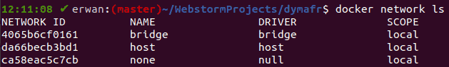

# Les réseaux Docker

## Introduction aux réseaux

### Connecter les conteneurs entre eux avec les réseaux

L'une des grandes puissances de _Docker_ est la possibilité de connecter les conteneurs entre eux très facilement.

Vous pouvez finement paramétrer comment ils se connectent grâce aux réseaux _Docker_ c'est ce que nous allons voir dans ce chapitre.

### Les _drivers_ des réseaux _Docker_

Le système de réseaux _Docker_ utilisent des _drivers_. Il en existe plusieurs par défaut.

#### Le _driver bridge_

**Le _bridge_ est le _driver_ par défaut pour les réseaux _Docker_.**

Nous les verrons en détails, mais ces réseaux sont utiles lorsque vous essayez de faire communiquer des conteneurs sur une même machine.

#### Le _driver host_

**Le _host_ est le _driver_ permettant de supp rimer l'isolation réseau d'un ou plusieurs conteneurs avec l'hôte.**

Il permet de complètement supprimer la gestion du réseau par _Docker_, c'est comme si les conteneurs tournaient directement sur l'hôte. Attention, uniquement pour le réseau ! (Par pour l'isolation des processus, du système de fichiers etc).

#### Le _driver overlay_

**L'_overlay_ est le _driver_ permettant de connecter plusieurs démons _Docker_.**

Il permet en fait de déployer des conteneurs **sur plusieurs machines distantes** et des les faire communiquer. Nous verrons tout cela lorsque nous étudierons _Swarm_.

Les autres _drivers_ possibles sont _none_ (pour utiliser un _plugin_ pour la gestion des réseaux qui ne sont pas gérés par _Docker_) et _macvlan_ (qui permet d'utiliser des adresses _MAC_ aux conteneurs). Ces autres possibilités sont vraiment pour des cas très rares et nous ne les étudierons donc pas.

## Le réseau bridge

### Les réseaux _bridge_

Un _bridge network_ ou pont réseau permet d'interconnecter deux segments de réseaux distincts.

**Dans _Docker_, un réseau _bridge_ utilise un pont logiciel qui permet à plusieurs conteneurs connectés à ce réseau de communiquer.**

Ce réseau permet de maintenir une isolation avec tous les autres conteneurs qui ne sont pas connectés au réseau _bridge_.

**Les réseaux _bridge_ ne sont utilisables que pour les conteneurs qui sont exécutés sur le même hôte.**

Pour faire communiquer des conteneurs qui sont situés sur des hôtes différents il faut utiliser un réseau _overlay_ comme nous le verrons.

**Lorsque vous lancez _Docker_ sur une machine, un réseau _bridge_ par défaut est créé automatiquement.**

Tous les conteneurs qui sont ensuite créés rejoignent ce réseau par défaut. Vous pouvez bien sûr empêcher cela en spécifiant un autre réseau.

Le problème de ce réseau par défaut est que les conteneurs ne peuvent communiquer qu'en utilisant leur adresse _IP_, ce qui est très peu flexible. Sans compter sur le fait que les adresses _IP_ ne sont pas fixes pour chaque conteneur : sur différents hôtes elles ne seront pas les mêmes.

Nous allons donc étudier ce réseau par défaut, puis voir la bonne manière d'utiliser les réseaux _bridge_ : en créant ses propres réseaux qui ont de nombreux avantages comme nous le verrons.

### Lister les réseaux existants

Vous pouvez lister les réseaux existants avec la commande suivante :

```sh
docker network ls
```

Vous verrez que vous avez notamment un réseau _bridge_ par défaut, comme par exemple :



### Inspecter les réseaux

Vous pouvez voir les détails d'un réseau avec :

```sh
docker network inspect
```

Pour inspecter le réseau par défaut, faites :

```sh
docker network inspect bridge
```

### Les conteneurs se connectent au réseau _bridge_ par défaut

Nous allons partir d'une nouvelle base :

Commencez par couper tous les conteneurs :

```sh
docker stop $(docker container ps -aq)
```

Supprimez tous les conteneurs stoppés et les volumes :

```sh
docker container prune
docker volume prune
```

Lançons ensuite un premier conteneur :

```sh
docker container run -it alpine sh
```

Dans un nouveau terminal vérifiez que ce nouveau conteneur est bien connecté au réseau _bridge_ :

```sh
docker network inspect bridge
```

Intéressez-vous à la partie _Containers_, vous aurez par exemple :

```json
"Containers": {
      "f3d3c575a149c8a484554e8a2204af5d5e4a38d839a389f284895f7c287b2b9d": {
    "Name": "mystifying_ardinghelli",
    "EndpointID": "faf31c95fc48a6e5a7abdf885b76ee62589e05f5a2637aa49df2badcdc64bac6",
    "MacAddress": "02:42:ac:11:00:02",
    "IPv4Address": "172.17.0.2/16",
    "IPv6Address": ""
      }
},
```

Notez son adresse _IP_ : _172.17.0.2_.

Lancez ensuite un autre conteneur :

```sh
docker container run -it alpine sh
```

Vous devez donc avoir deux terminaux avec deux conteneurs en cours d'exécution.

Sur le terminal où vous venez de lancer le second conteneur faites :

```sh
ifconfig
```

Cherchez la partie _inet addr_ pour la carte _eth0_, vous aurez par exemple :


```sh
inet addr:172.17.0.3
```

Vous avez maintenant les deux _IP_ de vos conteneurs.

Vous pouvez dans le premier conteneur faire :

```sh
ping 172.17.0.3
```

Et dans le second :

```sh
ping 172.17.0.2
```

Vous aurez par exemple :

Cela montre que le conteneur a pu envoyer des paquets de 64 octets sans problème à l'autre conteneur.

Si les deux conteneurs n'étaient pas sur le même réseau ils ne pourraient pas communiquer, et donc ne pourraient pas s'envoyer de paquets.

Vous voyez à quel point l'utilisation du réseau _bridge_ par défaut est laborieux : il faut récupérer pour chaque conteneur son _IP_ attribuée par _Docker_.

Ce n'est pas possible pour gérer convenablement un environnement _Docker_, imaginez si vous deviez aller sur votre serveur et récupérer les _IPs_ pour pouvoir configurer la connexion entre votre _backend_, votre base de données etc.

Heureusement il existe une solution très simple à mettre en oeuvre et qui est prévue par _Docker_ !

### Connecter deux conteneurs avec link

Il est possible de connecter des conteneurs sans avoir à utiliser leur _IP_ en utilisant l'option `--link`.

**Attention ! Cette option est dépréciée et sera à terme supprimée.** Nous vous la montrons uniquement car vous pouvez encore la rencontrer et il faut donc la comprendre. Mais il ne faut plus l'utiliser, il faut créer ses réseaux, comme nous le verrons dans la leçon suivante.

Quittez les deux conteneurs s'ils étaient encore en cours d'exécution.

Créez un premier conteneur en lui donnant un nom :

```sh
docker container run --name alpine1 -it alpine sh
```

Créez ensuite un second conteneur dans un deuxième terminal, en utilisant l'option _link_ :

```sh
docker container run  --name alpine2 --link alpine1 -it alpine sh
```

Remarquez que dans le conteneur _alpine2_ vous pouvez envoyer des paquets à _alpine1_ :

```sh
ping alpine1
```

Par contre dans _alpine1_, vous ne pouvez pas envoyer de paquets à _alpine2_ :

```sh
ping alpine2
```

La raison est qu'un `--link` est unidirectionnel. Il faudrait créer un `--link` également pour le premier conteneur. C'est pour ces complexités que _Docker_ a décidé d'abandonner `--link` et de passer à des réseaux personnalisés.

## Créer ses réseaux bridge

### Les réseaux _bridges_ créés par l'utilisateur

Nous avons vu que _Docker_ fournit un réseau _bridge_ par défaut auquel tous les conteneurs se connectent.

**Ce réseau _bridge_ par défaut ne doit pas être utilisé.** _Docker_ signale en effet qu'il devrait être déprécié, mais qu'il est nécessaire de le conserver pour des raisons de compatibilité.

Nous pouvons également créer nos propres réseaux _bridge_, ces réseaux sont bien meilleurs pour les raisons suivantes :

- ils permettent **une résolution _DNS_ automatique entre les conteneurs**. En utilisant le réseau _bridge_ par défaut, les conteneurs ne peuvent interagir qu'en utilisant leur adresse _IP_ (comme nous l'avons vu dans la leçon précédente). Sur un réseau _bridge_ que nous créons, les conteneurs peuvent utiliser leur nom pour se trouver sur le réseau.
- ils permettent **une meilleure isolation**. Si vous ne spécifiez pas un réseau pour un conteneur il se connecte au réseau _bridge_ par défaut (comme nous l'avons vu également). Cela diminue la sécurité, car des conteneurs qui n'appartiennent pas aux mêmes applications ou services peuvent communiquer à travers ce réseau. Avec des réseaux personnalisés nous spécifions quels conteneurs sont sur quels réseaux et donc pouvons définir exactement quels conteneurs peuvent communiquer entre eux.
- ils permettent **de connecter ou déconnecter des conteneurs lors de l'exécution**. Ce n'est pas possible avec le réseau par défaut.
- ils permettent une configuration différente pour chaque réseau. Ce que ne permet pas le réseau par défaut, car il y en a qu'un seul.

Aussi, n'utilisez que des réseaux _bridge_ personnalisés ! Nous verrons d'ailleurs qu'avec _Docker compose_ ils sont encore plus simples à configurer.

### Créer un réseau _bridge_ personnalisé

Pour créer un réseau, il suffit d'utiliser :

```sh
docker network create
```

Par défaut, un réseau créé de cette manière sera de type _bridge_.

Nous allons pouvoir montrer la résolution _DNS_ automatique avec un réseau personnalisé.

Commençons par créer un réseau :

```sh
docker network create mynet
```

Vérifions que nous le voyons bien :

```sh
docker network ls
```

Passons ensuite à la création de nouveaux conteneurs, en spécifiant cette fois-ci qu'ils sont connectés au réseau que nous venons de créer **grâce à l'option** `--network`.

```sh
docker container run --network mynet --name alpine1 -d alpine ping google.fr
```

Ce premier conteneur va simplement envoyer des requêtes en continu à _google.fr_.

Démarrons maintenant un second conteneur :

```sh
docker container run --network mynet --name alpine2 -it alpine sh
```

Essayons de contacter _alpine1_ :

```sh
ping alpine1
```

Génial ! Grâce à la résolution _DNS_ automatique de _Docker_, le nom _alpine1_ est résolu automatiquement en une adresse _IP_ et permet la communication avec l'autre conteneur.

Vérifions maintenant dans un nouveau terminal le réseau par défaut :

```sh
docker network inspect bridge
```

Vous verrez que nos deux conteneurs n'y sont plus connectés par défaut : _"Containers": {},_.

En effet, du moment que nous spécifions un autre réseau, les conteneurs ne se connectent plus au réseau _bridge_ par défaut.

Par contre, ils sont bien connectés sur notre réseau _bridge_ personnalisé :

```sh
docker network inspect mynet
```

Vous retrouverez bien nos deux conteneurs dans la clé _Containers_, vous retrouverez d'ailleurs les noms des conteneurs :


Nous pouvons enfin vérifier, dans le terminal où _alpine2_ n'est pas en cours d'exécution qu'_alpine1_ peut également communiquer avec _alpine2_ :

```sh
docker exec -it alpine1 ping alpine2
```

### Supprimer un ou plusieurs réseaux

Pour supprimer un réseau, sur lequel aucun conteneur en cours d'exécution n'est connecté, il suffit de faire :

```sh
docker network rm
```

Par exemple, pour supprimer le réseau que nous venons de créer il faut faire :

```sh
docker container stop alpine1 alpine2
docker network rm mynet
```

Vous pouvez supprimer tous les réseaux d'un coup :

```sh
docker network prune
```

## Connecter un serveur Node.js et une bdd MongoDB

### Objectif

Notre objectif va être de connecter deux conteneurs : un premier conteneur utilisera l'image officiel _MongoDB_ avec un volume nommé, comme nous l'avons appris, un second conteneur utilisera notre image de serveur _Node.js_ que nous allons modifier.

L'application sera très triviale. Elle va simplement enregistrer en base de données la valeur d'un compteur. Ce compteur sera incrémenté à chaque fois que l'utilisateur fait une requête _HTTP GET_ sur le port 80 (en se rendant sur _localhost_ dans un navigateur).

Voici le schéma de ce que nous voulons faire :


### Création du conteneur avec la base de données

Avant de créer le conteneur, nous devons créer le volume nommé pour notre base de données :

```sh
docker volume create mydb
```

Ensuite, nous pouvons lancer notre conteneur en mode détaché.

Nous n'oublions pas de lui donner un nom (pour que nous puissions le connecter plus tard au réseau que nous créerons, et pour pouvoir utiliser la résolution _DNS_ de _Docker_).

Nous faisons un _mount_ de type _volume_ car il s'agit d'une base de données :

```sh
docker run --name db --mount src=mybd,target=/data/db -d mongo
```

Nous pouvons vérifier que le conteneur est bien en cours d'exécution :

```sh
docker container ls
```

### Création de notre réseau _bridge_ personnalisé

Nous commençons par créer notre réseau :

```sh
docker network create mynet
```

Nous connectons ensuite notre base de données à celle-ci :

```sh
docker network connect mynet db
```

Petit bonus, déconnectons notre _db_ du réseau _bridge_ par défaut :

```sh
docker network disconnect bridge db
```

Inspectons ensuite les réseaux :

```sh
docker network inspect mynet
docker network inspect bridge
```

Vous devez avoir maintenant 0 conteneur sur le réseau _bridge_ par défaut et 1 conteneur connecté sur le réseau _mynet_.

### Initialisation compteur dans la base de données

Connectons nous maintenant à la base de données avec le client _MongoDB_ :

```sh
docker exec -it db mongosh
```

Utilisons la base de données _test_ :

```sh
use test
```

Insérons un document dans une collection _count_ que nous créons :

```sql
db.count.insertOne({count: 0})
```

Vérifions que le document est bien présent :

```sql
db.count.findOne()
```

Quittons :

```sh
exit
```

### Serveur _Node.js_

Nous allons modifier brièvement notre image pour pouvoir connecter notre application _Node.js_ à notre base de données _MongoDB_.

Pour ce faire, nous allons simplement installer le _driver_ officiel de _MongoDB_.

Modifiez le fichier _package.json_ pour ajouter la ligne : `"mongodb": "^6.1.0"`.

Vous aurez donc :

```json
{
  "dependencies": {
    "express": "^4.18.2",
    "mongodb": "^6.1.0",
    "nodemon": "^3.0.1"
  }
}
```

Reconstruisez l'image :

```sh
docker build -t node-server .
```

Lancez enfin le conteneur à partir de notre image en lui donnant un nom, en créant un _bind mount_ pour pouvoir obtenir le _live reload_ de _nodemon_, en publiant bien le port 80 et le connectant au réseau que nous avons créé :

```sh
docker container run --name server --mount type=bind,src="$(pwd)"/src,target=/app/src -p 80:80 --network mynet node-server
```

Il faut que vous soyez dans le dossier où se trouve l'image car sinon le chemin passé en _src_ pour le _bind mount_ ne sera pas le bon.

Vous pouvez vérifier que le port _80_ est bien publié en faisant :

```sh
docker container port server
```

Vous aurez comme retour :

```sh
80/tcp -> 0.0.0.0:80
```

## Configuration du serveur

### Modification du code du serveur

Modifiez le fichier _src/app.js_ :

```js
const express = require("express");
const { MongoClient } = require("mongodb");
const app = express();
let count;

const client = new MongoClient("mongodb://db");
async function run() {
  try {
    await client.connect();
    await client.db("admin").command({ ping: 1 });
    console.log("CONNEXION DB OK !");
    count = client.db("test").collection("count");
  } catch (err) {
    console.log(err.stack);
  }
}
run().catch(console.dir);

app.get("/", (req, res) => {
  count
    .findOneAndUpdate(
      {},
      { $inc: { count: 1 } },
      { returnNewDocument: true, upsert: true }
    )
    .then((doc) => {
      res.status(200).json(doc ? doc.count : 0);
    });
});

app.listen(80);
```

Le code précédent permet simplement de connecter le client _MongoDB_ lors du lancement du serveur _Node.js_ qui utilise le _framework Express_.

Sur les requêtes _HTTP GET_ sur la route `/` il incrémente le compteur dans la base de données et retourne le résultat au format _JSON_ pour que le navigateur puisse l'afficher.

Vous pouvez maintenant sauvegarder et vous rendre sur _localhost_ dans un navigateur et rafraîchir pour voir le compteur s'incrémenter.

## Le réseau host

### Le réseau host

Si vous utilisez le réseau hôte pour un conteneur, le réseau du conteneur ne sera pas du tout isolé de l'hôte.

A savoir que le conteneur et l'hôte auront les mêmes interfaces réseaux. Le conteneur n'aura donc par exemple pas sa propre adresse _IP_.

Si vous utilisez ce réseau, il n'y a plus besoin de publier les ports (ce n'est même pas possible) car ce sont les ports de l'hôte.

Lancez par exemple un conteneur en mode détaché, avec l'option `--rm` pour le supprimer lorsqu'il sera stoppé, avec le nom _nginx1_ et en spécifiant le réseau hôte :

```sh
docker container run --rm -d --network host --name nginx1 nginx
```

Vérifiez que le conteneur est bien en cours d'exécution :

```sh
docker container ls
```

Si ce n'est pas le cas c'est qu'un autre conteneur a son port publié sur le port 80 de l'hôte. Supprimez les autres conteneurs et relancez la commande pour créer le conteneur.

Vous pourrez directement accéder à _nginx_. Rendez vous simplement sur _localhost_.

Stoppez le conteneur :

```sh
docker container stop nginx1
```

Ce réseau est rarement utilisé et il n'est disponible que sur _GNU/Linux_. Cela ne fonctionnera pas si votre hôte est sur _Windows_ ou _MacOs_.
